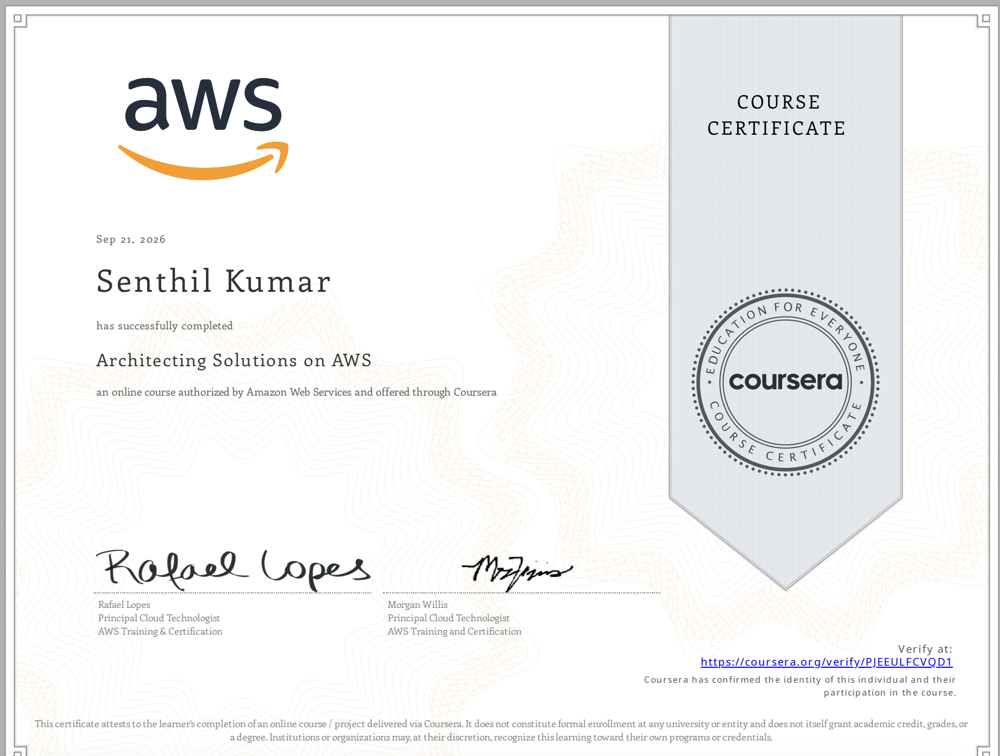

👈 **Back to:** [📝 Blog](https://senthilkumarm1901.github.io/learn_by_blogging/blog.html) | [💼 LinkedIn](https://www.linkedin.com/in/senthilkumarm1901) | [✍️ Medium](https://medium.com/@senthilkumar.m1901)

---


## ❓ 1. Why this blog and the book

> Knowing what a service *does* is not the same as knowing *when* to choose it and what you must be prepared to defend once you have.

### Technical Architect → Cloud Architect

In the previous [blog post on being a Technical Architect](https://senthilkumarm1901.github.io/learn_by_blogging/posts/it_architect/it_architect.html), we composed systems from building blocks. Each block was a clean item on a whiteboard.

In Cloud, for each block one needs to worry about:

- What is the **cost** of building a block in a particular way in cloud?
- What is the associated **latency** for that chosen path?
- What is the **blast radius** if things fail?

```{mermaid}
%%{init: {'theme': 'base', 'themeVariables': {'primaryColor': '#E3F2FD', 'primaryBorderColor': '#1E88E5', 'lineColor': '#424242', 'fontSize': '14px'}}}%%
flowchart TD
    Block["Each building block<br/>of a System"] --> Q{"Made concrete<br/>in the cloud"}
    Q --> M["💰 What does it cost<br/>when idle vs busy?"]
    Q --> L["⏱️ What latency does<br/>this choice bake in?"]
    Q --> R["💥 If it fails,<br/>how far does it spread?"]
    M --> Dec["The service choice<br/>is the answer to<br/>all three at once"]
    L --> Dec
    R --> Dec
```

This is a companion to [**Foundational Questions. Visual Answers. Mastering AWS Fundamentals**](https://senthilkumarm1901.github.io/learn_by_blogging/aws_cloud_technical_essentials/). That book builds the fundamentals, chapter by chapter: security, compute, networking, storage, databases, monitoring, optimization. This book assumes those fundamentals and asks a harder question: given a real customer's requirements, how do you *combine* those building blocks into one architecture — and justify the services you rejected?

---

## 🧭 2. Flow of Decision-making for a Cloud Architect


- Functional drivers = **what the system must do**.
    - For example: "store relational data", "run SQL analytics", "serve a REST API", "process a stream", "run containerized microservices".
    - These filter the candidate set; if the requirement is "transactional relational writes", a queue and an object store are simply not candidates.
- Non-functional drivers = **how well it must do it**.
    - Scale, latency, cost, resilience, ops burden.
    - These rank the survivors — among the relational options (RDS, Aurora, self-managed on EC2), the NFRs pick the winner.

---

## 📝 3. What this book covers

Every chapter follows the same workflow: **requirements/problem understanding → architectural drivers → collect candidate services → compare trade-offs → finalize decision → justify rejections.**

### 🧩 [**10. Architecting a Serverless Web Backend**](10-architecting-serverless-backend-solution-in-aws.html)

* **Problem**: A monolithic, on-prem order service must become an auto-scaling, decoupled, serverless backend in the cloud

**Before an Architect's Intervention**:

```{mermaid}
%%{init: {'theme': 'base', 'themeVariables': {'primaryColor': '#E3F2FD', 'primaryBorderColor': '#1E88E5', 'lineColor': '#424242', 'fontSize': '14px'}}}%%
flowchart LR
  U[Customers] --> W[Web tier]
  W --> O[Monolithic order service]
  O --> M[(MySQL)]
  O -.-> I[Inventory service]
  O -.-> A[Accounting service]
  O -.-> F[Fulfillment service]

  subgraph InScope["In scope for Migration"]
    W
    O
    M
  end

  subgraph OutOfScope["Out of scope"]
    I
    A
    F
  end
```

**The Naive First Draft**: "Make it serverless": swap the monolith for one Lambda that does everything.

```{mermaid}
%%{init: {'theme': 'base', 'themeVariables': {'primaryColor': '#E3F2FD', 'primaryBorderColor': '#1E88E5', 'lineColor': '#424242', 'fontSize': '14px'}}}%%
flowchart LR
    FE["Frontend clients"] --> APIGW["API Gateway"]
    APIGW --> L["One Lambda<br>all order logic"]
    L --> DDB["DynamoDB"]
    L -->|"sync calls"| DS["Inventory, Accounting,<br>Fulfillment"]
```

**Why the First Draft Fails**  → **What it needs**:

- One Lambda for every route is a monolith in disguise; one bug takes all routes down → split functions by responsibility.
- Synchronous downstream calls: one slow service fails the whole order → decouple with SQS, fan out with SNS.
- A sale-day burst hits Lambda and DynamoDB head-on → SQS absorbs it, Lambda drains at its own pace.
- Poison messages retry, then silently expire → dead-letter queue makes failures visible.

**After an Architect's Intervention**:

```{mermaid}
%%{init: {'theme': 'base', 'themeVariables': {'primaryColor': '#E3F2FD', 'primaryBorderColor': '#1E88E5', 'lineColor': '#424242', 'fontSize': '14px'}}}%%
flowchart TD
    FE["Frontend clients"] --> APIGW["API Gateway<br>auth, validation, throttling"]
    APIGW --> SQS["SQS<br>buffer / decouple"]
    SQS --> LAM["Lambda<br>order processing"]
    LAM --> DDB["DynamoDB<br>orders"]
    LAM -.->|"failures"| DLQ["Dead-letter queue"]
    DDB --> STR["DynamoDB Streams"]
    STR --> LAM2["Lambda<br>publisher"]
    LAM2 --> SNS["SNS topic"]
    SNS --> D1["Fulfillment"]
    SNS --> D2["Accounting"]
    SNS --> D3["Inventory"]
    APIGW --> CW["CloudWatch + X-Ray<br>across all services"]
    LAM --> CW
    DDB --> CW
    SNS --> CW
```


### 📊 [**11. Serverless Data Analytics**](11-serverless-data-analytics.html)

* **Problem**: A Static S3-hosted menus website needs a clickstream pipeline to be used along with it. 
* This should turn a one-off request into a recurring **ingest → store → query → visualise** data pipeline.
* Such a Data Analytics pipeline gives insights to restaurant owners on analytics from customer preferences 

**Before an Architect's Intervention**:

```{mermaid}
%%{init: {'theme': 'base', 'themeVariables': {'primaryColor': '#E3F2FD', 'primaryBorderColor': '#1E88E5', 'lineColor': '#424242', 'fontSize': '14px'}}}%%
flowchart LR
    C[Customer scans QR code] --> S3M["S3 static menu<br>HTML pages"]
    S3M --> ORD["'Order this item'<br>feature"]
    ORD -.-> PAY["Third-party payment API"]
    S3M --> CLICK["Clickstream:<br>views + navigation"]
    CLICK --> PIPE["Analytics pipeline<br>ingest, store, query, visualise"]

    subgraph InScope["In scope<br>(newly added)"]
        CLICK
        PIPE
    end

    subgraph OutOfScope["Out of scope<br>(not touching for edit)"]
        ORD
        PAY
    end
```

**The Naive First Draft**: "Just save every click somewhere and query it."

```{mermaid}
%%{init: {'theme': 'base', 'themeVariables': {'primaryColor': '#E3F2FD', 'primaryBorderColor': '#1E88E5', 'lineColor': '#424242', 'fontSize': '14px'}}}%%
flowchart LR
    B["Menu in browser"] -->|"one PUT per click"| S3["S3 bucket<br>raw JSON"]
    S3 --> ATH["Athena<br>scans raw JSON"]
    ATH --> QS["QuickSight<br>queries on every view"]
```

**Why the First Draft Fails**  → **What it needs**:

- Browser writes straight to S3: exposed bucket, no throttling → API Gateway as the front door.
- One write per click: millions of tiny files and per-request charges → Firehose buffers into batched files.
- Athena bills by bytes scanned; raw JSON drags every byte of every row → Parquet + Glue catalog + time partitions.
- Every dashboard view re-scans S3 → QuickSight SPICE caches the dataset in memory.

**After an Architect's Intervention**:

```{mermaid}
%%{init: {'theme': 'base', 'themeVariables': {'primaryColor': '#E3F2FD', 'primaryBorderColor': '#1E88E5', 'lineColor': '#424242', 'fontSize': '14px'}}}%%
flowchart TD

    USER["Customer<br/>scans QR code"]

    subgraph SITE["Static Menu Website"]
        EDGE["CloudFront distribution<br/><br/>protected by AWS WAF"]
        MENU[("S3 private origin<br/><br/>HTML, CSS and JavaScript")]
        BROWSER["Menu running in browser<br/>JS emits click events"]

        EDGE -->|"Fetch static assets"| MENU
        EDGE -->|"Serve menu application"| BROWSER
    end

    USER -->|"Request menu"| EDGE

    subgraph PIPELINE["Serverless Clickstream Analytics Pipeline"]
        AG["API Gateway<br/><br/>HTTPS, throttling and abuse control"]
        KDF["Amazon Data Firehose<br/><br/>Direct PUT, buffering,<br/>JSON to Parquet"]
        
        subgraph LAKE["S3 Data Lake"]
            DATA["Parquet data<br/>Hive-style prefixes"]
            ERR["Error output prefix"]
        end

        REPLICA[("S3 replica bucket<br/><br/>Second Region")]
        GDC["Glue Data Catalog<br/><br/>Table schema and partitions"]
        ATH["Amazon Athena<br/><br/>SQL on S3"]
        SPICE[("QuickSight SPICE<br/><br/>In-memory dataset")]
        QS["QuickSight Dashboards"]

        BROWSER -->|"Click events"| AG
        AG --> KDF

        GDC -.->|"Schema for<br/>Parquet conversion"| KDF
        KDF --> DATA
        KDF -.->|"Failed records"| ERR

        DATA -->|"Asynchronous CRR<br/>with versioning"| REPLICA

        GDC -.->|"Table metadata"| ATH
        DATA --> ATH

        ATH -->|"Dataset ingestion<br/>and scheduled refresh"| SPICE
        SPICE --> QS
    end

    subgraph OBS["Cross-Cutting Observability"]
        CW["Amazon CloudWatch<br/><br/>Metrics, logs and alarms"]
        SNS["Amazon SNS<br/>Operational notifications"]

        CW --> SNS
    end

    AG -.->|"Count, 4XX, 5XX, latency"| CW
    KDF -.->|"Delivery success,<br/>freshness and throttling"| CW
    REPLICA -.->|"Replication lag"| CW
    ATH -.->|"Failures and bytes scanned"| CW
    SPICE -.->|"Ingestion or refresh failures"| CW

    IAC["CloudFormation<br/>provisions the architecture"] -.-> SITE
    IAC -.-> PIPELINE
    IAC -.-> OBS
```


### 🔗 [**12. Hybrid, Container-Based Workloads**](12-hybrid-container-workloads.html)

* **Problem**: Half a company's workloads stay on-premises, half move to AWS. 
* Need: Connecting the On-prem Data Center with AWS infra, keeping containers portable, and migrating a database with near-zero downtime.

**The Naive First Draft**: "Spin up a new cluster in AWS, connect over the internet, dump-and-restore the database."

```{mermaid}
%%{init: {'theme': 'base', 'themeVariables': {'primaryColor': '#E3F2FD', 'primaryBorderColor': '#1E88E5', 'lineColor': '#424242', 'fontSize': '14px'}}}%%
flowchart LR
    DC["Data centre<br>containers, PostgreSQL, NFS"] -->|"public internet"| K["New cluster in AWS<br>own tooling, public subnets"]
    DC -->|"weekend dump + restore"| DB["PostgreSQL on AWS"]
    DC -->|"rewrite apps for S3 API"| S3["Amazon S3"]
```

**Why the First Draft Fails**  → **What it needs**:

- The internet link brings latency spikes to DC↔AWS traffic that will run for years → Direct Connect + VPN failover.
- Different tooling on each side means two ops models → ECS in AWS + ECS Anywhere on-prem.
- Containers in public subnets widen the attack surface → private subnets, NAT gateways, VPC endpoints.
- Dump-and-restore means hours of downtime → DMS for data, `pg_dump` for schema only.
- Rewriting NFS apps for S3 is a refactor the brief rules out → S3 File Gateway keeps NFS.

**After an Architect's Intervention** (simple version):

```{mermaid}
%%{init: {'theme': 'base', 'themeVariables': {'primaryColor': '#E3F2FD', 'primaryBorderColor': '#1E88E5', 'lineColor': '#424242', 'fontSize': '14px'}}}%%
flowchart LR
    subgraph DCn["Data centre (contracts<br>expiring in waves)"]
        direction TB
        C1["Containerised apps"]
        DB1["PostgreSQL"]
        C1 <--> DB1
    end
    
    DCn <-->|"dedicated, low-latency link"| AWS

    subgraph AWS["AWS (half the workloads)"]
        C2["Containers<br>private, outbound only"]
        DB2["PostgreSQL<br>lift-and-shift, no rewrite"]
        NFS["Data over NFS<br>no refactor"]
    end

    C1 -.->|"same orchestration tooling"| C2
    DB1 -.->|"no app code rewrite"| DB2
```

**After an Architect's Intervention** (detailed version):

```{mermaid}
%%{init: {'theme': 'base', 'themeVariables': {'primaryColor': '#E3F2FD', 'primaryBorderColor': '#1E88E5', 'lineColor': '#424242', 'fontSize': '14px'}}}%%
flowchart LR
    subgraph DCn["On-Premises"]
        OC["Containers<br>ECS Anywhere"]
        ODB["PostgreSQL"]
        OFS["NFS-mounted File Share"]
        SGW["S3 File Gateway<br>local cache"]
        OFS --> SGW
    end
     
    DCn <==>|"Direct Connect<br>plus VPN failover"| AWS
     
    subgraph AWS["AWS Cloud VPC"]
        subgraph A1["AZ 1"]
            ECS1["ECS on EC2<br>private subnet"] --> NAT1["NAT gateway 1"]
        end
        subgraph A2["AZ 2"]
            ECS2["ECS on EC2<br>private subnet"] --> NAT2["NAT gateway 2"]
        end
        VPE["VPC endpoints<br>ECR, SSM, S3, Logs"]
        RDS["RDS PostgreSQL<br>Multi-AZ + read replica"]
        S3["Amazon S3<br>Intelligent-Tiering"]
        ECS1 --> RDS
        ECS2 --> RDS
        ECS1 -.-> VPE
        ECS2 -.-> VPE
        SGW -.->|async| S3
    end
     
    ODB -.->|"DMS data + pg_dump schema"| RDS
    OPS["ECS Anywhere · Systems<br>Manager · AWS Backup"] -.-> DCn
    OPS -.-> AWS
    CW["CloudWatch: connection state, tunnel state,<br>task counts, replica lag, cache lag"] -.-> AWS
```

### 🏛️ [**13. Account Governance and Multi-Account Management**](13-multi-account-strategies.html)

* **Problem**: A single, unmanaged AWS account has to become a governed multi-account structure, with automatic provisioning, single sign-on, central logging and guardrails.

**The Naive First Draft**: "Keep one account; separate clients with tags and IAM policies."

```{mermaid}
%%{init: {'theme': 'base', 'themeVariables': {'primaryColor': '#E3F2FD', 'primaryBorderColor': '#1E88E5', 'lineColor': '#424242', 'fontSize': '14px'}}}%%
flowchart LR
    ROOT["One account<br>root + long-lived IAM users"] --> T["Tags + IAM policies<br>per client"]
    T --> A["Client A"]
    T --> B["Client B"]
    T --> C["Client C"]
```

**Why the First Draft Fails**  → **What it needs**:

- One misconfigured policy reaches every client → one account per client, grouped in Organizations OUs.
- Cost per client depends on perfect tagging → the account is the free, default unit of cost allocation.
- Quotas and API limits are per account, so one noisy client throttles all → separate accounts, separate quotas.
- Shared root and long-lived IAM users → IAM Identity Center (SSO) + Control Tower guardrails.

**After an Architect's Intervention** (simple version):

```{mermaid}
%%{init: {'theme': 'base', 'themeVariables': {'primaryColor': '#E3F2FD', 'primaryBorderColor': '#1E88E5', 'lineColor': '#424242', 'fontSize': '14px'}}}%%
flowchart LR
    subgraph Before["Single account (today)"]
        ROOT["root + unmanaged IAM users"] --> W1["Client A website"]
        ROOT --> W2["Client B website"]
        ROOT --> W3["Client C website"]
    end

    Before -->|"re-architect"| After

    subgraph After["Multi-account (goal)"]
        SSO["Single sign-on"] --> ACCA["Client A account"]
        SSO --> ACCB["Client B account"]
        SSO --> ACCC["Client C account"]
        ACCA --> LOG["Dedicated logging account"]
        ACCB --> LOG
        ACCC --> LOG
        GR["Guardrails +<br>enforced tagging"] -.-> ACCA
        GR -.-> ACCB
        GR -.-> ACCC
    end
```

**After an Architect's Intervention** (detailed version):

```{mermaid}
%%{init: {'theme': 'base', 'themeVariables': {'primaryColor': '#E3F2FD', 'primaryBorderColor': '#1E88E5', 'lineColor': '#424242', 'fontSize': '14px'}}}%%
flowchart TD
    subgraph Org["AWS Organization -<br>all features enabled"]
        MGMT["Management account<br>Control Tower, org CloudTrail, billing<br>NO workloads"]
        subgraph SecOU["Security OU"]
            LOGACC["Log Archive account<br>central CloudTrail and Config"]
            TOOL["Security Tooling account<br>delegated admin: GuardDuty,<br>Config, Security Hub"]
        end
        SS["Shared Services account<br>delegated IAM Identity Center admin"]
        subgraph WL["Workloads OU"]
            subgraph CustA["Customer A OU"]
                DEVA["Dev"]
                PRDA["Prod"]
            end
        end
    end
    USER["Workforce"] -->|SSO portal| SS
    SS -->|permission sets| DEVA
    SS -->|permission sets| PRDA
    MGMT -->|SCP guardrails| WL
    DEVA -->|logs| LOGACC
    PRDA -->|logs| LOGACC
    TOOL -->|findings| SEChub["Security Hub"]
```

### 🎯 [**14. Capstone: Decoupled App + EMR Analytics**](14-capstone-decoupled-app-and-emr-analytics.html)

**Problem**: 

* One customer, migrate two workloads to cloud at once: 
  * decoupling a three-tier app and 
  * re-platforming a Hadoop estate onto Amazon EMR
* This capstone effort reuses the patterns from Chapters 10-12 together.

**Before an Architect's Intervention**:

```{mermaid}
%%{init: {'theme': 'base', 'themeVariables': {'primaryColor': '#E3F2FD', 'primaryBorderColor': '#1E88E5', 'lineColor': '#424242', 'fontSize': '14px'}}}%%
flowchart LR
    subgraph OnPrem["On-premises today<br>one data centre, one power feed"]
        FE1["Frontend<br>HTML/CSS/JS"] --> BE1["Backend<br>Apache + Java"]
        BE1 --> DB1[("MySQL")]
        HAD["Hadoop cluster<br>+ visualisation tools"]
    end
```

**The Naive First Draft**: "Lift and shift as-is."

```{mermaid}
%%{init: {'theme': 'base', 'themeVariables': {'primaryColor': '#E3F2FD', 'primaryBorderColor': '#1E88E5', 'lineColor': '#424242', 'fontSize': '14px'}}}%%
flowchart LR
    U["Users"] --> EC2["One EC2<br>Apache + Java + static files"]
    EC2 --> RDS[("RDS MySQL<br>single-AZ")]
    HAD["Always-on Hadoop<br>cluster on EC2 + HDFS"]
```

**Why the First Draft Fails**  → **What it needs**:

- One EC2 is a single point of failure → ALB + ECS on Fargate across AZs.
- A single-AZ database moves the same risk one tier down → RDS Multi-AZ standby.
- The backend serves static files it shouldn't → CloudFront + WAF + S3 for the frontend.
- An always-on Hadoop cluster pays for idle compute, with data locked in HDFS → transient EMR reading S3 via EMRFS.

**After an Architect's Intervention** (simplified version):

```{mermaid}
%%{init: {'theme': 'base', 'themeVariables': {'primaryColor': '#E3F2FD', 'primaryBorderColor': '#1E88E5', 'lineColor': '#424242', 'fontSize': '14px'}}}%%
flowchart LR
    subgraph OnPrem["On-premises today<br>one data centre, one power feed"]
        FE1["Frontend<br>HTML/CSS/JS"] --> BE1["Backend<br>Apache + Java"]
        BE1 --> DB1[("MySQL")]
        HAD["Hadoop cluster<br>+ visualisation tools"]
    end
    OnPrem -->|"decouple + migrate"| Cloud

    subgraph Cloud["Goal: on AWS"]
        FE2["Frontend tier<br>CloudFront-WAF-S3"]
        BE2["Backend tier<br>ALB-<br>ECS_on_Fargate"]
        DB2[("Database tier")]
        EMR2["EMR analytics<br>tier"]
    end
```

**After an Architect's Intervention** (detailed version):


**Application tier on AWS**

```{mermaid}
%%{init: {'theme': 'base', 'themeVariables': {'primaryColor': '#E3F2FD', 'primaryBorderColor': '#1E88E5', 'lineColor': '#424242', 'fontSize': '14px'}}}%%
flowchart LR
    USERS["Internet users"] --> CF["CloudFront + WAF"]
    CF -->|"static"| S3F["S3<br>frontend"]
    CF -->|"dynamic"| ALB["Application<br>Load Balancer"]
    ALB --> ECS["ECS on Fargate<br>Java backend"]
    ECS --> RDS[("RDS for MySQL<br>Multi-AZ")]
    OnPremMySQ[("On-prem MySQL")] --> DMS["AWS DMS"] -->|"migrate<br>Full load or<br>Changed Data"| RDS
```

**Analytics tier on AWS**

```{mermaid}
%%{init: {'theme': 'base', 'themeVariables': {'primaryColor': '#E3F2FD', 'primaryBorderColor': '#1E88E5', 'lineColor': '#424242', 'fontSize': '14px'}}}%%
flowchart LR
    ONPREM["On-prem HDFS<br>dataset"] -->|"bulk seed"| SNOW["Snowball Edge"]
    ONPREM -->|"ongoing"| DS["AWS DataSync"]
    SNOW --> S3R["S3 raw zone"]
    DS --> S3R
    S3R -->|"EMRFS"| EMR["Amazon EMR<br>transient cluster"]
    EMR --> S3C["S3 curated zone"]
    S3C --> GDC["Glue Data Catalog"]
    GDC --> ATH["Amazon Athena"]
    S3C --> ATH
    ATH --> QS["Amazon QuickSight"]
```

---


### 🤖 [**15. Agentic AI Harness: Desktop to AWS**](15-architecting-agentic-ai-harness-desktop-to-aws.html)

* **Problem**: An enterprise agent harness (xAgents) already runs as a desktop app: a Rust core running a custom GOAP-inspired ReAct loop over local SQLite, LanceDB, MCP tools and multiple LLMs.
* Need: Org-wide agents in **AWS now** (and **Azure in future**), running the **same Rust codebase**, with one governance model, enterprise identity and central observability — while personal agents stay on the desktop.
* Unlike Chapters 10–14, the hard problem is not scale or migration — it is **portability without a rewrite**.

**What xAgents is today**:

```{mermaid}
%%{init: {'theme': 'base', 'themeVariables': {'primaryColor': '#E3F2FD', 'primaryBorderColor': '#1E88E5', 'lineColor': '#424242', 'fontSize': '14px'}}}%%
flowchart LR
    UI["React + TS UI"] <--> IPC["Tauri IPC"] <--> CORE["Rust Core<br/>GOAP ReAct Loop"]
    CORE --> LLM["LLM Gateway<br/>Bedrock · Azure · Ollama"]
    CORE --> TOOLS["Tools<br/>File · CSV · Excel · PDF · MCP"]
    CORE --> DB[("SQLite<br/>State + Audit")]
```


**The Naive First Draft**: "Fork the core for the cloud, hard-wire it to cloud services, sync every desktop's data up, and call it from a web UI."

```{mermaid}
%%{init: {'theme': 'base', 'themeVariables': {'primaryColor': '#E3F2FD', 'primaryBorderColor': '#1E88E5', 'lineColor': '#424242', 'fontSize': '14px'}}}%%
flowchart LR
    USER["User"] --> DESKAPP["Desktop app<br>React FE"] --> DESK["Desktop core<br>with SQLite, LanceDB"]
    USER --> WEB["Web UI"]
    DESK -->|"sync all data up"| S3[("S3 / cloud DB")]
    WEB -->|"sync API call,<br>waits for whole run"| FORK["Forked cloud core<br>with Postgres, OpenSearch, Gateway"]
    FORK --> S3
```

**Why the First Draft Fails**  → **What it needs**:

- A forked cloud core means two codebases that drift apart; every fix and every skills-governance rule must be made twice → **one Rust codebase**; desktop and cloud differ only in the adapters plugged into it.
- The forked core is hard-wired to its stores (today the AgentLoop calls SQLite, LanceDB and a `match` on the LLM provider directly), so moving to cloud means editing the loop → extract **provider interfaces** (Persistence, Memory, VectorStore, Registry, Tool, LLM), wrap the existing desktop implementations behind them, and add cloud implementations alongside.
- Syncing all desktop data up breaks the rule that sensitive data stays on-device unless explicitly routed → desktop runs keep their data locally; **org-wide agents** use cloud persistence; data moves from desktop to cloud only when a user routes it.
- A synchronous API call that waits for the whole multi-step run outlasts API Gateway's ~30 s integration timeout → **submit the run, return a run ID, stream progress**.
- A web UI calling the core directly has no enterprise auth → reuse the desktop's **Azure Entra ID** tenant, validated by an **API Gateway JWT authorizer** in front of the core.

**After an Architect's Intervention** (over-simplified version): **Core - Provider Architecture**

```{mermaid}
%%{init: {'theme': 'base', 'themeVariables': {'primaryColor': '#E3F2FD', 'primaryBorderColor': '#1E88E5', 'lineColor': '#424242', 'fontSize': '14px'}}}%%
flowchart TD
    CORE["SAME xAgents Core<br>owns behaviour"]
    CORE -->|"provider interfaces"| B["Adapters own integrations"]

    subgraph Desktop["Desktop"]
        D1[("SQLite + LanceDB")]
        D2["Local MCP · Ollama"]
    end

    subgraph AWS["AWS Cloud - now<br>(EKS)"]
        A1[("RDS PostgreSQL ·<br>Bedrock KB")]
        A2["AgentCore Gateway ·<br>Bedrock"]
    end

    subgraph Azure["Azure - future<br>(AKS)"]
        Z1[("Azure PostgreSQL ·<br>Azure AI Search")]
        Z2["MCP servers ·<br>Azure OpenAI"]
    end

    B --> Desktop
    B --> AWS
    B -.-> Azure

    classDef core fill:#FFE0B2,stroke:#FB8C00,stroke-width:2px
    class CORE core
```


**After an Architect's Intervention** (medium complexity):

```{mermaid}
%%{init: {'theme': 'base', 'themeVariables': {'primaryColor': '#E3F2FD', 'primaryBorderColor': '#1E88E5', 'lineColor': '#424242', 'fontSize': '14px'}}}%%
flowchart LR
    U["Enterprise users"] --> D["Desktop app<br>Tauri + React"]
    U --> W["Web UI<br>org-wide agents"]
    CB["ONE Rust<br>codebase in Git"] -.-> DCORE
    CB -.-> CCORE
    CB -.-> ZCORE

    D --> DCORE["Rust Core<br>AgentLoop"]
    DCORE --> SQL[("SQLite")]
    DCORE --> LAN[("LanceDB")]
    W --> CCORE["Same Rust Core<br>in AWS"]

    subgraph Current["Current state<br>(minimal refactoring only,<br>to keep one codebase for cloud)"]
        D
        DCORE
        SQL
        LAN
    end

    subgraph InScope["In scope<br>(newly added)"]
        W
        CCORE
        ZCORE["Same Rust Core<br>in Azure (future)"]
        AWSRDS[("Amazon RDS PostgreSQL")]
        AWSOPEN[("Amazon OpenSearch")]
    end
    CCORE --> AWSRDS
    CCORE --> AWSOPEN
    CCORE --> MCP["External MCP tools"]
    DCORE --> MCP["External MCP tools"]
    
```


**After an Architect's Intervention** (detailed version):

```{mermaid}
%%{init: {'theme': 'base', 'themeVariables': {'primaryColor': '#E3F2FD', 'primaryBorderColor': '#1E88E5', 'lineColor': '#424242', 'fontSize': '14px'}}}%%
flowchart LR
    USER["Enterprise user"]
    ENTRA["Azure Entra ID<br>SSO, MFA, groups"]

    subgraph DESKTOP["Desktop harness - personal agents"]
        TAURI["Tauri + React UI"] --> DCORE["xAgents Core"]
        DCORE --> DSTORE[("SQLite + LanceDB")]
    end

    subgraph CLOUD["AWS harness - org-wide agents"]
        AMP["Amplify<br>React web UI"] --> APIGW["API Gateway<br>JWT authorizer,<br>async + WebSocket"]
        APIGW -->|"VPC Link"| ALB["Internal<br>Application<br>Load Balancer"]
        subgraph EKS["Amazon EKS"]
            CCORE["SAME xAgents Core"]
        end
        ALB --> CCORE
        CCORE --> RDS[("RDS PostgreSQL")]
        CCORE --> KB[("Bedrock KB")]
        CCORE --> GW["AgentCore Gateway<br>+ Policy"]
        CCORE --> REG["AWS Agent Registry"]
        CCORE --> GRD["Bedrock Guardrails"] --> LLM["Bedrock ·<br>Azure OpenAI"]
        OBS["AgentCore Observability<br>+ CloudWatch"]
    end

    USER --> TAURI
    USER --> AMP
    TAURI <-.->|"sign-in"| ENTRA
    AMP <-.->|"sign-in"| ENTRA
    GW --> ENT["External Tools<br>SAP, SharePoint,<br>M365, APIs"]
    DCORE --> ENT
    DCORE -.->|"pull approved<br>agents and skills"| REG
    CCORE -.->|"OpenTelemetry step traces"|OBS
    DCORE -.->|"OpenTelemetry step traces"|OBS

    classDef core fill:#FFE0B2,stroke:#FB8C00,stroke-width:2px
    class DCORE,CCORE core
```


---

## 🏁 4. Conclusion

How the functional and non-functional drivers dictated the architecture decisions across the chapters:

| Chapter | Functional driver (produces candidates) | Non-functional driver (picks winner) |
| ------- | --------------------------------------- | ------------------------------------ |
| **[10. Serverless backend](10-architecting-serverless-backend-solution-in-aws.html)** | "Serve a REST API + persist orders" → Lambda/Fargate + DynamoDB/RDS | Spiky load + zero-idle cost → **Lambda + SQS + DynamoDB** |
| **[11. Data analytics](11-serverless-data-analytics.html)** | "Ingest a stream + run SQL for dashboards" → Kinesis/Firehose, Athena/Redshift | Occasional queries + cost → **Firehose + S3 + Athena** (read-time) over a warehouse |
| **[12. Containers](12-hybrid-container-workloads.html)** | "Run containerized microservices" → ECS/EKS, Fargate/EC2 | Ops burden + scale → **ECS + Fargate** unless the K8s ecosystem is genuinely needed |
| **[13. Multi-account](13-multi-account-strategies.html)** | "Isolate clients/environments" → single account, per-client accounts, per-env accounts | Blast radius + billing clarity → **Organizations + OUs** over one shared account |
| **[14. Capstone (monolith)](14-capstone-decoupled-app-and-emr-analytics.html)** | "Transactional relational store" → RDS/Aurora/EC2-hosted DB | Resilience + cost → RDS **Multi-AZ** over single-AZ or self-managed |
| **[15. Agentic Harness in both Desktop & AWS Cloud](15-architecting-agentic-ai-harness-desktop-to-aws.html)** | "Run a long, tool-calling agent loop for many users" → AgentCore Runtime, EKS, ECS Fargate, Lambda | Portability + one codebase + AWS-now/Azure-later → unchanged core on EKS behind provider interfaces (Kubernetes carries over to AKS); AgentCore Runtime if AWS-only |

The repeated message across the chapters:

- Start with the smallest sufficient set of blocks and add one piece of complexity per pain point (a failure to isolate, a burst to absorb, idle resources you should not pay for).
- Blast radius isn't always a resource sitting inside an account, sometimes the blast radius *is* the account, and the account boundary is the fix.
- When the same system must run in more than one place, the first decision is not a service but a **boundary**: what the platform *is* (behaviour) versus what it *uses* (infrastructure). Adopt managed services that provide capabilities; reject the ones that would take over the behaviour (Ch. 15).
- None of these decisions are made in isolation on a real system: a single build typically decouples its tiers (Ch. 14), picks an ingest/store/query path for its data (Ch. 11), and sits inside an account structure that contains the blast radius of all of it (Ch. 13) — at the same time, not in sequence.

---

## 📜 5. Source & Attribution

The intuition and examples in Chapters 10–14 are inspired by the `Architecting Solutions in AWS` Coursera course.

Chapter 15 applies the same method to a an imaginary Agentic harness app - xAgents, with AWS service facts checked against AWS documentation in October 2026.



---