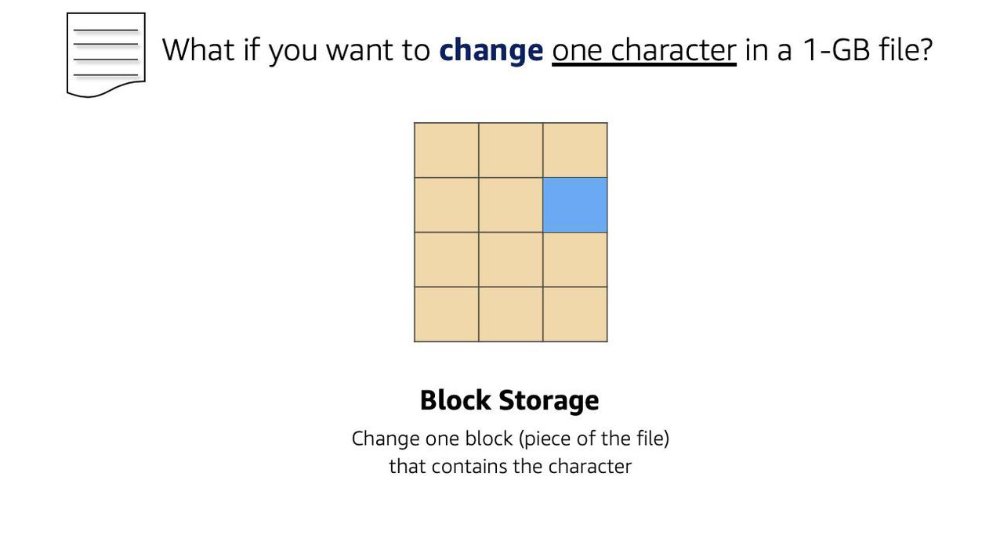
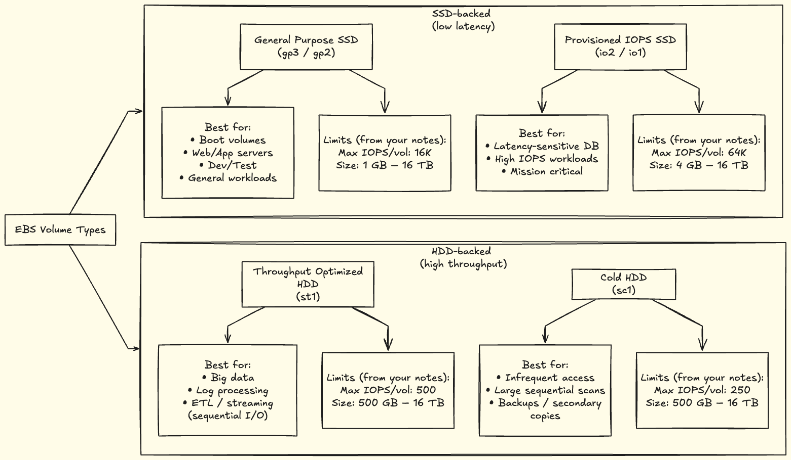
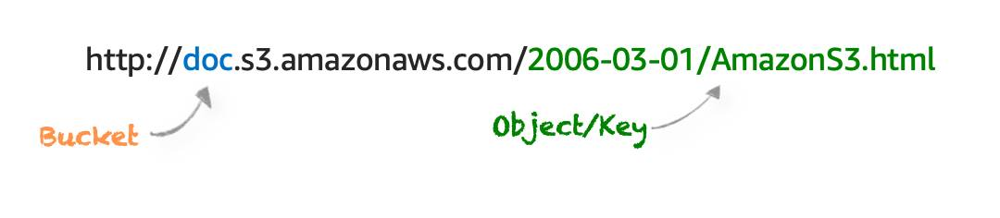

👈 **Back to:** [📝 Blog](https://senthilkumarm1901.github.io/learn_by_blogging/blog.html) | [💼 LinkedIn](https://www.linkedin.com/in/senthilkumarm1901) | [✍️ Medium](https://medium.com/@senthilkumar.m1901)

---

## 5.1 AWS Storage Types 

> ❓ How do you choose between S3, EBS, and EFS without guessing?
>
> *Hint: Think access pattern, latency vs throughput, and how your application interacts with data.*


**Three storage types:**

- **Block storage**: Splits data into fixed-size **blocks** with addresses → efficient random access; common for OS, DB volumes.
- **File storage**: Hierarchical **directory tree** (paths); each file has metadata (name, size, created date). More folders can add latency.
- **Object storage**: Flat namespace; each object = data + metadata + unique identifier; optimized for scale & throughput.

### 5.1.1 File Storage

- **Structure**: Tree-like folders (like traditional file systems).
- **Note**: Every additional folder adds latency.
- **Use cases**: large content repositories, dev environments, user home directories.

### 5.1.2 Block Storage 

- **Concept**: Files split into **addressable blocks** → efficient retrieval.
- Typically used where **low-latency**, frequent updates, or OS-level mount semantics are needed.



### 5.1.3 Object Storage 

- **Flat structure** (no true hierarchy).
- **Good for high throughput** and massive scale.
- Updating part of an object generally means overwriting the whole object.

**File vs Object (from your notes):**

- File: hierarchy YES; low-latency R/W; partial edit implies overwrite file; example: **Amazon EFS**
- Object: flat; high throughput; partial edit implies overwrite object; example: **Amazon S3**

| File Storage                                   | Object Storge                                  |
| ---------------------------------------------- | ---------------------------------------------- |
| Hierarchy - YES; Folder or tree-like structure | Flat Structure. No hierarchy                   |
| Good for low-latency read-write                | Good for high throughput                       |
| Edit a portion, you overwrite the whole file   | Edit a portion, you overwrite the whole object |
| Amazon EFS                                     | Amazon S3                                      |

---

## 5.2 EC2 Storage Options: Instance Store vs EBS

### 5.2.1 Two EC2 Instance Storage Options

- **Instance Store**: ephemeral block storage; good for **stateless** workloads.
- **EBS**: persistent block storage; behaves like an external drive that can outlive the instance.

```{mermaid}
flowchart TD
  A[[Temporary<br>Instance Store]]
  B[[Permanent<br>EBS]]
  C(Storage connected<br>to EC2)
  C --> A
  C --> B  
```

### 5.2.2 Attachment Relationships (EC2 ↔ EBS)

**1 EC2 to Many EBS Volumes**

- An **EBS volume (in the same AZ)** can be detached from one EC2 and attached to another.

```{mermaid}
flowchart LR
  EC[EC2]
  EB1[[EBS 1]]
  EB2[[EBS 2]]
  EB3[[EBS 3]]
  EC --> EB1
  EC --> EB2
  EC --> EB3
```

**1 EBS to 1 EC2 (typical)**

```{mermaid}
flowchart LR
  EC[EC2] --> EB1[[EBS 1]]
```

**1 EBS to Many EC2 (supported for some instances)**

```{mermaid}
flowchart LR
  EB1[[EBS 1]]
  ECA[EC2 A]
  ECB[EC2 B]

  EB1 --> ECA
  EB1 --> ECB
```


**Analogy/limits (from your notes):**

- Like an external drive: if compute fails, **data can still remain** on EBS.
- Volumes have **max size limits** (scalability bounded per volume).

### 5.2.3 Scaling EBS Volumes

Two main approaches:

1. **Increase volume size** up to the maximum (**16 TB** per volume, per your notes).
2. **Attach multiple volumes** to a single EC2 instance (one-to-many).

### 5.2.4 AMI Types (Instance Store-backed vs EBS-backed)


```{mermaid}
flowchart TD
  AMI(AMI)
  AMI1[[Instance Store<br>Backed AMI]]
  AMI2[[EBS-Volume<br>backed AMI<br>most common]]
  AMI --> AMI1
  AMI --> AMI2   
```

**Key points:**

- If an instance running on **instance-store backed AMI** is **stopped**, data is lost.
- Instance-store backed AMIs are useful for **stateless apps**.
- **Reboot** does not lose instance-store data (stop/hibernate/terminate does).

---

## 5.3 Latency vs Throughput (Choosing Storage/Perf Tradeoffs)

**Latency** = time for **one** packet to reach destination (important for DB + web interactions)

```{mermaid}
flowchart LR
  W[Web Server] -- 1 packet sent<br> in 10 millisec --> C[Client]
```


**Throughput** = number of packets delivered per second (important for big data)

```{mermaid}
flowchart LR
  W[Web Server] -- 10 packets sent<br> in 1 sec --> C[Client]
```

---

## 5.4 EBS Volume Types (SSD vs HDD) + Fit-to-Workload

**Rule of thumb (from your table):**

- **Provisioned IOPS SSD** → very low latency (databases, payment systems)
- **General Purpose SSD** → low latency (web servers, general transactional workloads)
- **Throughput Optimized HDD** → very high throughput (big data)
- **Cold HDD** → infrequently accessed; can tolerate higher latency, still may need throughput for transfers

**Key point:** SSDs are faster and more expensive than HDDs.




### 5.4.1 EBS Snapshots (Backups)

- **Incremental backups**
    - First snapshot stores full data
    - Later snapshots store only changed blocks

---

## 5.5 Amazon S3 (Object Storage)

### 5.5.1 What S3 Is

- **S3 is object storage**: flat structure, objects addressed via unique identifiers.
- Object = file + metadata (store as many as needed).

### 5.5.2 S3 URL/Structure



### 5.5.3 S3 Security

- Everything is **private by default**
- You _can_ make buckets/folders/objects public, but typical best practice is **granular access**.
- Two main access controls:
    - **IAM policies**
    - **S3 bucket policies**

**When to use S3 bucket policies (per your notes):**

- Simple **cross-account** access without IAM roles
- IAM policy **size limit** constraints (bucket policies support larger size)

> Bucket policies apply to **buckets only**, not folders/objects.

### 5.5.4 S3 Encryption

- Encryption **in transit** and **at rest**
- **Server-side encryption**: S3 encrypts before storing; decrypts on download
- **Client-side encryption**: you encrypt before upload and manage keys/tools

### 5.5.5 S3 Versioning

- Helps recover from accidental delete/overwrite
- Delete puts a **delete marker** (object not immediately removed); remove marker to restore
- Overwrite creates a **new version**; older versions remain accessible

Bucket states:

- **Unversioned** (default)
- **Versioning-enabled**
- **Versioning-suspended** (no new versions, old versions remain)

### 5.5.6 S3 Storage Classes

- **S3 Standard**: frequent access; low latency/high throughput; higher cost; 11-nines durability
- **S3 Intelligent-Tiering**: unpredictable access; auto-moves between frequent/infrequent tiers; small overhead
- **S3 Standard-IA**: infrequent but **rapid** access; lower storage cost, higher retrieval cost
- **S3 One Zone-IA**: infrequent, single-AZ redundancy; cheaper; lower availability
- **S3 Glacier**: archival; minutes to hours retrieval; very low storage cost
- **S3 Glacier Deep Archive**: lowest cost; retrieval up to ~12 hours
- **S3 Outposts**: on-prem S3 for local residency/low latency needs

### 5.5.7 Lifecycle Management (Automate Cost Control)

Lifecycle policies can automate:

- **Transition** (move between storage classes)
- **Expiration** (permanent deletion)

Good candidates:

- Periodic logs (keep 1 week/month then delete)
- Data whose access frequency decreases over time (hot → warm → archive → delete)

---

## 5.6 Storage Services Recap

- **EC2 Instance Store**: ephemeral block storage; for stateless apps; persists through reboot, not through stop/hibernate/terminate.
- **EBS**: persistent; supports resizing + snapshots; SSD for I/O sensitive, HDD for throughput intensive.
- **S3**: object storage; pay-as-you-go; replicated across multiple AZs; not attached to compute.
- **EFS / FSx**: serverless file services; no upfront provisioning; pay for use.

---

## 5.7 Key Takeaways

- Max **single S3 object** size: **5 TB** (good for media/video hosting).
- **EBS** fits high-transaction relational DB storage layers.
- Instance store data persists on **reboot**, not on **stop/hibernate/terminate**.
- **S3 Standard-IA** vs **Glacier Deep Archive**:
    - IA when rarely accessed but needs **quick** retrieval
    - Deep Archive when rarely accessed and retrieval delay is acceptable (often for compliance/legal retention)
- **Block storage** is best when only a **small portion** of a file changes.
