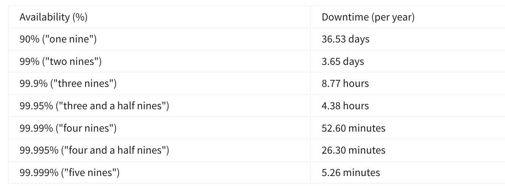
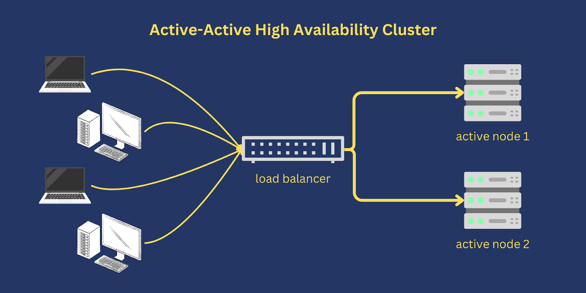
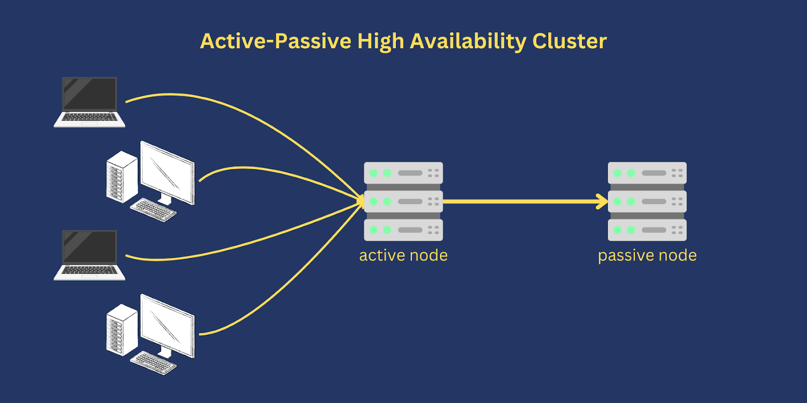
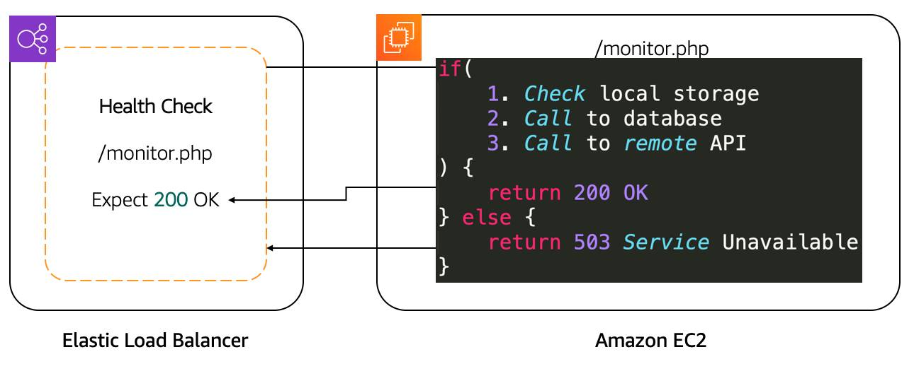
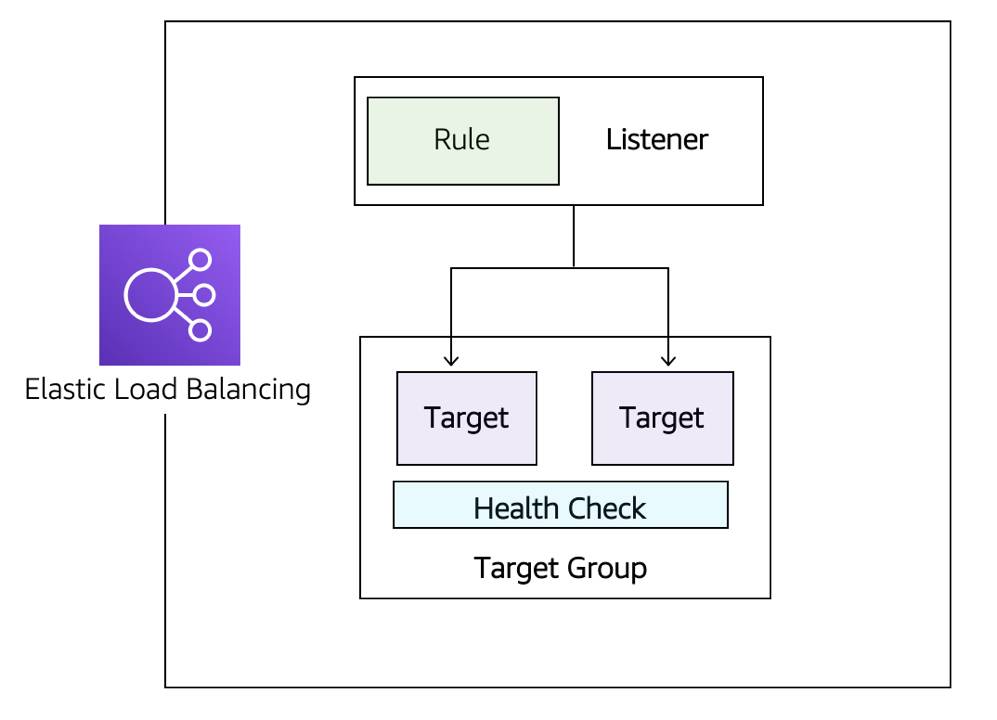
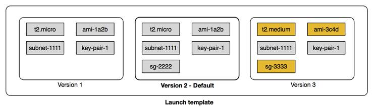
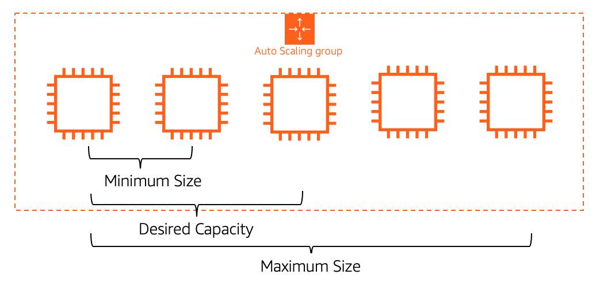
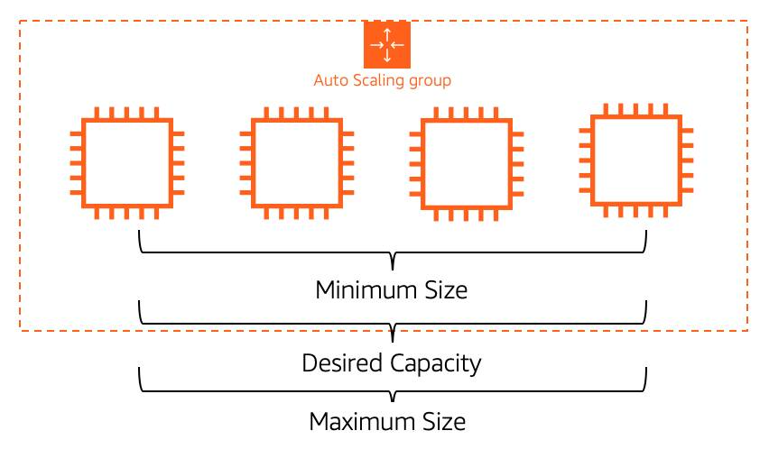

👈 **Back to:** [📝 Blog](https://senthilkumarm1901.github.io/learn_by_blogging/blog.html) | [💼 LinkedIn](https://www.linkedin.com/in/senthilkumarm1901) | [✍️ Medium](https://medium.com/@senthilkumar.m1901)

---

## 8.1 Notation in Nines:

> * ❓ How do you design for cost *and* performance without trade-offs?



## 8.2 Automatically use a Second Server in a different availability zone

```{mermaid}
flowchart TD
  client((Client))
  alb[Application Load Balancer]
  tg[Target Group]

  subgraph AZ1[AZ1]
    s1[Server 1]
  end

  subgraph AZ2[AZ2]
    s2[Server 2]
    s3[Server 3]
  end

  hc{{Health checks}}
  s1bad((Server 1<br>unhealthy))

  client -->|HTTP/HTTPS| alb
  alb -->|forwards| tg

  tg -->|if server1 healthy| s1
  tg -->|if server1 unhealthy| s2
  tg -->|if server1 unhealthy| s3

  alb -.->|periodic| hc
  hc -.-> s1
  hc -.-> s2
  hc -.-> s3

  s1 -.->|fails checks| s1bad
  s1bad -.->|removed from rotation| tg
```

## 8.3 Types of High Availability Architecture



> * Active-active clusters rely on a dedicated load balancer for routing or distributing traffic across all participating nodes. 
> * The manner by which a load balancer distributes traffic depends on the specific load balancing algorithm used. 
> * For instance, some load balancers distribute traffic using Round-Robin, Weighted Round Robin or Random algorithm.



> * Active-passive setups are common in disaster recovery (DR) strategies. 
> * In some DR strategies, the passive node is set up in a separate geographical location and 
> * then brought into play once the active node becomes incapacitated
>
> * **Why stateful apps often use active-passive:** stateful systems keep session or application state on a single node, so routing every request to the same active node avoids state synchronization complexity and consistency issues. The passive node is kept on standby and is only activated after the active node fails.
> * **Why stateless apps often use active-active:** stateless systems do not retain client session state on any individual server, so any active node can safely serve any request. This allows traffic to be distributed across multiple active nodes and enables true horizontal scaling without session affinity.
>
> Stateful apps need a single primary node for consistent state, while stateless apps can use all nodes concurrently because they do not depend on per-node session data.

Source for the images and above content: [An article on High Availability Architectures](https://www.jscape.com/blog/active-active-vs-active-passive-high-availability-cluster)

```{mermaid}
flowchart TD
  HA[high_availability<br> architectures]
  AP[active_passive]
  AA[active_active]

  P1((for Stateful<br>Applications))
  P2((for Stateless<br>Applications))

  HA --> AP
  HA --> AA  

  AP --> P1
  AA --> P2 
```
---

## 8.4 Route Traffic with Amazon Elastic Load Balancing

### 8.4.1 What is a Load Balancer:

## Load balancing

*   **Goal:** Spread incoming application requests across multiple backend servers (EC2 instances) so **internal servers do not get overloaded**.
*   A **load balancer** sits in front of the servers, receives all client traffic, and forwards each request to a backend server using a routing algorithm (commonly **round-robin**, which cycles through servers).
*   **Request path:** Client browser → load balancer → one EC2 application server → response returns via the load balancer back to the client.
*   You *can* run your own load balancer software on EC2, but AWS provides a managed service called **Elastic Load Balancing (ELB)** for this purpose.


### 8.4.2 FEATURES OF ELB

*   **Managed service:** <u>ELB is a fully managed load balancing service</u>, so you don’t have to run/operate your own load balancer fleet. [\[repost.aws\]](https://repost.aws/selections/KPa_EdeC-GRW6UxuEoebhIKw/aws-re-post-knowledge-center-spotlight-elastic-load-balancing-elb)
*   **Many target types:** It can distribute traffic to **EC2 instances, containers, IP addresses, and Lambda functions** (depending on LB type). [\[aws.amazon.com\]](https://aws.amazon.com/documentation-overview/elasticloadbalancing/), [\[docs.aws.amazon.com\]](https://docs.aws.amazon.com/elasticloadbalancing/)
*   **Question:** Why is the AWS service called **Elastic Load Balancing**? Because it automatically adjusts capacity and routes traffic across healthy targets as demand changes, making the load balancer behave like an “elastic” service.
*   **Hybrid capable via IP targets:** Because ELB can target **IP addresses**, any IP address can be a target. [\[aws.amazon.com\]](https://aws.amazon.com/elasticloadbalancing/)
*   **Highly available:** Deploy/enable the load balancer across **multiple Availability Zones** (ALB requires at least two) so it can keep routing to healthy targets if an AZ has issues. [\[docs.aws.amazon.com\]](https://docs.aws.amazon.com/elasticloadbalancing/latest/userguide/how-elastic-load-balancing-works.html), [\[aws.github.io\]](https://aws.github.io/aws-elb-best-practices/reliability/workload_architecture/)
*   **Elastic scaling:** ELB **automatically scales its capacity** based on changes in incoming traffic. [\[docs.aws.amazon.com\]](https://docs.aws.amazon.com/elasticloadbalancing/latest/userguide/what-is-load-balancing.html), [\[aws.amazon.com\]](https://aws.amazon.com/elasticloadbalancing/)

### 8.4.3 HEALTH CHECKS

*   Health checks should validate **real application health**, not just “port is open” or “homepage loads”; shallow checks can pass even when the app is broken. [\[aws.github.io\]](https://aws.github.io/aws-elb-best-practices/reliability/failure_management/)
*   A good pattern is a **deep health endpoint** (example: `/monitor`) that verifies **critical dependencies** (for example DB connectivity and an S3 call) and returns failure if any dependency fails. [\[aws.github.io\]](https://aws.github.io/aws-elb-best-practices/reliability/failure_management/)

```python
from fastapi import FastAPI, status
from fastapi.responses import JSONResponse

app = FastAPI()

@app.get("/health")
async def health():
    return {"status": "ok"}  # shallow check: app is reachable

@app.get("/monitor")
async def monitor():
    db_ok = check_database()
    cache_ok = check_cache()
    if db_ok and cache_ok:
        return {"status": "ok"}
    return JSONResponse(
        status_code=status.HTTP_503_SERVICE_UNAVAILABLE,
        content={"status": "fail", "dependencies": {"db": db_ok, "cache": cache_ok}},
    )


def check_database():
    # replace with a real database connectivity test
    return True


def check_cache():
    # replace with a real cache/session-store test
    return True
```

*   Point the load balancer’s health check path to that endpoint so the load balancer can decide whether a target should receive traffic. [\[docs.aws.amazon.com\]](https://docs.aws.amazon.com/elasticloadbalancing/latest/application/target-group-health-checks.html)



*   New instances start receiving traffic **only after they pass** the load balancer health checks; load balancer routes traffic only to **healthy** targets (with specific edge cases if all are unhealthy). [\[docs.aws.amazon.com\]](https://docs.aws.amazon.com/elasticloadbalancing/latest/application/target-group-health-checks.html), [\[docs.aws.amazon.com\]](https://docs.aws.amazon.com/autoscaling/ec2/userguide/ec2-auto-scaling-health-checks.html)
*   If the load balancer determines an instance is unhealthy, **traffic is stopped** to that instance, and **EC2 Auto Scaling can replace** unhealthy instances when it receives an unhealthy notification (ELB is one of the supported notification sources). [\[docs.aws.amazon.com\]](https://docs.aws.amazon.com/elasticloadbalancing/latest/application/target-group-health-checks.html), [\[docs.aws.amazon.com\]](https://docs.aws.amazon.com/autoscaling/ec2/userguide/ec2-auto-scaling-health-checks.html)
*   During scale-in (instance termination), **connection draining / deregistration delay** allows the load balancer to **stop new connections** to the instance while letting **in-flight requests complete** before termination, reducing dropped requests. [\[docs.aws.amazon.com\]](https://docs.aws.amazon.com/elasticloadbalancing/latest/classic/config-conn-drain.html), [\[docs.aws.amazon.com\]](https://docs.aws.amazon.com/autoscaling/ec2/userguide/ec2-auto-scaling-health-checks.html)
*   **Amazing:** ELB completes in-flight requests before terminating EC2 instances, which makes scale-in and unhealthy-instance removal much safer for clients.

### 8.4.4 ELB COMPONENTS




- Listeners: The client connects to the listener. This is often referred to as client-side. To define a listener, a port must be provided as well as the protocol, depending on the load balancer type. There can be many listeners for a single load balancer.
- Target groups: The backend servers or resources are grouped into a target group. A target group defines the set of targets (such as EC2 instances, IP addresses, or Lambda functions), the protocol and port for routing to them, and the health check settings that determine which targets are eligible to receive traffic.
- Rules: To associate a target group to a listener, a rule must be used. Rules are made up of a condition that can be the source IP address of the client and a condition to decide which target group to send the traffic to.

```bash
aws elbv2 create-target-group \
  --name my-target-group \
  --protocol HTTP \
  --port 80 \
  --vpc-id vpc-0123456789abcdef0 \
  --health-check-protocol HTTP \
  --health-check-path /monitor \
  --health-check-interval-seconds 30

aws elbv2 create-listener \
  --load-balancer-arn arn:aws:elasticloadbalancing:us-east-1:123456789012:loadbalancer/app/my-alb/1234567890abcdef \
  --protocol HTTP \
  --port 80 \
  --default-actions Type=forward,TargetGroupArn=arn:aws:elasticloadbalancing:us-east-1:123456789012:targetgroup/my-target-group/abcdef0123456789

aws elbv2 create-rule \
  --listener-arn arn:aws:elasticloadbalancing:us-east-1:123456789012:listener/app/my-alb/1234567890abcdef/abcdef0123456789 \
  --priority 10 \
  --conditions Field=path-pattern,Values='/app/*' \
  --actions Type=forward,TargetGroupArn=arn:aws:elasticloadbalancing:us-east-1:123456789012:targetgroup/my-target-group/abcdef0123456789
```

### 8.5 APPLICATION LOAD BALANCER

```{mermaid}
flowchart TB
  A[Client]
  ALB[Application Load Balancer<br>(Layer 7 - HTTP/HTTPS)]
  NLB[Network Load Balancer<br>(Layer 4 - TCP/UDP)]
  BE[Backend Targets<br>(EC2 / Containers / IP / Lambda)]

  A -->|HTTP / HTTPS| ALB
  A -->|TCP / UDP| NLB
  ALB -->|HTTP-based routing| BE
  NLB -->|TCP/UDP forwarding| BE
```

### 8.6 NLB

- ALB operates at the application layer and routes HTTP/HTTPS traffic.
- NLB operates at the transport layer and routes TCP/UDP traffic.
- The transport layer is where connection handling and packet forwarding happen.

---

## 8.7 Intro to Amazon EC2 Auto Scaling

Availability and reachability is improved by adding one more server. However, the entire system can again become unavailable if there is a capacity issue. Let’s look at that load issue with both types of systems we discussed, active-passive and active-active.

### 8.7.1 **Vertical Scaling**

### Active-Passive vs Active-Active Systems in Scaling

When too many requests are sent to a **single active-passive system**, the active server becomes unavailable and (hopefully) fails over to the passive server.  
But this doesn’t really solve the problem.  

#### Why Active-Passive Needs Vertical Scaling
- Active-Passive systems rely on **vertical scaling** (increasing server size).  
- With **EC2 instances**, this means:
  - Choosing a larger instance type
  - Or switching to a different type  
- **Limitation:** Scaling can only be done when the instance is **stopped**.

#### Steps for Vertical Scaling in Active-Passive
1. **Stop** the passive instance (safe, since it’s not receiving traffic).  
2. **Change** the instance size or type, then **start** it again.  
3. **Shift traffic** to the passive instance (making it active).  
4. **Stop, resize, and start** the previous active instance (so both match).  

#### Drawbacks of Active-Passive Scaling
- Manual and repetitive work each time traffic changes.  
- A server can only scale **vertically up to a limit**.  
- Once the limit is reached, the only option is to:
  - Create **another active-passive system**
  - Split requests and functionalities across them  
  - (Often requires **massive application rewriting**)  

#### Active-Active Advantage
- With **active-active systems**, scaling is **horizontal**.  
- Instead of making servers bigger, you simply **add more servers**.  
- This approach is easier, more flexible, and avoids rewriting applications.


### 8.7.2 **Horizontal Scaling**

- **Active-active system** works well because the application is **stateless** (no client sessions stored on the server).  
  - Scaling from 2 → 4 servers requires **no code changes**.  
  - Just add or remove instances as needed.  

- **Amazon EC2 Auto Scaling** handles this automatically:  
  - Creates new EC2 instances when traffic increases.  
  - Terminates instances when traffic decreases.  

- **Key advantage:**  
  - Active-active + stateless apps = **true scalability**.  
  - Much more efficient compared to active-passive systems.  


### 8.7.3 **Integrate ELB with EC2 Auto Scaling**

#### ELB and Auto Scaling Integration  

The **ELB service** integrates seamlessly with **EC2 Auto Scaling**. As soon as a new EC2 instance is added to or removed from the EC2 Auto Scaling group, ELB is notified. However, before it can send traffic to a new EC2 instance, it needs to validate that the application running on that EC2 instance is available.  

```{mermaid}
flowchart LR
  alb[Application Load Balancer]
  tg[Target Group]
  ec2[EC2 Instance]
  asg[EC2 Auto Scaling Group]

  alb -->|routes traffic| tg
  tg -->|forwards to| ec2
  alb -->|sends unhealthy notification| asg
  asg -->|replaces unhealthy instance| ec2
```

This validation is done via the **health checks feature of ELB**. Monitoring is an important part of load balancers, as it should route traffic to only healthy EC2 instances. That’s why ELB supports two types of health checks:  

- **TCP Health Check**: Establishing a connection to a backend EC2 instance using TCP, and marking the instance as available if that connection is successful.  
- **HTTP/HTTPS Health Check**: Making an HTTP or HTTPS request to a webpage that you specify, and validating that an HTTP response code is returned.  

---

#### Traditional Scaling vs Auto Scaling  

##### Traditional Scaling  
- With a traditional approach to scaling, you **buy and provision enough servers** to handle traffic at its peak.  
- At low traffic times (e.g., nighttime), there is **more capacity than traffic**.  
- This leads to **wasted money**, since turning off servers only saves electricity, not provisioning costs.  

##### Cloud (Auto Scaling) Approach  
- Cloud uses a **pay-as-you-go** model.  
- It’s important to **turn off unused services**, especially EC2 instances that run On-Demand.  
- Manual scaling can work for predictable traffic, but unusual spikes cause:  
  - **Over-provisioning** → wasted resources.  
  - **Under-provisioning** → loss of customers.  

##### Solution → **EC2 Auto Scaling**  
- Automatically adds and removes EC2 instances **based on conditions you define**.  
- Ensures the right number of EC2 instances are running at any time.  


### 8.7.4 **Using Amazon EC2 Auto Scaling**
The EC2 Auto Scaling service works to add or remove capacity to keep a steady and predictable performance at the lowest possible cost. By adjusting the capacity to exactly what your application uses, you only pay for what your application needs. And even with applications that have steady usage, EC2 Auto Scaling can help with fleet management. If there is an issue with an EC2 instance, EC2 Auto Scaling can automatically replace that instance. This means that EC2 Auto Scaling helps both to scale your infrastructure and ensure high availability. 

## 8.8 **Configure EC2 Auto Scaling Components**
There are three main components to EC2 Auto Scaling.

> 1. **Launch template or configuration**: 
  - *What resource* should be automatically scaled?
  - A configuration of parameters are used to create a EC2 instance
    - AMI 
    - Security Group associated with the EC2 Instance
    - EC2 Instance Type
    - Additional EBS Volumes 
    - more

- All of these information are needed by `EC2 Auto Scaling` to create the EC2 instances on our behalf

> 2. **EC2 Auto Scaling Group** (ASG): *Where* should the resources be deployed? and How many should be deployed?

Where do you deploy the EC2 instances created via `EC2 Auto Scaling`
- VPC
- Subnets across different Availability Zones
- Type of EC2 instance purchase: On-demand, Spot ? 

How many EC2 instances should the ASG create?
- Minimum
- Maximum
- Desired

> 3. **Scaling policies**: *When* should the resources be added or removed?

- Scaling policy can be set based on metrics like CPU utilization, measured via a CloudWatch Alarm 

### 8.8.1 **Learn About Launch Templates**



- There are multiple parameters required to create EC2 instances:  
  - Amazon Machine Image (AMI) ID  
  - Instance type  
  - Security group  
  - Additional Amazon Elastic Block Store (EBS) volumes  
  - And more...  

- All this information is also required by **EC2 Auto Scaling** to create the EC2 instance on your behalf when there is a need to scale.  
- This information is stored in a **launch template**.  

---

#### Launch Template Usage
- You can use a **launch template** to manually launch an EC2 instance.  
- You can also use it with **EC2 Auto Scaling**.  
- It supports **versioning**, which allows:  
  - Quickly rolling back if there was an issue.  
  - Specifying a default version of your launch template.  
  - Iterating on a new version while other users continue launching EC2 instances with the default version.  

---

#### Ways to Create a Launch Template
1. **Using an existing EC2 instance** (fastest way, since all settings are already defined).  
2. **From an existing template or a previous version** of a launch template.  
3. **From scratch**, where you need to define:  
   - AMI ID  
   - Instance type  
   - Key pair  
   - Security group  
   - Storage  
   - Resource tags  

---

#### Note
- Another way to define what Amazon EC2 Auto Scaling needs to scale is by using **a launch configuration**.  
- However, a launch configuration:  
  - Does **not** support versioning.  
  - Cannot be created from an existing EC2 instance.  
- For these reasons, and to ensure that you get the latest features, **use a launch template instead of a launch configuration**.  


### 8.8.2 Get to Know EC2 Auto Scaling Groups

- The next component that EC2 Auto Scaling needs is an **EC2 Auto Scaling Group (ASG)**.  
  - An ASG enables you to define where EC2 Auto Scaling deploys your resources.  
  - This is where you specify the **Amazon Virtual Private Cloud (VPC)** and **subnets** the EC2 instance should be launched in.  

- EC2 Auto Scaling takes care of creating the EC2 instances across the subnets.  
  - It’s important to select **at least two subnets** that are across different **Availability Zones (AZs)**.  

- ASGs also allow you to specify the **type of purchase** for the EC2 instances:  
  - **On-Demand only**  
  - **Spot only**  
  - **Combination of On-Demand and Spot** (lets you take advantage of Spot instances with minimal admin overhead).  

- To specify how many instances EC2 Auto Scaling should launch, configure three **capacity settings** for the group size:  
  - **Minimum**: The minimum number of instances running in your ASG, even if the threshold for lowering the amount of instances is reached.  
  - **Maximum**: The maximum number of instances running in your ASG, even if the threshold for adding new instances is reached.  
  - **Desired capacity**: The target number of instances in your ASG.  
    - This number must be within or equal to the minimum and maximum.  
    - EC2 Auto Scaling automatically adds or removes instances to match this number.  



- **Minimum capacity**  
  - EC2 Auto Scaling keeps removing EC2 instances until it reaches the minimum capacity.  
  - Best practice: set at least **two instances** to ensure high availability.  
  - Even if scaling down is instructed, EC2 Auto Scaling won’t remove instances below the minimum.  

- **Maximum capacity**  
  - When traffic grows, EC2 Auto Scaling keeps adding instances.  
  - Costs will also increase as more instances are added.  
  - Setting a **maximum** ensures the number of instances doesn’t exceed your budget.  

- **Desired capacity**  
  - This is the number of EC2 instances created when the Auto Scaling group is launched.  
  - If the desired capacity decreases, Auto Scaling removes the **oldest instance** by default.  
  - If it increases, Auto Scaling **creates new instances** using the launch template.  

- **Ensure availability with EC2 Auto Scaling**  
  - Minimum, maximum, and desired capacity can be set to **different values** for dynamic scaling.  
  - If you want Auto Scaling only for **fleet management**, configure all three to the **same value** (e.g., 4).  
  - EC2 Auto Scaling will **replace unhealthy instances** to always maintain that count, ensuring high availability.  



### 8.8.3 **Enable Automation with Scaling Policies**

- **ASG Desired Capacity**
  - By default, ASG stays at its initial desired capacity.  
  - Desired capacity can be **manually changed** or adjusted with **scaling policies**.  
  - Scaling policies use **CloudWatch metrics & alarms** (e.g., CPU > 70%) to trigger scaling actions.  

- **Types of Scaling Policies**  

  - **Simple Scaling Policy**  
    - Uses a **CloudWatch alarm** to add/remove instances or set desired capacity.  
    - Can use a **fixed number** or a **percentage of group size**.  
    - Includes a **cooldown period** to avoid premature scaling while new instances boot.  
    - Limitation: can’t handle multiple thresholds (e.g., 65% vs 85%).  

  - **Step Scaling Policy**  
    - Handles **multiple thresholds** with incremental actions.  
    - Example:  
      - +2 instances if CPU ≥ 85%  
      - +4 instances if CPU ≥ 95%  
    - Responds to alarms even if scaling activity is still in progress.  

  - **Target Tracking Scaling Policy**  
    - Simplest and most dynamic option.  
    - Set a **target value** (e.g., avg CPU %, network in/out, request count).  
    - Automatically creates and manages the required **CloudWatch alarms**.  


---

## 8.9 Key Takeaways

- 3 Components of `EC2 AutoScaling`: 1) Launch Template 2) `EC2 AutoScaling Group` , 3) `Scaling Policy`
- A ELB automatically scales to meet incoming demand
- When a user uses ELB with an Auto Scaling Group, there is no need to manually register the individual EC2 instances scaled with the load balancer
- If you are routing to targets based on a rule that uses the path of the request, you are using `Application Load Balancer`
- If you are running low-latency apps, real time games or IoT applications, use `Network Load Balancer` (if routing is NOT based on content-based routing)
- An application can be scaled `Vertically` by adding more firepower (compute capacity) to the existing machine OR by scaling `horizontally` by adding more EC2 instances of similar compute capacity
