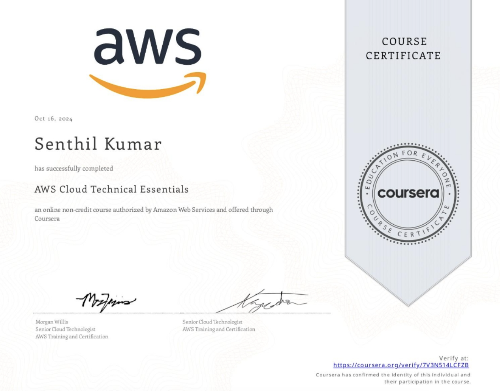

👈 **Back to:** [📝 Blog](https://senthilkumarm1901.github.io/learn_by_blogging/blog.html) | [💼 LinkedIn](https://www.linkedin.com/in/senthilkumarm1901) | [✍️ Medium](https://medium.com/@senthilkumar.m1901)

---

## ❓ 1. Why this Book

> An engineer becomes exponentially more effective with AI — but only if the fundamentals are solid.

✍️ What motivated ***me*** to write this short visual guidebook on AWS Cloud Fundamentals📝:

* 👉🏻 This question 🙋🏻‍♂️: Do I really understand the fundamentals deeply, or have I just gotten comfortable operating around them?

👉🏻 This thought 💭: 

* ❖ If someone is strong in the fundamentals, AI amplifies that skill to a 10X level. 
* ❖ Sometimes going back to the fundamentals is the most advanced thing one can do. 

What could motivate ***you*** to read this? 

* 👉🏻 A **visual guidebook** to deeply understand (not just use) cloud concepts  
* 👉🏻 A way to **strengthen intuition** so tools like AI become force multipliers

---

## ❓ 2. What this book covers

### Section We will Cover

```{mermaid}
flowchart LR
    A[Cloud Fundamentals]
    A --> B[Security]
    A --> C[Compute]
    A --> D[Networking]
    A --> E[Storage]
    A --> F[Databases]
    A --> G[Monitoring]
    A --> H[Optimization]
````

This is a structured, visual walkthrough of core cloud building blocks — explored through the questions that matter.

> * Strong fundamentals aren’t memorized. They’re built by asking the right questions.

If questions like these spark your curiosity, you’re in the right place:

### 🌍 [**Foundations**](https://chatgpt.com/c/01-introduction.html)

**1. Isn’t every AWS action just a chain of API calls?**  
**2. Who is responsible for availability and durability—You or AWS?**


### 🔐 [**Security**](02-security.html)

**3. How is every AWS request authenticated and authorized?**  
**4. Why do modern teams prefer IAM Roles over IAM Users?**  
**5. How do humans vs applications securely access AWS? (IdP vs Cognito)**


### ⚙️ [**Compute**](03-compute.html)

**6. When should you choose EC2, Containers, or Serverless?**  
*_(What really differentiates EC2, ECS/EKS, and Lambda?)_*


### 🌐 [**Networking**](04-networking.html)

**7. What actually happens inside a VPC when your app talks to the internet?**


### 💾 [**Storage**](05-storage.html)

**8. How do you choose between S3, EBS, and EFS without guessing?**


### 🗄️ [**Databases**](06-databases.html)

**9. When do you pick RDS vs DynamoDB—and why does it matter?**


### 📊 [**Monitoring**](07-monitoring.html)

**10. How do you know what’s happening inside your cloud system (before users do)?**


### ⚡ [**Optimization**](08-optimization.html)
**11. How do you design for cost *and* performance without trade-offs?**


---

## 3. Learning Notes Inspired by the Coursera Course 

> * I took the Cloud Fundamentals Coursera Course in in Oct, 2024 and revisited in early 2026 to write this book



---

## 4. 📜 Source & Attribution

I have used a few screenshots from the AWS Technical Essentials course on Coursera and are used strictly for learning purposes.

---

