{width=100%}


<br>

###### **Author:** Senthil Kumar


---

This question has been posed to my team and me multiple times: 
*Which agentic AI framework do we choose?*
<br> 
Almost immediately after we default to LangGraph, I would hear counter arguments flying across the room - too big, most modules not needed for us. Let us choose something lightweight like Temporal or the latest craze Hermes (at the time of writing). 
<br>
Then, a Cloud Engineer would chime in: Ultimately, all production-grade agentic ai systems need to nestle and scale within our cloud. So, let us choose AWS Strands :). When I asked one of my colleagues to review this blog, he suggested "Pydantic AI". 
<br>
The options seem to be endless!
<br>
My quest in this blog is not to pick a favorite but to analyze 3 popular frameworks - LangGraph, Strands and Hermes - and show empirical evidence on where they shine, struggle and surprise, when all conditions stay common.

---


## Key Sections of this Blog


* I. The Entire Blog in 5 Min
* II. The Agentic AI Patterns in Focus
* III. Why LangGraph, Strands, and Hermes; Why Not Others?
* IV. What Does the Evaluation Say?
* V. Conclusion
* VI. Epilogue
* VII. GitHub Resource & Useful References

 
    
## I. The Entire Blog in 5 Min


This post compares three agent frameworks across four progressively harder patterns. The goal is not to crown a single universal winner, but to show which design choice helps most when the workload changes.

### 5-Minute Executive Summary (1/3)

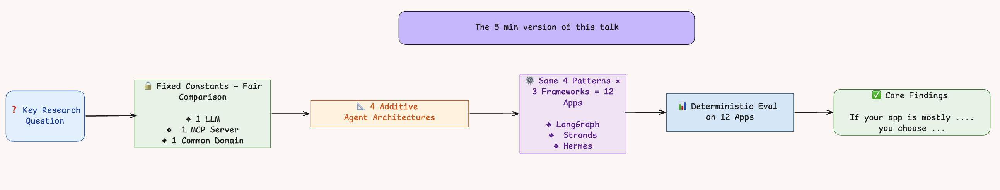{width=100%}

### 5-Minute Executive Summary (2/3)

| Pattern | Key Capability | Description |
|---|---|---|
| P1 | MCP tools | AI Agent with 2 Numeric Tools |
| P2 | +RAG tool | Same AI Agent with 2 Numeric Tools + 1 Semantic Retrieval Tool |
| P3 | +Skills | Same AI Agent with same tools + Skills |
| P4 | +Memory +chat | Same AI Agent with memory & terminal chat |


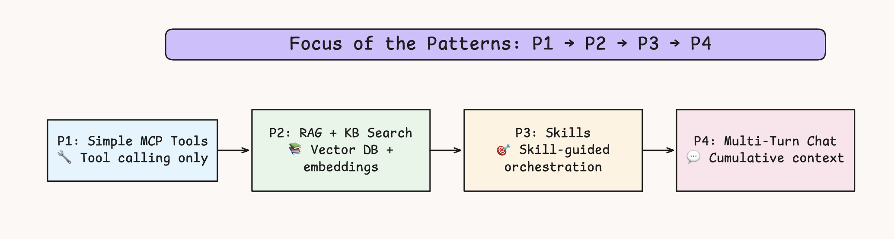{width=100%}


### 5-Minute Executive Summary (3/3)

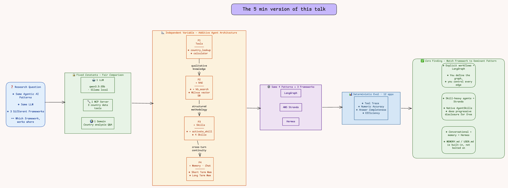{width=100%}


    
## II. The Agentic AI Patterns in Focus


    
### Additive Architecture Lens


The four patterns below move from basic tool use to retrieval, skills, and multi-turn memory, so you can see how each framework behaves as the orchestration problem becomes more demanding.

| Pattern | Key Capability | Description |
|---|---|---|
| P1 | MCP tools | AI Agent with 2 Numeric Tools |
| P2 | +RAG tool | Same AI Agent with 2 Numeric Tools + 1 Semantic Retrieval Tool |
| P3 | +Skills | Same AI Agent with same tools + Skills |
| P4 | +Memory +chat | Same AI Agent with memory & terminal chat |


> Progressive Design :
> * *Layer one new behavior at a time and measure impact*


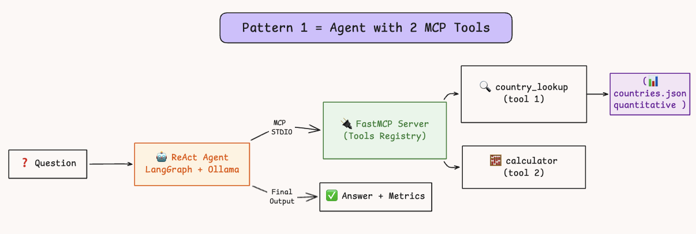{width=100%}

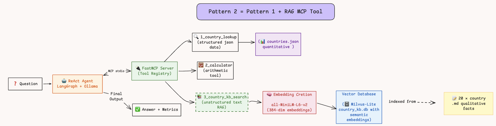{width=100%}

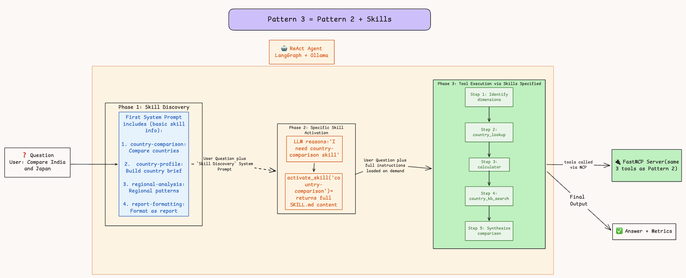{width=100%}

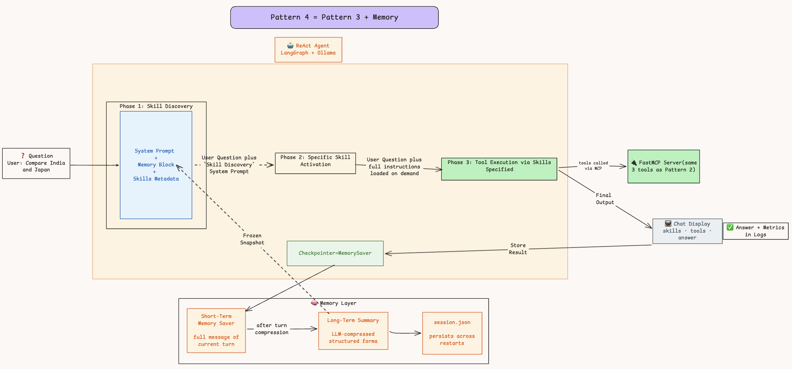{width=100%}

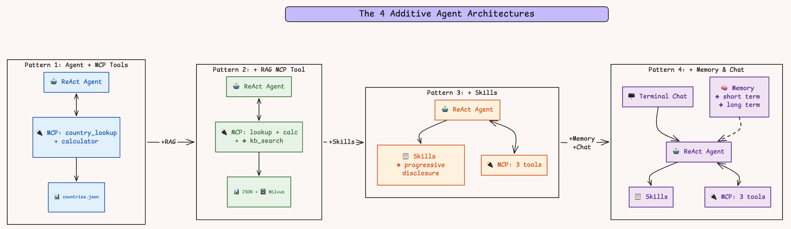{width=100%}

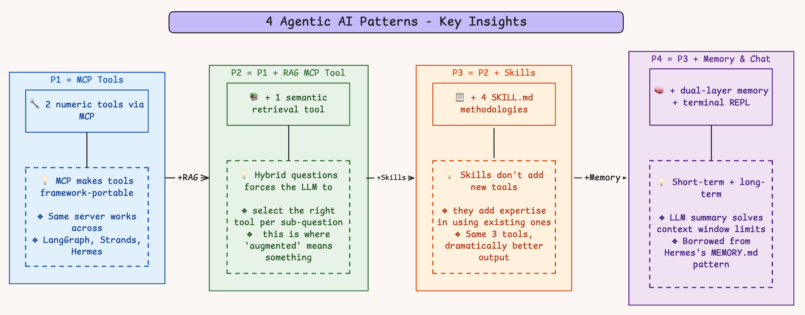{width=100%}


    
## III. Why LangGraph, Strands, and Hermes; Why Not Others?


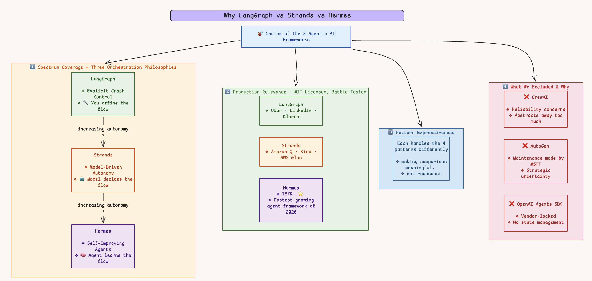{width=100%}


    
## IV. What Does the Evaluation Say?


### Evaluation Guidelines

### [4 Patterns · 3 Frameworks · 40+ Experiments](https://github.com/senthilkumarm1901/agentic_frameworks_exploration/blob/main/eval/reports/Final_Evaluation_Report.md)

These tables summarize the 40+ experiments in this post. The benchmark keeps the model, tools, and prompts fixed so the framework design is the main variable.

> **Core Question**: *Which framework should you use — and when?* <br>
> **Alt Question**: *If you're building a custom framework, what's the best feature to borrow from each?*

### A Recap of the Patterns

<br>
<br>


| Common Factor        | Description                                                                  |
| ------------- | ---------------------------------------------------------------------- |
| Model         | `qwen3.5:35b-a3b-coding-nvfp4` (local Ollama — identical across all 3) |
| Tools | Same MCP (Model Context Protocol) server across 3 frameworks                                           |
| Prompts | Uniform across 3 frameworks  - LangGraph, Strands, Hermes                                    |

<br>
<br>

### Patterns (Progressive Complexity)

| Pattern                 | What It Tests                             | Key Challenge                                                 |
| ----------------------- | ----------------------------------------- | ------------------------------------------------------------- |
| [**P1** Simple MCP Tools](https://github.com/senthilkumarm1901/agentic_frameworks_exploration/blob/main/eval/reports/pattern_1_report.md) | Basic tool calling + answer synthesis     | Can the agent call tools and synthesize a coherent answer?    |
| [**P2** RAG + KB Search](https://github.com/senthilkumarm1901/agentic_frameworks_exploration/blob/main/eval/reports/pattern_2_report.md)  | Vector DB retrieval + knowledge grounding | Can the agent combine structured + unstructured knowledge?    |
| [**P3** Skills](https://github.com/senthilkumarm1901/agentic_frameworks_exploration/blob/main/eval/reports/pattern_3_report.md)           | Skill-guided multi-tool orchestration     | Can the agent choose the right skill and follow its workflow? |
| [**P4** Multi-Turn Chat](https://github.com/senthilkumarm1901/agentic_frameworks_exploration/blob/main/eval/reports/pattern_4_report.md)  | Cumulative conversation context           | How does cost scale with conversation depth?                  |


### The Winner is ...

<br>
<br>

**There is no universal winner in this benchmark.** The right framework is pattern-dependent:

| If you need...                | Use...        | Why                                                  |
| ----------------------------- | ------------- | ---------------------------------------------------- |
| Simple tool orchestration     | **Hermes**    | Fastest, lightest            |
| RAG-powered search            | **Strands**   | Lowest memory (44 MB), fastest RAG latency           |
| Complex multi-skill workflows | **LangGraph** | 100% accuracy, best multi-skill orchestration        |
| Multi-turn chatbot            | **Hermes**    | Flat O(1) LLM scaling — cost doesn't grow with depth |


<br>
<br>

However, **Hermes** seems to be really promising (cannot help it :); so you borrow the maximum from here!)


<br>
<br>

[Full Evaluation Report](https://github.com/senthilkumarm1901/agentic_frameworks_exploration/blob/main/eval/reports/Final_Evaluation_Report.md)


---

### Pattern 1: Simple MCP Tools

<br>
<br>

> **The Test:** Can the agent reliably use external tools and return a clean, human-friendly answer?

<br>
<br>

Instead of raw metrics, here’s how these frameworks *felt* during build and execution:

<br>
<br>

| Feature | LangGraph | Strands | Hermes | Winner |
| --- | --- | --- | --- | --- |
| **Speed** | 12.4s | 11.5s | **9.5s** | **Hermes** ⚡ |
| **Token Cost** | 3,140 | 3,559 | **3,092** | **Hermes** 💸 |
| **Server Overhead** | 58.6 MB | **41.1 MB** | 51.1 MB | **Strands** 🧠 |
| **Code Weight** | 76.9 MB | 72.8 MB | **49.3 MB** | **Hermes** 🪶 |
| **Dependencies** | 175 | 142 | **101** | **Hermes** 📦 |
| **Accuracy** | **100%** | 50% | 75% | **LangGraph** 🎯 |

<br>
<br>

#### 🏆 Verdict: Hermes wins on efficiency, LangGraph wins on reliability

<br>
<br>

If you want a **fast, lightweight, low-cost agent**, Hermes clearly leads—smaller codebase, fewer tokens, fastest responses.

<br>

But there’s a catch: **Hermes and Strands often don’t finish cleanly.**

- **Lazy Agent Problem:**  
  Strands failed 50% of the time, Hermes 25%—dumping raw tool output instead of coherent answers.
- **LangGraph = predictable behavior:**  
  Only framework with **100% accuracy**, thanks to its enforced graph structure.

<br>
<br>

#### 🛠️ Fix: Prompt Discipline Required

To get Hermes/Strands closer to LangGraph-quality outputs, you must **force answer synthesis via prompt constraints**:

```python
_SYNTHESIS_SUFFIX = (
    "\n\nIMPORTANT: After using tools, you MUST always provide a final "
    "natural-language answer that synthesizes the results. "
    "Never end your response with just a tool call."
)
```

<br>
<br>

👉 [Read the Full Pattern 1 Evolution Report](https://github.com/senthilkumarm1901/agentic_frameworks_exploration/blob/main/eval/reports/pattern_1_report.md)


---

### Pattern 2: RAG + Knowledge Base Search

<br>
<br>

> **The Test:** Can the agent retrieve the right knowledge from a vector DB and combine it into a clean, accurate answer?

<br>
<br>

Here’s how each framework handled the RAG workload:

<br>
<br>

| Feature | LangGraph | Strands | Hermes | Winner |
| --- | --- | --- | --- | --- |
| **Speed** | 31.7s | **29.4s** | 32.8s | **Strands** ⚡ |
| **Token Cost** | **2,627** | 3,688 | 2,898 | **LangGraph** 💸 |
| **Server Overhead** | 133.6 MB | **44.0 MB** | 54.2 MB | **Strands** 🧠 |
| **Code Weight** | 984.8 MB | 996.8 MB | **967.2 MB** | **Hermes** 🪶 |
| **Accuracy** | **100%** | **100%** | **100%** | **Tie** 🎯 |

<br>
<br>

#### 🏆 Verdict: Strands wins the systems battle, but all nail accuracy

<br>
<br>

If your agent is **RAG-heavy (search + retrieval workflows)**, **Strands stands out**—fastest responses with significantly lower memory usage.

<br>

At the same time, **all three frameworks achieved 100% accuracy**, making this a purely **systems-level comparison**, not a correctness problem.

<br>
<br>

#### 🔍 What actually mattered

- **The “RAG Tax” (Code Size):**  
  All frameworks jumped to ~1GB due to embeddings + vector DB libraries.

- **Memory Efficiency (Big Differentiator):**  
  Strands and Hermes isolate heavy components into background processes → **low RAM usage**  
  LangGraph loads everything in-process → **high memory footprint**

- **Token Trade-off:**  
  Strands saves memory but spends more tokens  
  LangGraph is more concise (lowest token cost)

<br>
<br>

👉 [Read the Full Pattern 2 Evolution Report](https://github.com/senthilkumarm1901/agentic_frameworks_exploration/blob/main/eval/reports/pattern_2_report.md)

---

### Pattern 3: Agent with Skills

<br>
<br>

> **The Test:** Can the agent pick the right skill path and execute a multi-step plan without breaking logic?

<br>
<br>

Here’s how each framework handled guided orchestration:

<br>
<br>

| Feature | LangGraph | Strands | Hermes | Winner |
| --- | --- | --- | --- | --- |
| **Speed** | 40.1s | **34.7s** | 37.9s | **Strands** ⚡ |
| **Token Cost** | 9,499 | 14,154 | **8,031** | **Hermes** 💸 |
| **Server Overhead** | 134.6 MB | **45.6 MB** | 54.4 MB | **Strands** 🧠 |
| **Skill Selection** | **5/5** | **5/5** | 4/5 | **LangGraph / Strands** 🛠️ |
| **Accuracy** | **100%** | **100%** | 75% | **LangGraph / Strands** 🎯 |

<br>
<br>

#### 🏆 Verdict: LangGraph wins on precision, Strands on efficiency

<br>
<br>

If your workflow is **high-risk, multi-step orchestration**, **LangGraph is the safest choice**—it enforces structure and avoids logical mistakes.

<br>

**Strands** is faster and far more memory-efficient, but comes with a **heavy token cost**.

<br>

**Hermes** is lightweight and cheap—but this is where it starts to break.

<br>
<br>

#### 🔍 What actually mattered

- **Precision vs Shortcutting:**  
  Hermes chose the **wrong skill path** once → leading to a major factual error  
  (missed a country → wrong GDP output)

- **Self-healing vs Token Explosion:**  
  Strands showed strong resilience (auto-corrected failures like `UK → United Kingdom`)  
  but paid for it with **very high token usage**

- **Built-in Guardrails (LangGraph):**  
  Enforces deterministic execution → **no wrong paths, no missed steps, 100% accuracy**

<br>
<br>

👉 [Read the Full Pattern 3 Evolution Report](https://github.com/senthilkumarm1901/agentic_frameworks_exploration/blob/main/eval/reports/pattern_3_report.md)

---

### Pattern 4: Multi-Turn Conversational Agent

<br>
<br>

> **The Test:** Can the agent handle long conversations without becoming slow, expensive, or context-blind?

<br>
<br>

Here’s how the frameworks scaled across turns:

<br>
<br>

| Feature | LangGraph | Strands | Hermes | Winner |
| --- | --- | --- | --- | --- |
| **LLM Calls** *(Turn 1 → 4)* | 4 → 14 (3.5×) | 6 → 33 (5.5×) | **4 → 8 (2×)** | **Hermes** 📉 |
| **Token Growth** | 4.6× | 8.4× | **2.6×** | **Hermes** 💸 |
| **Chat Speed** | 62.8s | **24.5s** | 34.8s | **Strands** ⚡ |
| **Context Retention** | **✅ Perfect** | ⚠️ Partial | ❌ Failed | **LangGraph** 🧠 |
| **Error Recovery** | Perfect | Perfect | Perfect | **Tie** 🛠️ |

<br>
<br>

#### 🏆 Verdict: Hermes saves cost, LangGraph preserves intelligence

<br>
<br>

If cost scaling is your concern, **Hermes is the clear winner**—lowest growth in LLM calls and tokens.

<br>

But this comes with a trade-off: **context awareness drops sharply.**

<br>
<br>

#### 🔍 What actually mattered

- **Cheap but Forgetful (Hermes):**  
  Struggles with context. Missed simple follow-ups  
  (“Same for Brazil” → wrong comparison)

- **Fast but Expensive (Strands):**  
  Fastest responses, but **token usage explodes** with history replay

- **Accurate but Heavy (LangGraph):**  
  Retains full context and reasoning  
  but scales via **more LLM calls (brute force)**

<br>
<br>

#### 🛠️ Practical Fix (No Framework Change Needed)

You can fix both issues with a small architectural addition:

- **Hermes:** Add **intent clarification step**  
  → resolves vague follow-ups before execution

- **LangGraph:** Add **history compression step**  
  → summarize past chats to control LLM call growth

<br>
<br>


👉 [Read the Full Pattern 4 Evolution Report](https://github.com/senthilkumarm1901/agentic_frameworks_exploration/blob/main/eval/reports/pattern_4_report.md)

<br>
<br>

--- 

<br>
<br>

#### Appendix 

If you want to understand the LLM Call Spike numbers from turn 1 to 4 better, refer this github analysis here: [Analysis of LLM Call Spike in Pattern 4](https://github.com/senthilkumarm1901/agentic_frameworks_exploration/blob/main/eval/reports/Analysis_of_LLM_Call_Spike_in_Pattern_4.md)


---

### A Summary of the Winners (debatable!)

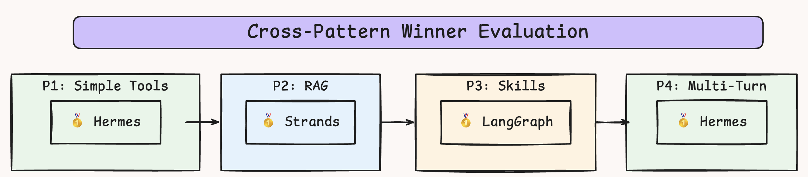{width=100%}

---

    
## V. Key Learnings


### 1. No bad frameworks — only untested ones

<br>
<br>

| Framework | Best | Worst |
| --- | --- | --- |
| LangGraph | 100% accuracy (P1+P3) | 134 MB memory, slowest |
| Strands | 44 MB memory, fast warm turns | 33 LLM calls by Turn 4, 124K tokens |
| Hermes | O(1) scaling, 2.6× token growth | ❌ Failed context test, missed Russia |

<br>
<br>

---

<br>
<br>

### 2. Architecture reveals weaknesses before your users do

<br>
<br>

| Framework | Architecture | Weakness It Creates |
| --- | --- | --- |
| **LangGraph** | Graph state machine — re-evaluates every node | LLM calls grow linearly; high in-process memory |
| **Strands** | Full context replay — every call sees everything | Tokens explode as turns increase |
| **Hermes** | Fixed loop — plan once, execute, answer | Shallow history reasoning; fails implicit references |

<br>
<br>

> None of these showed up in Pattern 1. All surfaced by Pattern 4.  
> **The architecture didn't change — the workload revealed it.**

<br>
<br>

---

<br>
<br>

### 3. Evaluation is a product feature, not an afterthought

<br>
<br>

Standard metrics tell you **how fast**. Designed tests tell you **how wrong**.

<br>
<br>

| Measured | Discovered | How |
| --- | --- | --- |
| Latency, tokens, memory | Hermes is fastest, cheapest | Standard metrics |
| "Same for Brazil" | Hermes **drops context** | Designed test |
| "Most populous European country" | Same model, different framework → different answer | Designed test |
| European GDP total | Hermes picked wrong skill → missed a country | Designed test |

<br>
<br>

> Every ❌ was caught by a **designed test**, not a dashboard.  
> If we'd only measured speed and cost, Hermes would look flawless.

### 1. No bad frameworks — only untested ones

<br>
<br>

| Framework | Best | Worst |
| --- | --- | --- |
| LangGraph | 100% accuracy (P1+P3) | 134 MB memory, slowest |
| Strands | 44 MB memory, fast warm turns | 33 LLM calls by Turn 4, 124K tokens |
| Hermes | O(1) scaling, 2.6× token growth | ❌ Failed context test, missed Russia |

<br>
<br>

---

<br>
<br>

### 2. Architecture reveals weaknesses before your users do

<br>
<br>

| Framework | Architecture | Weakness It Creates |
| --- | --- | --- |
| **LangGraph** | Graph state machine — re-evaluates every node | LLM calls grow linearly; high in-process memory |
| **Strands** | Full context replay — every call sees everything | Tokens explode as turns increase |
| **Hermes** | Fixed loop — plan once, execute, answer | Shallow history reasoning; fails implicit references |

<br>
<br>

> None of these showed up in Pattern 1. All surfaced by Pattern 4.  
> **The architecture didn't change — the workload revealed it.**

<br>
<br>

---

<br>
<br>

### 3. Evaluation is a product feature, not an afterthought

<br>
<br>

Standard metrics tell you **how fast**. Designed tests tell you **how wrong**.

<br>
<br>

| Measured | Discovered | How |
| --- | --- | --- |
| Latency, tokens, memory | Hermes is fastest, cheapest | Standard metrics |
| "Same for Brazil" | Hermes **drops context** | Designed test |
| "Most populous European country" | Same model, different framework → different answer | Designed test |
| European GDP total | Hermes picked wrong skill → missed a country | Designed test |

<br>
<br>

> Every ❌ was caught by a **designed test**, not a dashboard.  
> If we'd only measured speed and cost, Hermes would look flawless.

<br>
<br>

---

## VI. Epilogue


### Bonus Pattern 5: (-)RAG -> (+)Wiki

> *Remove RAG; include Karpathy's LLM Wiki pattern.*

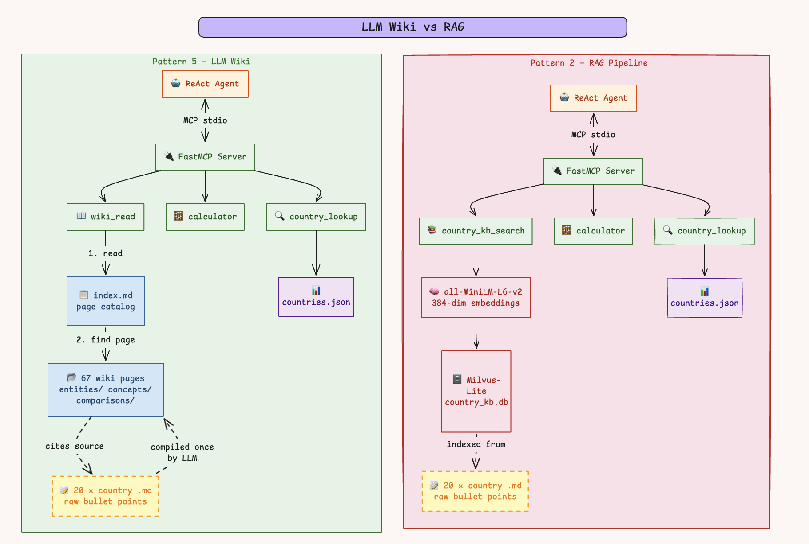{width=100%}

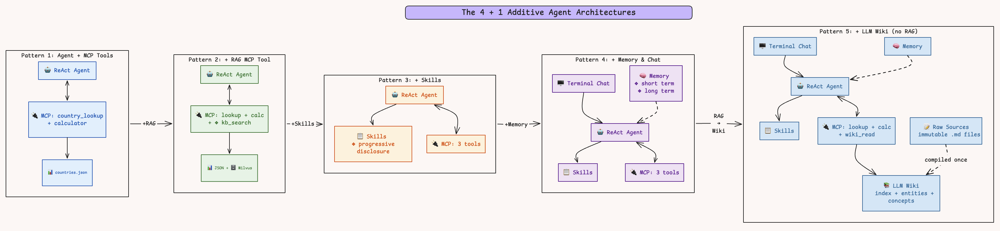{width=100%}

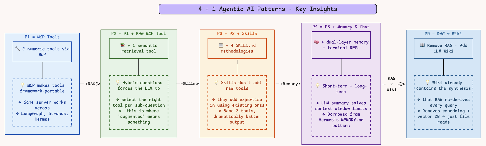{width=100%}

For the next iteration:

- Try Workflow Patterns
    - Routing-Workflow
    - Parallel-Workflow
    - Sequential-Workflow

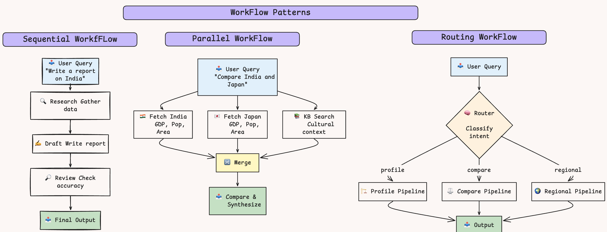{width=100%}

- Try comparing with other agentic AI frameworks
    - There are still other good ones like: `temporal` (python/typescript), `pydantic ai` (python), `rig` (rust)

Reproducibility note: These results reflect one local Ollama-based benchmark run with the same model, the same MCP tools, and the same prompts across all three frameworks. If you rerun them with a different model or different tool behavior, the rankings may change.

---

## VII. Github Resource

- The codebase, evaluation reports conducted are logged in github here: [senthilkumarm1901/agentic_frameworks_exploration](https://github.com/senthilkumarm1901/agentic_frameworks_exploration)


### Useful Reading References


Follow below links  for reading material on Agentic AI, each expanding on the link above that.  

1.  Simple article first: [Building Effective AI Agents](https://www.anthropic.com/engineering/building-effective-agents "https://www.anthropic.com/engineering/building-effective-agents")
2. Inspired by the above article and based on my day-to-day experience, I wrote an article on similar lines long ago: [https://medium.com/@senthilkumar.m1901/single-llm-to-agentic-ai-genais-evolution-explained-c0670d83…](https://medium.com/@senthilkumar.m1901/single-llm-to-agentic-ai-genais-evolution-explained-c0670d8325f3?source=friends_link&sk=d040821d89a7ce8c5e506fde3184c948 "https://medium.com/@senthilkumar.m1901/single-llm-to-agentic-ai-genais-evolution-explained-c0670d8325f3?source=friends_link&sk=d040821d89a7ce8c5e506fde3184c948")
3. None of the above have skills explained well: [Equipping agents for the real world with Agent Skills](https://www.anthropic.com/engineering/equipping-agents-for-the-real-world-with-agent-skills "https://www.anthropic.com/engineering/equipping-agents-for-the-real-world-with-agent-skills") 
4. Same Stuff as 1 but elaborated further with **Skills** and More Agentic Patterns; Anthropic gave version 2: [https://resources.anthropic.com/hubfs/Building%20Effective%20AI%20Agents-%20Architecture%20Patterns…](https://resources.anthropic.com/hubfs/Building%20Effective%20AI%20Agents-%20Architecture%20Patterns%20and%20Implementation%20Frameworks.pdf "https://resources.anthropic.com/hubfs/building%20effective%20ai%20agents-%20architecture%20patterns%20and%20implementation%20frameworks.pdf")
5. [Hermes Agent Masterclass](https://www.dailydoseofds.com/p/hermes-agent-masterclass/ "https://www.dailydoseofds.com/p/hermes-agent-masterclass/") (the pics here are 👌)
6. The Context Engineering 101 (in pic):

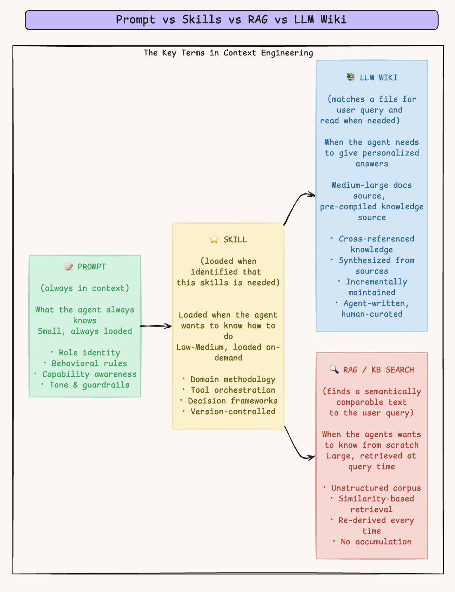{width=100%}