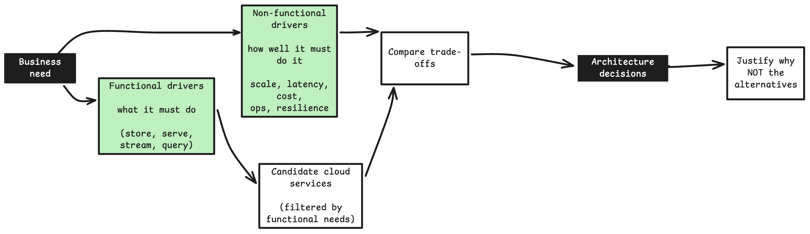

::: {.callout-note}
## Page Moved
This content now lives in the book **Thinking like a Cloud Architect**.

If you are not redirected automatically, please [**click here to go to the book**](https://senthilkumarm1901.github.io/learn_by_blogging/aws_architecting_solutions/).
:::

