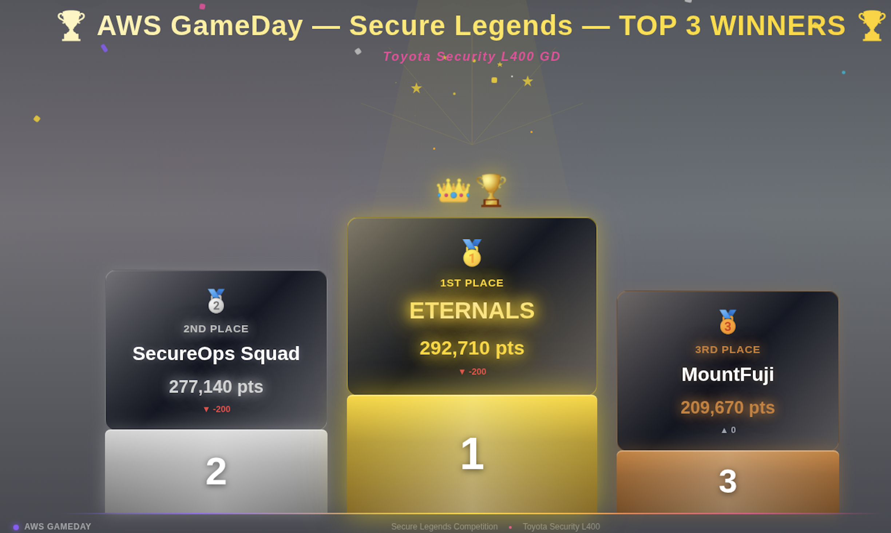

> * My Team - Eternals - won the event! <br>
> * Thanks to my company Toyota Connected India and AWS for organizing the event (Apr'26)

## The 3 AWS Security Quests

- **Forensics Analysis**: Identify, cordon off and remediate the compromised instances
	- AWS Services: EC2 Instances, ALB, ASG, Security Groups, CloudShell (to run the commands)
- **Data Classification & Protection**: PII leak detection & automated response
	- AWS Services: Lambda, Macie and EventBridge
- **Credentials Management**: Identity Compromise & Remediation
	- AWS Services: CloudTrail, S3, IAM, Lambda

## Our Strategy

The following steps we adopted helped in our success: 

- **Pre-event Preparation**: Before the event day, we were given the problem statements. I ran it by an LLM provider to come up with plans in "mermaid chart" format for the 3 quests. 
	- The mermaid chart plans are shown in the subsequent portion of the blog
- During the event, logged into the AWS Console. Entered AWS CloudShell and logged in to the provided KiroCLI (the real hero 🦸)
- For each quest, we had a KiroCLI terminal (different team members owned their interaction with kirocli in cloudshell of the AWS account where we were solving the problem). 
- **Gave Proper Context to KiroCLI**: We gave a mermaid chart with brief explanation of each quest so that the LLM in KiroCLI can understand the quest. 
- KiroCLI which came up with a plan as per the quest and the mermaid charts.
- Approved the AWS CLI commands suggested by KiroCLI as and when required. Suggested new approaches if need be. 

---


## Quest 1 - **Forensics Analysis**

#### Problem Statement from AWS

Unicorn Instances have been compromised! The user will have to identify the compromised instance and then cordon it to run analysis. They will use AWS CloudShell and the command line to determine where the instances were compromised and fix any issues.

**Services used:** 

1. EC2 → May have to create or delete certain instance
2. ALB → May need to enable access log. Change the listener rule
3. WAF → may need to check sampled request.
4. Security group → May need to modify inbound or outbound rule.
5. Auto scaling group → Add or remove instance.

#### The Preparation Plan

```{mermaid}

graph TB
    %% ── Styles ──
    classDef titleStyle fill:#1a1a2e,stroke:#e94560,color:#fff,font-weight:bold,font-size:16px
    classDef problemStyle fill:#2d2d44,stroke:#e94560,color:#fff,font-weight:bold
    classDef phaseStyle fill:#0f3460,stroke:#16213e,color:#fff,font-weight:bold,font-size:13px
    classDef ec2Style fill:#ff6f00,stroke:#e65100,color:#fff,font-weight:bold
    classDef albStyle fill:#7b1fa2,stroke:#4a148c,color:#fff,font-weight:bold
    classDef wafStyle fill:#d32f2f,stroke:#b71c1c,color:#fff,font-weight:bold
    classDef sgStyle fill:#1565c0,stroke:#0d47a1,color:#fff,font-weight:bold
    classDef asgStyle fill:#2e7d32,stroke:#1b5e20,color:#fff,font-weight:bold
    classDef shellStyle fill:#00838f,stroke:#006064,color:#fff,font-weight:bold
    classDef actionStyle fill:#37474f,stroke:#263238,color:#e0e0e0,font-size:11px
    classDef noteStyle fill:#fff3e0,stroke:#ff9800,color:#333,font-style:italic

    %% ── Title & Problem ──
    TITLE["🔬 FORENSICS ANALYSIS<br/>Unicorn Instances<br>Compromised!"]:::titleStyle
    PROBLEM["🚨 Problem:<br>Identify compromised<br>instance <br> → Cordon it <br/> → Run analysis via <br> AWS CloudShell CLI <br> → Fix issues"]:::problemStyle

    TITLE --> PROBLEM

    %% ── IR Lifecycle Phases ──
    PROBLEM --> DETECT
    DETECT["🔍 PHASE 1: DETECT<br/>Identify<br/>the Compromise"]:::phaseStyle
    CONTAIN["🔒 PHASE 2: CONTAIN<br/>Isolate & Cordon Off"]:::phaseStyle
    INVESTIGATE["🕵️ PHASE 3: INVESTIGATE<br/>Analyze the Attack"]:::phaseStyle
    REMEDIATE["🔧 PHASE 4: REMEDIATE<br/>Fix & Harden"]:::phaseStyle
    RECOVER["✅ PHASE 5: RECOVER<br/>Restore Normal Operations"]:::phaseStyle

    DETECT --> CONTAIN --> INVESTIGATE --> REMEDIATE --> RECOVER

    %% ── DETECT Phase Services ──
    DETECT --> ALB_DETECT["⚖️ ALB<br/>Enable Access Logs<br/>→ Capture client IPs, <br>request paths,<br/>response codes to S3"]:::albStyle
    DETECT --> WAF_DETECT["🛡️ WAF<br/>Check Sampled Requests<br/>→ Inspect headers, body,<br/>source IPs to find <br/>the attack vector"]:::wafStyle
    DETECT --> EC2_DETECT["🖥️ EC2<br/>Identify Compromised Instance<br/>→ Check metadata,<br/> user-data,<br/>system logs, IAM roles"]:::ec2Style

    %% ── CONTAIN Phase Services ──
    CONTAIN --> SG_CONTAIN["🔒 Security Group<br/>Quarantine Instance<br/>→ Restrict inbound:<br/> allow only forensic IP"]:::sgStyle
    CONTAIN --> ALB_CONTAIN["⚖️ ALB<br/>Change Listener Rules<br/>→ Redirect/block traffic to<br/>compromised instance"]:::albStyle
    CONTAIN --> ASG_CONTAIN["📈 Auto Scaling Group<br/>Detach Instance<br/>→ Remove from ASG to <br/>prevent auto-replacement<br/> & evidence loss<br/>→ Suspend scaling processes"]:::asgStyle

    %% ── INVESTIGATE Phase Services ──
    INVESTIGATE --> SHELL_INVESTIGATE["🐚 CloudShell<br/>CLI Forensic Workstation<br/>→ aws ec2 <br>describe-instances<br/>→ aws elbv2 <br>describe-target-health<br/>→ aws wafv2 <br>get-sampled-requests"]:::shellStyle
    INVESTIGATE --> EC2_INVESTIGATE["🖥️ EC2<br/>Deep Dive Analysis<br/>→ Snapshot EBS volume<br>(evidence)<br/>→ Review instance <br>metadata & IMDS<br/>→ SSH in for live forensics"]:::ec2Style
    INVESTIGATE --> ALB_INVESTIGATE["⚖️ ALB<br/>Analyze Access Logs<br/>→ Identify<br>suspicious traffic patterns<br/>→ Brute-force attempts, <br>exploit payloads"]:::albStyle

    %% ── REMEDIATE Phase Services ──
    REMEDIATE --> WAF_REMEDIATE["🛡️ WAF<br/>Tighten Rules<br/>→ Add IP blocklists<br/>→ Rate-based rules<br/>→ Geo-restrictions"]:::wafStyle
    REMEDIATE --> SG_REMEDIATE["🔒 Security Group<br/>Harden Rules<br/>→ Remove <br>0.0.0.0/0 SSH access<br/>→ Apply <br>least-privilege networking"]:::sgStyle
    REMEDIATE --> EC2_REMEDIATE["🖥️ EC2<br/>Terminate Compromised Instance<br/>→ Delete after <br>evidence captured<br/>→ Patch <br>AMI / launch template"]:::ec2Style

    %% ── RECOVER Phase Services ──
    RECOVER --> ASG_RECOVER["📈 Auto Scaling Group<br/>Restore Capacity<br/>→ Launch clean <br>replacement instances<br/>→ Resume <br>scaling processes<br/>→ Adjust <br>desired/min/max"]:::asgStyle
    RECOVER --> ALB_RECOVER["⚖️ ALB<br/>Restore Routing<br/>→ Re-enable <br>listener rules<br/>→ Verify health <br>checks pass"]:::albStyle
    RECOVER --> DONE["🎯 Unicorn Rentals<br/>Back Online & Hardened"]:::titleStyle
```


#### Lessons Learned

```{mermaid}
graph TD
    classDef titleStyle fill:#1b263b,stroke:#e63946,color:#fff,font-weight:bold,font-size:15px
    classDef lessonStyle fill:#2a2a40,stroke:#e63946,color:#fff,font-weight:bold
    classDef detailStyle fill:#37474f,stroke:#546e7a,color:#e0e0e0
    classDef fixStyle fill:#005f73,stroke:#0a9396,color:#fff,font-weight:bold

    TITLE["🔬 FORENSICS ANALYSIS<br/><br/>Lessons Learned"]:::titleStyle

    TITLE --> L1
    TITLE --> L2
    TITLE --> L3
    TITLE --> L4
    TITLE --> L5

    L1["❌ Lesson 1<br/><br/>Never ship<br/>backdoors"]:::lessonStyle
    L1 --> L1D["The /backdoor endpoint<br/>used subprocess.run<br/>with shell=True.<br/><br/>This is a textbook<br/>RCE vulnerability."]:::detailStyle

    L2["❌ Lesson 2<br/><br/>Separate ALB and<br/>instance Security Groups"]:::lessonStyle
    L2 --> L2D["Instances should never<br/>be directly reachable<br/>from the internet.<br/><br/>ALB faces public traffic.<br/>Instances stay in<br/>private subnets only."]:::detailStyle

    L3["❌ Lesson 3<br/><br/>Enable ALB<br/>access logs"]:::lessonStyle
    L3 --> L3D["Access logs were disabled,<br/>making forensic analysis<br/>much harder.<br/><br/>Always log to S3 —<br/>you can't investigate<br/>what you don't record."]:::detailStyle

    L4["❌ Lesson 4<br/><br/>Deploy WAF<br/>proactively"]:::lessonStyle
    L4 --> L4D["A basic WAF with<br/>AWS Managed Rules<br/>would have caught this.<br/><br/>WAF is a first line<br/>of defense, not<br/>an afterthought."]:::detailStyle

    L5["❌ Lesson 5<br/><br/>Principle of<br/>Least Privilege"]:::lessonStyle
    L5 --> L5D["The Flask app ran with<br/>full OS-level access,<br/>allowing file encryption.<br/><br/>Apps should run as<br/>restricted users with<br/>minimal permissions."]:::detailStyle
```

---

## Quest 2 - Data Classification & Protection

#### Problem Statement from AWS

Personal identity information is being leaked from Unicorn Rentals! The player will have to create a custom identifier and then apply it to the unicorn files stored in S3. They will then need to determine the source of the leak and put a stop to it.

**Services used:**

1. Lambda – Modify Python code
2. Macie → Create job for custom data identifier
3. EventBridge → create rule


#### The Preparation Plan

```
┌─────────────────────────────────────────────────────────────────┐
│                    DATA CLASSIFICATION PIPELINE                 │
├─────────────────────────────────────────────────────────────────┤
│                                                                 │
│   S3 Bucket                                                     │
│   (unicorn files with PII)                                      │
│        │                                                        │
│        ▼                                                        │
│   Amazon Macie                                                  │
│   ┌──────────────────────────┐                                  │
│   │ • Custom Data Identifier │ ← You create this (regex-based)  │
│   │ • Discovery Job          │ ← Scans S3 objects               │
│   │ • Findings generated     │                                  │
│   └──────────┬───────────────┘                                  │
│              │ (finding event published)                        │
│              ▼                                                  │
│   Amazon EventBridge                                            │
│   ┌──────────────────────────┐                                  │
│   │ • Rule: match Macie      │                                  │
│   │   finding events         │                                  │
│   │ • Target: Lambda / SNS   │                                  │
│   └──────────┬───────────────┘                                  │
│              │ (triggers)                                       │
│              ▼                                                  │
│   AWS Lambda                                                    │
│   ┌──────────────────────────┐                                  │
│   │ • Python code (modified) │                                  │
│   │ • Fix the PII leak       │                                  │
│   │ • Quarantine / remediate │                                  │
│   └──────────────────────────┘                                  │
│                                                                 │
└─────────────────────────────────────────────────────────────────┘
```

We did not know about Amazon Macie: 

* Amazon Macie is a **fully managed data security and privacy service** that uses **machine learning and pattern matching** to discover, classify, and protect sensitive data stored in **Amazon S3**. It's purpose-built for finding PII, financial data, credentials, and other sensitive content at scale.

How Macie fits the bigger picture for the problem

```
S3 Bucket (unicorn files)
     │
     ▼
Macie Discovery Job
(managed + custom identifiers)
     │
     ▼
Findings → "File X contains PII type Y at location Z"
     │
     ▼
EventBridge Rule → triggers alert / remediation
```

**Example EventBridge Rule Pattern for Macie**:

```
{
  "source": ["aws.macie"],
  "detail-type": ["Macie Finding"],
  "detail": {
    "severity": {
      "description": ["High"]
    }
  }
}
```


#### Lessons Learned

```{mermaid}

graph TD
    classDef titleStyle fill:#1b263b,stroke:#e63946,color:#fff,font-weight:bold,font-size:15px
    classDef lessonStyle fill:#2a2a40,stroke:#e63946,color:#fff,font-weight:bold
    classDef detailStyle fill:#37474f,stroke:#546e7a,color:#e0e0e0
    classDef fixStyle fill:#005f73,stroke:#0a9396,color:#fff,font-weight:bold

    TITLE["🛡️ DATA CLASSIFICATION<br/> and PROTECTION<br/><br/>Lessons Learned"]:::titleStyle

    TITLE --> L1
    TITLE --> L2
    TITLE --> L3
    TITLE --> L4
    TITLE --> L5

    L1["❌ Lesson 1<br/><br/>Never log or return<br/>PII in plaintext"]:::lessonStyle
    L1 --> L1D["Lambda was writing<br/>unredacted PII to logs<br/>and responses.<br/><br/>Always mask or tokenize<br/>before output."]:::detailStyle

    L2["❌ Lesson 2<br/><br/>Enable Macie<br/>proactively"]:::lessonStyle
    L2 --> L2D["Data classification should<br/>be continuous, not a<br/>forensic afterthought.<br/><br/>Scheduled Macie jobs catch<br/>leaks before customers do."]:::detailStyle

    L3["❌ Lesson 3<br/><br/>Define custom<br/>data identifiers early"]:::lessonStyle
    L3 --> L3D["AWS managed identifiers<br/>catch generic PII only.<br/><br/>Business-specific patterns<br/>like Unicorn customer IDs<br/>need custom regex rules."]:::detailStyle

    L4["❌ Lesson 4<br/><br/>Automate response<br/>with EventBridge"]:::lessonStyle
    L4 --> L4D["No rule existed to alert<br/>on Macie findings.<br/><br/>A simple EventBridge rule<br/>could trigger instant<br/>quarantine and notification."]:::detailStyle

    L5["❌ Lesson 5<br/><br/>Treat S3 as a<br/>data boundary"]:::lessonStyle
    L5 --> L5D["Every bucket holding<br/>customer data needs:<br/><br/>→ Server-side encryption<br/>→ Access logging<br/>→ Versioning<br/>→ Lifecycle policy"]:::detailStyle

```

---

## Quest 3 - Credentials Management

#### Problem Statement from AWS

Credentials for Unicorn Rentals have been compromised. Players will have to identify that user that encrypted some of the Unicorn instances and update that users access.

**Services used:**

1. CloudTrail.
2. S3 → For website hosting. Check security of the static website, Bucket policy
3. IAM role and user → may have to modify.
4. Lambda → Minor Python code change


#### The Preparation Plan

```{mermaid}

graph TB
    %% ── Styles ──
    classDef titleStyle fill:#1b263b,stroke:#e63946,color:#fff,font-weight:bold,font-size:16px
    classDef problemStyle fill:#2a2a40,stroke:#e63946,color:#fff,font-weight:bold
    classDef phaseStyle fill:#003049,stroke:#1d3557,color:#fff,font-weight:bold,font-size:13px
    classDef cloudtrailStyle fill:#6a040f,stroke:#370617,color:#fff,font-weight:bold
    classDef s3Style fill:#ee9b00,stroke:#ca6702,color:#fff,font-weight:bold
    classDef iamStyle fill:#005f73,stroke:#0a9396,color:#fff,font-weight:bold
    classDef lambdaStyle fill:#7f5539,stroke:#9c6644,color:#fff,font-weight:bold
    classDef actionStyle fill:#343a40,stroke:#212529,color:#e0e0e0,font-size:11px
    classDef noteStyle fill:#fff3e0,stroke:#ff9800,color:#333,font-style:italic

    %% ── Title & Problem ──
    TITLE["🔐 CREDENTIALS MANAGEMENT<br/><br/>Unicorn Rentals<br/>Security Incident"]:::titleStyle
    PROBLEM["🚨 Problem Statement:<br/><br/>Credentials have been compromised.<br/>Identify the user who encrypted<br/>Unicorn instances and update /<br/>revoke that user's access"]:::problemStyle

    TITLE --> PROBLEM

    %% ── Lifecycle Phases ──
    PROBLEM --> DETECT
    DETECT["🔍 PHASE 1: DETECT<br/><br/>Identify the<br/>Compromised Identity"]:::phaseStyle
    ANALYZE["🧠 PHASE 2: ANALYZE<br/><br/>Understand<br/>Scope & Impact"]:::phaseStyle
    CONTAIN["🔒 PHASE 3: CONTAIN<br/><br/>Restrict &<br/>Revoke Access"]:::phaseStyle
    REMEDIATE["🔧 PHASE 4: REMEDIATE<br/><br/>Fix Config<br/>& Code"]:::phaseStyle
    HARDEN["✅ PHASE 5: HARDEN<br/><br/>Prevent<br/>Recurrence"]:::phaseStyle

    DETECT --> ANALYZE --> CONTAIN --> REMEDIATE --> HARDEN

    %% ── DETECT ──
    DETECT --> CT_DETECT["🔍 CloudTrail<br/><br/>Review Event History<br/><br/>→ Identify who performed<br/>encryption<br/>→ User / Role /<br/>IP / Timestamp"]:::cloudtrailStyle

    %% ── ANALYZE ──
    ANALYZE --> CT_ANALYZE["🔍 CloudTrail<br/><br/>Correlate API Calls<br/><br/>→ KMS / EC2 / S3<br/>encryption actions<br/>→ Confirm<br/>blast radius"]:::cloudtrailStyle
    ANALYZE --> S3_ANALYZE["🪣 S3<br/><br/>Review Static<br/>Website Setup<br/><br/>→ Public access<br/>settings<br/>→ Bucket policy<br/>& ACLs"]:::s3Style

    %% ── CONTAIN ──
    CONTAIN --> IAM_CONTAIN["🔐 IAM<br/><br/>Modify User /<br/>Role Access<br/><br/>→ Revoke<br/>permissions<br/>→ Rotate<br/>credentials<br/>→ Disable<br/>compromised user"]:::iamStyle
    CONTAIN --> S3_CONTAIN["🪣 S3<br/><br/>Restrict<br/>Bucket Access<br/><br/>→ Tighten<br/>bucket policies<br/>→ Block<br/>public access"]:::s3Style

    %% ── REMEDIATE ──
    REMEDIATE --> LAMBDA_REMEDIATE["⚡ Lambda<br/><br/>Minor Python<br/>Code Change<br/><br/>→ Remove<br/>insecure logic<br/>→ Patch workflow<br/>using credentials"]:::lambdaStyle
    REMEDIATE --> IAM_REMEDIATE["🔐 IAM<br/><br/>Apply Least<br/>Privilege<br/><br/>→ Refine<br/>policies<br/>→ Remove unused<br/>permissions"]:::iamStyle

    %% ── HARDEN ──
    HARDEN --> CT_HARDEN["🔍 CloudTrail<br/><br/>Ensure Trails<br/>Enabled<br/><br/>→ Multi-region<br/>logging<br/>→ Long-term<br/>audit retention"]:::cloudtrailStyle
    HARDEN --> IAM_HARDEN["🔐 IAM<br/><br/>Security<br/>Best Practices<br/><br/>→ Enforce MFA<br/>→ Access key<br/>rotation<br/>→ Role-based<br/>access"]:::iamStyle
    HARDEN --> DONE["🎯 Unicorn Rentals<br/><br/>Credentials Secured<br/>& Monitored"]:::titleStyle
```

#### Lessons Learned

```{mermaid}
graph TD
    classDef titleStyle fill:#1b263b,stroke:#e63946,color:#fff,font-weight:bold,font-size:15px
    classDef lessonStyle fill:#2a2a40,stroke:#e63946,color:#fff,font-weight:bold
    classDef detailStyle fill:#37474f,stroke:#546e7a,color:#e0e0e0
    classDef fixStyle fill:#005f73,stroke:#0a9396,color:#fff,font-weight:bold

    TITLE["🔐 CREDENTIALS MANAGEMENT<br/><br/>Lessons Learned"]:::titleStyle

    TITLE --> L1
    TITLE --> L2
    TITLE --> L3
    TITLE --> L4
    TITLE --> L5

    L1["❌ Lesson 1<br/><br/>Never hardcode<br/>credentials"]:::lessonStyle
    L1 --> L1D["Static access keys<br/>are a ticking time bomb.<br/><br/>Rotate keys regularly.<br/>Use IAM roles instead."]:::detailStyle

    L2["❌ Lesson 2<br/><br/>Enable CloudTrail<br/>from Day 1"]:::lessonStyle
    L2 --> L2D["CloudTrail was used<br/>reactively for investigation.<br/><br/>It should alert proactively<br/>on anomalous API calls."]:::detailStyle

    L3["❌ Lesson 3<br/><br/>Enforce least privilege<br/>on IAM"]:::lessonStyle
    L3 --> L3D["Compromised user had<br/>permission to encrypt<br/>EC2 instances.<br/><br/>They should never<br/>have had that privilege."]:::detailStyle

    L4["❌ Lesson 4<br/><br/>Harden S3<br/>static websites"]:::lessonStyle
    L4 --> L4D["Bucket policies were<br/>overly permissive.<br/><br/>Use OAC + CloudFront,<br/>not public bucket policies."]:::detailStyle

    L5["❌ Lesson 5<br/><br/>Audit Lambda<br/>execution roles"]:::lessonStyle
    L5 --> L5D["Lambda IAM role had<br/>broader permissions<br/>than code required.<br/><br/>Tight scoping limits<br/>blast radius."]:::detailStyle
```


## Conclusion

- KiroCLI's direct access to AWS services via simple english language was both amazing and scary. 
- We may not enable KiroCLI in production. But seems like a good tool in dev and pre-prod stages
- I had generous help during the event from KiroCLI (maybe it is the event winner 🤔)
- I converted majority of the text in this blog to mermaid charts for easier readability (with the help of LLMs, again ;) )


