### Key Sections of this Blog

* 0) The 5 Min Short Version of the Entire Blog
* I) Introduction to AWS Bedrock
* II) Control Plane & Data Plane Endpoints
* III) Real World Bedrock Architectures
* IV) Guardrails
* V) Conclusion

> **Disclaimer**: <br>
> * The AWS CLI commands are ***representational***. Kindly check `aws <bedrock-api> <command> help` to confirm the workings.<br> 
> * These are notes for learning and I have used LLMs to tweak my messaging or make it crisper/better<br>
> * Sources are attributed to all external pics for clarity. Pics with no sources are Author's


```bash
▓▓▓▓▓▓▓▓▓▓▓▓▓▓▓▓▓▓▓▓▓▓▓▓▓▓▓▓▓▓▓▓▓▓▓▓▓▓▓▓▓▓▓▓▓▓▓▓▓▓▓▓▓▓▓▓▓▓▓▓▓
▓▓▓▓▓▓▓▓▓▓▓▓▓▓▓▓▓▓▓▓▓ End of Section ▓▓▓▓▓▓▓▓▓▓▓▓▓▓▓▓▓▓▓▓▓▓▓▓
▓▓▓▓▓▓▓▓▓▓▓▓▓▓▓▓▓▓▓▓▓▓▓▓▓▓▓▓▓▓▓▓▓▓▓▓▓▓▓▓▓▓▓▓▓▓▓▓▓▓▓▓▓▓▓▓▓▓▓▓▓
```

## 0. The 5 Min Short Version of the Entire Blog

<div align="center">

### AWS Bedrock APIs - Simplified Overview  


> * Tip: Right-click and see the above pic in new tab for full-screen view

</div>

---

<div align="center">
    
### The Three Main Bedrock Architecture Patterns


> * Tip: Right-click and see the above pic in new tab for full-screen view

</div>

---

### Real World Architecture Patterns

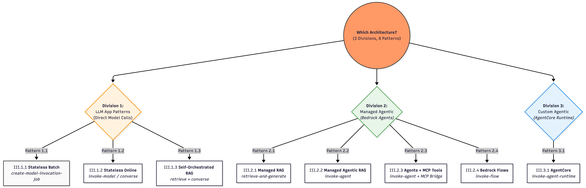

---

### In a hurry 🏃💨? What I will be covering here...


Bedrock APIs falling under 2 buckets

- **Control Plane** APIs:  Administrative APIs / define what exists
- **Data Plane** APIs: Primary function of the service (invoking the model/agent/flow)

---

Three common Bedrock architecture patterns:

1. LLM App → Direct model invocation
2. Managed Agentic App → Bedrock Agents
3. Custom Agentic App → AgentCore runtime

---

```bash
▓▓▓▓▓▓▓▓▓▓▓▓▓▓▓▓▓▓▓▓▓▓▓▓▓▓▓▓▓▓▓▓▓▓▓▓▓▓▓▓▓▓▓▓▓▓▓▓▓▓▓▓▓▓▓▓▓▓▓▓▓
▓▓▓▓▓▓▓▓▓▓▓▓▓▓▓▓▓▓▓▓▓ End of Section ▓▓▓▓▓▓▓▓▓▓▓▓▓▓▓▓▓▓▓▓▓▓▓▓
▓▓▓▓▓▓▓▓▓▓▓▓▓▓▓▓▓▓▓▓▓▓▓▓▓▓▓▓▓▓▓▓▓▓▓▓▓▓▓▓▓▓▓▓▓▓▓▓▓▓▓▓▓▓▓▓▓▓▓▓▓
```

<div align="center">

## I. Introduction to AWS Bedrock
    
</div>

### What is Amazon Bedrock?

Amazon Bedrock is a **fully managed, serverless** AWS service that exposes:

- **Foundation Models** (claude, titan, etc.,)
- **Agent Frameworks** 
    - `bedrock-agent` - an opinionated framework from AWS for Agent Orchestration (AWS owns the orchestration)
    - `bedrock-agentcore`, etc., - a modular frameowkr where you own the orchestration
- **Safety Controls** 

...through a unified API surface.

### What Can You Build?

Types of AI Apps:
- GenAI Deterministic or Agentic Workflows
- Conversational AI Applications

---

**What Bedrock offers:**

`Infrastructure` (serverless) + `Models` (Foundation Models)

### In a Model Inference API call, Bedrock Service allows you to ...

| Feature | Description |
|---------|-------------|
| Choose a model | Select from available FMs |
| Inference Parameters | temperature, top_p, model-specific settings |
| Model Inputs | Including Prompt |
| Output Config | Response formatting |
| Guardrails | For both query and output |

### Additional Capabilities

- Run **batch jobs**
- **Async** request calls
- **Fine-tuning** models
- **Provisioned throughput** for dedicated capacity


```bash
▓▓▓▓▓▓▓▓▓▓▓▓▓▓▓▓▓▓▓▓▓▓▓▓▓▓▓▓▓▓▓▓▓▓▓▓▓▓▓▓▓▓▓▓▓▓▓▓▓▓▓▓▓▓▓▓▓▓▓▓▓
▓▓▓▓▓▓▓▓▓▓▓▓▓▓▓▓▓▓▓▓▓ End of Section ▓▓▓▓▓▓▓▓▓▓▓▓▓▓▓▓▓▓▓▓▓▓▓▓
▓▓▓▓▓▓▓▓▓▓▓▓▓▓▓▓▓▓▓▓▓▓▓▓▓▓▓▓▓▓▓▓▓▓▓▓▓▓▓▓▓▓▓▓▓▓▓▓▓▓▓▓▓▓▓▓▓▓▓▓▓
```

<div align="center">

## II. Control Plane & Data Plane Endpoints
    
</div>

### API Plane Separation

AWS consistently separates services into:

| Plane | Purpose |
|-------|--------|
| **Control Plane** | Configure, create, manage things |
| **Data Plane** | Run workloads, handle high-volume traffic |

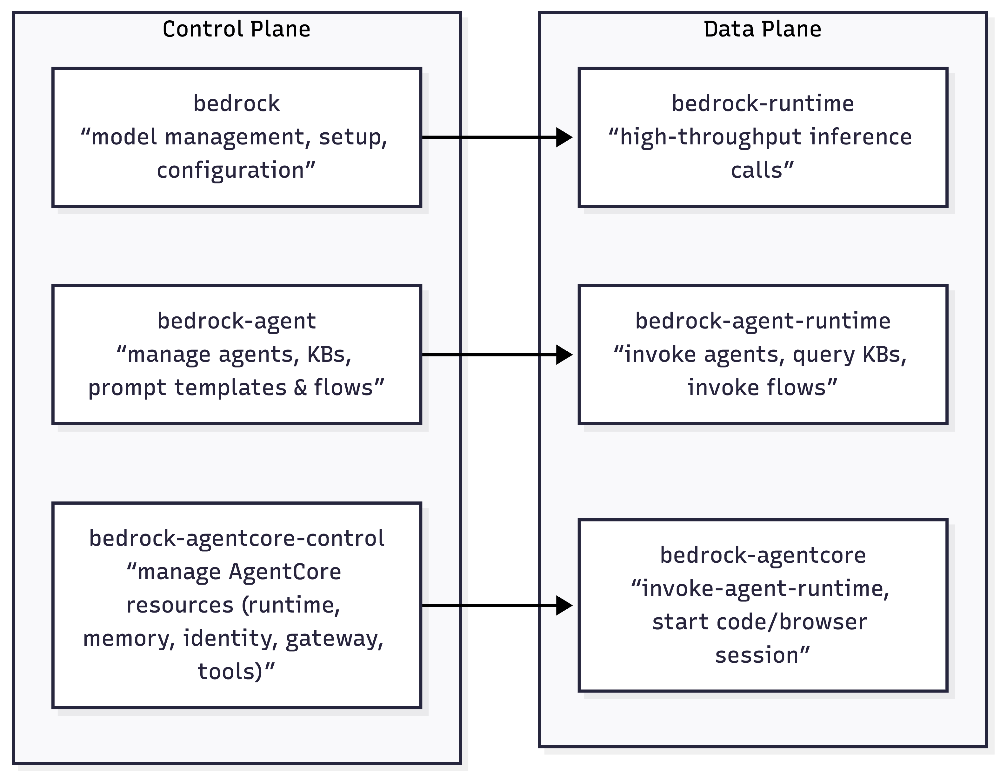

| S No | Endpoint                    | Plane         | Purpose                                                                | Who uses this?                                                                |
| ---- | --------------------------- | ------------- | ---------------------------------------------------------------------- | ----------------------------------------------------------------------------- |
| 1    | `bedrock`                   | Control plane | Model management, setup, configuration                                 | **Platform / ML / Infra teams** defining models, capacity, and governance     |
| 2    | `bedrock-runtime`           | Data plane    | High-throughput inference calls                                        | **Application developers** building stateless LLM-powered features            |
| 3    | `bedrock-agent`             | Control plane | Manage agents, KBs, prompt templates & flows                           | **Platform / ML teams** designing managed agent & RAG architectures           |
| 4    | `bedrock-agent-runtime`     | Data plane    | Invoke agents, query KBs, invoke flows                                 | **App developers** consuming _managed_ agents, RAG, and flows at runtime      |
| 5    | `bedrock-agentcore-control` | Control plane | Manage AgentCore resources (Runtime, Memory, Identity, Gateway, Tools) | **Advanced platform / agent teams** provisioning custom agent runtimes        |
| 6    | `bedrock-agentcore`         | Data plane    | Run agent sessions, tools (Browser/Code-Interpreter), Memory I/O       | **Teams running custom agent runtimes** (LangGraph / custom planners / tools) |


<div align="center">
    
### 1) `bedrock` — Control Plane

##### **Model management, setup, configuration**
    
</div>

- This is the **control plane** for core model management. 
- It includes APIs used to manage models, start fine-tuning model jobs, and batch inferencing, among others

### 1.1 Discover Models & Metadata

```bash
# List available foundation models
aws bedrock list-foundation-models --region us-east-1

# Inspect a specific model
aws bedrock get-foundation-model \
  --model-identifier anthropic.claude-3-5-sonnet-20240620-v1:0 \
  --region us-east-1
```

### 1.2 Configure account/Region‑level **invocation logging**

```bash
# Enable model invocation logging to S3
aws bedrock put-model-invocation-logging-configuration \
  --logging-config '{
    "s3Config": { "bucketName": "my-bedrock-logs" },
    "textDataDeliveryEnabled": true,
    "imageDataDeliveryEnabled": true
  }' \
  --region us-east-1
```

### 1.3 Provisioned Throughput

```bash
# Create Provisioned Throughput (dedicated capacity)
aws bedrock create-provisioned-model-throughput \
  --model-id anthropic.claude-3-5-sonnet-20240620-v1:0 \
  --provisioned-model-name my-pt-sonnet \
  --model-units 1 \
  --commitment-duration OneMonth \
  --region us-east-1
```

### 1.4 Fine-Tuning 

```bash
# Submit a fine-tuning job
aws bedrock create-model-customization-job \
  --job-name ft-haiku-faq \
  --base-model-identifier anthropic.claude-3-haiku-20240307-v1:0 \
  --training-data-config '{"s3Uri":"s3://my-train-bucket/data/"}' \
  --region us-east-1
  
```

### 1.5 Batch Inference


```bash
# Create batch inference job
aws bedrock create-model-invocation-job \
  --job-name faq-batch-jan \
  --model-id anthropic.claude-3-5-sonnet-20240620-v1:0 \
  --input-data-config '{"s3InputDataConfig":{"s3Uri":"s3://my-batch/input/"}}' \
  --region us-east-1
```


```bash
▓▓▓▓▓▓▓▓▓▓▓▓▓▓▓▓▓▓▓▓▓▓▓▓▓▓▓▓▓▓▓▓▓▓▓▓▓▓▓▓▓▓▓▓▓▓▓▓▓▓▓▓▓▓▓▓▓▓▓▓▓
▓▓▓▓▓▓▓▓▓▓▓▓▓▓▓▓▓▓▓▓▓ End of Sub-Section ▓▓▓▓▓▓▓▓▓▓▓▓▓▓▓▓▓▓▓▓
▓▓▓▓▓▓▓▓▓▓▓▓▓▓▓▓▓▓▓▓▓▓▓▓▓▓▓▓▓▓▓▓▓▓▓▓▓▓▓▓▓▓▓▓▓▓▓▓▓▓▓▓▓▓▓▓▓▓▓▓▓
```

<div align="center">

## 2) `bedrock-runtime` — Data Plane
#### **Inference, async calls, high-throughput**

</div>


- This is the **data plane** used for **real-time inference**. 
- If you need to call a model to generate output (e.g., text, images), the requests go through this endpoint. 

### 2.1 Single‑prompt **InvokeModel** (typical text generation)

```bash

# Prepare provider-specific body (example: Anthropic Claude 3.x)
cat > request.json <<'JSON'
{
  "anthropic_version":"bedrock-2023-05-31",
  "max_tokens":512,
  "messages":[{"role":"user","content":[{"type":"text","text":"Summarize ChatGPT architecture in 5 bullets."}]}]
}
JSON

# Invoke model and save response
aws bedrock-runtime invoke-model \
  --model-id anthropic.claude-3-5-sonnet-20240620-v1:0 \
  --content-type application/json \
  --body fileb://request.json \
  --region us-east-1 > response.json
```

> **Note:** AWS CLI does not support streaming responses

### 2.2 Converse API (Uniform Chat Interface)

```bash
# Simple multi-turn chat
aws bedrock-runtime converse \
  --model-id anthropic.claude-3-haiku-20240307-v1:0 \
  --messages '[{"role":"user","content":[{"text":"Give me 3 risks..."}]}]' \
  --region us-east-1

# Use a managed Prompt (Prompt Management)
aws bedrock-runtime converse \
  --model-id arn:aws:bedrock:us-east-1:<ACCOUNT_ID>:prompt/<PROMPT_ID> \
  --prompt-variables '{"input":"Generate a release note"}' \
  --region us-east-1
```

### 2.3 Embeddings 

```bash
# Text embeddings (Titan v2)
aws bedrock-runtime invoke-model \
  --model-id amazon.titan-embed-text-v2:0 \
  --body '{"inputText":"Bedrock embeddings"}' \
  --region us-east-1
```

### 2.4 Async Inference

```bash
# Start async invoke (long-running media workloads)
aws bedrock-runtime start-async-invoke \
  --model-id amazon.nova-reel-v1:0 \
  --model-input file://reel_request.json \
  --output-data-config 's3OutputDataConfig={"s3Uri":"s3://my-async/"}' \
  --region us-east-1
```

```bash
▓▓▓▓▓▓▓▓▓▓▓▓▓▓▓▓▓▓▓▓▓▓▓▓▓▓▓▓▓▓▓▓▓▓▓▓▓▓▓▓▓▓▓▓▓▓▓▓▓▓▓▓▓▓▓▓▓▓▓▓▓
▓▓▓▓▓▓▓▓▓▓▓▓▓▓▓▓▓▓▓▓▓ End of Sub-Section ▓▓▓▓▓▓▓▓▓▓▓▓▓▓▓▓▓▓▓▓
▓▓▓▓▓▓▓▓▓▓▓▓▓▓▓▓▓▓▓▓▓▓▓▓▓▓▓▓▓▓▓▓▓▓▓▓▓▓▓▓▓▓▓▓▓▓▓▓▓▓▓▓▓▓▓▓▓▓▓▓▓
```

<div align="center">

## 3) `bedrock-agent` — Control Plane

#### **Agents, Knowledge Bases, Prompt Templates**
    
</div>

- This is a **control plane** endpoint specifically for managing agents, prompt templates, knowledge bases, and prompt flows. 

### 3.1 Create & Manage an Agent

```bash
# Create an agent with instructions and a foundation model
aws bedrock-agent create-agent \
  --agent-name "ops-assistant" \
  --instruction "You are an internal Ops assistant." \
  --foundation-model anthropic.claude-3-5-sonnet-20240620-v1:0 \
  --agent-resource-role-arn arn:aws:iam::<ACCOUNT_ID>:role/BedrockAgentRole \
  --region us-east-1

# Create an alias
aws bedrock-agent create-agent-alias \
  --agent-id <AGENT_ID> --agent-alias-name prod --region us-east-1
```

### 3.2 Create Knowledge Base

```bash
# Create knowledge base (storage + vector config defined via JSON files)
aws bedrock-agent create-knowledge-base \
  --name kb-docs \
  --role-arn arn:aws:iam::<ACCOUNT_ID>:role/BedrockKBRole \
  --knowledge-base-configuration file://kb-config.json \
  --storage-configuration file://kb-storage.json \
  --region us-east-1

# Add data source and start ingestion
aws bedrock-agent create-data-source \
  --knowledge-base-id <KB_ID> --name s3-docs \
  --data-source-configuration file://kb-datasource.json \
  --region us-east-1
```

### 3.3 Prompt Management 
```bash
# Create a prompt with a variant
aws bedrock-agent create-prompt \
  --name "cs-faq" --default-variant "v1" \
  --variants file://prompt-variant.json --region us-east-1
```

### 3.4 Flows

```bash
# Create a Flow
aws bedrock-agent create-flow \
  --name "chat-lite" \
  --definition file://flow-definition.json \
  --region us-east-1
```

```bash
▓▓▓▓▓▓▓▓▓▓▓▓▓▓▓▓▓▓▓▓▓▓▓▓▓▓▓▓▓▓▓▓▓▓▓▓▓▓▓▓▓▓▓▓▓▓▓▓▓▓▓▓▓▓▓▓▓▓▓▓▓
▓▓▓▓▓▓▓▓▓▓▓▓▓▓▓▓▓▓▓▓▓ End of Sub-Section ▓▓▓▓▓▓▓▓▓▓▓▓▓▓▓▓▓▓▓▓
▓▓▓▓▓▓▓▓▓▓▓▓▓▓▓▓▓▓▓▓▓▓▓▓▓▓▓▓▓▓▓▓▓▓▓▓▓▓▓▓▓▓▓▓▓▓▓▓▓▓▓▓▓▓▓▓▓▓▓▓▓
```

<div align="center">

## 4) `bedrock-agent-runtime` — Data Plane

#### **Invoke agents, query KBs/RAG**
    
</div>    


- This is the **data plane** counterpart for agents. 
- It is used when you invoke an agent or flow, or when you query a knowledge base in real time.

### 4.1 Invoke an Agent

```bash
# Invoke an agent alias with session state
aws bedrock-agent-runtime invoke-agent \
  --agent-id <AGENT_ID> \
  --agent-alias-id <ALIAS_ID> \
  --session-id $(uuidgen) \
  --input-text "Summarize yesterday's on-call incident." \
  --region us-east-1
# path=bedrock-agent-runtime; agent-id/alias route to deployed agent; session-id threads convo.
```

### 4.2 **retrieve** (vector search only) vs **retrieve‑and‑generate** (managed RAG)

```bash
# Retrieve: semantic search only (no LLM generation)
aws bedrock-agent-runtime retrieve \
  --knowledge-base-id <KB_ID> \
  --retrieval-query '{"text":"backup policy steps"}' \
  --region us-east-1

# Retrieve-and-generate: fetch + generate in one call
aws bedrock-agent-runtime retrieve-and-generate \
  --input '{"text":"What are our P1 on-call steps?"}' \
  --retrieve-and-generate-configuration '{...}' \
  --region us-east-1
```

### 4.3 **Invoke a Flow** with `bedrock-agent-runtime`

```bash
# Prepare the flow input (maps to your Flow's Input Node names)
cat > flow-input.json <<'JSON'
{
  "inputs": [
    {
      "content": { "document": "hello" },
      "nodeName": "FlowInputNode",
      "nodeOutputName": "document"
    }
  ]
}
JSON

# Invoke a Flow alias
aws bedrock-agent-runtime invoke-flow \
  --flow-identifier <FLOW_ID> \
  --flow-alias-identifier <ALIAS_ID> \
  --cli-input-json file://flow-input.json \
  --region us-east-1 > flow-response.json

# (Typical inspection)
cat flow-response.json
```

```bash
▓▓▓▓▓▓▓▓▓▓▓▓▓▓▓▓▓▓▓▓▓▓▓▓▓▓▓▓▓▓▓▓▓▓▓▓▓▓▓▓▓▓▓▓▓▓▓▓▓▓▓▓▓▓▓▓▓▓▓▓▓
▓▓▓▓▓▓▓▓▓▓▓▓▓▓▓▓▓▓▓▓▓ End of Sub-Section ▓▓▓▓▓▓▓▓▓▓▓▓▓▓▓▓▓▓▓▓
▓▓▓▓▓▓▓▓▓▓▓▓▓▓▓▓▓▓▓▓▓▓▓▓▓▓▓▓▓▓▓▓▓▓▓▓▓▓▓▓▓▓▓▓▓▓▓▓▓▓▓▓▓▓▓▓▓▓▓▓▓
```

<div align="center">

## 5) `bedrock-agentcore-control` — Control Plane

#### **AgentCore Resources Management**
    
</div>

## Create AgentCore Runtime

```bash
# 1. Package & upload your LangGraph agent

## Example: package and upload your agent code
zip -r agent.zip app.py requirements.txt my_langgraph_pkg/

aws s3 cp agent.zip s3://my-bucket/agentcore/artifacts/agent.zip --region us-east-1

# 2. Create the AgentCore Runtime (direct code deploy)

aws bedrock-agentcore-control create-agent-runtime \
  --agent-runtime-name chat-runtime \
  --agent-runtime-artifact '{
    "codeConfiguration": {
      "code": { "s3": { "bucket":"my-bucket","prefix":"agentcore/artifacts/" } },
      "runtime": "PYTHON_3_11"
    }
  }' \
  --role-arn arn:aws:iam::<ACCOUNT_ID>:role/AgentCoreExecutionRole \
  --region us-east-1
```


### 5.2 Configure **Memory** (for short/long‑term context)

```bash
# Create a Memory resource
aws bedrock-agentcore-control create-memory \
  --name chat-memory \
  --region us-east-1

# List memories
aws bedrock-agentcore-control list-memories --region us-east-1

# Describe a Memory
aws bedrock-agentcore-control get-memory \
  --memory-id <MEMORY_ID> \
  --region us-east-1
```

### 5.3 Configure **Gateway** (turn APIs/Lambda/MCP servers into tools)

```bash
# Create a Gateway (tool registry)
aws bedrock-agentcore-control create-gateway \
  --name chat-gateway \
  --region us-east-1

# Register a tool target (e.g., an internal API / MCP server / Lambda)
aws bedrock-agentcore-control create-gateway-target \
  --gateway-id <GATEWAY_ID> \
  --name kb-search \
  --region us-east-1

# List gateways & targets
aws bedrock-agentcore-control list-gateways --region us-east-1
aws bedrock-agentcore-control list-gateway-targets \
  --gateway-id <GATEWAY_ID> \
  --region us-east-1
```

```bash
▓▓▓▓▓▓▓▓▓▓▓▓▓▓▓▓▓▓▓▓▓▓▓▓▓▓▓▓▓▓▓▓▓▓▓▓▓▓▓▓▓▓▓▓▓▓▓▓▓▓▓▓▓▓▓▓▓▓▓▓▓
▓▓▓▓▓▓▓▓▓▓▓▓▓▓▓▓▓▓▓▓▓ End of Sub-Section ▓▓▓▓▓▓▓▓▓▓▓▓▓▓▓▓▓▓▓▓
▓▓▓▓▓▓▓▓▓▓▓▓▓▓▓▓▓▓▓▓▓▓▓▓▓▓▓▓▓▓▓▓▓▓▓▓▓▓▓▓▓▓▓▓▓▓▓▓▓▓▓▓▓▓▓▓▓▓▓▓▓
```

<div align="center">

## 6) `bedrock-agentcore` — Data Plane

#### **Run Agent Sessions, Tools, Memory I/O**

</div>

- This is where your chat app **runs** the agent: 
    - start/stream **sessions**, 
    - call **tools** (Browser/Code‑Interpreter), and 
    - perform **Memory** reads/writes
- all under per‑second, consumption‑based runtime billing

### Invoke Agent Runtime & Memory

```bash
# Invoke against an AgentCore Runtime
aws bedrock-agentcore invoke-agent-runtime \
  --agent-runtime-id <RUNTIME_ID> \
  --session-id $(uuidgen) \
  --input '{"prompt":"hello"}' \
  --region us-east-1

# Add memory records
aws bedrock-agentcore batch-create-memory-records \
  --memory-id <MEMORY_ID> \
  --records '[{"type":"TEXT","text":"User prefers concise."}]' \
  --region us-east-1
```

```bash
▓▓▓▓▓▓▓▓▓▓▓▓▓▓▓▓▓▓▓▓▓▓▓▓▓▓▓▓▓▓▓▓▓▓▓▓▓▓▓▓▓▓▓▓▓▓▓▓▓▓▓▓▓▓▓▓▓▓▓▓▓
▓▓▓▓▓▓▓▓▓▓▓▓▓▓▓▓▓▓▓▓▓ End of Section ▓▓▓▓▓▓▓▓▓▓▓▓▓▓▓▓▓▓▓▓▓▓▓▓
▓▓▓▓▓▓▓▓▓▓▓▓▓▓▓▓▓▓▓▓▓▓▓▓▓▓▓▓▓▓▓▓▓▓▓▓▓▓▓▓▓▓▓▓▓▓▓▓▓▓▓▓▓▓▓▓▓▓▓▓▓
```

<div align="center">

## III. Real-World Bedrock Architectures
    
</div>

### Architecture Patterns Overview

Most Bedrock-based systems fall into repeatable patterns depending on:

- Whether **state** is required
- Who owns **orchestration**
- **Control vs convenience** desired
- **Latency and cost** sensitivity


<div align="center">

## III.1 LLM App Patterns (Direct Model Invocation)    
    
</div>

> *These patterns are for developers who want to handle all logic themselves,* 
> *using Bedrock strictly as an inference and retrieval engine.*

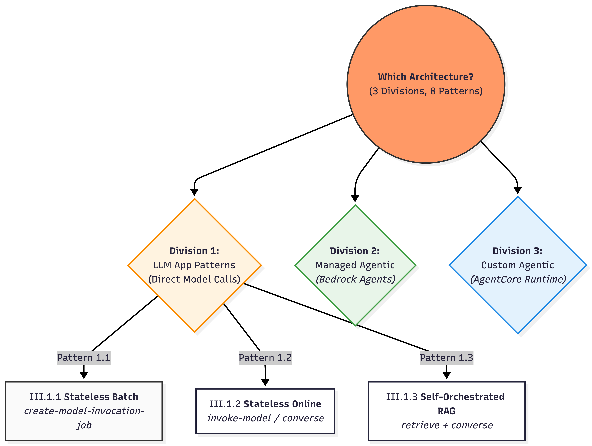

### III.1.1) Stateless Batch LLM Calls (Offline / Async workloads)

**When to use:** High-volume, independent prompts; throughput/cost optimized; results can land later

```bash
S3 (JSONL inputs)
   │
   ▼
bedrock.create-model-invocation-job
   │
   ▼
S3 (JSONL outputs)
```

**State:** No conversational state. Just S3 input + job metadata, receive output

Source: [AWS Docs Batch Inference](https://docs.aws.amazon.com/bedrock/latest/userguide/batch-inference-data.html)

**An Example JSONL Object**: 

```JSONL
{"modelInput": {"anthropic_version": "bedrock-2023-05-31", "max_tokens": 512, "messages": [{"role": "user", "content": [{"type": "text", "text": "Summarize this ticket: My intemrnet has been down in Chennai for 3 hours."}]}]}, "recordId": "ticket_001"}
{"modelInput": {"anthropic_version": "bedrock-2023-05-31", "max_tokens": 512, "messages": [{"role": "user", "content": [{"type": "text", "text": "Summarize this ticket: I cannot login to the mobile app despite resetting password."}]}]}, "recordId": "ticket_002"}
```


### III.1.2) Stateless Online LLM Calls

**When to use:** Single-turn transformations, classification, summarization

```
User / App
   │
   ▼
bedrock-runtime.invoke-model or converse
   │
   ▼
Response
```

**State:** 
- Fully stateless. All context must be sent each call.
- Even the converse API is strictly stateless.
- Append the previous turn conversations to the `--messages` array parameter in the next API call.

### III.1.3) Self-orchestrated RAG

**When to use**

* Need deterministic control over the retrieved documents. 


```
User
  → bedrock-agent-runtime.retrieve (KB search)
  → your code filters / trims chunks (custom logic)
  → bedrock-runtime.ConverseStream (LLM + streaming)
  → Token stream → UI
```

**Key characteristics**

* Uses **two data planes**:

  * `bedrock-agent-runtime.retrieve` → vector search only
  * `bedrock-runtime` → LLM inference
* Retrieval and generation are **decoupled**

**State lives in**:
* **Application-managed**. History, retrieval results, and prompt assembly live in your application logic (e.g., a Lambda or ECS container).

> This is **RAG without agents** — simple, explicit, and production-friendly.

```bash
▓▓▓▓▓▓▓▓▓▓▓▓▓▓▓▓▓▓▓▓▓▓▓▓▓▓▓▓▓▓▓▓▓▓▓▓▓▓▓▓▓▓▓▓▓▓▓▓▓▓▓▓▓▓▓▓▓▓▓▓▓
▓▓▓▓▓▓▓▓▓▓▓▓▓▓▓▓▓▓▓▓▓ End of Sub-Section ▓▓▓▓▓▓▓▓▓▓▓▓▓▓▓▓▓▓▓▓
▓▓▓▓▓▓▓▓▓▓▓▓▓▓▓▓▓▓▓▓▓▓▓▓▓▓▓▓▓▓▓▓▓▓▓▓▓▓▓▓▓▓▓▓▓▓▓▓▓▓▓▓▓▓▓▓▓▓▓▓▓
```

<div align="center">

## III.2 Managed Agentic App Patterns (Bedrock Agents)
    
</div>

> * *These patterns use the "Autonomous Being" model* 
> * *where AWS manages both the Brain (Planner) and the Body (Memory/Tools).* 

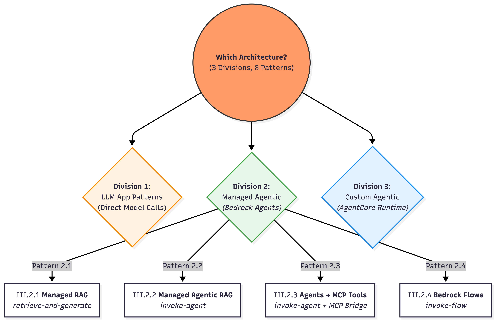

### III.2.1) Managed RAG — `retrieve-and-generate`

**The simplest possible RAG that Bedrock offers.**

**When to use**: <br>
* Fast “KB Q&A” with minimal plumbing; a single managed retrieval + answer step is sufficient.

```
User
  → bedrock-agent-runtime.retrieve-and-generate
       ├─ Vector search (once)
       ├─ Prompt assembly (bedrock-managed)
       └─ LLM generation
  → Response
```

**State:** Primary knowledge in KB. Use a `sessionId` to allow the managed service to handle continuity.


###  III.2.2) AWS Bedrock Managed Agentic RAG

**When to use**
* Need built-in planning + tool use + KB integration + traceability with fastest time-to-value.

```
User
  → bedrock-agent-runtime.invoke-agent
       ├─ Agent orchestrates KB + tools
       ├─ May retrieve multiple times
       └─ Event stream (answer + trace)
  → UI
```

* Control Plane: bedrock-agent → configure agent (instructions, action groups, KBs)
* Data Plane: bedrock-agent-runtime (data) → invoke-agent (answer + optional trace)


**State lives in**:
* Agent session context is tied to `sessionId` and can be shaped via `SessionState` (session attributes, conversation history, etc.).

**Key characteristics**

* Uses **`bedrock-agent-runtime.invoke-agent`**
* Bedrock owns:

  * planning
  * retrieval count
  * tool invocation
  * conversational state

* Outputs:

  * final answer
  * optional reasoning / trace events

**Important nuance**

* We **cannot have fool-proof** control how many retrievals happen (possible through prompt instructions)
* Latency can vary per request
* Debugging requires reading traces, not logs

### III.2.3) Bedrock Agents + MCP-backed Tools

**When to use**
- When you need your existing AWS-managed Bedrock Agent to connect to MCP compatible servers
- When you are ok doing some custom plumbing activities

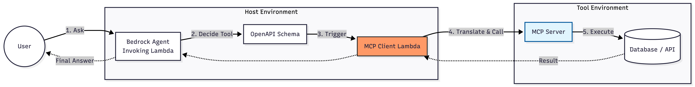

**State lives in**:
* Reasoning/session context in Bedrock Agent via `sessionId`/`SessionState`.
* Tool/data-side state in external MCP services 

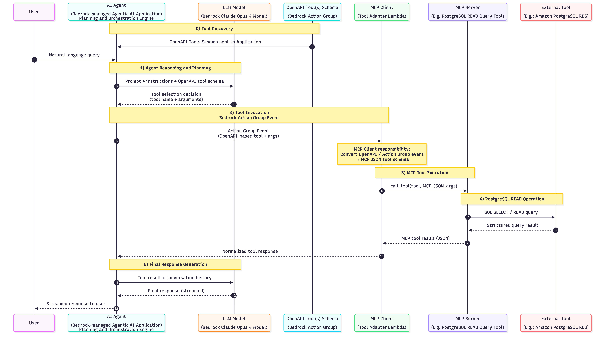


### III.2.4) Bedrock Flows

**Declarative, managed orchestration for predictable GenAI workflows**

```
User / App
  → bedrock-flow-runtime.invoke-flow
       ├─ Step 1: Prompt / Model call
       ├─ Step 2: Conditional logic
       ├─ Step 3: Retrieval or transform
       └─ Step N: Final response
```

**When to use**
* Need a governed, versioned, deterministic pipeline (branching/conditions/iterations) without writing orchestration code.

**State Lives In**
* **Execution-Tracked**. State is tracked via executionId for the duration of the flow's run.

```bash
▓▓▓▓▓▓▓▓▓▓▓▓▓▓▓▓▓▓▓▓▓▓▓▓▓▓▓▓▓▓▓▓▓▓▓▓▓▓▓▓▓▓▓▓▓▓▓▓▓▓▓▓▓▓▓▓▓▓▓▓▓
▓▓▓▓▓▓▓▓▓▓▓▓▓▓▓▓▓▓▓▓▓ End of Sub-Section ▓▓▓▓▓▓▓▓▓▓▓▓▓▓▓▓▓▓▓▓
▓▓▓▓▓▓▓▓▓▓▓▓▓▓▓▓▓▓▓▓▓▓▓▓▓▓▓▓▓▓▓▓▓▓▓▓▓▓▓▓▓▓▓▓▓▓▓▓▓▓▓▓▓▓▓▓▓▓▓▓▓
```

<div align="center">

## III.3 Custom Agentic App Patterns (AgentCore)
    
</div>

> * *You provide the Brain (Planner), AWS provides the Body (Managed Infrastructure).*

**What is AgentCore?**

AgentCore is both **framework-agnostic** and **model-agnostic** — deploy and operate AI agents securely at scale using any framework ([Strands](https://strandsagents.com/latest/), [CrewAI](https://www.crewai.com/), [LangGraph](https://www.langchain.com/langgraph), [LlamaIndex](https://www.llamaindex.ai/)) and any LLM. It eliminates the undifferentiated heavy lifting of building specialized agent infrastructure.

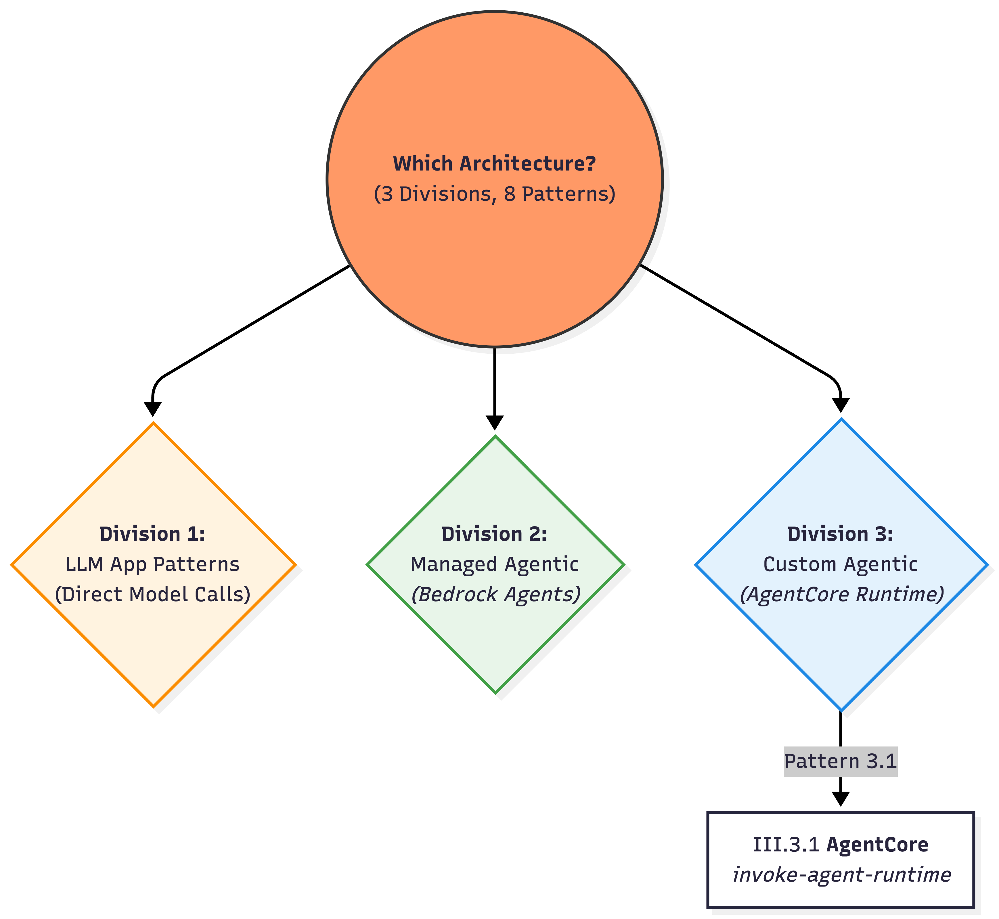

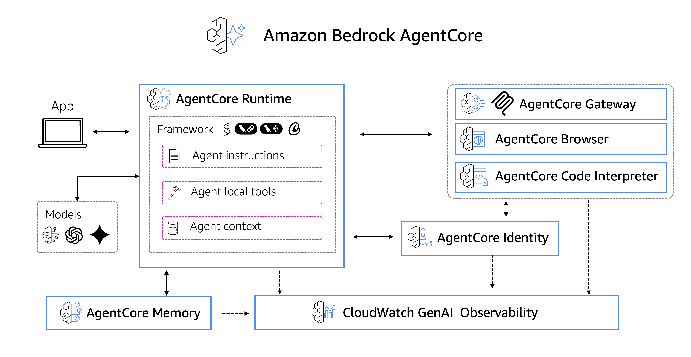

Source: [amazon-bedrock-agentcore-samples github repo](https://github.com/awslabs/amazon-bedrock-agentcore-samples/tree/main/01-tutorials)

**AgentCore Components (main ones in my opinion):**

| Component | Purpose |
|-----------|--------|
| **Runtime** | Secure, serverless runtime to deploy agents & tools — any framework, any model |
| **Gateway** | Convert APIs/Lambda into MCP-compatible tools automatically |
| **Identity** | Agent identity & access management (Okta, Entra, Cognito) |
| **Memory** | Managed memory infrastructure for personalized agent experiences |
| **Tools** | Built-in Code Interpreter & Browser Tool |

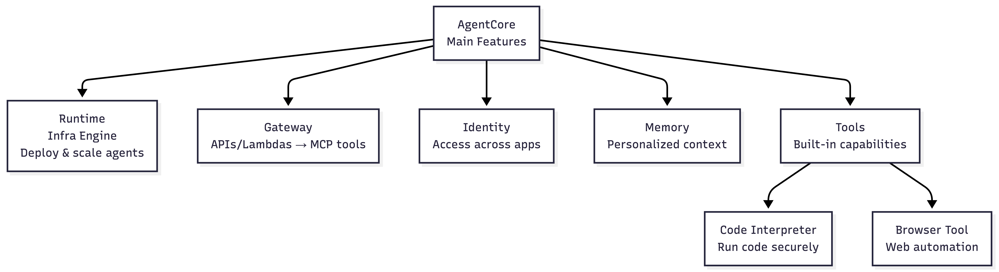

Adapted from [amazon-bedrock-agentcore-samples github repo](https://github.com/awslabs/amazon-bedrock-agentcore-samples)

**Gateway: APIs → MCP Tools**

AI agents need tools to perform real-world tasks — from searching databases to sending messages. AgentCore Gateway automatically converts APIs, Lambda functions, and existing services into MCP-compatible tools so developers can quickly make these essential capabilities available to agents without managing integrations.

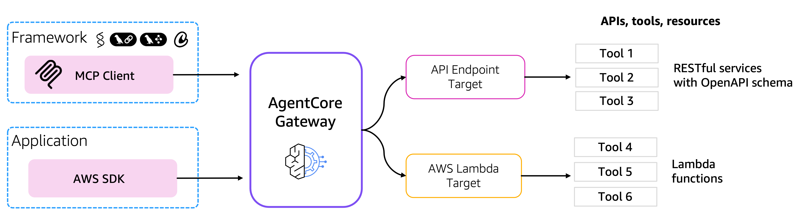

Source: [amazon-bedrock-agentcore-samples](https://github.com/awslabs/amazon-bedrock-agentcore-samples/tree/main/01-tutorials/02-AgentCore-gateway)

**Example Architecture:**

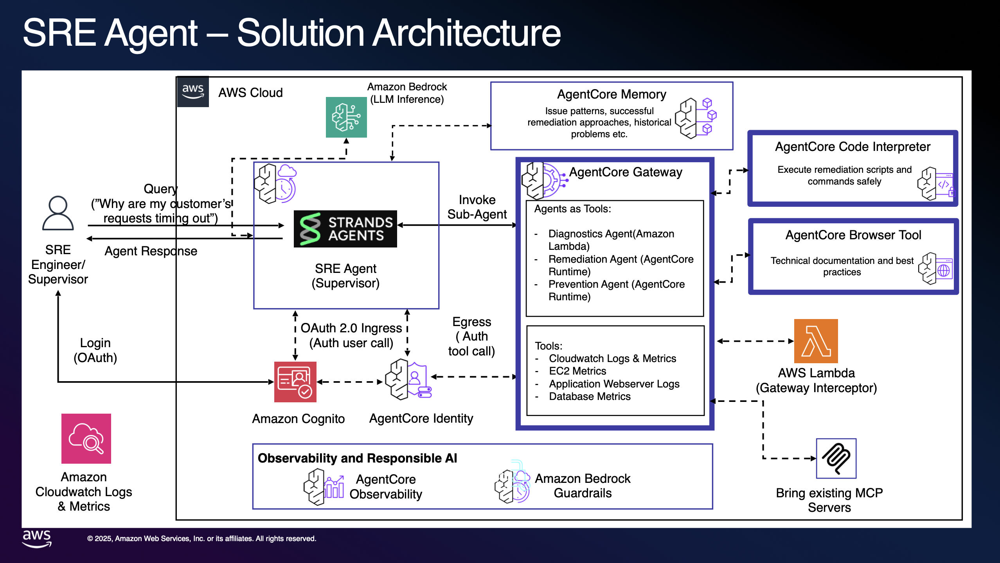

Source: [amazon-bedrock-agentcore-samples](https://github.com/awslabs/amazon-bedrock-agentcore-samples/tree/main/01-tutorials/02-AgentCore-gateway/12-agents-as-tools-using-mcp)

### III.3.1) AgentCore (Custom Agent Runtime)

**When to use**

* Need custom agent planners (LangGraph/Strands/custom loops), long-running sessions, strict isolation, custom tools.
* SecOps approved permissions to Agents

```
User
  → bedrock-agentcore.invoke-agent-runtime
       ├─ Your planner loop (LangGraph/custom)
       ├─ Explicit memory read/write
       ├─ Tool calls (Bedrock Browser/Bedrock Code tool or external tools) 
       └─ Streaming output
  → UI
```

* Control: bedrock-agentcore-control → deploy runtime/memory/gateway
* Run: bedrock-agentcore (data) → invoke-agent-runtime (session-based)

**State**: 
* **Externally Managed**. State is explicitly persisted and retrieved via bedrock-agentcore APIs 

> * This is **maximum control**, at the cost of **maximum responsibility**.

<div align="center">

## IV. Guardrails
    
</div>

### How Guardrails Work

```
User Prompt
     │
     ▼
┌───────────────────────────────┐
│ Guardrails — INPUT SCAN       │
│ • Topic allow / deny          │
│ • Jailbreak patterns          │
│ • PII detection (optional)    │
└───────────────────────────────┘
     │
     ├─❌ Violates? → Block/Rephrase
     ▼
┌───────────────────────────────┐
│ Core Model Inference          │
└───────────────────────────────┘
     │
     ▼
┌───────────────────────────────┐
│ Guardrails — OUTPUT SCAN      │
└───────────────────────────────┘
     │
     ▼
Final Response
```

### How Guardrails are enforced in Bedrock Runtime APIs

```bash
# process
bedrock-runtime.converse
   ├─ Guardrail input scan
   ├─ Model inference
   └─ Guardrail output scan
```

```bash
# how converse api is invoked with Guardrail
bedrock-runtime.converse
  - modelId
  - messages
  - guardrailIdentifier
  - guardrailVersion
```

### Why `<input>` Tags Matter


**TL;DR**  
- Guardrails don’t automatically protect an entire prompt. For key protections—especially **prompt‑injection** and **jailbreak** defenses—Guardrails evaluate content **inside `<input> … </input>`**. 
- Explicitly tagging untrusted text clarifies what must be scrutinized.


**Trust Zones:**
- **Trusted:** system instructions, developer rules
- **Untrusted:** end-user input (free-form text)

**With tags (correct scoping):**
```
System: Follow safety rules.

<input>
how can I make a bomb?
</input>
```

<div align="center">

## V. Summary
    
</div>    

## Three Bedrock Runtime APIs

| API | Key Commands | State |
|-----|--------------|-------|
| `bedrock-runtime` | invoke-model, converse | **Stateless** — No memory |
| `bedrock-agent-runtime` | retrieve, invoke-agent | **Session-aware** — Bedrock-managed |
| `bedrock-agentcore` | invoke-agent-runtime | **Fully stateful** — App-owned |


```bash
▓▓▓▓▓▓▓▓▓▓▓▓▓▓▓▓▓▓▓▓▓▓▓▓▓▓▓▓▓▓▓▓▓▓▓▓▓▓▓▓▓▓▓▓▓▓▓▓▓▓▓▓▓▓▓▓▓▓▓▓▓
```

## Mental Model Recap

| LLM App Pattern | API |
|---------|-----|
| Stateless Batch | `bedrock.create-model-invocation-job` |
| Stateless Online | `bedrock-runtime.invoke-model/converse` |
| Self-orchestrated RAG | `retrieve` + `converse` |


```bash
▓▓▓▓▓▓▓▓▓▓▓▓▓▓▓▓▓▓▓▓▓▓▓▓▓▓▓▓▓▓▓▓▓▓▓▓▓▓▓▓▓▓▓▓▓▓▓▓▓▓▓▓▓▓▓▓▓▓▓▓▓
```

**You have less control here in AWS Managed Bedrock Agents)** 

| Bedrock Managed 🧠 App Pattern | API |
|---------|-----|
| Managed RAG | `bedrock-agent-runtime.retrieve-and-generate` |
| Deterministic Flows | `bedrock-agent-runtime.invoke-flow` |
| Managed Agents | `bedrock-agent-runtime.invoke-agent` |


```bash
▓▓▓▓▓▓▓▓▓▓▓▓▓▓▓▓▓▓▓▓▓▓▓▓▓▓▓▓▓▓▓▓▓▓▓▓▓▓▓▓▓▓▓▓▓▓▓▓▓▓▓▓▓▓▓▓▓▓▓▓▓
```

**You have more control here in AgentCore** | AgentCore gives you serverless infra

| Custom Managed 🧠 App Pattern | API |
|---------|-----|
| Custom AgentCore | * `bedrock-agentcore.invoke-agent-runtime` <br> |


> *Each layer trades **control for convenience** — not capability.*

## Core Takeaways

- **AWS Bedrock** = Fully managed, serverless service for GenAI apps
- **API Plane Separation:** Control Plane (configure) vs Data Plane (run)
- **Key Control Plane APIs:** `bedrock`, `bedrock-agent`, `bedrock-agentcore-control`
- **Key Data Plane APIs:** `bedrock-runtime`, `bedrock-agent-runtime`, `bedrock-agentcore`

- *If you are a developer, building beyond PoC, for all things "Agentic AI", blindly only follow Bedrock AgentCore*


## Author's Final Note

> * *With plethora of Agentic AI frameworks, it seems Bedrock is also veering towards `bedrock-agentcore` which allows developers to use any framework and any model*
> * And, use AWS just for the "undifferentiated heavy lifting" - infrastructure for AI Agents

```bash
▓▓▓▓▓▓▓▓▓▓▓▓▓▓▓▓▓▓▓▓▓▓▓▓▓▓▓▓▓▓▓▓▓▓▓▓▓▓▓▓▓▓▓▓▓▓▓▓▓▓▓▓▓▓▓▓▓▓▓▓▓
```

> * The AWS GenAI Specialization Coursera course is a good 4-star. Could bring you up to speed on a range of Bedrock services
> * If you are an advanced Agent AI builder, just try `github.com/awslabs/amazon-bedrock-agentcore-samples`
 
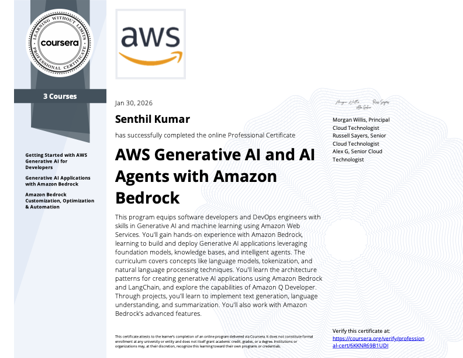

<div align="center">

## Thank You!

</div>