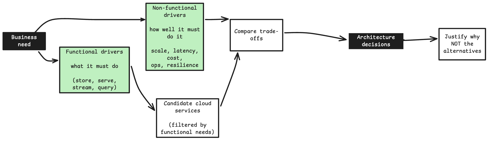

## Technical Architect → Cloud Architect

In the previous [blog post on being a Technical Architect](https://senthilkumarm1901.github.io/learn_by_blogging/posts/it_architect/it_architect.html), we composed systems from building blocks. Each block was a clean item on a whiteboard. 

<br>

In Cloud, for each block one needs these to worry about: 

- What is the **cost** of building a block in a particular way in cloud, 
- What is the associated **latency** for that chosen path?
- What is the **blast radius** if things fail?


```{mermaid}
%%{init: {'theme': 'base', 'themeVariables': {'primaryColor': '#E3F2FD', 'primaryBorderColor': '#1E88E5', 'lineColor': '#424242', 'fontSize': '14px'}}}%%
flowchart TD
    Block["Each building block<br/>of a System"] --> Q{"Made concrete<br/>in the cloud"}
    Q --> M["💰 What does it cost<br/>when idle vs busy?"]
    Q --> L["⏱️ What latency does<br/>this choice bake in?"]
    Q --> R["💥 If it fails,<br/>how far does it spread?"]
    M --> Dec["The service choice<br/>is the answer to<br/>all three at once"]
    L --> Dec
    R --> Dec
```

## Flow of Decision-making for a Cloud Architect



- Functional drivers = **what the system must do**. 
    - The needs discussed here: "Store relational data," "run SQL analytics," "serve a REST API," "process a stream", "run containerized microservices" 
    - These filter the candidate set — if the requirement is "transactional relational writes," a queue and an object store are simply not candidates.
- Non-functional drivers = **how well it must do it**. 
    - Scale, latency, cost, resilience, ops burden. 
    - These rank the survivors — among the relational options (RDS, Aurora, self-managed on EC2), the NFRs pick the winner.

## Five Examples - to practice being a Cloud Architect

### 1. The Monolith: Client → Server → Relational DB


**The Naive First Draft**:

Someone says "put our app on the cloud." The simplest, most rudimentary way to arrange those building blocks. 

```{mermaid}
%%{init: {'theme': 'base', 'themeVariables': {'primaryColor': '#E3F2FD', 'primaryBorderColor': '#1E88E5', 'lineColor': '#424242', 'fontSize': '14px'}}}%%
flowchart LR
    Client["Client"] --> EC2["Server on EC2"]
    EC2 --> RDS["Relational DB<br/>RDS PostgreSQL"]
```

**Problems with the Naive Approach**:

- **Block 1**: The server is a single point of failure. One EC2 dies, the app dies. Don't scale the server, scale the decision: put it behind a load balancer across two Availability Zones. Blast radius shrinks from "the whole app" to "just one instance."

- **Block 2**: The database is now the single point of failure. So RDS gets a standby in a second AZ (Multi-AZ). Same idea as block 1. You are not buying performance, you are buying a smaller blast radius. Note: The standby is different from read replicas. Standby takes into effect only when main instance fails. 

- **Block 3**: The traffic is spiky. Fixed instances waste money at night and are not sufficient at noon. An Auto Scaling Group turns a fixed cost into a shaped one.

```{mermaid}
%%{init: {'theme': 'base', 'themeVariables': {'primaryColor': '#E3F2FD', 'primaryBorderColor': '#1E88E5', 'lineColor': '#424242', 'fontSize': '14px'}}}%%
flowchart TD
    Start(["Requirement:<br/>lift a monolith to cloud"]) --> D1{"Single server<br/>enough?"}
    D1 -->|"No — must survive<br/>an AZ loss"| D2["ALB + 2 AZs"]
    D2 --> D3{"DB a single<br/>point of failure?"}
    D3 -->|"Yes"| D4["RDS Multi-AZ standby"]
    D4 --> D5{"Load steady<br/>or spiky?"}
    D5 -->|"Spiky"| D6["Auto Scaling Group<br/>fixed cost → shaped cost"]
    D5 -->|"Steady"| D7["Reserved instances<br/>cheapest steady rate"]
    D6 --> Done(["Resilient monolith<br/>rejected: single EC2,<br/>single-AZ DB"])
    D7 --> Done
```

**The Rejected Alternative**: `Ditch EC2, Adopt Serverless` is a bad *first* Approach. 

> * A single EC2 is cheapest but has an app-wide blast radius; going straight to microservices is over-engineering for a monolith that just needs to survive an AZ failure. 
> * The architect's move here is restraint — the smallest set of blocks that removes the single points of failure.

📖 **Deep dive:** this monolith is exactly what gets decoupled tier-by-tier in [14. Capstone Project: Decoupling a Three-Tier App and Migrating Hadoop Analytics with Amazon EMR](https://senthilkumarm1901.github.io/learn_by_blogging/aws_cloud_technical_essentials/14-capstone-decoupled-app-and-emr-analytics.html)

---

### 2. The Serverless Web Backend: Client → `<Serverless Web Backend>` → DB


**The Naive First Draft**:

"A REST API, no servers to babysit." Three blocks: a front door, some logic, a store.

```{mermaid}
%%{init: {'theme': 'base', 'themeVariables': {'primaryColor': '#E3F2FD', 'primaryBorderColor': '#1E88E5', 'lineColor': '#424242', 'fontSize': '14px'}}}%%
flowchart LR
    Client["Client"] --> APIGW["API Gateway"]
    APIGW --> L["Lambda"]
    L --> DDB["DynamoDB"]
```

**Problems with the Naive Approach**:

- Block 1: 
    - **One Lambda doing everything is a monolith in disguise**: A single function handling create/read/update/delete couples unrelated failures. 
    - Mitigation: `Split by route`: Each lambda function owns one responsibility, one blast radius.

- Block 2: 
    - **A downstream call is slow and fragile**: If placing an order also triggers inventory and billing synchronously, one slow dependency fails the whole request. 
    - Mitigation: So you `decouple with an event`: the API accepts the order, drops a message on a queue, and returns. The user is not kept waiting until inventory is cleared. 

- Block 3: 
    - **A burst arrives (for e.g. a sale)**. Synchronous, everything melts. 
    - Mitigation: With a queue (SQS) absorbing the burst, Lambda drains it at its own pace. The queue is a shock absorber.

- Block 4: 
    - **Some messages fail no matter what**. 
    - A poison message retries repeatedly and then silently disappears at retention expiry. 
    - Mitigation: A dead-letter queue catches it so failures are visible, not infinite.


```{mermaid}
%%{init: {'theme': 'base', 'themeVariables': {'primaryColor': '#E3F2FD', 'primaryBorderColor': '#1E88E5', 'lineColor': '#424242', 'fontSize': '14px'}}}%%
flowchart TD
    Start(["Requirement:<br/>scalable web API"]) --> Q1{"One Lambda<br/>or per-route?"}
    Q1 -->|"Per responsibility"| A1["One function per route<br/>isolated blast radius"]
    A1 --> Q2{"Downstream calls<br/>sync or async?"}
    Q2 -->|"Slow / fragile downstream"| A2["Decouple via SQS<br/>API returns immediately"]
    Q2 -->|"Fast / must be atomic"| A3["Keep sync<br/>accept coupling"]
    A2 --> Q3{"Can it survive<br/>a traffic burst?"}
    A3 --> Q3
    Q3 -->|"Spiky sales traffic"| A4["Queue absorbs burst<br/>Lambda drains at pace"]
    A4 --> Q4{"Handle poison<br/>messages?"}
    Q4 -->|"Yes"| A5["Dead-letter queue<br/>failures become visible"]
    A5 --> Done(["Resilient serverless backend<br/>rejected: single fat Lambda,<br/>fully synchronous chain"])
```

**The Rejected Alternative**: The fully synchronous version is simple but cannot meet real-world needs

- The fully synchronous version is simplest but couples every failure and can't survive a burst; a single Lambda is fewer moving parts but one bug takes down all routes.
- The **Intuition**: The intuition: serverless starts simple, then earns its resilience one decoupling at a time — event triggers, queues, and dead-letter queues are not decoration, they're the blast-radius controls.

📖 **Deep dive:** [10. Architecting a Serverless Backend Solution in AWS](https://senthilkumarm1901.github.io/learn_by_blogging/aws_cloud_technical_essentials/10-architecting-serverless-backend-solution-in-aws.html)

---

### 3. The Serverless Data Analytics Pipeline: Event source → Ingest → Data Store → Query → Visualize 

**The Naive First Draft**:

"We want dashboards on our event data." The instinct is a database. The architect's instinct is a pipeline — because the cost question is different here: do you pay at write-time or read-time?

```{mermaid}
%%{init: {'theme': 'base', 'themeVariables': {'primaryColor': '#E3F2FD', 'primaryBorderColor': '#1E88E5', 'lineColor': '#424242', 'fontSize': '14px'}}}%%
flowchart LR
    Src[["Multiple Event sources"]] --> Ingest["Ingest"]
    Ingest --> Store["Store"]
    Store --> Query["Query"]
    Query --> Viz["Visualize"]
```

**Problems with the Naive Approach**:

- Block 1: 
    - Each event is tiny (a click, a sensor reading). Writing every one straight to S3 means millions of tiny files and one write request per event — S3 charges per request and per object, so this is both slow and needlessly expensive, and tiny files are painful to query later.
    - Mitigation: **Firehose** sits in front as a buffer: it collects events for, say, 5 minutes or until 128 MB accumulate, then writes one batched file. You trade a few minutes of freshness for a fraction of the request cost and far healthier file sizes.

- Block 2: **Where does it land? A database? or a S3?; Ans: S3**. 
    - Why S3: 
        - 1. Cheap at rest, and 
        - 2. it lets you defer schema - dump the data as-is now, decide its structure only when you query (schema-on-read)
        - This is **schema-on-read**: pay nothing to structure data now, pay only when you query. 
    - Why NOT the DB: The opposite bet, schema-on-write (an indexed database), structures and indexes data the moment it lands and keeps a query engine running permanently. It is worth it only when reads need to be instant. 

Detour on Block 2: **What is a "permanent write-time bill"?**

- Every analytics store makes you pay at one of two moments:

    - Write-time (schema-on-write) — a database or warehouse does work the instant data arrives: it validates the schema, builds indexes, sorts, and keeps everything on provisioned storage/compute that runs whether or not anyone queries. That cost is permanent because it accrues 24×7 for as long as the data lives there — you're paying to keep it query-ready even at 3 AM when nobody's looking.
    - Read-time (schema-on-read) — S3 just holds raw bytes cheaply. No indexing, no running engine. You pay the structuring cost only at the moment you query (Athena scanning). If you never query, you never pay that part.

- So "permanent write-time bill" = the always-on cost of keeping data indexed and query-ready in a live database. 
- The schema-on-read bet trades that away: near-zero cost at rest, cost only on demand. 
- That's why it wins when queries are occasional, and loses when reads are hot and constant (at which point the always-on engine actually earns its keep).

- Block 3: **Raw JSON is expensive to scan**. 
    - Athena bills by bytes scanned, and raw JSON is verbose, row-oriented, and uncompressed — so a query that only needs two columns still drags every byte of every row off disk. Two moves fix this. 
    - A Glue crawler catalogs the data (infers columns and types so Athena knows how to read it)
    - Then a Glue ETL job rewrites it into columnar Parquet, partitioned by time (e.g. year/month/day/). 
    - Now a query touching two columns reads only those two columns, and a query for "last Tuesday" reads only that day's folder — skipping everything else. 
    - Same data, a fraction of the bytes scanned, a fraction of the bill.
- Block 4: **Who queries, and how?** 
    - Athena runs serverless SQL directly over the S3 files — no cluster to provision, priced purely by data scanned. 
    - Athena is truly consumption-priced, billed only by bytes scanned. QuickSight is serverless too but priced per user, not per query. So the compute path stays idle-cost-free, while the dashboard layer is a fixed seat cost.


```{mermaid}
%%{init: {'theme': 'base', 'themeVariables': {'primaryColor': '#E3F2FD', 'primaryBorderColor': '#1E88E5', 'lineColor': '#424242', 'fontSize': '14px'}}}%%
flowchart TD
    Start(["Requirement:<br/>dashboards on event data"]) --> Q1{"Pay at write-time<br/>or read-time?"}
    Q1 -->|"Query occasionally,<br/>cheaply"| A1["Schema-on-read<br/>land raw in S3"]
    Q1 -->|"Reads hot &<br/>predictable"| A2["Schema-on-write<br/>indexed DB / warehouse"]
    A1 --> Q2{"Ingest cadence?"}
    Q2 -->|"Streaming, spiky"| A3["Firehose buffers<br/>→ batched S3 writes"]
    A3 --> Q3{"Scan cost<br/>too high?"}
    Q3 -->|"Yes"| A4["Glue → Parquet<br/>+ time partitions"]
    A4 --> Q4{"Consumption?"}
    Q4 --> A5["Athena SQL +<br/>QuickSight dashboards"]
    A5 --> Done(["Serverless analytics pipeline<br/>rejected: write-time DB,<br/>raw-JSON scanning"])
```

**The Rejected Alternative**:

- Dumping everything into a database gives instant queries but a permanent write-time bill and rigid schema
- Skipping Parquet keeps it simple but every Athena query scans mountains of JSON. 
- The intuition: in analytics, storage is cheap and scanning is expensive — so the architecture is really a bet about when you pay to structure data.

📖 **Deep dive:** [11. Serverless Data Analytics](https://senthilkumarm1901.github.io/learn_by_blogging/aws_cloud_technical_essentials/11-serverless-data-analytics.html)

---

### 4. The Microservice Container Workload

**The Naive First Draft**:

"We want to run several containerized services." Put the image in ECR and run it somewhere (onprem or cloud)

```{mermaid}
%%{init: {'theme': 'base', 'themeVariables': {'primaryColor': '#E3F2FD', 'primaryBorderColor': '#1E88E5', 'lineColor': '#424242', 'fontSize': '14px'}}}%%
flowchart LR
    Img["Container image<br/>in ECR"] --> Run["Run it somewhere"]
```

**Problems with the Naive Approach**:

- **Block 1: Who runs the container? - You or AWS?** 
    - EC2 launch type = you manage nodes (cheaper steady-state, more ops). 
    - Fargate = serverless containers (no nodes, pay per task, slightly pricier). 
    - For spiky or low-ops services, Fargate; for heavy steady load, EC2 nodes.
- **Block 2: Which Orchestrator? - ECS or EKS**
    - If you're all-in on AWS and want simplicity, zero control-plane cost → ECS
    - If you genuinely need the Kubernetes ecosystem or multi-cloud portability → EKS
    - EKS charges abuot ~ USD 0.10 / cluster / hour; ECS control plan is free. 
- **Block 3: More than one service now? - How do they find and reach each other?**
    - Service discovery gives each service a stable name; load balancing spreads requests, and health checks stop sending traffic to unhealthy instances.
    - A service mesh makes those service-to-service rules a shared platform concern: it manages traffic policy, retries, telemetry, and often mTLS between services. It is a networking layer alongside the orchestrator, not a replacement for ECS or EKS.
- **Block 4: Something must stay on-prem**. 
    - Data residency, a factory-floor latency requirement, or a legacy system that can't move. 
    - Now it's hybrid — ECS Anywhere / EKS Anywhere extend the same control plane to on-prem hardware. Hybrid is a constraint you accept deliberately, never a default you drift into. 


```{mermaid}
%%{init: {'theme': 'base', 'themeVariables': {'primaryColor': '#E3F2FD', 'primaryBorderColor': '#1E88E5', 'lineColor': '#424242', 'fontSize': '14px'}}}%%

flowchart TD
    Start(["Requirement:<br/>run containerized microservices"]) --> Q1{"Need the Kubernetes<br/>ecosystem / multi-cloud?"}
    Q1 -->|"No"| A1["ECS<br/>simple, free control plane"]
    Q1 -->|"Yes, and a team<br/>owns the cluster"| A2["EKS<br/>K8s ecosystem + portability"]
    A1 --> Q2{"Which Compute to choose?"}
    A2 --> Q2
    Q2 -->|"Spiky / low-ops"| A3["Fargate<br/>serverless tasks"]
    Q2 -->|"Steady / heavy / GPU"| A4["EC2 node groups<br/>cheaper at scale"]
    A3 --> Q3{"Must anything<br/>stay on-prem?"}
    A4 --> Q3
    Q3 -->|"Yes: Because of Data residency /<br/>plant latency"| A5["ECS/EKS Anywhere<br/>hybrid control plane"]
    Q3 -->|"No"| A6["Cloud-native only"]
    A5 --> Done(["Container workload strategy<br/>rejected: EKS for 3 services,<br/>drifting into hybrid"])
    A6 --> Done
```

**The Rejected Alternative**:
- EKS-by-default buys ecosystem power you may never use and a real operational tax; 
- EC2 nodes for a bursty low-volume service means paying for idle capacity. 
- The intuition: containers are one building block with four independent decisions stacked on top  
    — orchestrator, compute mode, service mesh, and locality 
    - and most teams get burned by answering "EKS" before they've asked the first question

📖 **Deep dive:** [12. Architecting a Hybrid Container-Based Solution on AWS](https://senthilkumarm1901.github.io/learn_by_blogging/aws_cloud_technical_essentials/12-hybrid-container-workloads.html#how-to-architect-a-hybrid-container-based-solution-on-aws)

---

### 5. The Multi-Account Landing Zone: One account → Many Accounts (limits blast radius)

**The Naive First Draft**:

"Just build in the account we already have." Every client, every environment, one root login, one shared account.

```{mermaid}
%%{init: {'theme': 'base', 'themeVariables': {'primaryColor': '#E3F2FD', 'primaryBorderColor': '#1E88E5', 'lineColor': '#424242', 'fontSize': '14px'}}}%%
flowchart LR
    Root["root + shared<br/>IAM users"] --> A["Client A workload"]
    Root --> B["Client B workload"]
    Root --> C["Dev and Prod,<br/>same account"]
```

**Problems with the Naive Approach**:

- Block 1: 
    - **One misconfiguration reaches every client and environment at once**: there is no boundary between them, only convention. 
    - Mitigation: `Split by ownership`: one account per client or business unit, grouped under **AWS Organizations** OUs — the account itself becomes the blast-radius boundary.

- Block 2: 
    - **Billing is one lump sum**: no one can say what Client A costs versus Client B without heroic tagging discipline. 
    - Mitigation: the account is the **default, free unit of cost allocation** — split accounts and the bill splits itself.

- Block 3: 
    - **Dev experiments and prod traffic share the same guardrails — or lack of them — and the same service quotas**: most quotas and API rate limits are per account, per Region, so one noisy neighbor throttles everyone. 
    - Mitigation: separate accounts per environment. Sandbox/dev get freedom to experiment; prod gets tight **SCPs**. Quotas reset per account too.

- Block 4: 
    - **Nobody remembers who has root, and long-lived IAM users pile up per account**. 
    - Mitigation: replace long-lived users with **IAM Identity Center** (SSO) issuing short-lived assumed roles, and provision every new account through **Control Tower** so guardrails apply by default, not by memory.

```{mermaid}
%%{init: {'theme': 'base', 'themeVariables': {'primaryColor': '#E3F2FD', 'primaryBorderColor': '#1E88E5', 'lineColor': '#424242', 'fontSize': '14px'}}}%%
flowchart TD
    Start(["Requirement:<br/>many clients/environments,<br/>one AWS presence"]) --> Q1{"Must one incident's<br/>blast radius stay contained?"}
    Q1 -->|"Yes"| A1["Split into accounts by<br/>ownership / environment"]
    A1 --> Q2{"Need repeatable,<br/>guardrailed provisioning?"}
    Q2 -->|"Yes"| A2["Organizations + OUs + SCPs<br/>via Control Tower"]
    A2 --> Q3{"How do people reach<br/>many accounts safely?"}
    Q3 --> A3["IAM Identity Center (SSO)<br/>+ short-lived roles"]
    A3 --> Q4{"Need one place to<br/>see everything?"}
    Q4 --> A4["Dedicated logging account<br/>CloudTrail, GuardDuty"]
    A4 --> Done(["Governed multi-account<br/>landing zone<br/>rejected: one shared account,<br/>long-lived IAM users"])
```

**The Rejected Alternative**: `One account for everything` is the simplest to start, but it wastes the strongest, coarsest blast-radius and billing boundary AWS gives away for free.

> * Going the other way — an account per microservice — multiplies the OU/SCP/logging overhead a team must operate, for isolation finer than the actual risk requires.
> * The intuition: blast radius isn't only a resource-level concern (which AZ, which instance) — the **account boundary** is the largest blast-radius knob available, and it costs nothing until you actually need finer isolation.

📖 **Deep dive:** [13. Architecting for Account Governance and Multi-Account Management](https://senthilkumarm1901.github.io/learn_by_blogging/aws_cloud_technical_essentials/13-multi-account-strategies.html)

## Conclusion

- The way the functional drivers and non-functional drivers dictated the cloud architecture decisions in these 5 examples: 

| Example                | Functional driver (produces candidates)                                        | Non-functional driver (picks winner)                                                |
| ---------------------- | ------------------------------------------------------------------------------ | ----------------------------------------------------------------------------------- |
| **Monolith**           | "Transactional relational store" → RDS/Aurora/EC2-hosted DB                    | Resilience + cost → RDS **Multi-AZ** over single-AZ or self-managed                 |
| **Serverless backend** | "Serve a REST API + persist orders" → Lambda/Fargate + Dynamo/RDS              | Spiky load + zero-idle cost → **Lambda + SQS + DynamoDB**                           |
| **Data analytics**     | "Ingest a stream + run SQL for dashboards" → Kinesis/Firehose, Athena/Redshift | Occasional queries + cost → **Firehose + S3 + Athena** (read-time) over a warehouse |
| **Containers**         | "Run containerized microservices" → ECS/EKS, Fargate/EC2                       | Ops burden + scale → **ECS + Fargate** unless K8s ecosystem is genuinely needed     |
| **Multi-account**      | "Isolate clients/environments" → single account, per-client accounts, per-env accounts | Blast radius + billing clarity → **Organizations + OUs** over one shared account |

- The final repetitive message across the 5 examples: 
    - Start with the smallest sufficient set of blocks and add 1 complexity for every pain point (e.g. of painpoints: a failure to isolate, a burst to absorb, not paying for idle resources,  etc.,)
    - Blast radius isn't always a resource sitting inside an account — sometimes the blast radius *is* the account, and the account boundary is the fix.
    - None of these 5 decisions are made in isolation on a real system: a single build typically decouples its tiers (Example 1), picks an ingest/store/query path for its data (Example 3), and sits inside an account structure that contains the blast radius of all of it (Example 5) — at the same time, not in sequence.