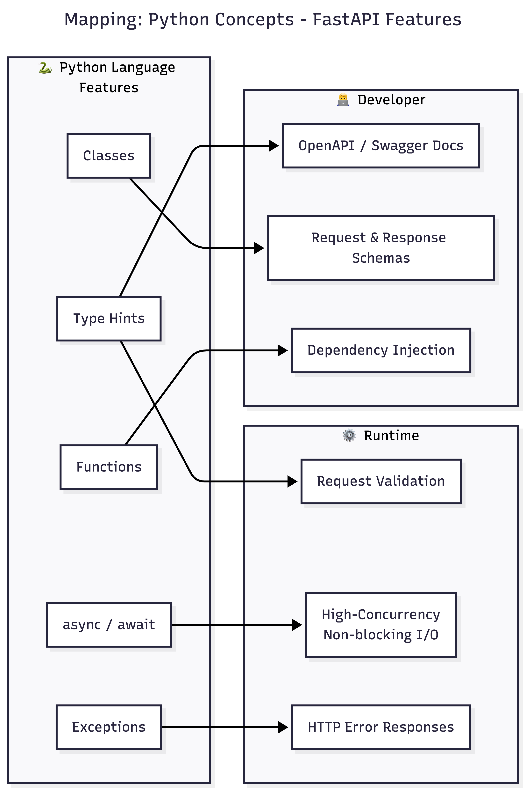

## Python Fundamentals Power FastAPI - A Quick View
FastAPI quietly uses a lot of Python concepts underneath - Python type hints, PyDantic validation, and async framework, among a few others.

Here are going to uncover them one bye one. 

- The same Python language's features power two different dimensions in FastAPI.
- On one side, they directly affect runtime behavior — validation, concurrency, and error handling.
- On the other, they dramatically improve developer experience — auto-generated docs, schemas, and clean dependency injection. 

### Python Type Hints: From Optional to Mandatory

### Async/Await: Understanding Concurrency and Parallelism

Sources: 
- https://samagra.me/wtf/2024/09/27/gateway-interfaces.html
- https://asgi.readthedocs.io/en/latest/introduction.html 

### Data Modeling: From Classes to Validated APIs

### Functions as Dependencies: The Power of Callables

### Error Handling: Turning Python Exceptions into HTTP Responses