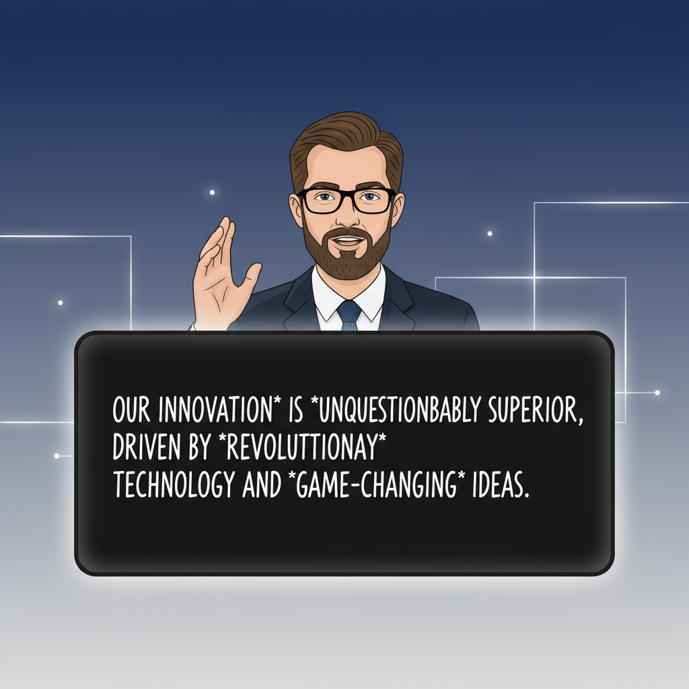
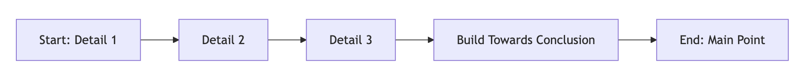

## 

---

#### Why am I even speaking on this topic?

> * Once upon a time, 15 years ago ....
> * I started my role as a Market Research Analyst in a Procurement-focused Management Consultancy Firm.
> * Typically, a Management consultancy has a team of Consultants and an army of Market Research (MR) Analysts. 
> * My first company combined the role of both Consultant and MR Analysts into one.
> * As a Consultant and a MR Analyst, I had a ton of opportunities to hone my communications skills

{width=300}

---

#### Why am I even speaking on this topic?

> * 💼 My Career: If I were an Asset Management Company, I’d have primarily invested in ***momentum*** funds. 
> * 🔄 Career Transitions from one momentum to another: ***Management Consulting*** → ***Analytics*** → Data Science → Deep Learning → Generative AI

> * 🥖🧈 Early Roles: My bread and butter in the first two roles - Management Consultancy and Analytics - ***depended heavily on communication skills***!  
> * I made cold-calls, sent lots of cold emails, prepared tonnes of reports and gave an equally substantial report explanation calls to clients in senior levels

---

## The Four Pillars

::: {.nonincremental}
- ***Active*** Listening 👂
- ***Mindful*** Reading 📖
- ***Deliberate*** Writing ✍️
- ***Clear*** Speaking 🗣️
:::

> - Your mind voice: "Just fancy, empty adjectives 🫙"  
> - But really, it’s about making everything active and intentional  
> - Practical tips and hacks coming up in the next slides 🚀

---

## What does it take to become a better communicator?

> * All four forms of communication are deeply interconnected 🔗  
> * Better **listeners** become better **speakers** 👂➡️🗣️  
> * Better **readers** become better **writers** 📖➡️✍️  
> * Strong **writers** often become strong **speakers** — and vice versa 🔄

---

## 1. Active Listening

---

### ***Typical Instructions*** for Active Listening

* 🧘 Be present
* 🤔 Stay curious
* 👍 Acknowledge (nodding, verbal cues)
* 🔁 Reflect in your own words

> - Thanks, but no thanks 🙅  
> - These tips are hard to practice—especially for *boring* topics 😅

---

### Listening - With Imaginative Subtitles

---

### Activate `Imaginative Subtitles`

My **go-to active listening hack** for boring topics:

* 🎬 Run a mental *subtitle track*

  * Words scroll across your mind’s screen on a black background
  * In a cursive, homebrew-style font
  * Sprinkled with emojis 🥤✨

* 📝 Make **nouns** stand out in **bold** and spice up adjectives with *italics*

---

### Listening - With Spectrogram

---

### Listening — With Spectrogram 🎶

* In your imaginative *Netflix mind*, let the bottom strip run a `Spectrogram` 📊
* Actively notice every inflection in speech instead of just absorbing it subconsciously 🎧
* Is the delivery fiery like **Virat Kohli** 🔥 or calm like **Dhoni** 🧑🏼‍✈️🆒?
* Use it to gauge the ***passion*** in the speech — flat, wavy, smooth, evocative, or full of highs and lows 🌊

---

### Listening — With Toastmasters-like Metrics 🎤

Side effects of running mental subtitles:

- ✅ Spot grammatical slips
- 🔢 Track filler words — the classic “Ah Counter” (my favorite!)
- 🔁 Notice stammering or repeated sentence starts

---

#### Listening as Toastmasters — Grammar ✍️

     

- Common slip-ups: “I can able to…”, “She did not completed this …†⌠ 
- Unless you’re Sachin 🏏 or ARR 🎶, speaking correctly matters in the long run ✅

 

---

#### Listening as Toastmasters — Ah Counter 🔢

     

- My favorite metric: the Ah Counter! 🯠 
- Filler words like “like”, “you know”, “but umm…†🙃  

--- 

#### Listening as Toastmasters — Crutch Phrases 🪃

     

- Common fillers: “Actually”, “At the end of the day…”, “Honestly speaking…” 🗨️  
- Are some of these phrases being overused? 🤔

---

#### Listening as Toastmasters — Stammering ⏸️

     

- Examples: “I-I-I think we should…†or “So, so, so the plan is…” ğŸ—£ï¸  
- Often caused by rushing thoughts or ideas racing ahead of words 🏃💭  

 

---

#### Why Toastmasters-like Active Listening? 🎧✨

     

- It’s not about finding faults 🤦‍♂️💥
- These hacks help you become less self-critical ❤️‍🔥
- Nobody’s perfect—and that’s perfectly okay 👌🏼
- But acknowledgment is the first step to improvement ✔️
- Often, the simplest solution is just pausing more ⏸️

 

---

### Experienced Listener — Inferring Styles from a Speech 🎯

 

- Deductive ⬇️ — Top-down reasoning
- Inductive ⬆️ — Bottom-up reasoning
- Git Workflow 🔀 — Branching paths and merges
…
 

---

### Speech Style - Deductive: **Top-down Approach**

> * "We need to refactor the payment module [main point].  The current code has duplicated logic, poor error handling, and makes onboarding new developers difficult [details]."

> * 👉 Here, the decision/action comes first, followed by supporting evidence

---

### Speech Style - Inductive: **Bottom-up Approach**

{width=300}

> * "The payment module has duplicated logic, poor error handling, and is hard for new developers to understand [details].  That’s why we need to refactor it [main point]."

> * 👉 Here, the evidence builds up, and the conclusion is delivered last.

---

### Another Good Style: **Trunk and Feature Branches**

---

### Hybrid Speech Styles

> Real-life: Most talks are like a hybrid of deductive-inductive. 

---

## 2. Second Pillar: Mindful Reading

---

### Importance of Writing for Better Reading Comprehension ✍️📖

- The world is flooded with content — whether from humans or AI 🌍💨
- The real question: Are we truly efficient at reading comprehension? 🤔

 

---

### Mindful Reading — Breaking Down Long Reads 📚✨

- **Problem**:
    - Long messages, reports, research papers, or documents can feel overwhelming 🤯
    - Passive scanning/reading gets you nowhere ❌

- ***Accountable*** Reading Hacks:
    - 📝 Headings Only — jot down one-word summaries
    - 😀👎❓ Emote It — copy each para/bullet and react to it
    - ✍️ Selective Self-Writing — add your own comment/summary to key sections

 

---

### Mindful Reading — Visual Structures 🧩

- Use Flowcharts or Tables to simplify complex text
- Tools: Pen & Paper ✍️, Mermaid Charts 🪄, Excalidraw 🎨, Draw.io 🖥️, etc.

---

## 3. Third Pillar: Writing

---

### My Motto on Writing ✍️✨

 

- Time spent writing is never wasted ⏳
- Writing is how I learn 📖
- Writing is how I think 💡

 

---

### Avoid Agenda-less Meeting Invites or Hi!

> - Avoid sending a meeting invite which does not have an agenda  
> - Never, ever send Empty "Hi/Hello" and waiting for others to respond. Always add an one-line context

 

---

### The Importance of Writing Before Calling ✍️ → ☎️

  

- Yes, call and explain things 👥 — but prepare a pre-meeting write-up (if not for others, for yourself ).  
- A short write-up before the meeting helps everyone align better ✅

 
---

### Document-Driven Meetings — Any Takers? 📄🚀

  

- At Amazon, problem-solving meetings start with a structured written memo instead of a slide deck 📝
- The **two-page memo** received over **50 comments** 📑📝 before the call
- The engineer felt disheartened initially 😓 but soon realized the **writing and thinking** required significant improvement 💡
---

## Fourth Pillar: Speaking

---

### Achieving Exceptional Speaking Skills 🎤✨

   
   

> * Mastering **listening, reading, and writing** is key to exceptional speaking 👂📖✍️ 
> * No matter where you are now—never underestimate your **long-term potential** 🚀 

   

---

### Meeting Room Conversations vs Public Speeches 🏢🎤

> * Chasing **public speaking perfection** is a wrong goal (for most of us) ❌
> * Nobody wants a **Sashi Tharoor-style** monologue in every day meeting discussions 😅

> * Instead, let us focus on making  everyday **meeting room conversations** effective!

   

---

### How to Improve Meeting Room Conversations

> * Improve your speech following the ***Toastmasters*** metrics
> * Use the **Speech Styles** to make your thoughts coherent
> * Practice **thinking on your feet**, which transfers to public speaking naturally 💡

---

## `Status Update` Calls 

> * This is one of the most frequent calls as Software Engineers
> * Let us look at the steps to master these calls

---

### `Status Update` Call Template

- 1. Starting the Update 🎬
- 2. Acknowledging 👍
- 3. Transitioning 🔄
- 4. Answering Questions ❓
- 5. Closing & Next Steps 🏁✨

---

### `Status Update` Call Hacks

- 1. Starting the Update 🎬
    - “To kick things off…” 🏁
    - “At a high level, here’s where we stand…” 📊

- 2. Acknowledging 👍
    - “Makes sense” ✅, “Fair point” 💡, "That adds up", "You are right"

---

### `Status Update` Call Hacks

- 3. Transitioning 🔄
    - “If we zoom out to see the big picture…” 🌐 | "If we drill deeper 🔍"
    - “That brings us to the next point…” ➡️

---

### `Status Update` Call Hacks

- 4. Answering Questions ❓
    - “If I read your question correctly, you are asking…” 👀
    - “It’s a valid concern. I don’t have a concrete answer right now, but I’ll research and circle back.” 🔍

- 5. Closing & Next Steps 🏁✨
    - “Here’s what we’ll tackle next…” 📌
    - “I’ll follow up with an email ...” ✉️

---

## How to handle difficult conversations

#### Some Funny quotes

---

### When Someone Puts A Gun to Your Head 🔫 

---

### Why Sheldon does not use cuss words 

---

### Like a Tree Standing in a Torrential Downpour

---

### Handling Difficult Conversations — Scenarios ⚡️

> * **Scenario 1:** Person A interrupts you midway — how do you respond? 🤔
> * **Scenario 2:** Person A pressures you with an unwise timeline — what’s your move? ⏳
> * **Scenario 3:** Person A puts you down publicly — how would you tackle it? 💬

---

##### 1. Person A interrupts you midway — how do you respond? 🤔

- 1. Calm Assertive Pushback  

> * *Hold that thought—let me finish this and then we’ll come to it.*

- 2. Defusing the heat   

> *  *I hear you, I was coming around to that point anyway*

---

##### 2. Person A pressures you with an unwise timeline — what’s your move? ⏳

1. Buying Time Without Sounding Defensive  

> * *I’d prefer to give you a realistic answer, not a rushed one — let me circle back by tomo.*  

2. Acknowledging Pressure, But Reframing  

> * *I understand the urgency, At the same time, I want to make sure we don’t cut corners.*

---

##### 3. Person A puts you down publicly — how would you tackle it? 💬

1. Acknowledge but Reframe  

> * I hear your concern. I think it’s best we look at the <problem/resolution/data> and resolve the issue

2. Take the High Ground but still Reframe  

> * Thanks for the feedback. But I am avoiding explaining my past efforts to keep this discussion constructive. I'd rather want to look at future steps of resolution

---

## Conclusion

> What does a good communicator need?

 
{width=200} 
 

> * "Active" Everything - Listening, Reading, Writing and eventually it will show up in your speaking
> * Have a holistic goal on communication

---