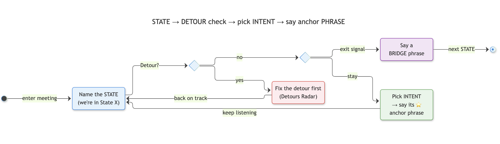

> This post continues my blog from a year ago: [An Engineer's Playbook for Formal Communication in the AI Age](2025-09-17-engineers-communication-hacks.md). That post ended with a nudge to stop chasing public-speaking perfection and instead make everyday **meeting room conversations** effective. This post is the practical companion: a phrasebook organized by *where you are* in a meeting.



---

## 🔌 Communication Is a Systems Problem

Communication runs in two modes, much like data systems:

- **Writing = batch processing** ✍️
    - Offline, with an unlimited buffer.
    - Refactor, fact-check and restructure before anyone sees it.
- **Speaking = stream processing** 🗣️
    - Live, in sub-second cycles.
    - Listen, interpret and respond at the same time.
    - No recall. Only in-flight corrections.

```{mermaid}
%%{init: {'theme': 'base', 'themeVariables': {'primaryColor': '#E3F2FD', 'primaryBorderColor': '#1E88E5', 'lineColor': '#424242', 'fontSize': '14px'}}}%%
flowchart TB
    subgraph BATCH["✍️ Batch · Writing"]
        direction LR
        W1["Draft"]:::neutral --> W2["Refactor"]:::neutral --> W3["Send"]:::opening
    end
    
    subgraph STREAM["🗣️ Stream · Speaking"]
        direction LR
        S1["Listen"]:::neutral --> S2["Think"]:::neutral --> S3["Speak"]:::exploring
        S3 -. "correct in-flight" .-> S1
    end

    classDef opening fill:#E3F2FD,stroke:#1E88E5,stroke-width:1px;
    classDef exploring fill:#E8F5E9,stroke:#43A047,stroke-width:1px;
    classDef neutral fill:#FAFAFA,stroke:#9E9E9E,stroke-width:1px;
```

This playbook is for the **streaming** mode. The ⭐ anchors are pre-compiled responses, ready when there's no time to draft.

**How to use this playbook:** 

* Name the **state** the meeting is in → pick your **intent** → say the ⭐ **anchor** phrase. 
* Learn the alternates only after the anchors come naturally.

---

## 📌 The Meeting Fluency Playbook - At A Glance

The blog starts with a systems lens, then the map of a meeting and then follows the order a typical meeting flows, from opening to close:

1. **Open** — *Frame the goal*
    * 1.1 Kick Off
    * 1.2 Give Status
    * 1.3 Anchor the Goal
2. **Explore** — *Surface facts and ideas*
    * 2.1 Acknowledge
    * 2.2 Answer a Question
    * 2.3 Buy Thinking Time
    * 2.4 When You Don't Know
    * 2.5 Change Altitude
    * 2.6 Connect Ideas
3. **Challenge** — *Test and trade off*
    * 3.1 Disagree
    * 3.2 Influence Without Sounding Pushy
    * 3.3 Push Back on Scope
    * 3.4 Persuade
    * 3.5 Sound Strategic
    * 3.6 Resist Timeline Pressure
4. **Decide** — *Commit and assign*
    * 4.1 Frame the Decision
    * 4.2 Ask for Commitment
    * 4.3 Assign an Owner
5. **Close** — *Land it*
    * 5.1 Recap
    * 5.2 Hand Off
6. **The Detours Radar** — *Recovering when the meeting goes off course (any state)*
    * 6.1 Drift
    * 6.2 Confusion
    * 6.3 Someone Is Rambling
    * 6.4 You Need to Interrupt
    * 6.5 You Were Interrupted
    * 6.6 Someone Is Annoyed or Upset
    * 6.7 Public Put-Down
7. **The Delivery Toolkit** — *Works in every state*
    * 7.1 Speech Styles: Pick by the Room
    * 7.2 Run a Sidecar: Meta-Thinking
    * 7.3 Self-Correct in Real Time
    * 7.4 Linguistic Devices

---

## 🗺️ The Map: State → Detour Check → Pick Intent → Say Anchor Phrase

Every meeting moves through five **states**. Knowing which state the room is in tells you *what kind of phrase* is useful right now.

```{mermaid}
%%{init: {'theme': 'base', 'themeVariables': {'primaryColor': '#E3F2FD', 'primaryBorderColor': '#1E88E5', 'lineColor': '#424242', 'fontSize': '14px'}}}%%
flowchart LR
    S1["① OPEN<br/>Frame"]:::opening --> S2["② EXPLORE<br/>Diverge"]:::exploring
    S2 --> S3["③ CHALLENGE<br/>Test"]:::challenging
    S3 --> S4["④ DECIDE<br/>Converge"]:::deciding
    S4 --> S5["⑤ CLOSE<br/>Land"]:::closing
    S3 -. "missing facts" .-> S2
    S4 -. "no consensus" .-> S3

    classDef opening fill:#E3F2FD,stroke:#1E88E5,stroke-width:1px;
    classDef exploring fill:#E8F5E9,stroke:#43A047,stroke-width:1px;
    classDef challenging fill:#FFF8E1,stroke:#FB8C00,stroke-width:1px;
    classDef deciding fill:#F3E5F5,stroke:#8E24AA,stroke-width:1px;
    classDef closing fill:#F5F5F5,stroke:#616161,stroke-width:1px;
```

| # | State | What's happening |
|---|---|---|
| ① | **Open** | Settle in; state the goal, agenda and outcome |
| ② | **Explore** | Share facts and perspectives; generate ideas |
| ③ | **Challenge** | Critique, surface tradeoffs, push back |
| ④ | **Decide** | Narrow options, commit, assign |
| ⑤ | **Close** | Recap and exit |

### ⚡ The In-the-Moment Loop

```{mermaid}
---
title: STATE → DETOUR check → pick INTENT → say anchor PHRASE
---
%%{init: {'theme': 'base', 'themeVariables': {'primaryColor': '#E3F2FD', 'primaryBorderColor': '#1E88E5', 'lineColor': '#424242', 'fontSize': '14px'}}}%%
stateDiagram-v2
    direction LR

    state "Name the STATE<br>(we're in State X)" as InState
    state "Fix the detour first<br>(Detours Radar)" as Fix
    state "Pick INTENT<br>→ say its ⭐<br>anchor phrase" as Intent
    state "Say a<br>BRIDGE phrase" as Bridge
    state isDetour <<choice>>
    state isExit <<choice>>

    [*] --> InState : enter meeting
    InState --> isDetour : Detour?
    isDetour --> Fix : yes
    Fix --> InState : back on track
    isDetour --> isExit : no
    isExit --> Bridge : exit signal
    isExit --> Intent : stay
    Intent --> InState : keep listening
    Bridge --> [*] : next STATE

    classDef opening fill:#E3F2FD,stroke:#1E88E5,stroke-width:1px
    classDef exploring fill:#E8F5E9,stroke:#43A047,stroke-width:1px
    classDef deciding fill:#F3E5F5,stroke:#8E24AA,stroke-width:1px
    classDef risk fill:#FFEBEE,stroke:#E53935,stroke-width:1px

    class InState opening
    class Fix risk
    class Intent exploring
    class Bridge deciding
```

### 🧠 Before You Speak: Micro-Plan

```{mermaid}
%%{init: {'theme': 'base', 'themeVariables': {'primaryColor': '#E3F2FD', 'primaryBorderColor': '#1E88E5', 'lineColor': '#424242', 'fontSize': '14px'}}}%%
flowchart LR
    L["👂 Listen"]:::neutral --> P["🧩 Process"]:::neutral --> D["📝 Draft first<br/>2 sentences silently"]:::neutral --> S["🗣️ Speak"]:::exploring

    classDef exploring fill:#E8F5E9,stroke:#43A047,stroke-width:1px;
    classDef neutral fill:#FAFAFA,stroke:#9E9E9E,stroke-width:1px;
```

::: {.callout-tip}
**Thinking on your feet = Active Listening + Micro-Planning your speech.** It's a muscle, not magic.
:::

---

## 1. Open: Frame the Goal

*Settle in; state the goal, agenda and outcome.*

```{mermaid}
%%{init: {'theme': 'base', 'themeVariables': {'primaryColor': '#E3F2FD', 'primaryBorderColor': '#1E88E5', 'lineColor': '#424242', 'fontSize': '14px'}}}%%
flowchart LR
    OPN["① OPEN"]:::opening --> K["Kick off"]:::neutral
    OPN --> ST["Give status"]:::neutral
    OPN --> G["Anchor the goal"]:::neutral

    classDef opening fill:#E3F2FD,stroke:#1E88E5,stroke-width:1px;
    classDef neutral fill:#FAFAFA,stroke:#9E9E9E,stroke-width:1px;
```

### 1.1 Kick Off

- ⭐ **"To set the stage…"**
- To kick things off…
- At a high level, let me explain where we are.

### 1.2 Give Status

- ⭐ **"Here's where we stand…"**
- We are on track.
- We're ironing out the details…
- To sum up what we've accomplished so far…

### 1.3 Anchor the Goal

- ⭐ **"What are we trying to achieve today?"**
- By the end of this meeting, we should have…
- If we leave with one decision, it should be…

::: {.callout-note title="🚪 Exit Signal → 2. Explore"}
The goal and agenda are agreed.

**Bridge:** *"That brings us to the next point."*
:::

::: {.callout-warning title="📡 Detours Radar: Checkpoint 1 → 2"}
**Most common here: ❓ Confusion about purpose**

- ⭐ **"Let's align on definitions before debating solutions."**
- We may be answering different questions.

*(Full radar in [6. The Detours Radar](#detours-radar) below.)*
:::

---

## 2. Explore: Surface Facts and Ideas

*Share facts and perspectives; generate ideas.*

```{mermaid}
%%{init: {'theme': 'base', 'themeVariables': {'primaryColor': '#E3F2FD', 'primaryBorderColor': '#1E88E5', 'lineColor': '#424242', 'fontSize': '14px'}}}%%
flowchart LR
    EXP["② EXPLORE"]:::exploring --> A["Acknowledge"]:::neutral
    EXP --> Q["Answer a question"]:::neutral
    EXP --> T["Buy thinking time"]:::neutral
    EXP --> N["Don't know"]:::neutral
    EXP --> Z["Change altitude"]:::neutral
    EXP --> C["Connect ideas"]:::neutral

    classDef exploring fill:#E8F5E9,stroke:#43A047,stroke-width:1px;
    classDef neutral fill:#FAFAFA,stroke:#9E9E9E,stroke-width:1px;
```

### 2.1 Acknowledge

- ⭐ **"Fair point."**
- Makes sense.
- That adds up.
- Crystal clear.

### 2.2 Answer a Question

- ⭐ **"If I read your question correctly, you're asking…"**
- The short answer is… The longer answer is…
- It's a valid concern. Here's how I'd think about it.

### 2.3 Buy Thinking Time

- ⭐ **"Let me think through that for a moment."**
- That's a good question. Let me process it.
- I don't want to give a rushed answer.
- Let me validate my understanding first.

### 2.4 When You Don't Know

```{mermaid}
%%{init: {'theme': 'base', 'themeVariables': {'primaryColor': '#E3F2FD', 'primaryBorderColor': '#1E88E5', 'lineColor': '#424242', 'fontSize': '14px'}}}%%
flowchart LR
    W["❌ I don't know."]:::risk --> S["✅ I can answer part of that<br/>today and validate the rest."]:::exploring

    classDef exploring fill:#E8F5E9,stroke:#43A047,stroke-width:1px;
    classDef risk fill:#FFEBEE,stroke:#E53935,stroke-width:1px;
```

- ⭐ **"I can answer part of that today and validate the rest."**
- I don't have a concrete answer yet; I'll research and circle back.
- I don't have enough data to answer confidently.
- Let me distinguish what we know from what we assume.
- I'd rather verify than guess.

### 2.5 Change Altitude

```{mermaid}
%%{init: {'theme': 'base', 'themeVariables': {'primaryColor': '#E3F2FD', 'primaryBorderColor': '#1E88E5', 'lineColor': '#424242', 'fontSize': '14px'}}}%%
flowchart TD
    UP["🔭 If we zoom out…<br/>(big picture)"]:::opening --- NOW["Current discussion"]:::neutral --- DOWN["🔬 If we drill deeper…<br/>(details)"]:::exploring

    classDef opening fill:#E3F2FD,stroke:#1E88E5,stroke-width:1px;
    classDef exploring fill:#E8F5E9,stroke:#43A047,stroke-width:1px;
    classDef neutral fill:#FAFAFA,stroke:#9E9E9E,stroke-width:1px;
```

- ⭐ **"If we zoom out…" / "If we drill deeper…"**
- To make this concrete…
- Put differently…

### 2.6 Connect Ideas *(strategic)*

- ⭐ **"Let me connect the dots."**
- This ties back to our earlier discussion on…
- The pattern emerging here is…
- The signal I'm seeing is…

::: {.callout-note title="🚪 Exit Signal → 3. Challenge"}
The options are on the table and ideas start repeating.

**Bridge:** *"Here's what it boils down to…"*
:::

::: {.callout-warning title="📡 Detours Radar: Checkpoint 2 → 3"}
**Most common here: 🗣️ Rambling and 🌀 Drift**

- ⭐ **"If I distill that down…"**
- ⭐ **"Let's park that for now."**
:::

---

## 3. Challenge: Test and Trade Off

*Critique, surface tradeoffs, push back.*

```{mermaid}
%%{init: {'theme': 'base', 'themeVariables': {'primaryColor': '#E3F2FD', 'primaryBorderColor': '#1E88E5', 'lineColor': '#424242', 'fontSize': '14px'}}}%%
flowchart LR
    CH["③ CHALLENGE"]:::challenging --> D["Disagree"]:::neutral
    CH --> I["Influence softly"]:::neutral
    CH --> S["Push back on scope"]:::neutral
    CH --> P["Persuade"]:::neutral
    CH --> L["Sound strategic"]:::neutral
    CH --> TP["Resist timeline pressure"]:::neutral

    classDef challenging fill:#FFF8E1,stroke:#FB8C00,stroke-width:1px;
    classDef neutral fill:#FAFAFA,stroke:#9E9E9E,stroke-width:1px;
```

### 3.1 Disagree

```{mermaid}
%%{init: {'theme': 'base', 'themeVariables': {'primaryColor': '#E3F2FD', 'primaryBorderColor': '#1E88E5', 'lineColor': '#424242', 'fontSize': '14px'}}}%%
flowchart LR
    SOFT["🤝 Collaborative"]:::exploring -->|"stakes rise"| EXEC["📊 Executive<br/>(evidence-led)"]:::challenging

    classDef exploring fill:#E8F5E9,stroke:#43A047,stroke-width:1px;
    classDef challenging fill:#FFF8E1,stroke:#FB8C00,stroke-width:1px;
```

**Collaborative**

- ⭐ **"I see it slightly differently."**
- Another way to frame this is…
- Let me challenge an assumption here.
- I agree with the direction, but not necessarily the approach.

**Executive**

- ⭐ **"The data appears to point elsewhere."**
- I'm struggling to reconcile that with the evidence.
- I'm not convinced that's the primary driver.
- The tradeoff here is…

### 3.2 Influence Without Sounding Pushy

- ⭐ **"Have we considered…?"**
- What would be the downside of…?
- If we optimize for X, then…
- Let me offer a different perspective.
- The risk I see is…
- I'd encourage us to think about…

### 3.3 Push Back on Scope

- ⭐ **"We can do that, but it will require deprioritizing something else."**
- That's valuable, but it may be outside our current scope.
- We should separate must-haves from nice-to-haves.
- The opportunity cost is…

### 3.4 Persuade

- ⭐ **"The crux of the issue is…"**
- The bottom line is…
- Here's why this matters.
- The implication is…

### 3.5 Sound Strategic *(senior leadership)*

- ⭐ **"Let's challenge the premise before discussing solutions."**
- Let's optimize for outcomes, not activity.
- Let's focus on leading indicators.
- Let's identify the constraint.
- Let's work backwards from the customer impact.
- Let's separate symptoms from root causes.

### 3.6 Resist Timeline Pressure ⏳

```{mermaid}
%%{init: {'theme': 'base', 'themeVariables': {'primaryColor': '#E3F2FD', 'primaryBorderColor': '#1E88E5', 'lineColor': '#424242', 'fontSize': '14px'}}}%%
flowchart LR
    P["⏳ Pressure"]:::risk --> A["Acknowledge urgency"]:::neutral --> B["Buy time"]:::neutral --> C["Commit to a date"]:::exploring

    classDef exploring fill:#E8F5E9,stroke:#43A047,stroke-width:1px;
    classDef risk fill:#FFEBEE,stroke:#E53935,stroke-width:1px;
    classDef neutral fill:#FAFAFA,stroke:#9E9E9E,stroke-width:1px;
```

- ⭐ **"I'd prefer to give you a realistic answer, *not a rushed one* — let me circle back by [day/time]."**
- I *understand the urgency*. At the same time, I want to make sure we *don't cut corners*.
- I'll verify the scope with the team and come back with *a firm date* by 3 PM.

::: {.callout-note title="🚪 Exit Signal → 4. Decide"}
The tradeoffs are clear and arguments are looping.

**Bridge:** *"From a decision-making standpoint…"*
:::

::: {.callout-note title="↩️ Go Back → 2. Explore"}
People are arguing without facts.

**Bridge:** *"Let's establish the facts first."*
:::

::: {.callout-warning title="📡 Detours Radar: Checkpoint 3 → 4"}
**Most common here: 🔥 Heat and ✋ Interruptions**

- ⭐ **"I understand the frustration."** → then → **"Let's focus on what we can control from here."**
- ⭐ **"Hold that thought — let me finish this, and then we'll come to it."**
:::

---

## 4. Decide: Commit and Assign

*Narrow options, commit, assign.*

```{mermaid}
%%{init: {'theme': 'base', 'themeVariables': {'primaryColor': '#E3F2FD', 'primaryBorderColor': '#1E88E5', 'lineColor': '#424242', 'fontSize': '14px'}}}%%
flowchart LR
    DEC["④ DECIDE"]:::deciding --> F["Frame the decision"]:::neutral
    DEC --> C["Ask for commitment"]:::neutral
    DEC --> A["Assign owner"]:::neutral

    classDef deciding fill:#F3E5F5,stroke:#8E24AA,stroke-width:1px;
    classDef neutral fill:#FAFAFA,stroke:#9E9E9E,stroke-width:1px;
```

### 4.1 Frame the Decision

- ⭐ **"The decision becomes clearer if we frame it this way…"**
- What's the core decision we need to make?
- We have two options on the table: X or Y.

### 4.2 Ask for Commitment

- ⭐ **"Can we align on that?"**
- Are we comfortable making that decision today?
- What would need to be true for us to proceed?
- What's preventing us from moving forward?

### 4.3 Assign an Owner

- ⭐ **"Can we leave with a clear owner and timeline?"**
- Who's best placed to take this forward?
- What's a realistic date for the first checkpoint?

::: {.callout-note title="🚪 Exit Signal → 5. Close"}
There's a decision, an owner and a date.

**Bridge:** *"Let me quickly recap before we wrap up."*
:::

::: {.callout-warning title="📡 Detours Radar: Checkpoint 4 → 5"}
**Most common here: 🌀 Late-stage scope creep**

- ⭐ **"That may be a separate discussion."**
- We can come back to that if time permits.
:::

---

## 5. Close: Land It

*Recap and exit.*

```{mermaid}
%%{init: {'theme': 'base', 'themeVariables': {'primaryColor': '#E3F2FD', 'primaryBorderColor': '#1E88E5', 'lineColor': '#424242', 'fontSize': '14px'}}}%%
flowchart LR
    CLS["⑤ CLOSE"]:::closing --> R["Recap"]:::neutral
    CLS --> H["Hand off"]:::neutral

    classDef closing fill:#F5F5F5,stroke:#616161,stroke-width:1px;
    classDef neutral fill:#FAFAFA,stroke:#9E9E9E,stroke-width:1px;
```

### 5.1 Recap

- ⭐ **"To recap: we've decided X, [owner] takes it forward, and we check back on [date]."**
- The key takeaway is…
- If you remember one thing from this discussion, it should be…

### 5.2 Hand Off

- ⭐ **"We've wrapped up X; that sets up the field for Y."**
- I'll send a short summary with the action items.

---

## 6. The Detours Radar: When the Meeting Goes Off Course {#detours-radar}

*A full reference of detours that can show up in any state.*

```{mermaid}
%%{init: {'theme': 'base', 'themeVariables': {'primaryColor': '#E3F2FD', 'primaryBorderColor': '#1E88E5', 'lineColor': '#424242', 'fontSize': '14px'}}}%%
flowchart TD
    R(("📡 Detour")):::risk --> A["🌀 Drift"]:::neutral
    R --> B["❓ Confusion"]:::neutral
    R --> C["🗣️ Rambling"]:::neutral
    R --> D["✋ You interrupt"]:::neutral
    R --> E["↩️ You were interrupted"]:::neutral
    R --> F["🔥 Annoyed / Upset"]:::neutral
    R --> G["💬 Public put-down"]:::neutral

    classDef risk fill:#FFEBEE,stroke:#E53935,stroke-width:1px;
    classDef neutral fill:#FAFAFA,stroke:#9E9E9E,stroke-width:1px;
```

### 6.1 🌀 Drift (Off Track)

- ⭐ **"Let's park that for now."**
- That may be a separate discussion.
- We can come back to that if time permits.
- We're drifting from the core question.
- Let's bring this back to the original objective.

### 6.2 ❓ Confusion (Recovery)

- ⭐ **"Let's reset for a moment."**
- I think we're mixing two separate topics.
- Let's establish the facts first.
- Let's align on definitions before debating solutions.
- We may be answering different questions.

### 6.3 🗣️ Someone Is Rambling

```{mermaid}
%%{init: {'theme': 'base', 'themeVariables': {'primaryColor': '#E3F2FD', 'primaryBorderColor': '#1E88E5', 'lineColor': '#424242', 'fontSize': '14px'}}}%%
flowchart LR
    P["😊 Polite:<br/>summarize for them"]:::exploring -->|"still rambling"| D["🎯 Direct:<br/>ask for the headline"]:::challenging

    classDef exploring fill:#E8F5E9,stroke:#43A047,stroke-width:1px;
    classDef challenging fill:#FFF8E1,stroke:#FB8C00,stroke-width:1px;
```

**Polite**

- ⭐ **"If I distill that down…"**
- Let me summarize what I'm hearing.
- So the key takeaway is…

**Direct**

- ⭐ **"Can we get to the headline?"**
- What's the core decision we need to make?
- What's the crux of the issue?

### 6.4 ✋ You Need to Interrupt

**Polite**

- ⭐ **"Can I briefly build on that?"**
- Let me jump in for a second…
- If I may add a quick point…
- Sorry to cut in, but…

**Urgent**

- ⭐ **"One important clarification before we proceed…"**
- I think we're making an assumption here…
- Before we go deeper, we should align on…
- We may be solving the wrong problem. Let me explain.

### 6.5 ↩️ You Were Interrupted

```{mermaid}
%%{init: {'theme': 'base', 'themeVariables': {'primaryColor': '#E3F2FD', 'primaryBorderColor': '#1E88E5', 'lineColor': '#424242', 'fontSize': '14px'}}}%%
flowchart LR
    I["↩️ Interrupted"]:::risk --> W["Let them finish"]:::neutral --> Q{"Tone?"}:::neutral
    Q --> S["Soft: reclaim"]:::exploring
    Q --> A["Assertive: finish first"]:::challenging
    Q --> H["Defuse + hold stance"]:::deciding

    classDef exploring fill:#E8F5E9,stroke:#43A047,stroke-width:1px;
    classDef challenging fill:#FFF8E1,stroke:#FB8C00,stroke-width:1px;
    classDef deciding fill:#F3E5F5,stroke:#8E24AA,stroke-width:1px;
    classDef risk fill:#FFEBEE,stroke:#E53935,stroke-width:1px;
    classDef neutral fill:#FAFAFA,stroke:#9E9E9E,stroke-width:1px;
```

**Soft**

- ⭐ **"To close the loop on my earlier point…"**
- As I was saying…
- Let me pick up where I left off…
- Coming back to the original thought…

**Assertive**

- ⭐ **"Hold that thought — let me finish this, and then we'll come to it."**
- I'd like to complete that point first.
- That's a good point. Before we go there, let me conclude this one.

**Defuse but hold your stance**

- ⭐ **"*I hear you* — I was coming around to that point anyway. Before explaining that, let me *wrap up* my current argument."**

### 6.6 🔥 Someone Is Annoyed or Upset

```{mermaid}
%%{init: {'theme': 'base', 'themeVariables': {'primaryColor': '#E3F2FD', 'primaryBorderColor': '#1E88E5', 'lineColor': '#424242', 'fontSize': '14px'}}}%%
flowchart LR
    A["1 · Acknowledge<br/>the feeling"]:::challenging --> B["2 · Understand<br/>the concern"]:::neutral --> C["3 · Redirect<br/>to the goal"]:::exploring

    classDef exploring fill:#E8F5E9,stroke:#43A047,stroke-width:1px;
    classDef challenging fill:#FFF8E1,stroke:#FB8C00,stroke-width:1px;
    classDef neutral fill:#FAFAFA,stroke:#9E9E9E,stroke-width:1px;
```

**1 · Acknowledge**

- ⭐ **"I hear your concern."**
- I understand the frustration.
- That's a fair reaction given the circumstances.
- Thank you for being direct about that.

**2 · Understand**

- ⭐ **"I want to make sure I understand the concern correctly."**
- Let's unpack that together.
- Let's take a step back and look at the underlying issue.

**3 · Redirect / de-escalate**

- ⭐ **"I don't think we're far apart on the objective."**
- Let's work backward from the goal.
- Let's separate what happened from how we move forward.
- Let's focus on what we can control from here.

### 6.7 💬 Public Put-Down

```{mermaid}
%%{init: {'theme': 'base', 'themeVariables': {'primaryColor': '#E3F2FD', 'primaryBorderColor': '#1E88E5', 'lineColor': '#424242', 'fontSize': '14px'}}}%%
flowchart LR
    H["💬 Attack"]:::risk --> G{"Type?"}:::neutral
    G -->|"on your work"| HG["Take the high ground<br/>→ redirect to the future"]:::exploring
    G -->|"'just answer me'"| PB["Paraphrase<br/>→ pass the ball back"]:::exploring

    classDef exploring fill:#E8F5E9,stroke:#43A047,stroke-width:1px;
    classDef risk fill:#FFEBEE,stroke:#E53935,stroke-width:1px;
    classDef neutral fill:#FAFAFA,stroke:#9E9E9E,stroke-width:1px;
```

> (*Italicized words = lean on them with intonation.*)

**Take the high ground**: *"This is the most horrendous performance I have seen."*

- ⭐ ➡️ **"I'm happy to walk through the *past efforts*, but to keep this discussion *constructive*, let me first *highlight the measures* needed to resolve the issues."**
- That's a valid challenge. Let's separate the immediate fix from the broader design, so we can address both.

**Pass the ball back**: *"I asked a simple question: are we building feature A or feature B? Just answer me that first."*

- ⭐ ➡️ **"Let me *make that clearer*. In short: we will try feature B first and, if it doesn't work, pivot to feature A. 
    - *Does that answer your question?* (👈 end with the question and pass the ball to the questioner; this shows you are NO PUSHOVER)"**

::: {.callout-tip}

**Power move:** stay calm, but reframe the moment with clarity. A constructive redirect lets you win the room without making anyone lose face.
:::

---

## 7. The Delivery Toolkit: Works in Every State

### 7.1 Speech Styles: Pick by the Nature of the Room


These styles were introduced in the [previous post](2025-09-17-engineers-communication-hacks.md); here is when to pick each one.

```{mermaid}
%%{init: {'theme': 'base', 'themeVariables': {'primaryColor': '#E3F2FD', 'primaryBorderColor': '#1E88E5', 'lineColor': '#424242', 'fontSize': '14px'}}}%%
flowchart LR
    Q{"What does the room need?"}:::neutral -->|"clarity fast"| DED["Deductive<br/>Conclusion → reasons"]:::opening
    Q -->|"context first"| IND["Inductive<br/>Reasons → conclusion"]:::exploring
    Q -->|"avoid rambling"| TBR["Trunk + Feature Branch<br/>Main point → short detour → back to trunk"]:::deciding

    classDef opening fill:#E3F2FD,stroke:#1E88E5,stroke-width:1px;
    classDef exploring fill:#E8F5E9,stroke:#43A047,stroke-width:1px;
    classDef deciding fill:#F3E5F5,stroke:#8E24AA,stroke-width:1px;
    classDef neutral fill:#FAFAFA,stroke:#9E9E9E,stroke-width:1px;
```

**Pick your Style by political capital** 🏦

**Communication Efficacy = Message Clarity × Political Capital**

- **Clarity** is always in your hands.
- **Political capital** is your savings: trust and goodwill built over time.
    - Near-zero capital mutes even a clear message.
- Your capital sets your runway, and the runway sets your style:

| Capital | Room | Runway | Style |
|---|---|---|---|
| 🟢 High | Trust, alignment | Long | **Inductive** OR **Deductive** - both could work|
| 🟡 Neutral | Healthy skepticism | Standard | **Deductive** is safe choice; Insist in the beginning you have backing facts/reasons |
| 🔴 Low | Friction, opposition | Short | **Micro-planned:** metrics first, risks upfront, scripted opening |

### 7.2 Run a Sidecar: Meta-Thinking

Analytical people get told they "overthink". Reframe it.

- **Overthinking** 😰
    - Self-conscious and anxious.
    - Clogs working memory → hesitation, fatigue.
- **Meta-thinking** 🛰️
    - A light background monitor (Mark Snyder's *Self-Monitoring Theory*).
    - Like a **sidecar** process: it collects telemetry without slowing the main app.
    - Your main mind stays on the problem.

```{mermaid}
%%{init: {'theme': 'base', 'themeVariables': {'primaryColor': '#E3F2FD', 'primaryBorderColor': '#1E88E5', 'lineColor': '#424242', 'fontSize': '14px'}}}%%
flowchart LR
    ROOM["👥 Room"\]:::opening -->|"words"| MAIN["🧠 Main process<br/>Content + argument"]:::exploring
    ROOM -.->|"signals"| SIDE["🛰️ Sidecar<br/>Tone · pace · confidence"]:::neutral
    SIDE -.->|"nudge"| MAIN
    MAIN --> OUT["🗣️ Your point"\]:::deciding

    classDef opening fill:#E3F2FD,stroke:#1E88E5,stroke-width:1px;
    classDef exploring fill:#E8F5E9,stroke:#43A047,stroke-width:1px;
    classDef deciding fill:#F3E5F5,stroke:#8E24AA,stroke-width:1px;
    classDef neutral fill:#FAFAFA,stroke:#9E9E9E,stroke-width:1px;
```

**Set your log level** 🎚️

| Level | When | Capture |
|---|---|---|
| `TRACE` | You're mostly listening | Everything: content, delivery, dynamics |
| `DEBUG` | You'll speak; new or high-stakes room | Content + key signals |
| `INFO` | You'll speak; familiar faces | Content + the speaker's *confidence* in it |

- Don't run full logging all the time. Too many signals is noise.
- Sample in 5–10 second **bursts**: at transitions and just before you speak.

**Confidence signals worth logging** 📶

- **Uptalk** (tone): a statement whose pitch rises at the end.
    - *"We launch on Tuesday↗?"*
- **Tag questions** (words): a statement followed by *"right?"* or *"am I right?"*
    - *"We launch on Tuesday, right?"*
- **Pace + filler spike**: thoughts outpacing words.
- Each can signal doubt. Address it *before* it becomes an objection.

::: {.callout-warning title="⚠️ Avoid false positives"}
Fatigue, discomfort can also cause disfluency. Read a signal only when someone **deviates from their own baseline**.
:::

### 7.3 Self-Correct in Real Time (Listen to Yourself)

| Signal | What to watch | Quick fix |
|---|---|---|
| **Waveform** | Pace and volume | Slow down at key points; don't trail off at sentence ends |
| **Filler counter** | "um", "basically", "like" | Replace the filler with a short pause |
| **Grammar** | Half-finished sentences | Finish the sentence before starting a new one |
| **Stammering** | Restarts under pressure | Pause, breathe, re-say the anchor phrase |

### 7.4 Linguistic Devices: Make It Land
- **Metaphors and analogies:** compress 30 seconds of explanation into 3 seconds of understanding.
- **Rhetorical questions:** *"Isn't this exactly the problem we set out to solve?"*
- **Connectors:** *therefore, however, that said, as a result*
- **Idioms:** *park it, ironing out, boils down to, close the loop*, plus the themed sets below.

**🫀 Human Body**

- *Off the top of my head* — a rough answer without checking
- *See eye to eye* — fully agree
- *Put our heads together* — solve it jointly
- *Get cold feet* — hesitate before committing
- *Skin in the game* — a personal stake in the outcome
- *A heads-up* — an early warning

**🌳 Nature / Environment**

- *Low-hanging fruit* — quick, easy wins
- *Tip of the iceberg* — a small visible part of a bigger problem
- *Test the waters* — try something small before committing
- *Nip it in the bud* — stop a problem early
- *Boil the ocean* — try to do too much at once
- *Once the dust settles* — after things calm down

**🏏 Sports: Cricket**

- *On the front foot / back foot* — proactive / defensive
- *Batting on a sticky wicket* — in a difficult position
- *Stumped* — unable to answer
- *Hit it for six* — a big success
- *Play with a straight bat* — be honest and cautious
- *That's not cricket* — that's unfair

**⚔️ War**

- *Bite the bullet* — accept something unpleasant but necessary
- *Pick your battles* — push back only where it matters
- *Hold the fort* — keep things running while others are away
- *Mission creep* — goals keep expanding beyond the original plan
- *Dodged a bullet* — narrowly avoided a problem
- *Rally the troops* — motivate the team

**💻 Coding / Tech**

- *Bikeshedding* — debating trivial details while ignoring the big ones
- *Yak shaving* — a chain of side tasks before the real work can start
    - *e.g., you want to make coffee, but you're out of milk, so you must go to the store, but your car tire is flat, so you have to pump it up first.*
- *Down a rabbit hole* — start on one thing and get consumed by its endless depth
- *Works on my machine* — not yet proven in real conditions
- *Happy path / edge case* — the everything-goes-right scenario / the rare one
- *Technical debt* — shortcuts today that cost more later
- *Garbage in, garbage out* — bad inputs guarantee bad outcomes
- *Rubber-duck it* — explain it out loud to spot the flaw
- *Take it offline* — discuss it outside this meeting

**🎲 Others**

- *The ball is in your court* — your turn to act (tennis)
- *Move the goalposts* — change the criteria midway (football)
- *All hands on deck* — everyone needs to help (sailing)
- *Back to square one* — start over (board games)
- *The elephant in the room* — an obvious issue nobody mentions
- *There's no silver bullet* — no single fix solves everything
- *Play devil's advocate* — argue the other side to test an idea

::: {.callout-tip}
**Use idioms sparingly:** one per point is plenty. In global teams, prefer the plain version; cricket idioms can confuse colleagues who don't follow the sport.
:::

---

## A Recap: The Learning Path

Don't try to memorize every phrase at once. Build fluency in layers:

```{mermaid}
%%{init: {'theme': 'base', 'themeVariables': {'primaryColor': '#E3F2FD', 'primaryBorderColor': '#1E88E5', 'lineColor': '#424242', 'fontSize': '14px'}}}%%
flowchart LR
    L1["L1 · Map<br/>5 states + radar"]:::opening --> L2["L2 · Anchors<br/>1 ⭐ per intent + bridges"]:::exploring --> L3["L3 · Range<br/>alternates + tone dial"]:::deciding

    classDef opening fill:#E3F2FD,stroke:#1E88E5,stroke-width:1px;
    classDef exploring fill:#E8F5E9,stroke:#43A047,stroke-width:1px;
    classDef deciding fill:#F3E5F5,stroke:#8E24AA,stroke-width:1px;
```

| Level | Learn | Practice in meetings |
|---|---|---|
| **L1** | 5 states + Detours Radar | Silently name the current state every few minutes |
| **L2** | 4 bridges + ⭐ anchors | Use one new anchor per meeting |
| **L3** | Alternates + tone (soft → direct → strategic) | Swap an anchor for its strategic alternate |

::: {.callout-tip}
**If you freeze:** name the state you're in and say its ⭐ anchor phrase.
:::

---

## Closing Thought

* Meetings are not random conversations; they move through predictable states. Once you can name the state, the right phrase is much easier to find.
* The goal is not to sound scripted. The anchors are scaffolding: use them until the thinking behind them becomes second nature, then let your own voice take over.
* As I wrote in the [previous post](2025-09-17-engineers-communication-hacks.md): great communicators aren't born; they're forged 🔥🛠️, one deliberate meeting at a time.

---

::: {.callout-note title="Disclaimer"}
The idea and structure of this blog are my own. The content was fleshed out with the help of an AI assistant. Acknowledging the AI writing partner here 🙏
:::