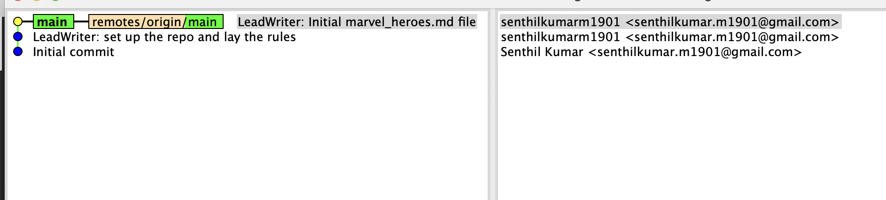
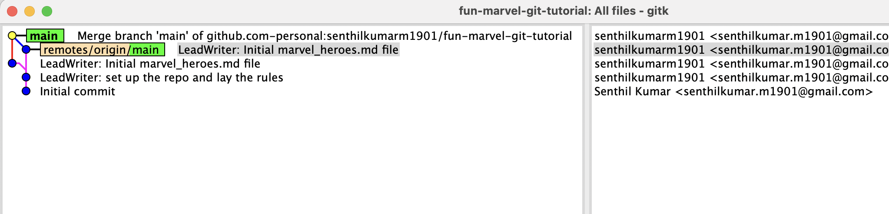
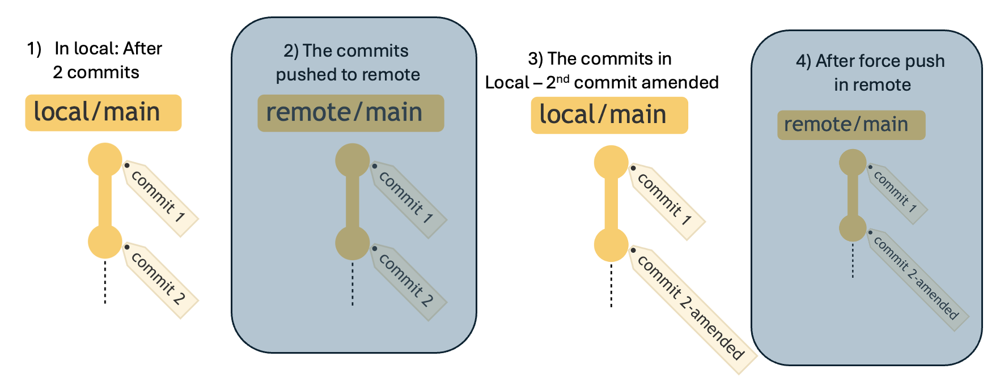
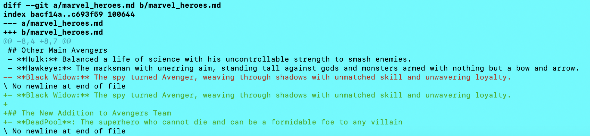
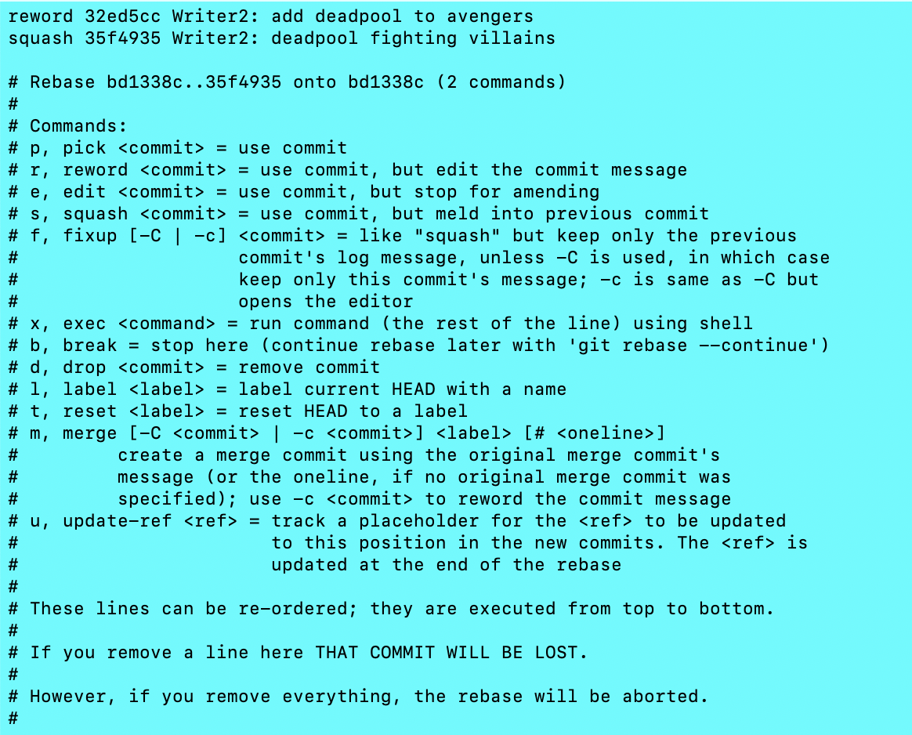
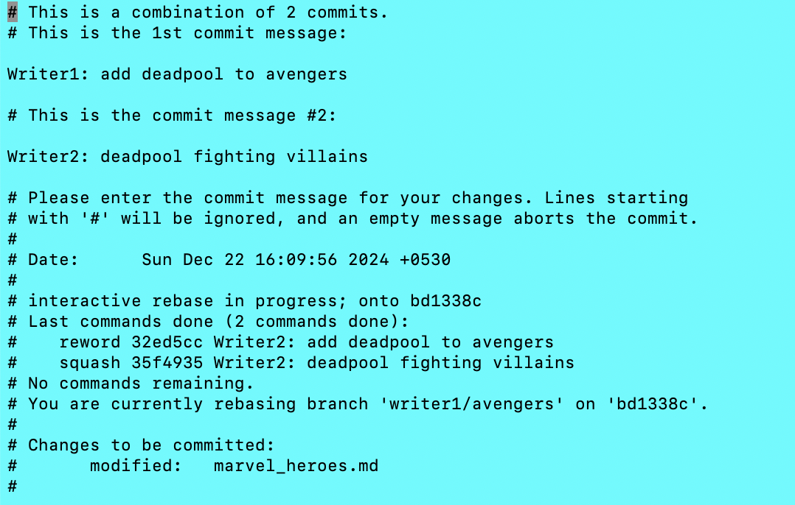
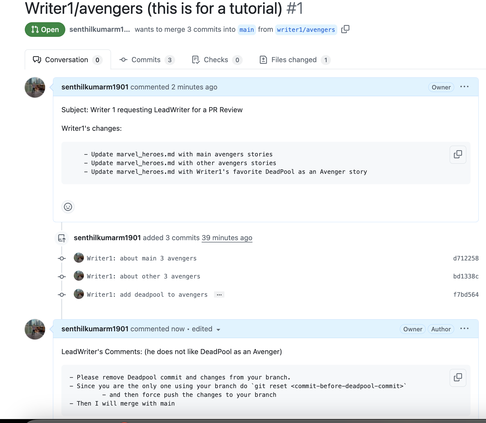
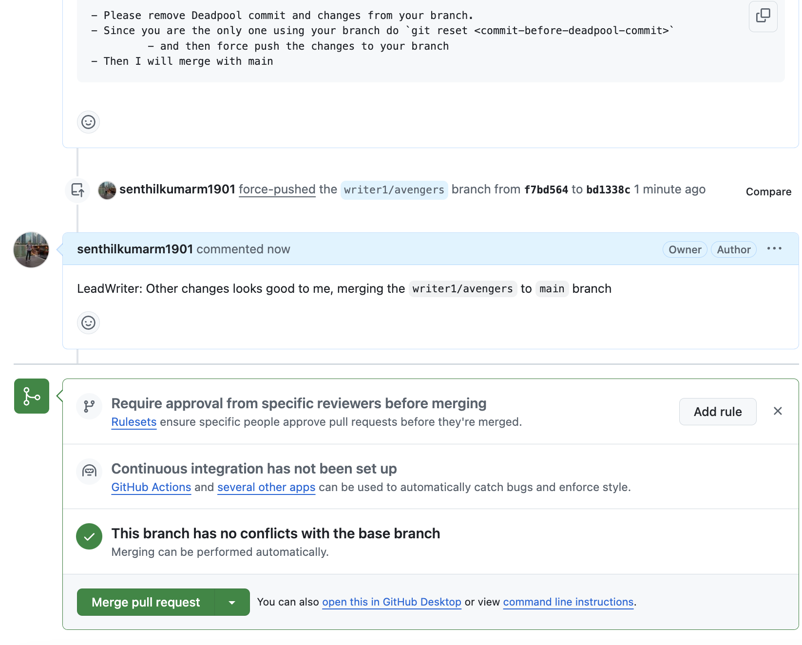
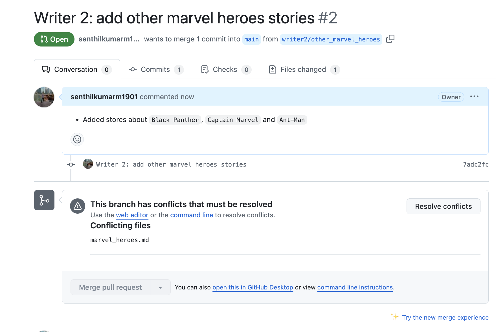
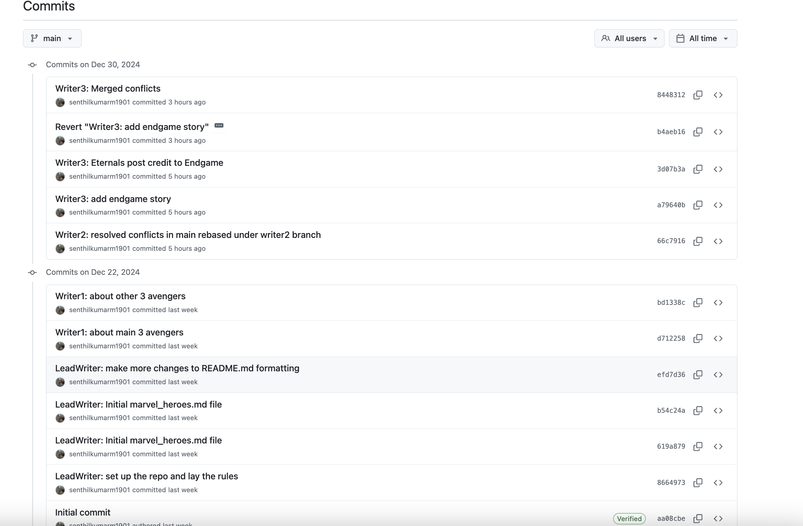

# Introduction

In this blog we have covered several advanced features of git, all the while unfurling the Marvel universe story

```bash
git commit --amend # (Scenario A and B)
git pull --ff # (Scenario A)
git push remote branch --force-with-lease # (Scenario B)
git diff # (Scenario C)
git rebase -i commit-hash # (squash and reword disussed in Scenario D)
git reset --hard commit-hash # (Scenario E)
git rebase # (Scenario F)
git revert  # (Scenario G)
git switch feature && git rebase main
git merge --no-ff
git tag ( git tag marvel-phase-end) # (Scenario H)
# Bonus: How are Pull Requests in public repo
```

# Setting the Context to the Marvel Story

**fun-marvel-git-tutorial**: 
> This is a Marvel-inspired fun Git Tutorial to help a coder transition from a beginner to an advanced Git User

:::{.callout-note}
If you would like to review the history discussed in this blog, refer to the below repo: 
Repo: https://github.com/senthilkumarm1901/fun-marvel-git-tutorial
:::

> Instead of a regular tutorial that explains the `git commands` one by one, this blog takes up an `applied` approach by weaving the knowledge of git commands in the most practical manner possible - as part of a story of collaboration in Git. 
> I have attempted to keep this as close to real life experience as possible, 

**Story - A Team of Script Writers at Marvel Enterprises**:

> A Team of 4 Writers are collaborating in Git to create amazing comic stories in the Marvel Universe

**About the Team**
- A Lead Script Writer at Marvel is tasked with creation of several comics. 
- He delegates the work to 3 writers with the following responsibilities

**Responsibilities**


>[!IMPORTANT]
>- Where do all Writers Collaborate - In `GitHub` <br>
>- Each Writer can create a branch for them to commit their efforts <br>
>- Upon completion of the work, they are expected to seek `Pull Request` Review for merging their branch with `main` where the Lead Script Writer comments and approves. <br>


**Lead Script Writer's Initial Efforts**

- Create a repo in remote. `git clone` locally 
- Push all initial ground work such as 
    - the context portions in `README.md` and 
    - the initial empty version of `marvel_heroes.md`
- The writers are expected to contribute their efforts in their branches in the file `marvel_heroes.md`


>[!NOTE]
>- The only file all writers are collaborating in is `marvel_heroes.md`


# The Lead Script Writer's Git Journey

## The Boilerplate Git Commands 
```bash
# Ensuring my Personal GitHub Creds are utilized
% git clone git@github.com-personal:senthilkumarm1901/fun-marvel-git-tutorial.git

% cd fun-marvel-git-tutorial.git

% git config user.email "senthilkumar.m1901@gmail.com"

% git config user.name "senthilkumarm1901" 

#---

# Ensuring this git_commands file and folder are ignored by git
## will ignore all `git_commands.md` file anywhere in the git repo
% echo "git_commands.md" >> .gitignore
## Ignoring `git_commands/` folder anywhere in the git repo 
% echo "**git_commands/" >> .gitignore

#---

# Now, the LeadWriter made a minor edit

# adding `README.md` and `marvel_heroes.md` files to git
% git add README.md  && git commit -m "LeadWriter: set up the repo and lay the rules"
% git add marvel_heroes.md && git commit -m "LeadWriter: Initial marvel_heroes.md file"

% cat marvel_heroes.md
> In this document, all writers contribute their efforts

% git push origin main

#---

```


## Scenario A: `git commit --amend &&  git pull --ff && git push remote branch` 

```bash
# LeadWriter made some minor edits to `README.md`
% vi README.md
## added the changes to previous commit

% git add README.md 
% git commit --amend --no-edit

## It seems after pushing amending commit results in conflicts

% git push origin main
To github.com-personal:senthilkumarm1901/fun-marvel-git-tutorial.git
 ! [rejected]        main -> main (non-fast-forward)
error: failed to push some refs to 'github.com-personal:senthilkumarm1901/fun-marvel-git-tutorial.git'
hint: Updates were rejected because the tip of your current branch is behind
hint: its remote counterpart. Integrate the remote changes (e.g.
hint: 'git pull ...') before pushing again.
hint: See the 'Note about fast-forwards' in 'git push --help' for details.

## Adhereing to the suggestion above
% git pull --ff
Merge made by the 'ort' strategy.

% git push origin main
Enumerating objects: 8, done.
Counting objects: 100% (7/7), done.
Delta compression using up to 8 threads
Compressing objects: 100% (4/4), done.
Writing objects: 100% (4/4), 532 bytes | 532.00 KiB/s, done.
Total 4 (delta 2), reused 0 (delta 0), pack-reused 0
remote: Resolving deltas: 100% (2/2), completed with 1 local object.
To github.com-personal:senthilkumarm1901/fun-marvel-git-tutorial.git
   619a879..1aac0d4  main -> main

```

### **What just happened?**

- After first  `git push` but before `git commit --ammend --no-edit`
- Both `main` and `origin/main` are in the same commit `C`

```
A---B---C (main & origin/main)
```

- After `git commit --amend`, the local and remote main branches have diverged

```
A---B---C (origin/main)
         \
          C' (main)
```

- After `git pull` , a **3-way merge** happened

```
A---B---C--- M (main, origin/main)
         \  /
          C'
```

**What is ORT Strategy**

- The 'ort' strategy refers to the "Optimized Recursive Three-Way Merge" strategy
- A merge commit was created, combining the remote branch and your amended commit.

**Before ORT merge**


**After ORT merge**


>[!NOTE]
> `git pull --ff` allows Git to fast-forward if possible, but if the branches have diverged (as in your case), Git falls back to performing a merge.

- If I wish to avoid a `merge-commit` in the history, I could have done, `git push --force` (see another example below)

## Scenario B: `git push --force-with-lease`


[Image Source](https://towardsdev.com/understanding-the-power-of-git-push-force-with-lease-30f73858e0dc)

> Goal: How about keeping the commit history clean? No, `merge commit` like above in the 3-way merge. 

**What if I used `git push --force-with-lease`**

```bash
% git add README.md 
% git commit --amend
# EDITED MESSAGE:  `LeadWriter: make more changes to README.md formatting`
% git log --oneline --all
efd7d36 (HEAD -> main) LeadWriter: make more changes to README.md formatting
1aac0d4 (origin/main, origin/HEAD) Merge branch 'main' of github.com-personal:senthilkumarm1901/fun-marvel-git-tutorial
b54c24a LeadWriter: Initial marvel_heroes.md file
619a879 LeadWriter: Initial marvel_heroes.md file
8664973 LeadWriter: set up the repo and lay the rules
aa08cbe Initial commit


% git push origin main --force-with-lease
Enumerating objects: 7, done.
Counting objects: 100% (7/7), done.
Delta compression using up to 8 threads
Compressing objects: 100% (3/3), done.
Writing objects: 100% (3/3), 405 bytes | 405.00 KiB/s, done.
Total 3 (delta 1), reused 0 (delta 0), pack-reused 0
remote: Resolving deltas: 100% (1/1), completed with 1 local object.
To github.com-personal:senthilkumarm1901/fun-marvel-git-tutorial.git
 + 1aac0d4...efd7d36 main -> main (forced update)
```

**After `git push --force-with-lease` update**
 

**Unfamiliar with above `gitk` view, here is the terminal view of the same**: 

```bash
 % git log --oneline --all --decorate --graph
*   efd7d36 (HEAD -> main, origin/main, origin/HEAD) LeadWriter: make more changes to README.md formatting
|\  
| * 619a879 LeadWriter: Initial marvel_heroes.md file
* | b54c24a LeadWriter: Initial marvel_heroes.md file
|/  
* 8664973 LeadWriter: set up the repo and lay the rules
* aa08cbe Initial commit
```

### **What just happened?**

- Before `git commit --amend`

```
A---B---C---M (origin/main, main)
```

- After `git commit --amend`


```
A---B---C---M (origin/main)
              \
               M' (main)
```

- After `git push origin main --force-with-lease`

```
A---B---C---M' (origin/main, main)

```

**A Quick Recap of Force Push**


**Scenario Recap**: <br>

1. **I pushed a commit to the remote repository.**
2. I made additional changes to the same commit (e.g., using `git commit --amend`).
3. I am now trying to sync my updated local branch with the remote branch.

**Pros and Cons of Using `git push --force` in This Case** <br>

| **Aspect**          | **Using `git pull --ff` **  (git pull==`git fetch && git merge`)                     | **Using `git push --force`**                  |
|----------------------|------------------------------------------------|-----------------------------------------------|
| **Safety**           | Ensures you’re up-to-date with remote history. | Can overwrite remote history if not careful. |
| **Ease of Use**      | Requires resolving conflicts if history diverges. | Directly applies your local changes to remote. |
| **Collaboration**    | Safe for shared branches.                     | Risky in shared branches (disrupts others).  |
| **Commit History**   | Preserves history integrity.                  | Rewrites history (can confuse others).       |


**Safer Alternative: <br> `git push --force-with-lease`** (compared to `git push --force`)
If I must force push, I could try `--force-with-lease`:
```bash
git push origin <branch-name> --force-with-lease
```
This ensures the remote branch hasn’t been updated by someone else since my last fetch. If there’s a mismatch, Git will reject the push, preventing accidental overwrites.

:::{.callout-note}
git push --force vs --force-with-lease discussion in [slackoverflow](https://stackoverflow.com/questions/52823692/git-push-force-with-lease-vs-force)
:::


**Cleaner Commit history in Remote Repo because of `git push --force-with-lease`**


</details>


:::{.callout-warning}
- In general, it is better to use `git commit --amend` (or even `git rebase -i commit-hash` - discussed in next section) BEFORE you have pushed your changes to remote branch. 
- But if you have pushed your changes to remote, you must be prepared to use `git push --force-with-lease` or `git push --force-if-includes`
:::

---

# Writer1's Git Journey

## The Boilerplate Git Commands 

```bash
# Writer1 clone the repo
# ensure he uses the right user.email and user.name

% git clone  github.com-personal:senthilkumarm1901/fun-marvel-git-tutorial.git
% cd fun-marvel-git-tutorial
% git config user.email "senthilkumar.m1901@gmail.com" && git config user.name "senthilkumarm1901"

% git status
On branch main
Your branch is up to date with 'origin/main'.

nothing to commit, working tree clean

# Switch to a new branch `writer1/avengers`
% git switch -c writer1/avengers
```

- Writer 1 making the first commit `Writer1: about main 3 avengers`

```bash
% vi marvel_heroes.md
% git add marvel_heroes.md && git commit -m "Writer1: about main 3 avengers"

% cat marvel_heroes.md
> In this document, all writers contribute their efforts

## About the Main Avengers
- **Iron Man:** Created the Iron Man suit and saved himself from captivity.
- **Captain America:** Led the charge against Hydra during WWII and became a symbol of hope.
- **Thor:** Defended Asgard and Earth, wielding Mjolnir with unshakable valor.
```


## Scenario C - Understanding `git diff --staged` usage

- Writer1 making second commit - `Writer1: about other 3 avengers`

```bash
% vi marvel_heroes.md
% git add marvel_heroes.md 
%  git diff --staged
diff --git a/marvel_heroes.md b/marvel_heroes.md
index daf9bed..bacf14a 100644
--- a/marvel_heroes.md
+++ b/marvel_heroes.md
@@ -5,3 +5,7 @@
 - **Captain America:** Led the charge against Hydra during WWII and became a symbol of hope.
 - **Thor:** Defended Asgard and Earth, wielding Mjolnir with unshakable valor.
 
+## Other Main Avengers
+- **Hulk:** Balanced a life of science with his uncontrollable strength to smash enemies.
+- **Hawkeye:** The marksman with unerring aim, standing tall against gods and monsters armed with nothing but a bow and arrow.
+- **Black Widow:** The spy turned Avenger, weaving through shadows with unmatched skill and unwavering loyalty.
\ No newline at end of file
%
```

**Interpretting `git diff --staged` command**


> The green lines are the newly created lines in `marvel_heroes.md` 

```bash
% git commit -m "Writer1: about other 3 avengers"
```

- Writer 1 making 3rd and 4th commits `Writer2: add deadpool to avengers` and `Writer2: deadpool fighting villains` 

```bash
% git add marevel_heroes.md && git diff --staged
```


> If you see above, a `new line` is added after Black Widow line and a new section on `DeadPool` was added

```bash
% git commit -m "Writer2: add deadpool to avengers"
% vi marvel_heroes.md 
% git add marvel_heroes.md && git commit -m "Writer2: deadpool fighting villains"

# review the logs
% git log --oneline --all

35f4935 (HEAD -> writer1/avengers) Writer2: deadpool fighting villains
32ed5cc Writer2: add deadpool to avengers
bd1338c Writer1: about other 3 avengers
d712258 Writer1: about main 3 avengers
efd7d36 (origin/main, origin/HEAD, main) LeadWriter: make more changes to README.md formatting
b54c24a LeadWriter: Initial marvel_heroes.md file
619a879 LeadWriter: Initial marvel_heroes.md file
8664973 LeadWriter: set up the repo and lay the rules
aa08cbe Initial commit
```


## Scenario D - Altering history and commit messages using interactive git rebase

```bash
# Since the commit is not pushed to remote yet, 
# the commit messages can be edited,
# even the commits can be squished
% git rebase -i HEAD~2
```



> I am rewording the incorrect commit message from `Writer2` to `Writer1`
> I am squashing the newer commit to the previous commit




```bash
%  git log --oneline --all
f7bd564 (HEAD -> writer1/avengers) Writer1: add deadpool to avengers
bd1338c Writer1: about other 3 avengers
d712258 Writer1: about main 3 avengers
efd7d36 (origin/main, origin/HEAD, main) LeadWriter: make more changes to README.md formatting
b54c24a LeadWriter: Initial marvel_heroes.md file
619a879 LeadWriter: Initial marvel_heroes.md file
8664973 LeadWriter: set up the repo and lay the rules
aa08cbe Initial commit
```


```bash
% git push -u origin writer1/avengers
```

### **What just happened?**

- Before `git rebase -i HEAD~2`

```
A---B---C---M (origin/main, origin/HEAD, main)
            \
             D---E---F--G (HEAD -> writer1/avengers)

D (d712258): "Writer1: about main 3 avengers."
E (bd1338c): "Writer1: about other 3 avengers."
F (32ed5cc): "Writer2: add deadpool to avengers."
G (35f4935): "Writer2: deadpool fighting villains."
```

- After the following `git rebase -i HEAD~2`

```
% git rebase -i HEAD~2
# in another window, you make the following changes
# reword 32ed5cc (F) Writer2: add deadpool to avengers --> `Writer1: add deadpool to avengers`
# squash 35f4935 (G) Writer2: deadpool fighting villains --> Squash it to the previous commit F
```

```
A---B---C---M (origin/main, origin/HEAD, main)
            \
             D---E---(F+G) (HEAD -> writer1/avengers)


A---B---C---M (origin/main, origin/HEAD, main)
            \
             D---E---H (HEAD -> writer1/avengers)
```

- After `git push --force-with-lease`

```
A---B---C---M (origin/main, main)
            \
             D---E---H (HEAD --> origin/writer1/avengers, writer1/avengers)

```


## Scenario E - Usage of `git reset --hard commit-to-go-to`

- LeadWriter is unhappy with Writer1 including DeadPool as an avenger



**Writer1 working on removing Deadpool commit entirely**:

- **Simplest but most unsafe solution** is `git reset --hard` but in our case it is okay since we do not want the deadpool commit entirely


```bash
# find the commit to reset the git pointer to
% git log --oneline --all
f7bd564 (HEAD -> writer1/avengers, origin/writer1/avengers) Writer1: add deadpool to avengers
bd1338c Writer1: about other 3 avengers
d712258 Writer1: about main 3 avengers
efd7d36 (origin/main, origin/HEAD, main) LeadWriter: make more changes to README.md formatting
b54c24a LeadWriter: Initial marvel_heroes.md file
619a879 LeadWriter: Initial marvel_heroes.md file
8664973 LeadWriter: set up the repo and lay the rules
aa08cbe Initial commit

# the commit to make the HEAD go back to is `bd1338c`
% git reset --hard bd1338c
HEAD is now at bd1338c Writer1: about other 3 avengers
 

%  git log --oneline --all
f7bd564 (origin/writer1/avengers) Writer1: add deadpool to avengers
bd1338c (HEAD -> writer1/avengers) Writer1: about other 3 avengers
d712258 Writer1: about main 3 avengers
efd7d36 (origin/main, origin/HEAD, main) LeadWriter: make more changes to README.md formatting
b54c24a LeadWriter: Initial marvel_heroes.md file
619a879 LeadWriter: Initial marvel_heroes.md file
8664973 LeadWriter: set up the repo and lay the rules
aa08cbe Initial commit

# we still need to push this to main branch
# We have already discussed the benefits of `git push --force-with-lease`

% git push origin writer1/avengers --force-with-lease
Total 0 (delta 0), reused 0 (delta 0), pack-reused 0
To github.com-personal:senthilkumarm1901/fun-marvel-git-tutorial.git
 + f7bd564...bd1338c writer1/avengers -> writer1/avengers (forced update)
```

### **What just happened?**

- Before `git reset --hard E`

```
A---B---C---M (origin/main, main)
            \
             D---E---H (origin/writer1/avengers, writer1/avengers)

H - It is the deadpool commit 
```

- After `git reset --hard E` in local

```
A---B---C---M (origin/main, main)
            \
             D---E (HEAD -> writer1/avengers)
                  \
                   H (origin/writer1/avengers)
```


- After `git push origin writer1/avengers --force-with-lease`

```
A---B---C---M (origin/main, main)
            \
             D---E (HEAD -> writer1/avengers, origin/writer1/avengers)

The commit F is permanently removed
```


**Merge Request can be Approved in Remote ir via CLI - `Merge` (simple `fast forward`) **:



```bash
% git log --oneline --all
bd1338c (HEAD -> writer1/avengers, origin/writer1/avengers) Writer1: about other 3 avengers
d712258 Writer1: about main 3 avengers
efd7d36 (origin/main, origin/HEAD, main) LeadWriter: make more changes to README.md formatting
b54c24a LeadWriter: Initial marvel_heroes.md file
619a879 LeadWriter: Initial marvel_heroes.md file
8664973 LeadWriter: set up the repo and lay the rules
aa08cbe Initial commit

% git rebase main
Current branch writer1/avengers is up to date.

% git switch main
Switched to branch 'main'
Your branch is up to date with 'origin/main'.
 

% git merge writer1/avengers 
Updating efd7d36..bd1338c
Fast-forward
 marvel_heroes.md | 10 ++++++++++
 1 file changed, 10 insertions(+)


% git log --oneline --all
bd1338c (HEAD -> main, origin/writer1/avengers, origin/main, origin/HEAD, writer1/avengers) Writer1: about other 3 avengers
d712258 Writer1: about main 3 avengers
efd7d36 LeadWriter: make more changes to README.md formatting
b54c24a LeadWriter: Initial marvel_heroes.md file
619a879 LeadWriter: Initial marvel_heroes.md file
8664973 LeadWriter: set up the repo and lay the rules
aa08cbe Initial commit
```
---

# Writer2's Git Journey

## Boilerplate Git Commands

- Writer2 had forked from Lead Script Writer's commit

```bash
# in `Writer2's terminal`
 % git log --oneline --all
efd7d36 (HEAD -> writer2/other_marvel_heroes, origin/main, origin/HEAD, main) LeadWriter: make more changes to README.md formatting
b54c24a LeadWriter: Initial marvel_heroes.md file
619a879 LeadWriter: Initial marvel_heroes.md file
8664973 LeadWriter: set up the repo and lay the rules
aa08cbe Initial commit

% git status
On branch writer2/other_marvel_heroes
nothing to commit, working tree clean

# add about `other marvel heroes` like Black Panther, Captain Marvel and Ant-Man
% vi marve_heroes.md

% git add marvel_heroes.md && git commit -m "Writer 2: add other marvel heroes stories"

% git push -u origin writer2/other_marvel_heroes
```

## Scenario F - Rebase with main

> Raise a PR for merging `writer2/other_marvel_heroes` with `main`

- The PR shows that there are conflicts



- Let us 1) rebase main, 2) resolve conflicts, 3) ff the main branch and 4) merge with `writer2`


```
# before rebasing
A---B---C (master)
     \
      D---E (feature)

# while on feature branch
# `git rebase master`

A---B---C (master)
         \
          D'---E' (feature)

# now, the `feature` branch can be merged with `master` with a easier `Fast Forward` method
```


```bash
% git fetch origin main  

remote: Enumerating objects: 8, done.
remote: Counting objects: 100% (8/8), done.
remote: Compressing objects: 100% (6/6), done.
remote: Total 6 (delta 1), reused 4 (delta 0), pack-reused 0 (from 0)
Unpacking objects: 100% (6/6), 964 bytes | 56.00 KiB/s, done.
From github.com-personal:senthilkumarm1901/fun-marvel-git-tutorial
 * branch            main       -> FETCH_HEAD
   efd7d36..bd1338c  main       -> origin/main

% git log --oneline --all
7adc2fc (HEAD -> writer2/other_marvel_heroes, origin/writer2/other_marvel_heroes) Writer 2: add other marvel heroes stories
bd1338c (origin/main, origin/HEAD) Writer1: about other 3 avengers
d712258 Writer1: about main 3 avengers
efd7d36 (main) LeadWriter: make more changes to README.md formatting
b54c24a LeadWriter: Initial marvel_heroes.md file
619a879 LeadWriter: Initial marvel_heroes.md file
8664973 LeadWriter: set up the repo and lay the rules
aa08cbe Initial commit

% git switch main
Switched to branch 'main'
Your branch is behind 'origin/main' by 2 commits, and can be fast-forwarded.
  (use "git pull" to update your local branch)

% git pull origin main
From github.com-personal:senthilkumarm1901/fun-marvel-git-tutorial
 * branch            main       -> FETCH_HEAD
Updating efd7d36..bd1338c
Fast-forward
 marvel_heroes.md | 10 ++++++++++
 1 file changed, 10 insertions(+)

% git switch writer2/other_marvel_heroes 
Switched to branch 'writer2/other_marvel_heroes'
Your branch is up to date with 'origin/writer2/other_marvel_heroes'.

# 1) rebase main
 % git rebase main
Auto-merging marvel_heroes.md
CONFLICT (content): Merge conflict in marvel_heroes.md
error: could not apply 7adc2fc... Writer 2: add other marvel heroes stories
hint: Resolve all conflicts manually, mark them as resolved with
hint: "git add/rm <conflicted_files>", then run "git rebase --continue".
hint: You can instead skip this commit: run "git rebase --skip".
hint: To abort and get back to the state before "git rebase", run "git rebase --abort".
Could not apply 7adc2fc... Writer 2: add other marvel heroes stories

# 2) resolve conflicts
% vi marvel_heroes.md

% git add marvel_heroes.md && git commit -m "Writer2: resolved conflicts in main rebased under writer2 branch"
[detached HEAD 66c7916] Writer2: resolved conflicts in main rebased under writer2 branch
 1 file changed, 7 insertions(+), 1 deletion(-)

% git rebase --continue
Successfully rebased and updated refs/heads/writer2/other_marvel_heroes.

% git log --oneline --all
66c7916 (HEAD -> writer2/other_marvel_heroes) Writer2: resolved conflicts in main rebased under writer2 branch
7adc2fc (origin/writer2/other_marvel_heroes) Writer 2: add other marvel heroes stories
bd1338c (origin/main, origin/HEAD, main) Writer1: about other 3 avengers
d712258 Writer1: about main 3 avengers
efd7d36 LeadWriter: make more changes to README.md formatting
b54c24a LeadWriter: Initial marvel_heroes.md file
619a879 LeadWriter: Initial marvel_heroes.md file
8664973 LeadWriter: set up the repo and lay the rules
aa08cbe Initial commit

# 3) switch to main
% git switch main

% git merge writer2/other_marvel_heroes --ff-only
Updating bd1338c..66c7916
Fast-forward
 marvel_heroes.md | 8 +++++++-
 1 file changed, 7 insertions(+), 1 deletion(-)


% git log --oneline --all
66c7916 (HEAD -> main, writer2/other_marvel_heroes) Writer2: resolved conflicts in main rebased under writer2 branch
7adc2fc (origin/writer2/other_marvel_heroes) Writer 2: add other marvel heroes stories
bd1338c (origin/main, origin/HEAD) Writer1: about other 3 avengers
d712258 Writer1: about main 3 avengers
efd7d36 LeadWriter: make more changes to README.md formatting
b54c24a LeadWriter: Initial marvel_heroes.md file
619a879 LeadWriter: Initial marvel_heroes.md file
8664973 LeadWriter: set up the repo and lay the rules
aa08cbe Initial commit


# local and remote `writer2` branches have diverged
# but main branch is pushed properly


# since `writer2/other_marvel_heroes` is rebased and `origin/writer2/other_marvel_heroes` is not, 
# we need to force push (but we are doing `safely` with `--force-with-lease`)
% git push --all --force-with-lease
Total 0 (delta 0), reused 0 (delta 0), pack-reused 0
To github.com-personal:senthilkumarm1901/fun-marvel-git-tutorial.git
 + 7adc2fc...66c7916 writer2/other_marvel_heroes -> writer2/other_marvel_heroes (forced update) 
```

### What just happened?


- The following is the flow when the following is done 
    - `git pull origin main`
    - `git push -u origin writer2/other_marvel_heroes`
- Note, `git rebase` is not done

```
A---B---C---M (HEAD -> main, origin/main, origin/HEAD)
         \
          D (HEAD -> writer2/other_marvel_heroes, origin/writer2/other_marvel_heroes)
```

- Now,
    - `git checkout writer2/other_marvel_heroes && git rebase main` 
    - # push the local changes to remote
    - `git push -u origin writer2/other_marvel_heroes --force-with-lease`

```
A---B---C---M (main, origin/main, origin/HEAD)
            \
             D' (HEAD -> writer2/other_marvel_heroes, origin/writer2/other_marvel_heroes)


D becomes D' after resolving conflicts
```

- Now,
    - `git checkout main && git merge writer2/other_marvel_heroes --ff-only`

```
A---B---C---M---D' (HEAD -> main, writer2/other_marvel_heroes, origin/main, origin/writer2/other_marvel_heroes, origin/HEAD)
```


---

# Writer3's Git Journey

## Boilerplate Git Commands


```bash
% git status
On branch writer3/end_game
nothing to commit, working tree clean

% git log --oneline --all
efd7d36 (HEAD -> writer3/end_game, origin/main, origin/HEAD, main) LeadWriter: make more changes to README.md formatting
b54c24a LeadWriter: Initial marvel_heroes.md file
619a879 LeadWriter: Initial marvel_heroes.md file
8664973 LeadWriter: set up the repo and lay the rules
aa08cbe Initial commit

% vi marvel_heroes.md

% git add marvel_heroes.md && git commit -m "Writer3: add endgame story"
[writer3/end_game a79640b] Writer3: add endgame story
 1 file changed, 8 insertions(+)


# added a scene about Eternals watching the Thanos Snap reversed
% vi marvel_heroes.md
% git add marvel_heroes.md && git commit -m "Writer3: Eternals post credit to Endgame"
```

## Scenario G - Reverting to `End Game` commit (before `Eternals` commit)

> Raise a PR for merging `writer3/end_game` with `main`


```bash
% git fetch origin main
remote: Enumerating objects: 11, done.
remote: Counting objects: 100% (11/11), done.
remote: Compressing objects: 100% (8/8), done.
remote: Total 9 (delta 2), reused 7 (delta 1), pack-reused 0 (from 0)
Unpacking objects: 100% (9/9), 1.45 KiB | 64.00 KiB/s, done.
From github.com-personal:senthilkumarm1901/fun-marvel-git-tutorial
 * branch            main       -> FETCH_HEAD
   efd7d36..66c7916  main       -> origin/main


% git log --oneline --all --decorate --graph
* 3d07b3a (HEAD -> writer3/end_game, origin/writer3/end_game) Writer3: Eternals post credit to Endgame
* a79640b Writer3: add endgame story
| * 66c7916 (origin/writer2/other_marvel_heroes, origin/main, origin/HEAD, main) Writer2: resolved conflicts in main rebased under writer2 branch
| * bd1338c (origin/writer1/avengers) Writer1: about other 3 avengers
| * d712258 Writer1: about main 3 avengers
|/  
*   efd7d36 LeadWriter: make more changes to README.md formatting
|\  
| * 619a879 LeadWriter: Initial marvel_heroes.md file
* | b54c24a LeadWriter: Initial marvel_heroes.md file
|/  
* 8664973 LeadWriter: set up the repo and lay the rules
* aa08cbe Initial commit
```


```bash
# go to the endgame commit 
% git revert a79640b
Auto-merging marvel_heroes.md
CONFLICT (content): Merge conflict in marvel_heroes.md
error: could not revert a79640b... Writer3: add endgame story
hint: After resolving the conflicts, mark them with
hint: "git add/rm <pathspec>", then run
hint: "git revert --continue".
hint: You can instead skip this commit with "git revert --skip".
hint: To abort and get back to the state before "git revert",
hint: run "git revert --abort".
```

- Resolving conflicts

```bash
% git switch main
% git status
On branch main
Your branch is behind 'origin/main' by 3 commits, and can be fast-forwarded.
  (use "git pull" to update your local branch)

nothing to commit, working tree clean

% git pull
From github.com-personal:senthilkumarm1901/fun-marvel-git-tutorial
 * [new branch]      writer1/avengers            -> origin/writer1/avengers
 * [new branch]      writer2/other_marvel_heroes -> origin/writer2/other_marvel_heroes
Updating efd7d36..66c7916
Fast-forward
 marvel_heroes.md | 16 ++++++++++++++++
 1 file changed, 16 insertions(+)

% git merge writer3/end_game 
Auto-merging marvel_heroes.md
CONFLICT (content): Merge conflict in marvel_heroes.md
Automatic merge failed; fix conflicts and then commit the result.

Auto-merging marvel_heroes.md
CONFLICT (content): Merge conflict in marvel_heroes.md
Automatic merge failed; fix conflicts and then commit the result.
% git status
On branch main
Your branch is up to date with 'origin/main'.

You have unmerged paths.
  (fix conflicts and run "git commit")
  (use "git merge --abort" to abort the merge)

Unmerged paths:
  (use "git add <file>..." to mark resolution)
	both modified:   marvel_heroes.md

no changes added to commit (use "git add" and/or "git commit -a")

% git add marvel_heroes.md && git commit -m "Writer3: Merged conflicts"
[main 43ccb28] Writer3: Merged conflicts

% git push -u origin main
```

### **What just happened?**


- Before Reverting
```
A---B--C--M--D' (main, origin/main, origin/HEAD)
        \
         G---H--I (writer3/end_game, origin/writer3/end_game)

H - Endgame commit
I - Eternals commit         
```

- After Reverting where I lose the `Eternals` commit and go back to `H` (after resolving conflicts)
```
A---B--C--M--D' (main, origin/main, origin/HEAD)
        \
         G---H--I--H' (writer3/end_game, origin/writer3/end_game)
```

- Now, 
    - `git switch main`
    - `git merge writer3/end_game`

```
A---B--C--M--D' --- M2 (HEAD --> main, origin/main, origin/HEAD)
        \           /  
         G---H--I--H' (writer3/end_game, origin/writer3/end_game)
``` 

---

## Scenario H - Tagging in Git


```bash
# give a tag to the current commit in main
% git tag End_of_Phase3 

# list the tags
% git tag
End_of_Phase3

# make another tag to the same  commit
% git tag End_of_Phase4 --force 
% git tag                       
End_of_Phase3
End_of_Phase4

# delete one of the older tags
% git tag --delete End_of_Phase3
Deleted tag 'End_of_Phase3' (was 8448312)
% git tag                       
End_of_Phase4

# 
% git push origin tag End_of_Phase4
```

:::{.callout-note}
A `tag` is a git concept whereas a `Release` is GitHub higher level concept.
:::
---

# Conclusion - What have we accomplished?




:::{.callout-note}
With finally 12 commits in the remote `main` branch, we have explained many advanced commands of Git
:::

---

# BONUS
## Forking a Public Repo and Request for a Pull Request with Original Repo`

- Forking a Public Repo and PR from a Forked Repo to the Original Repo 
    - 1. Fork the Original Public Repo (OPR) and make it F-OPR
    - 2. Clone the F-OPR to local (automatically adds the Forked Repo as `Origin` for Remote)
    - 3. Add a remote pointing to the OPR as `Original` for Remote (`git remote add Original https://github.com/OPR/`)
    - 4. Make changes locally to F-OPR. 
    - 5. Push to F-OPR (which you have permission to do)
    - 6. Raise a PR to allow F-OPR to merge with OPR 
    
> **OPR**: https://github.com/explosion/spaCy <br>
> **F-OPR**: https://github.com/mribbons/spaCy/tree/master <br>
> **PR Page**: https://github.com/explosion/spaCy/pull/13613 <br>
> 
`mribbons wants to merge 2 commits into explosion:master from mribbons:master`
    - **PR Commit Example**: https://github.com/explosion/spaCy/pull/13613/commits/228045464b15de57483926228cb5d045b75998b9 <br>
