## Introduction 


While countless resources teach "top X commands in Git", many fail to catapult a beginner to an advanced one in a practical way. Those resources explain the details of a command but not the situation that warranted the use of the command. In this code-along blog post, readers can understand "why a git command was used" and "how to use it". 

In this blog, I am hoping the readers can
- gain confidence in using hard-to-understand git commands in a real-world-like scenario <br>
- test their acquired knowledge by [completing Linux Foundation's Git exam](https://training.linuxfoundation.org/skillcred/git/)  <br>

**Pre-requisites**: <br>
- Any good terminal you are comfortable with <br>
- Install `git` <br>
- A music streaming app in your mobile app playing [this song](https://www.youtube.com/watch?v=wYIbH2I5GZk) (ok, that was just for me!) <br>

---

## 1. How is the blog structured? 

> Short Answer: Like a real-world scenario involving a team of collaborators in Git

 - Typically, a team of developers works on a software product and collaborate via Git. 
 - In this blog, a team of writers writes stories for an amazing comic universe, all the while collaborating in Git. This is an attempt to give that typical developer scenario a fun twist!


 Fig 1. A team collaborating through Git | Pic Source: Meta AI  

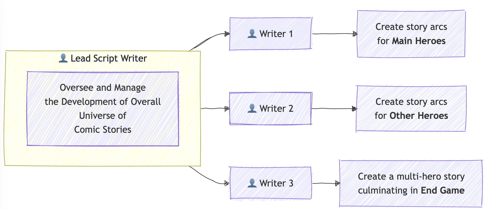
Fig 2. A git tutorial featuring a fictional team of scriptwriters unfurling a comic, superhero universe | Pic Source: Author 

- I am going to use 1 `LeadScriptWriter` (dev)  branch and 3 `Writer` (feature) branches. 

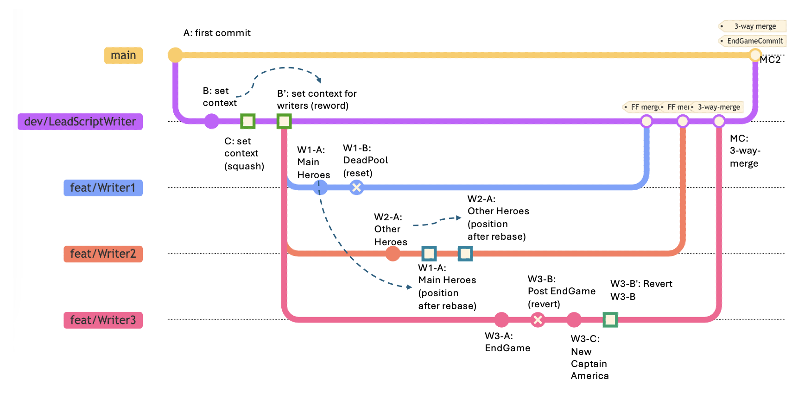
Fig 3. The above pic depicts the git branches 

> The above is a typical [git flow approach](https://www.atlassian.com/git/tutorials/comparing-workflows/gitflow-workflow) .
> Some would suggest [Trunk-based development](https://www.atlassian.com/continuous-delivery/continuous-integration/trunk-based-development) is better. This debate on the **git branching model** is out of the scope of this blog.  

---

## 2. "Hey, just tell me, what am I going to learn here?" 

In a fun, practical, and replicable way, we are going to cover the following beginner to advanced git commands

```

# Dev Branch: dev/LeadScriptWriter/Context (for miscellaneous set of useful commands)

- git commit --amend 
- git diff
- git rebase -i commit-hash & git push

# Feature Branch 1: Writer1/MainHeroes (for `reset`)
- git reset --soft commit-hash
- git merge --ff-only

# Feature Branch 2: Writer2/OtherHeroes (for `rebase`)
- git switch feature && git rebase main
- git merge --ff-only

# Feature Branch 3: Writer3/EndGame (for `revert`)
- git revert
- git merge --no-ff

# Merge `dev` with `main`
- git merge --no-ff
- git tag
```


---

## 3. The Bare-minimum Git Theory 

> Skip this section if you are already aware of the basics

### 3.1 **What is Git**?
	- Git is **a version control software** that runs locally. Git is primarily a command-line tool. 
	- You do not need a GitHub/GitLab or other remote repo account to use Git locally. 
	- You need a remote repo like GitHub/GitLab when you wish to **collaborate** and **share** your repository with the outside world. 

```bash
% mkdir -p sample_git_dir
% cd sample_git_dir
% git init
# ---
```

### 3.2 **What are `git add`(staging area) and `git commit` commands?**
	- Before you `commit`, you add your changes to `a staging area`.  
	- You can add many files to the staging area. You save the progress of all those files via a `commit`.


```bash
% pwd
/some/path/to/sample_git_dir
% echo "file1" > file1.txt && echo "file2" > file2.txt
# Before you `commit`, you add your changes to a `staging` area.
# You can add many files to the staging area.
% git add file1.txt file2.txt
# You save the progress of all those files via a `commit`. 
% git commit -m "first commit"
# ---
```


### 3.3 **What is a `HEAD`?**
	- HEAD is **a pointer** that refers to the "current location" or the "current commit" you are on, in your repository

```bash
% echo "file3" > file3.md
% git add file3.md
% git commit -m "second commit"
# ----

# note that the `HEAD` is at the commit `85de13a`
% git log --oneline
ed71ef7 (HEAD -> main) second commit
331ee7b first commit
```

- Note that I did not say "latest commit" in the previous sentence :) Whichever commit you are currently "checking out", that commit becomes the HEAD
- Generally, the HEAD is on the `latest commit` in a branch you are working. 
- You could go to a specific commit `git checkout commit-hash-or-tag`. Then you would be on a `detached HEAD` (not to worry!). You can create a new branch from that `detached HEAD` position or simply go back to an existing branch.


```bash
# Even if you progress further, you could go back to any specific commit
% git checkout 331ee7b
Note: switching to '331ee7b'.

You are in 'detached HEAD' state. You can look around, make experimental
changes and commit them, and you can discard any commits you make in this
state without impacting any branches by switching back to a branch.

If you want to create a new branch to retain commits you create, you may
do so (now or later) by using -c with the switch command. Example:

  git switch -c <new-branch-name>

Or undo this operation with:

  git switch -

Turn off this advice by setting config variable advice.detachedHead to false

HEAD is now at 331ee7b updating files of type txt
```

- When you are in a `detached HEAD` state in a particular commit, the state of files then would be shown. In other words, new files or updates created after that commit would not be visible. 

```bash
# the file `file3.md` was not created during this commit `7db0093`
% ls
file1.txt file2.txt
# --- 

# I am going from this detached HEAD state back to the `branch`
% git status
HEAD detached at 331ee7b
nothing to commit, working tree clean

```

- You can always switch to any branch to come out of the `detached HEAD`
```
% git checkout main
Previous HEAD position was 331ee7b updating files of type txt
Switched to branch 'main'

% ls
file1.txt file2.txt file3.md
```

### 3.4 **Btw, what exactly is a branch?**
- Branches are like alternate `timelines`! We can work on multiple tasks in parallel branches or have different branches just to simply separate the different tasks. 
- Each branch in a git repo has a specific set of associated commits. 

```bash
# what are the branches you have now
% git branch --list -a
* main

% git status
On branch main
nothing to commit, working tree clean

% cat file1.txt 
file1


# create and switch to that branch
% git switch -c sample_branch_1

# add more contents to `file1.txt`
% echo "\nMore contents here ..." >> file1.txt
% git add file1.txt && git commit -m "third commit"
```

- Making changes on one branch does not affect other branches until we merge them. 

```bash
# what is the content of `file1.txt` in `sample_branch_1`?
% git show sample_branch_1:file1.txt
file1

More contents here ...

# what is the content of `file1.txt` in `main`
% git show main:file1.txt
file1
```

### How do I merge 2 branches?
	- Let us merge a "feature" branch into "main"

```bash
# currently the HEAD is in `sample_branch_1` branch
% git log --oneline --all                          
2bf38e2 (HEAD -> sample_branch_1) third commit
ed71ef7 (main) second commit
331ee7b first commit

% git status
On branch sample_branch_1
nothing to commit, working tree clean

% git switch main

% git merge sample_branch_1
Updating ed71ef7..2bf38e2
Fast-forward
 file1.txt | 2 ++
 1 file changed, 2 insertions(+)

# Now, let us see file1.txt again
% git show main:file1.txt
file1

More contents here ...

% git log --oneline
2bf38e2 (HEAD -> main, sample_branch_1) third commit
ed71ef7 second commit
331ee7b first commit
```


### 3.5 What is a `.git` directory?

The `.git` directory is essentially the heart of Git. That is what makes version control work.

When you initialize a Git repository using `git init`, this directory is created at the root of your project. Below is an overview of the structure and contents of the `.git` directory:

#### Key Components of the `.git` Directory
There are more files and directories than the below ones but I am focusing the spotlight on items I have historically noticed. 

##### 1. **Files**

- `.git/config` A file containing repository-specific configuration

```bash
% cat .git/config
[core]
	repositoryformatversion = 0
	filemode = true
	bare = false
	logallrefupdates = true
	ignorecase = true
	precomposeunicode = true
[user]
	email = youremail@something.com
	name = Your Name
```


- `.git/HEAD` - Refers to the current branch's latest commit

```bash
% cat .git/HEAD
ref: refs/heads/main
```


- `.git/index` - Serves as the staging area for changes, holding metadata like timestamps and filenames along with their SHA-1 hashes in binary form

What is the difference between `working directory` and `index`  terms in `.git` directory?
- **Working Directory**: This is the actual directory where project files are located. Modifications made to files in the working directory are considered 'untracked' until explicitly staged for commit. 
- **Staging Area (Index)**: The staging area acts as an intermediate step between the working directory and the `.git` directory


- Skipping explanations for other files like ORIG_HEAD, FETCH_HEAD (you can explore [here](https://git-scm.com/docs/gitrepository-layout) )
```
% find .git -type f -name "*" -depth 1
.git/ORIG_HEAD
.git/config
.git/HEAD
.git/description
.git/index
.git/packed-refs
.git/COMMIT_EDITMSG 
```


##### 2. **Directories**

```bash
% find .git -type d -name "*" -depth 1
.git/filter-repo
.git/objects
.git/info
.git/logs
.git/hooks
.git/refs
```

- `.git/refs`  - This directory contains references to commits that are pointing to branches or tags

```bash
% tree -L 3 .git/refs      
.git/refs
├── heads
└── tags

# stores the commit id where main branch is pointing to
% cat .git/refs/heads/main
331ee7b90c8ba8a0cdc1a2d2824198114fd82bf7

% git log --oneline
331ee7b (**main**) first commit
```

- `.git/logs` - Stores reference logs (hint: reflogs - `git reflog` ) that track changes to branch tips, aiding in recovery and auditing processes.

```bash
% tree -L 3 .git/logs         
.git/logs
├── HEAD
└── refs
    └── heads
        ├── main
        └── sample_branch_1

3 directories, 3 files
```


- `.git/objects` contains information about 3 types of objects stored here 

```
- Blobs (content of files),
- Trees (directories),
- Commits and Tags (commit metadata).
```

- Want to learn what are `.git/objects` hands-on? Follow the commands below. 

```bash
% mkdir -p git-objects-demo && cd git-objects-demo && git init
% echo "Hello Reader" >> my_blog_reader.txt
% git add my_blog_reader.txt && git commit -m "first commit"
% tree -L 3 .git/objects 
.git/objects
├── 27
│   └── ce6a44f95b9e65d69a4ad7222c51a2d43d50b0
├── 55
│   └── 8f4283c08411bf4dca21aac74c3f0fbdd2d63f
├── d1
│   └── d8585ee8e0ae24a3996103b36e27c89711d57f
├── info
└── pack

6 directories, 3 files
% git cat-file --help
...
git-cat-file - Provide content or type and size information for repository objects
...

# tree object having the directory,file name and other details
% git cat-file -p 27ce6a44f95b9e65d69a4ad7222c51a2d43d50b0
100644 blob d1d8585ee8e0ae24a3996103b36e27c89711d57f	my_blog_reader.txt

# blob object showing raw file content
% git cat-file -p d1d8585ee8e0ae24a3996103b36e27c89711d57f
Hello Reader

# commit object showing the tree object's hash
% git cat-file -p 558f4283c08411bf4dca21aac74c3f0fbdd2d63f
tree 27ce6a44f95b9e65d69a4ad7222c51a2d43d50b0
author Your Name <your_email@something.com> 1739191036 +0530
committer Your Name <your_email@something.com> 1739191036 +0530

first commit
```

- I am skipping explanations about `.git/hooks` (warrants a blog on its own about `precommit hooks`)
- `.git/filter-repo` directory helps in rewriting history.


Source: [Stackoverflow discussion on .git](https://stackoverflow.com/a/56026788)


---

## 4. Learning Git by Way of Practice 

> Now, let us move on to the moderate to advanced stuff
### 4.1 Branch 1: `dev/LeadScriptWriter/Context`

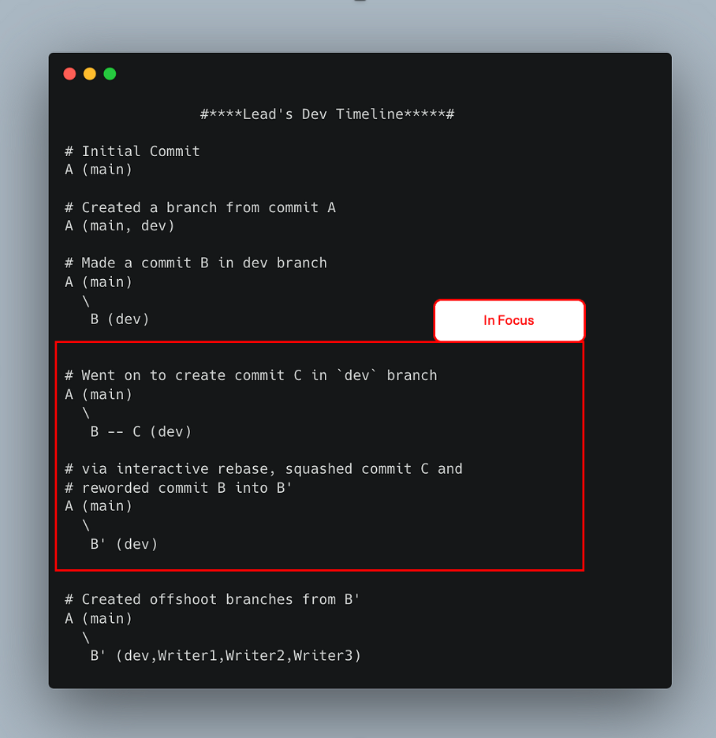
Fig 4.1.1 A quick summary of what we are going to do in this section (4.1)

> In this branch `dev/LeadScriptWriter/Context` , the Lead Script Writer is setting up the context

- Create a directory and set up git there

```bash
% mkdir -p comic_universe
% cd comic_universe

# The below command sets up the `.git` directory that helps in version control
% git init

# The below command helps git know who the committer is
% git config user.email "youremail@something.com" && git config user.name "Your Name"
% git status
On branch main
nothing to commit, working tree clean
```


```
A (main)
```

- Create a dev branch or, in our case `dev/LeadScriptWriter/Context` 

```bash
% touch comic_heroes.md
% git add comic_heroes.md && git commit -m "A: first commit - empty file"
% git switch -c dev/LeadScriptWriter/Context
```


- A pictorial representation of the commits so far (you could try `git log --oneline`)
- The HEAD of the branch is depicted in the diagram
```
A (main, dev)
```


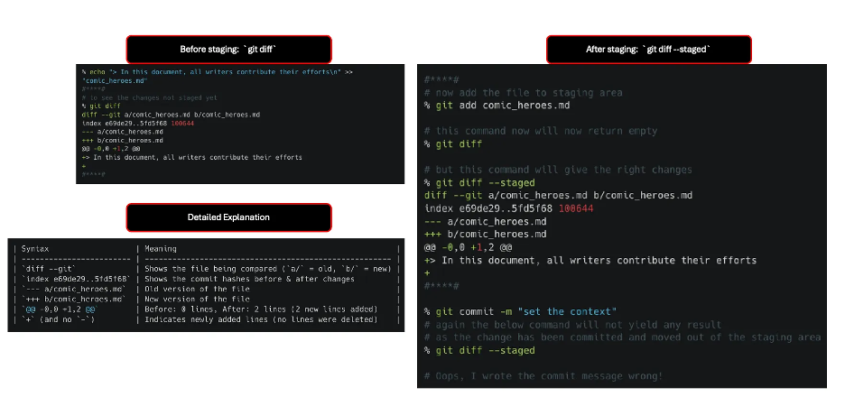

- Now, let us explore `git diff` and `git commit --amend` commands
```bash
% git status
On branch dev/LeadScriptWriter/Context
nothing to commit, working tree clean

% echo "> In this document, all writers contribute their efforts\n" >> "comic_heroes.md"

#****#
# to see the changes not staged yet
% git diff
diff --git a/comic_heroes.md b/comic_heroes.md
index e69de29..5fd5f68 100644
--- a/comic_heroes.md
+++ b/comic_heroes.md
@@ -0,0 +1,2 @@
+> In this document, all writers contribute their efforts
+
#****#
```


| Syntax                   | Meaning                                                |
| ------------------------ | ------------------------------------------------------ |
| `diff --git`             | Shows the file being compared (`a/` = old, `b/` = new) |
| `index e69de29..5fd5f68` | Shows the commit hashes before & after changes         |
| `--- a/comic_heroes.md`  | Old version of the file                                |
| `+++ b/comic_heroes.md`  | New version of the file                                |
| `@@ -0,0 +1,2 @@`        | Before: 0 lines, After: 2 lines (2 new lines added)    |
| `+` (and no `-`)         | Indicates newly added lines (no lines were deleted)    |

- Basically, the above lines say that there are two lines added to `comic_heroes.md` (+1,2)


```bash
#****#
# now add the file to staging area
% git add comic_heroes.md

# this command now will now return empty
% git diff

# but this command will give the right changes
% git diff --staged
diff --git a/comic_heroes.md b/comic_heroes.md
index e69de29..5fd5f68 100644
--- a/comic_heroes.md
+++ b/comic_heroes.md
@@ -0,0 +1,2 @@
+> In this document, all writers contribute their efforts
+
#****#

% git commit -m "set the context"
# again the below command will not yield any result
# as the change has been committed and moved out of the staging area
% git diff --staged

# Oops, I wrote the commit message wrong!
# let me edit the commit message
% git commit --amend
# In a window that will open enter the below message
# B: set the context (without the initial "# ")

# now, let us look at the commit messages
# now it is changed to "B: set the context"
% git log --oneline 
a54215f (HEAD -> dev/LeadScriptWriter/Context) B: set the context
d033ca6 (main) A: first commit - empty file
```

- Progress so far:
```
A (main)
  \
   B (dev)
```


```bash
% echo "## About the Main Heroes" >> comic_heroes.md
% echo "\n## Other Heroes" >> comic_heroes.md
% echo "\n## The EndGame" >> comic_heroes.md
% git add comic_heroes.md && git commit -m "C: set the context (2)"
```


- Progress so far:
```
A (main)
  \
   B -- C (dev) 
```

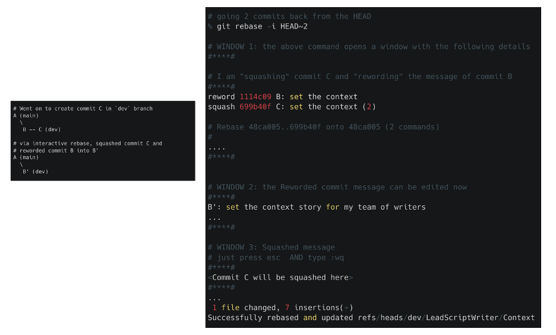

- Before I ask my co-writers to start creating their branch from here, I wish to briefly rejig my commit history. 


```bash

# I use the git rebase command in `interactive` mode 
# going 2 commits back from the HEAD
% git rebase -i HEAD~2

# WINDOW 1: the above command opens a window with the following details
#****#
pick 1114c09 B: set the context
pick 699b40f C: set the context (2)

# Rebase 48ca005..699b40f onto 48ca005 (2 commands)
#
# Commands:
# p, pick <commit> = use commit
# r, reword <commit> = use commit, but edit the commit message
# e, edit <commit> = use commit, but stop for amending
# s, squash <commit> = use commit, but meld into previous commit

...
...
#****#

# WINDOW 2: I am "squashing" commit C and editing the message of commit B
#****#
reword 1114c09 B: set the context
squash 699b40f C: set the context (2)

# Rebase 48ca005..699b40f onto 48ca005 (2 commands)
#
....
#****#


# WINDOW 3: the Reworded commit message can be edited now
#****#
B\': set the context story for my team of writers
...
#****#

# WINDOW 4: Squashed message 
# just press esc  AND type :wq
# no need to do anything here, as the commit is getting squashed
#****#
<Commit C will be squashed here> 
#****#
[detached HEAD 08ed2ac] B: set the context
 Date: Thu Feb 13 22:23:54 2025 +0530
 1 file changed, 7 insertions(+)
Successfully rebased and updated refs/heads/dev/LeadScriptWriter/Context.

% git log --oneline
4b34c23 (HEAD -> dev/LeadScriptWriter/Context) B': set the context story for my team of writers
d033ca6 (main) A: first commit - empty file
```


- Progress so far:
```
A (main)
  \
   B' (dev)
```

> Note: 
> - Original commit history of `dev` branch was `A -- B -- C`. 
> - New commit history of `dev` branch is `A -- B'` 

- Now, I want all my writers to start their work from here. 

```bash
% git branch Writer1/MainHeroes
% git branch Writer2/OtherHeroes
% git branch Writer3/EndGame

# the below command lists the different branches we have 
# * indicates we are still in the `dev` branch
% git branch --list 
  Writer1/MainHeroes
  Writer2/OtherHeroes
  Writer3/EndGame
* dev/LeadScriptWriter/Context
  main
```

- Progress so far:
	- The pointer  for all branches `dev` and `feature` branches like `Writer` are in the same commit
```
A (main)
  \
   B' (dev,Writer1,Writer2,Writer3)
```

### 4.2 Branch 2: `Writer1/MainHeroes`


Fig 4.2.1 A quick summary of section (4.2)


- Now, let us switch to the `Writer1` branch and start writing about 3 main Heroes in `comic_heroes.md`

```
- **Iron Man:** Created the Iron Man suit and saved himself from captivity.
- **Captain America:** Led the charge against Hydra during WWII and became a symbol of hope.
- **Thor:** Defended Asgard and Earth, wielding Mjolnir with unshakable valor.
```

```bash
% git switch Writer1/MainHeroes
% cat comic_heroes.md
> In this document, all writers contribute their efforts

## About the Main Heroes

## Other Heroes

## The EndGame

# add the lines about Main Heroes
% vi comic_heroes.md 

# command to print only lines 3 to 6 that were newly added
% sed -n '3,6p' comic_heroes.md
## About the Main Heroes
- **Iron Man:** ...
- **Captain America:** ...
- **Thor:** ...

% git add comic_heroes.md && git commit -m "W1-A: add main heroes" 
```


Progress so far:
	- The pointer  for all branches `dev` and `feature` branches like `Writer` are in the same commit
```
A (main)
  \
   B' (dev,Writer2,Writer3)
	 \
      W1-A (Writer1)
```


> Out of his personal favoritism, `Writer1` chose to add "DeadPool" into the "Main Avengers"

> **DeadPool**: The avenger who cannot be killed at all and is going to be iron man's best friend and 4th main avenger


```bash
% git status
On branch Writer1/MainHeroes
nothing to commit, working tree clean

# add the line about `DeadPool`
% vi comic_heroes.md 

# printing 3rd and 7th lines from `comic_heroes.md`
% sed -n '3p' comic_heroes.md && sed -n '7p' comic_heroes.md

## About the Main Heroes
- **DeadPool**: The avenger who cannot be killed at all and is going to be iron man\'s best friend and 4th main avenger

% git add comic_heroes.md && git commit -m "W1-B: add deadpool to main avengers"
```


- Progress so far:
	- The pointer  for all branches `dev` and `feature` branches like `Writer` are in the same commit
```
A (main)
  \
   B' (dev,Writer2,Writer3)
	 \
      W1-A -- W1-B (Writer1)
```

> Looking into this the LeadWriter got furious ! 
- "Please remove `DeadPool` completely. Since no others have used your branch yet. "
- "Kindly use `git reset commit-before-deadpool-commit` and reset all the changes. "
- "DO IT NOW!"

- Writer1 gets into action to implement what the Lead suggested. 


```bash
% git log --oneline --all --graph
* ef032c9 (HEAD -> Writer1/MainHeroes) W1-B: add deadpool to main avengers
* 6c21d67 W1-A: add main heroes
* b6aaf19 (dev/LeadScriptWriter/Context, Writer3/EndGame, Writer2/OtherHeroes) B\': set the context story for my team of writers
* 48ca005 (main) A: first commit - empty file

# resetting to W1-A commit
% git reset --soft 6c21d67

# want to know more on what is `git reset --soft`?
# try `git reset --help` and search `--soft` in the window that opens `The Git Manual`

% git status
On branch Writer1/MainHeroes
Changes to be committed:
  (use "git restore --staged <file>..." to unstage)
	modified:   comic_heroes.md

# thank got that `Deadpool` commit is gone. 
% git log oneline --all
6c21d67 (HEAD -> Writer1/MainHeroes) W1-A: add main heroes
b6aaf19 (dev/LeadScriptWriter/Context, Writer3/EndGame, Writer2/OtherHeroes) B\': set the context story for my team of writers
48ca005 (main) A: first commit - empty file


# Wait, why does it say `modified: comic_heroes.md` 
# let us see what is there in the `staged` area
% git diff --staged
diff --git a/comic_heroes.md b/comic_heroes.md
index fbc7404..fc2c8e7 100644
--- a/comic_heroes.md
+++ b/comic_heroes.md
@@ -4,6 +4,7 @@
 - **Iron Man:** Created the Iron Man suit and saved himself from captivity.
 - **Captain America:** Led the charge against Hydra during WWII and became a symbol of hope.
 - **Thor:** Defended Asgard and Earth, wielding Mjolnir with unshakable valor.
+- **DeadPool**: The avenger who cannot be killed at all and is going to be iron man\'s best friend and 4th main avenger
```


```bash
 ## Other Heroes

# oh, still `Deadpool` line is there. 
# let me remove the content from the staged area 
% git restore --staged comic_heroes.md
                        
% git status                           
On branch Writer1/MainHeroes
Changes not staged for commit:
  (use "git add <file>..." to update what will be committed)
  (use "git restore <file>..." to discard changes in working directory)
	modified:   comic_heroes.md

# let me remove the content in the working directory too
# as suggested in the above command
% git restore comic_heroes.md # note I have not used the argument `--staged` here

# now let us check if all clean
% git status && echo "#****#" && cat comic_heroes.md
On branch Writer1/MainHeroes
nothing to commit, working tree clean
#****#
> In this document, all writers contribute their efforts

## About the Main Heroes
- **Iron Man:** Created the Iron Man suit and saved himself from captivity.
- **Captain America:** Led the charge against Hydra during WWII and became a symbol of hope.
- **Thor:** Defended Asgard and Earth, wielding Mjolnir with unshakable valor.

## Other Heroes

## The EndGame
```

- Note, I could have used `git reset --mixed` or `git reset --hard` as well (verify the `The Git Manual` using `git reset --help` for more details)


- Progress so far
```
A (main)
  \
   B' (dev,Writer2,Writer3)
	 \
      W1-A (Writer1)
```

- Time to merge `Writer1` branch with `dev` branch
- We are doing a Fast Forward Merge. This is an "implicit" merge and is possible only when `dev` and `Writer1` branches have not diverged. Here, we DO NOT have divergent branches. 

```bash
% git switch dev/LeadScriptWriter/Context
% git merge Writer1/MainHeroes --ff-only
```

- We have moved the tip of `dev` branch to the commit `W1-A` pointed at by `Writer1`

- Progress so far:

```
A (main)
  \
   B' (Writer2,Writer3)
	 \
      W1-A (dev, Writer1)
```


### 4.3 Branch 3: `Writer2/OtherHeroes`

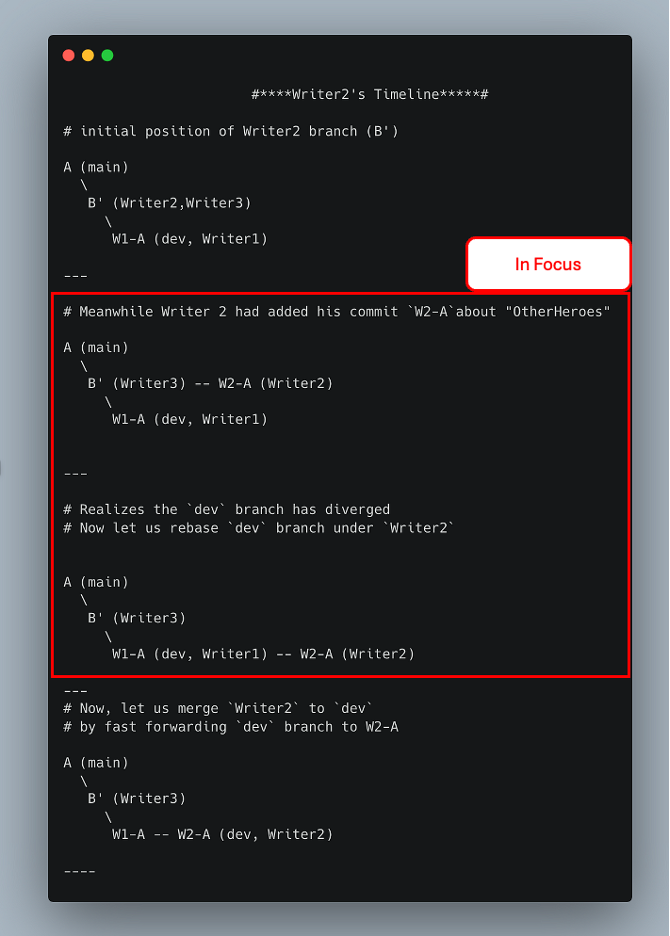
A quick summary of section (4.3)

> While `Writer1` was creating stories about the main heroes, `Writer2` was writing stories about other heroes.

```bash
% git switch Writer2/OtherHeroes
```

- Content for Other Heroes

```
- **Hulk:** Balanced a life of science with his uncontrollable strength to smash enemies.
- **Black Panther:** Protected Wakanda and shared Vibranium with the world.
- **Captain Marvel:** Fought galactic threats and became a cosmic force for good.
- **Ant-Man:** Mastered the Quantum Realm to fight villains on a microscopic scale.
```


- Note that the changes made by Writer1  to `dev` branch are not visible yet.  But `Writer 2` makes his commit


```bash
% vi comic_heroes.md
% cat comic_heroes.md
> In this document, all writers contribute their efforts

## About the Main Heroes

## Other Heroes
- **Hulk:** Balanced a life of science with his uncontrollable strength to smash enemies.
- **Black Panther:** Protected Wakanda and shared Vibranium with the world.
- **Captain Marvel:** Fought galactic threats and became a cosmic force for good.
- **Ant-Man:** Mastered the Quantum Realm to fight villains on a microscopic scale.

## The EndGame
% git add comic_heroes.md && git commit -m "W2-A: add details about Other Heroes"
```

- Progress so far

```
A (main)
  \
   B' (Writer3) -- W2-A (Writer2)
	 \
      W1-A (dev, Writer1)
```

- Writer2 realizes that it is better to "rebase" the new changes in `dev` under `Writer2` , before merging `Writer2` with `dev`

```bash
% git rebase dev/LeadScriptWriter/Context
Successfully rebased and updated refs/heads/Writer2/OtherHeroes.

% git switch dev/LeadScriptWriter/Context 
% git merge Writer2/OtherHeroes --ff-only
Updating 6c21d67..c695edd
Fast-forward
 comic_heroes.md | 4 ++++
 1 file changed, 4 insertions(+)
```

- Progress so far:

```
A (main)
  \
   B' (Writer3)
	 \
      W1-A (dev) -- W2-A (dev, Writer2)
```

### 4.4 Branch 4: `Writer3/EndGame`


A quick summary of section (4.4)


The below is the story developed by `Writer3` for `EndGame`

```
- The Avengers and allies assemble to undo the Snap and defeat Thanos.
- Black Panther leads the Wakandan army into battle.
- Captain Marvel destroys Thanos' fleet.
- Ant-Man helps navigate the Quantum Realm for time heist missions.
- Iron Man sacrifices himself to save the universe.
```

```bash
% git switch Writer3/EndGame
% cat comic_heroes.md
> In this document, all writers contribute their efforts

## About the Main Heroes

## Other Heroes

## The EndGame

% vi comic_heroes.md 
% cat comic_heroes.md
> In this document, all writers contribute their efforts

## About the Main Heroes

## Other Heroes

## The EndGame
- The Avengers and allies assemble to undo the Snap and defeat Thanos.
- Black Panther leads the Wakandan army into battle.
- Captain Marvel destroys Thanos\' fleet.
- Ant-Man helps navigate the Quantum Realm for time heist missions.
- Iron Man sacrifices himself to save the universe.

% git add comic_heroes.md && git commit -m "W3-A: defeat Thanos"

```

- Progress
```
A (main)
  \
   B'  -- W3-A (Writer3)
	 \
      W1-A -- W2-A (dev, Writer2)
```

- Out of enthusiasm, `Writer3` starts to write heroes happens Post End game 


```bash
% vi new_heroes.md
% cat new_heroes.md
- Falcon becomes Captain America
- World gets a new band of Superheroes called Thunderbolts

% git add new_heroes.md && git commit -m "W3-B: PostEndGame"
```

- Progress:
```
A (main)
  \
   B'  -- W3-A -- W3-B (Writer3)
	 \
      W1-A -- W2-A (dev, Writer2)
```


```bash
% git log --oneline --all 
6fdd729 (HEAD -> Writer3/EndGame) W3-B: PostEndGame
858eaed W3-A: defeat Thanos
9515509 (dev/LeadScriptWriter/Context, Writer2/OtherHeroes) W2-A: add details about Other Heroes
25b8db8 (Writer1/MainHeroes) W1-A: add main heroes
4b34c23 B\': set the context story for my team of writers
d033ca6 (main) A: first commit - empty file
```

- Writer3 now talks about "New Captain America"

```
## PostSnap
- Falcon takes over the mantle as Captain America from Steve Rogers who has lived his time in the past
```

```bash
% cat comic_heroes.md
> In this document, all writers contribute their efforts

## About the Main Heroes

## Other Heroes

## The EndGame
- The Avengers and allies assemble to undo the Snap and defeat Thanos.
- Black Panther leads the Wakandan army into battle.
- Captain Marvel destroys Thanos\' fleet.
- Ant-Man helps navigate the Quantum Realm for time heist missions.
- Iron Man sacrifices himself to save the universe.

## PostSnap
- Falcon takes over the mantle as Captain America from Steve Rogers who has lived his time in the past

% git add comic_heroes.md && git commit -m "W3-C: New Captain America" 
```

- The Lead upon reviewing this, wanted to "revert" the "PostEndGame" commit of `W3-B` . He wanted EndGame chapter to not have any End Credit scene.


- Writer3 get back to "reverting" the PostEndGame commit `W3-B'`
```bash
% git log --oneline
7cae9bf (HEAD -> Writer3/EndGame) W3-C: New Captain America
6fdd729 W3-B: PostEndGame
858eaed W3-A: defeat Thanos
4b34c23 B': set the context story for my team of writers
d033ca6 (main) A: first commit - empty file

% git revert 6fdd729             
[Writer3/EndGame 27c1750] W3-B': Revert "W3-B: PostEndGame"
 1 file changed, 2 deletions(-)
 delete mode 100644 new_heroes.md

# Note that `new_heroes.md` is not in the list of files changed since that commit was "reverted" 

% git log --oneline
27c1750 (HEAD -> Writer3/EndGame) W3-B': Revert "W3-B: PostEndGame"
7cae9bf W3-C: New Captain America
6fdd729 W3-B: PostEndGame
858eaed W3-A: defeat Thanos
4b34c23 B': set the context story for my team of writers
d033ca6 (main) A: first commit - empty file
```

- Note that `new_heroes.md` is not in the list of files changed since that commit was "reverted"


- Progress

```
A (main)
  \
   B'  -- W3-A -- W3-B -- W3-C -- W3-B' (Writer3)
	 \
      W1-A -- W2-A (dev, Writer2)
```

- Merge `Writer3` with `dev` branch

```bash
# now let us merge `Wrtier3` branch with `dev` branch
% git switch dev/LeadScriptWriter/Context
% git merge Writer3/EndGame --no-ff
Auto-merging comic_heroes.md
Merge made by the 'ort' strategy.
 comic_heroes.md | 8 ++++++++
 1 file changed, 8 insertions(+)
```


```
A (main)
  \
   B'  -- W3-A -- W3-B -- W3-C -- W3-B'
	 \                             /
      W1-A -- W2-A -- -- -- -- MC (dev, Writer3)
```

- The ‘ort’ strategy refers to the “Optimized Recursive Three-Way Merge” strategy
- A merge commit `MC` was created when combining the `dev` branch and the `Writer3` branch.


### 4.5: Merge `dev` with `main` and `tag`

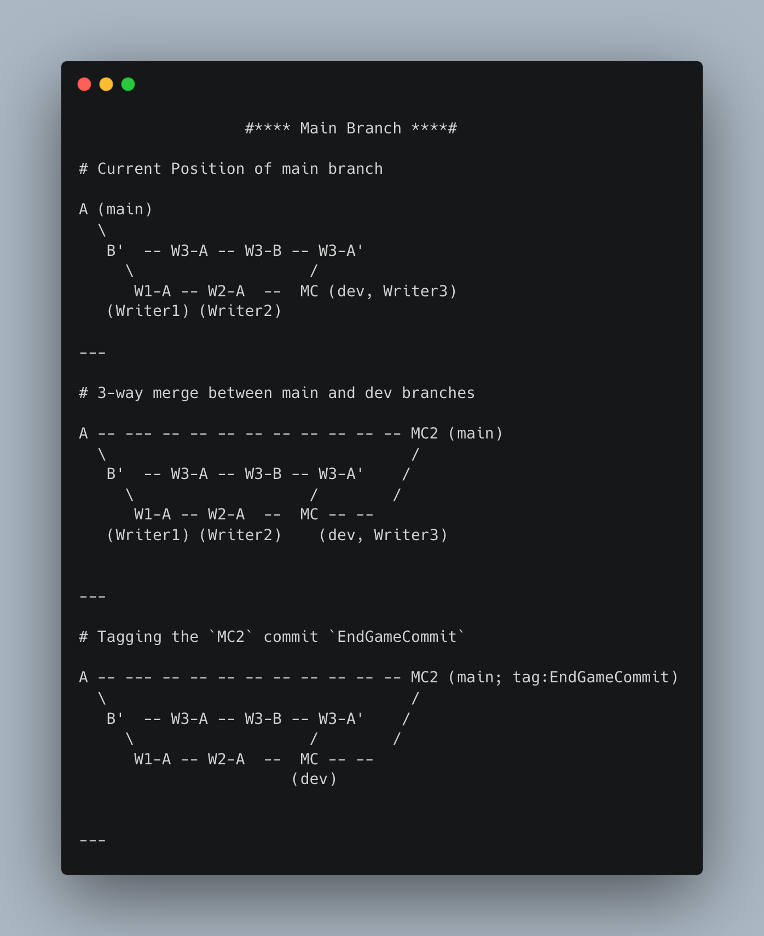

- As per `Git Flow` branching model, we are merging a stable branch like `dev` now to `main`


```bash
% git switch main 
% git merge dev/LeadScriptWriter/Context --no-ff
Merge made by the 'ort' strategy.
 comic_heroes.md | 22 ++++++++++++++++++++++
 1 file changed, 22 insertions(+)
 
% git log --oneline --graph --all
*   1b4235f (HEAD -> main) MC2: Merge branch 'dev/LeadScriptWriter/Context'
|\  
| *   460daed (dev/LeadScriptWriter/Context) MC: Merge branch 'Writer3/EndGame' into dev/LeadScriptWriter/Context
| |\  
| | * 27c1750 (Writer3/EndGame) W3-B': Revert "W3-B: PostEndGame"
| | * 7cae9bf W3-C: New Captain America
| | * 6fdd729 W3-B: PostEndGame
| | * 858eaed W3-A: defeat Thanos
| * | 9515509 (Writer2/OtherHeroes) W2-A: add details about Other Heroes
| * | 25b8db8 (Writer1/MainHeroes) W1-A: add main heroes
| |/  
| * 4b34c23 B': set the context story for my team of writers
|/  
* d033ca6 A: first commit - empty file
```

- From this `main` branch we can tag the commit for future reference 

```bash
% git tag EndGameCommit
% git log --oneline --graph --all
*   1b4235f (HEAD -> main, tag: EndGameCommit) MC2: Merge branch 'dev/LeadScriptWriter/Context'
|\  
| *   460daed (dev/LeadScriptWriter/Context) MC: Merge branch 'Writer3/EndGame' into dev/LeadScriptWriter/Context
| |\  
| | * 27c1750 (Writer3/EndGame) W3-B': Revert "W3-B: PostEndGame"
| | * 7cae9bf W3-C: New Captain America
| | * 6fdd729 W3-B: PostEndGame
| | * 858eaed W3-A: defeat Thanos
| * | 9515509 (Writer2/OtherHeroes) W2-A: add details about Other Heroes
| * | 25b8db8 (Writer1/MainHeroes) W1-A: add main heroes
| |/  
| * 4b34c23 B': set the context story for my team of writers
|/  
* d033ca6 A: first commit - empty file
```

---

### 4.6 Bonus: How do `cherry-pick`, `merge conflicts` work

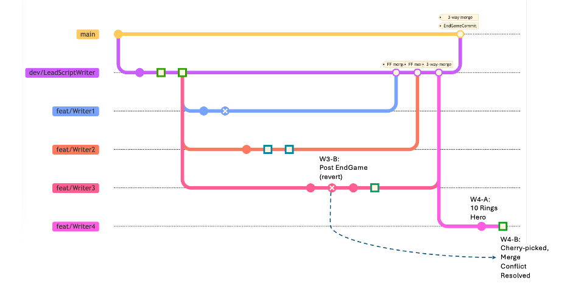


- Now, Writer4 starts to expand the story beyond EndGame.

```bash
% git checkout dev/LeadScriptWriter/Context
% git switch -c Writer4/PostEndGame
% vi new_heroes.md
# write about Legend of the 10 Rings
% cat new_heroes.md
# Post EndGame
- **Shang-Chi and the Legend of the Ten Rings**: Shang-Chi confronts his past and unlocks his true potential while battling the mysterious Ten Rings organization.
- git add new_heroes.md && git commit -m "W4-A: 10 Rings Hero"
```
- Lead tells Writer4 to cherry-pick a commit about `PostEndGame` by Writer3

```bash
% git log --oneline
f2135dc (HEAD -> Writer4/PostEndGame) W4-A: 10 Rings Hero
460daed (dev/LeadScriptWriter/Context) MC: Merge branch 'Writer3/EndGame' into dev/LeadScriptWriter/Context
27c1750 (Writer3/EndGame) W3-B': Revert "W3-B: PostEndGame"
7cae9bf W3-C: New Captain America
6fdd729 W3-B: PostEndGame
858eaed W3-A: defeat Thanos
9515509 (Writer2/OtherHeroes) W2-A: add details about Other Heroes
25b8db8 (Writer1/MainHeroes) W1-A: add main heroes
4b34c23 B': set the context story for my team of writers
d033ca6 A: first commit - empty file

# 6fdd729 W3-B: PostEndGame
% git cherry-pick 6fdd729
Auto-merging new_heroes.md
CONFLICT (add/add): Merge conflict in new_heroes.md
error: could not apply 6fdd729... W3-B: PostEndGame
hint: After resolving the conflicts, mark them with
hint: "git add/rm <pathspec>", then run
hint: "git cherry-pick --continue".
hint: You can instead skip this commit with "git cherry-pick --skip".
hint: To abort and get back to the state before "git cherry-pick",
hint: run "git cherry-pick --abort".

% cat new_heroes.md
<<<<<<< HEAD
# Post EndGame
- **Shang-Chi and the Legend of the Ten Rings**: Shang-Chi confronts his past and unlocks his true potential while battling the mysterious Ten Rings organization.
=======
- Falcon becomes Captain America
- World gets a new band of Superheroes called Thunderbolts
>>>>>>> 6fdd729 (W3-B: PostEndGame)
```

- The changes between `<<<<` and `=====` are from the initial source `Writer4/PostEndGame`
- The changes from `======` and `>>>>>` are from the cherry-picked commit `6fdd729 (W3-B: PostEndGame)`
- Let us resolve it manually

```bash
% vi new_heroes.md
% cat new_heroes.md
# Post EndGame
- **Shang-Chi and the Legend of the Ten Rings**: Shang-Chi confronts his past and unlocks his true potential while battling the mysterious Ten Rings organization.
- Falcon becomes Captain America and fights Red Hulk
- World gets a new band of Superheroes called Thunderbolts
```

- Now, let us continue the steps mentioned in `git cherry-pick <commit>`

```bash
% git add new_heroes.md
% git cherry-pick --continue
[Writer4/PostEndGame e29bae4] W4-B: Merge conflicts and cherry-picked from W3-B: PostEndGame
 Date: Thu Feb 13 22:50:16 2025 +0530
 1 file changed, 2 insertions(+)
```

- Final status

```bash
% git log --oneline --all
e29bae4 (HEAD -> Writer4/PostEndGame) W4-B: Merge conflicts and cherry-picked from W3-B: PostEndGame
f2135dc W4-A: 10 Rings Hero
1b4235f (tag: EndGameCommit, main) MC2: Merge branch 'dev/LeadScriptWriter/Context'
460daed (dev/LeadScriptWriter/Context) MC: Merge branch 'Writer3/EndGame' into dev/LeadScriptWriter/Context
27c1750 (Writer3/EndGame) W3-B': Revert "W3-B: PostEndGame"
7cae9bf W3-C: New Captain America
6fdd729 W3-B: PostEndGame
858eaed W3-A: defeat Thanos
9515509 (Writer2/OtherHeroes) W2-A: add details about Other Heroes
25b8db8 (Writer1/MainHeroes) W1-A: add main heroes
4b34c23 B': set the context story for my team of writers
d033ca6 A: first commit - empty file
```

- You could keep expanding the story and your learnings of the git commands, this way :D

---

## 5. Remote Git Learnings

### 5.1 `Remote` Repositories

- A **local repository** is the Git repository stored on your local computer (whatever we have seen so far). Typical commands- git add, git commit, git log 
- A **remote repository** is a Git repository hosted on a server (e.g., GitHub, GitLab, Bitbucket, or self-hosted). It allows multiple developers to collaborate by pushing and pulling changes. Typical commands- git push, git pull, git fetch 


In this blog, we have seen git merge and git rebase but we have not done git fetch , git pull and git push. 
The following explanation, about push to and pull from an online repo, can hopefully put you in good stead in real-world scenarios. 


- For the sake of the demonstrating push and pull in local laptop, let us setup an alternate directory as a remote

> Underlying foundation: Whether it is Local or Remote, you are working with branches


**How does a `pull` command works?**

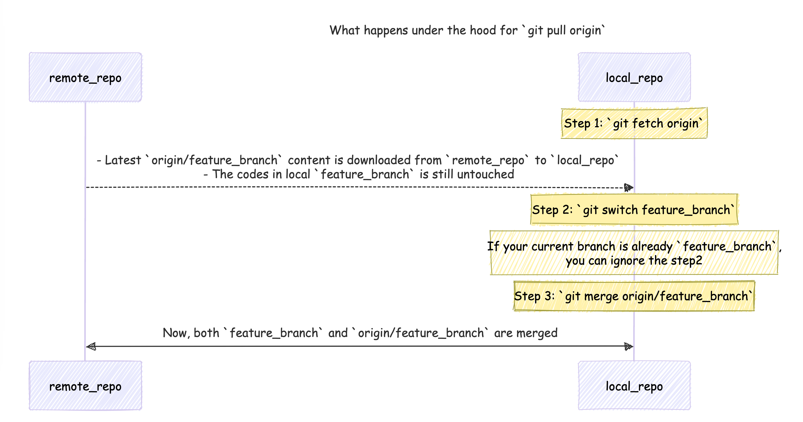

- `git pull origin branch_name` == `git fetch origin branch_name && git switch branch_name && git merge origin/branch_name`


- Also, there are different strategies for `git pull` (essentially different `merge` strategies):
	- `git pull --ff` (fast forward)
	- `git pull --no-ff` and 
	- `git pull --rebase`.
- All of the above different merge strategies had been dealt with in the previous section. 
- Why `git pull --ff-only` is a safe option: [link](https://blog.sffc.xyz/post/185195398930/why-you-should-use-git-pull-ff-only)


**How does a `push` command work?**


- When you do `git push origin branch_name`, the following commands happen:
	- `git reverse-fetch branch_name` (this is a **fictional** command of my own that just indicates the contents of `branch_name` are pushed to remote server)
	- In the remote_server, you would switch to the origin/branch_name `git switch origin/branch_name`
	- In the remote_server, you would merge the new changes from `branch_name` with `origin_branch_name`


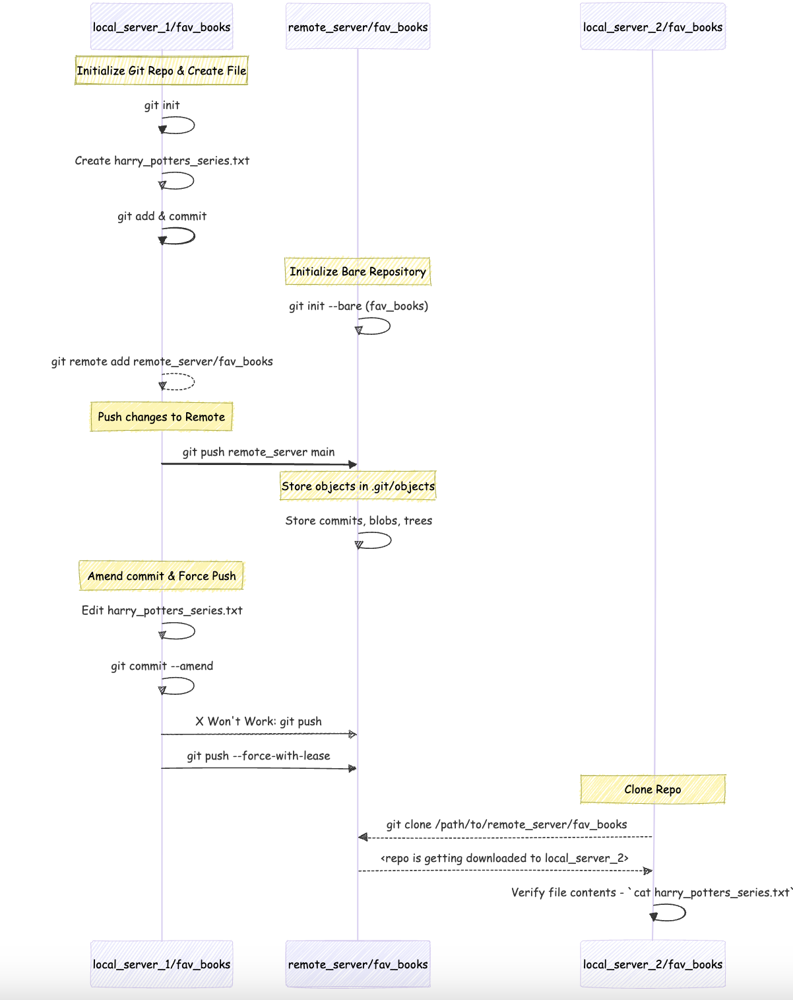

- Putting above learnings to practice. 
- Did I not say `Whether it is Local or Remote, you are working with branches`? Let me prove that in an example below

<br>

```bash
% mkdir -p remote_learnings

# `remote_learnings` 1s an empty directory
remote_learnings % ls

# create 3 sub directories to help in learning `clone`, `push`, `fetch` and `pull` commands
remote_learnings % mkdir -p local_server_1 local_server_2 remote_server


# create a local git repo in `local_server_1` directory
remote_learnings % cd local_server_1
remote_learnings/local_server_1 % mkdir -p fav_books && cd fav_books

# create a file `harry_potters_series.txt ` and list down the names of the books
remote_learnings/local_server_1/fav_books % vi harry_potters_series.txt 

remote_learnings/local_server_1/fav_books % cat harry_potters_series.txt
Harry Potter and the Philospher\'s Stone: The first book in the series 
Harry Potter and the Chamber of Secrets: The second book in the series 
Harry Potter and the Prisoner of Azkaban: The third book in the series 
Harry Potter and the Goblet of Fire: The fourth book in the series 
Harry Potter and the Order of the Phoenix: The fifth book in the series 
Harry Potter and the Half-Blood Prince: The sixth book in the series 
Harry Potter and the Deathly Hallows: The seventh and final book in the series 

remote_learnings/local_server_1/fav_books % git add harry_potters_series.txt && git commit -m "first commit - hp series"

# Status so far
% tree -L 3 /path/to/remote_learnings/
.
├── local_server_1
│   └── fav_books
│       └── harry_potters_series.txt
├── local_server_2
└── remote_server

# creare a "bare" git repo in `remote_server`
remote_learnings/local_server_1/fav_books % cd $PWD/../../remote_server
remote_learnings/remote_server % mkdir -p fav_books
remote_learnings/remote_server/fav_books % git init --bare

# now back to `local_server_1`
remote_learnings/remote_server % cd ../local_server_1/fav_books
# add `remote_server` directory as a remote
remote_learnings/local_server_1/fav_books % git add remote remote_server $PWD/../../remote_server/fav_books

# check if the remote is added properly
remote_learnings/local_server_1/fav_books % cat .git/config
[core]
	repositoryformatversion = 0
	filemode = true
	bare = false
	logallrefupdates = true
	ignorecase = true
	precomposeunicode = true
[remote "remote_server"]
	url = /path/to/remote_learnings/local_server_1/fav_books/../../remote_server/fav_books
	fetch = +refs/heads/*:refs/remotes/remote_server/*
 

# now you can "push" from `local_server_1` to `remote_server`
remote_learnings/local_server_1/fav_books % git push remote_server main 

Enumerating objects: 3, done.
Counting objects: 100% (3/3), done.
Delta compression using up to 8 threads
Compressing objects: 100% (3/3), done.
Writing objects: 100% (3/3), 424 bytes | 424.00 KiB/s, done.
Total 3 (delta 0), reused 0 (delta 0), pack-reused 0
To /path/to/remote_learnings/local_server_1/fav_books/../../remote_server/fav_books
 * [new branch]      main -> main


# OPTIONAL STEPS
# you could go to `remote_server` to check if the files are present
# but remember we created a `bare` remote repo
remote_learnings/local_server_1/fav_books % cd $PWD/../../remote_server/fav_books
remote_learnings/remote_server/fav_books % ls 
HEAD		config		description	hooks		info		objects		refs
remote_learnings/remote_server/fav_books % cd objects 
remote_learnings/remote_server/fav_books/objects % tree -L 3 .                                             
.
├── 7e
│   └── e6ec54038f2ba0dce7966a14cf010b5a994f8f
├── be
│   └── dbfe43f6aef154a2024eb05a91277b1455f727
├── e0
│   └── 30127f29099ccabe62eea5d929efc655149dff
├── info
└── pack


# note how I am opening files using `git cat-file -p`
# and now `7e` and `e6ec54038f2ba0dce7966a14cf010b5a994f8f` are clubbed together

remote_learnings/remote_server/fav_books/objects %  git cat-file -p 7ee6ec54038f2ba0dce7966a14cf010b5a994f8f
Harry Potter and the Philospher\'s Stone: The first book in the series 
Harry Potter and the Chamber of Secrets: The second book in the series 
Harry Potter and the Prisoner of Azkaban: The third book in the series 
Harry Potter and the Goblet of Fire: The fourth book in the series 
Harry Potter and the Order of the Phoenix: The fifth book in the series 
Harry Potter and the Half-Blood Prince: The sixth book in the series 
Harry Potter and the Deathly Hallows: The seventh and final book in the series 

remote_learnings/remote_server/objects % cd ../local_server_1/fav_books
# END OF OPTIONAL STEPS

# Current status
remote_learnings/local_server_1/fav_books % git log --oneline 
bedbfe4 (HEAD -> main, remote_server/main) first commit - hp series
# What if I made a mistake? 
# Shouldn't be `Soceror's Stone` instead of `Philospher's Stone`?
remote_learnings/local_server_1/fav_books % vi harry_potters_series.txt 
remote_learnings/local_server_1/fav_books % head -n 1 harry_potters_series.txt
Harry Potter and the Sorcerer\'s Stone: The first book in the series 

# reviewing the changing before committing
remote_learnings/local_server_1/fav_books % git diff
diff --git a/harry_potters_series.txt b/harry_potters_series.txt
index 7ee6ec5..434f014 100644
--- a/harry_potters_series.txt
+++ b/harry_potters_series.txt
@@ -1,4 +1,4 @@
-Harry Potter and the Philospher's Stone: The first book in the series 
+Harry Potter and the Sorcerer's Stone: The first book in the series 
 Harry Potter and the Chamber of Secrets: The second book in the series 
 Harry Potter and the Prisoner of Azkaban: The third book in the series 
 Harry Potter and the Goblet of Fire: The fourth book in the series 

remote_learnings/local_server_1/fav_books % git commit --amend
remote_learnings/local_server_1/fav_books % git log --oneline --all
cb41287 (HEAD -> main) first commit - hp series
bedbfe4 (remote_server/main) first commit - hp series


# your push will get rejected !
remote_learnings/local_server_1/fav_books % git push remote_server main
To /path/to/remote_learnings/local_server_1/fav_books/../../remote_server/fav_books
 ! [rejected]        main -> main (non-fast-forward)
error: failed to push some refs to '/path/to/remote_learnings/local_server_1/fav_books/../../remote_server/fav_books'
hint: Updates were rejected because the tip of your current branch is behind
hint: its remote counterpart. Integrate the remote changes (e.g.
hint: 'git pull ...') before pushing again.
hint: See the 'Note about fast-forwards' in 'git push --help' for details.

# but you could use `git push --force-with-lease` (a safe alternative)
remote_learnings/local_server_1/fav_books % git push remote_server main --force-with-lease
Enumerating objects: 3, done.
Counting objects: 100% (3/3), done.
Delta compression using up to 8 threads
Compressing objects: 100% (3/3), done.
Writing objects: 100% (3/3), 426 bytes | 426.00 KiB/s, done.
Total 3 (delta 0), reused 0 (delta 0), pack-reused 0
To /path/to/remote_learnings/local_server_1/fav_books/../../remote_server/fav_books
 + bedbfe4...cb41287 main -> main (forced update)


# now let us go to `local_server_2` and clone the repo
remote_learnings/local_server_1/fav_books % cd $PWD/../../local_server_2
remote_learnings/local_server_2 % git clone $PWD/../remote_server/fav_books
Cloning into 'fav_books'...
done.

remote_learnings/local_server_2 % cd fav_books
remote_learnings/local_server_2/fav_books % cat harry_potters_series.txt 
Harry Potter and the Sorcerer\'s Stone: The first book in the series 
Harry Potter and the Chamber of Secrets: The second book in the series 
Harry Potter and the Prisoner of Azkaban: The third book in the series 
Harry Potter and the Goblet of Fire: The fourth book in the series 
Harry Potter and the Order of the Phoenix: The fifth book in the series 
Harry Potter and the Half-Blood Prince: The sixth book in the series 
Harry Potter and the Deathly Hallows: The seventh and final book in the series 
```


**Key Takeaway**:
> If you have understood the underlying foundation of commits and branches, there is not much difference between a remote repo and a local repo. They are just different branches in different locations :). 


---

### 5.3 What is a `Pull/Merge Request`? 

A **Pull Request** (PR) is a feature commonly associated with platforms like GitHub, GitLab, and Bitbucket, rather than being a fundamental aspect of Git itself.

#### Features of Pull Requests

- **Code Review**: Pull requests enable team members to review code changes, provide feedback, and suggest improvements before integration.
- **Discussion**: They serve as a platform for discussion about the proposed changes, allowing for comments on specific lines of code.
- **Integration with CI/CD**: Many platforms integrate pull requests with Continuous Integration/Continuous Deployment (CI/CD) pipelines, automatically running tests on the proposed changes.

---

### 5.3. How to Contribute to Open Source Public Repositories?

> `fork -> clone, edit & push -> pull request`

#### Fork the Original Public Repo (OPR)
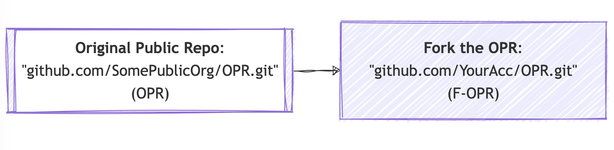

#### Push changes to F-OPR's remote
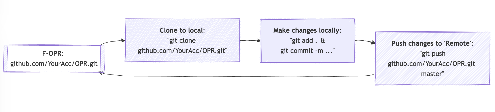

#### Raise a Pull Request
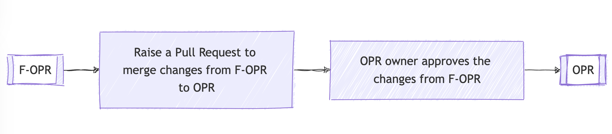


Example: <br>
- **Original Public Repo** (OPR): https://github.com/explosion/spaCy <br>
- **Forked-OPR** (F-OPR): https://github.com/mribbons/spaCy/tree/master <br>
- **Pull Request Page**: https://github.com/explosion/spaCy/pull/13613 <br>
- **A PR Example**: https://github.com/explosion/spaCy/pull/13613/commits/228045464b15de57483926228cb5d045b75998b9 
  - SomePerson is requesting to merge 2 commits into `explosion:master` from his own forked `SomePerson:master`


---

## 6. Conclusion

There are many more git commands that I have not explored here (a few useful ones that come to my mind - `git bisect` , `git worktree`, `git stash pop`, [`git filter-repo`](https://github.com/newren/git-filter-repo/)). 

I believe you could practice all of the above missed commands on your own now, without an iota of fear, by extending the story!

If you feel the above material was a breeze, you could secure the Linux Skill Cred Git certification like me ([my_credly_linux_cert](https://www.credly.com/badges/aa76e1a3-877b-4f39-ba68-f4447bc05d18)). 

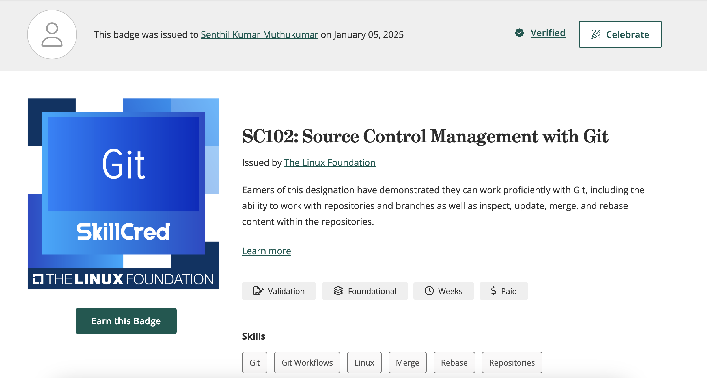

Feeling like you need more practice? <br>Do try this [source](https://gitexercises.fracz.com/) to test your git knowledge further. 
<br>
Did you completely git it? 
Happy Git Committing!

---

## 7. Epilogue

**Are you looking to further your knowledge beyond what I have covered?** 
- Another feature of git that I could not dig deeper into here is [pre-commit hooks](https://www.atlassian.com/git/tutorials/git-hooks) (`.git/hooks`). Precommit hooks can be used to keep the codes & files that enter git clean and in the format we want. 

- After committing your code to an online repository in GitHub, GitLab, or elsewhere, a pipeline can be triggered to build (the environment), test (your code), and finally deploy your application. That pipeline is commonly called Continuous Integration/ Continuous Delivery (CICD). You could learn that [here](https://training.linuxfoundation.org/training/devops-and-sre-fundamentals-implementing-continuous-delivery-lfs261/)


---
