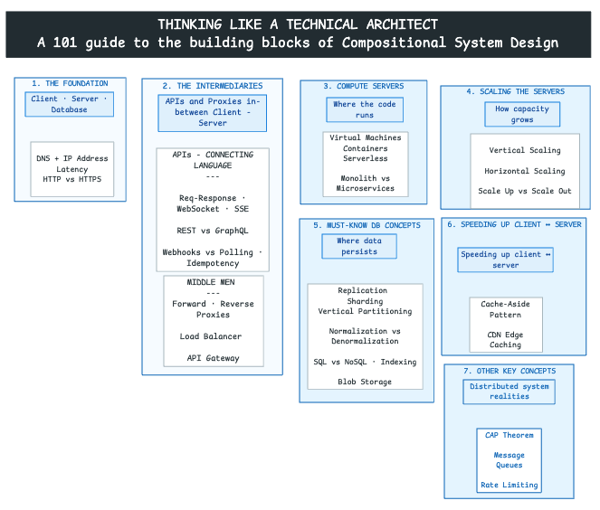
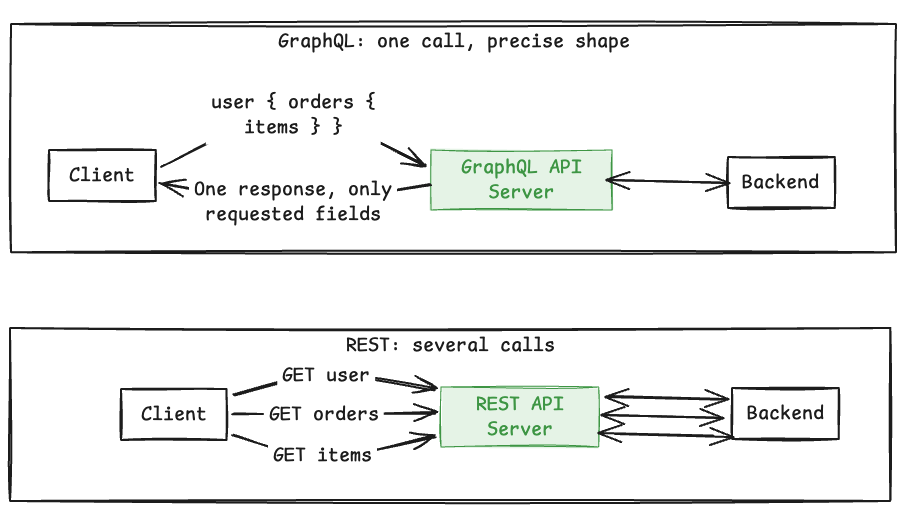
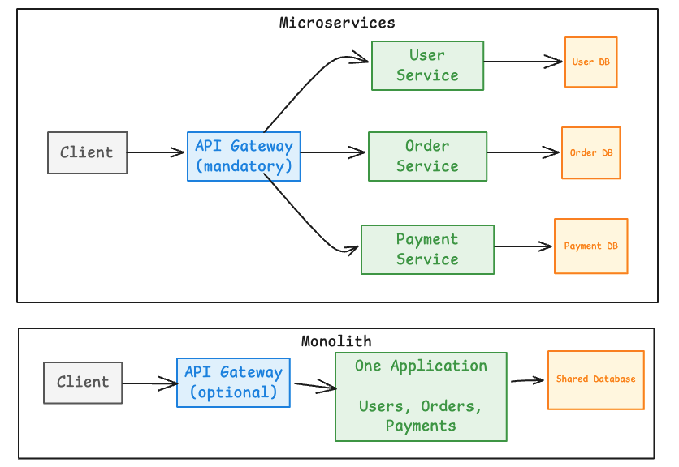
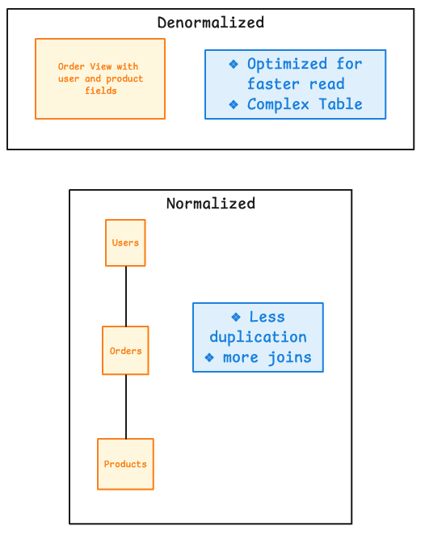

> This is a concise guide to the building blocks behind scalable, reliable systems. The central idea is simple: a large system is composed from smaller patterns or blocks. We build them up here in the order a request actually flows, from client to server to database and back.

This learning blog is a structured consolidation of the learnings from the following sources:

* **30 building blocks** of System Design discussed in the video: ▶️ Watch: [System Design was HARD until I Learned these 30 Concepts](https://www.youtube.com/watch?v=s9Qh9fWeOAk)
* **Companion reading:** [Top 30 System Design Concepts (AlgoMaster)](https://algomaster.io/learn/system-design/top-30-system-design-concepts)
* ▶️ Motivational Watch for Systems Thinking: [Lenny's Podcast featuring CXO of Netflix on - Why Netflix is betting on systems thinkers in the AI era](https://www.youtube.com/watch?v=t0GiTyz4syY)

---



## 📌 The Building Blocks of Compositional System Design - At A Glance

The structure of the blog follows how a request travels through a system:

1. **The Foundation: Client, Server, and Database** — *How a request travels, where it goes, and how it stays secure*
    * 1.1 Client–Server–Database Architecture
    * 1.2 How a Client Finds a Server: DNS and IP Address
    * 1.3 Why Distance Matters: Latency
    * 1.4 Encryption on the Wire (Security in Transit): HTTPS
    * 1.5 Encryption Beyond the Wire: End2End Encryption
    * 1.6 Encryption at Rest: Client-Side Encryption and Server-side Encryption
2. **The Intermediaries Between Client and Server** — *The APIs and proxies that sit in the middle*
    * APIs — *how the client and server talk*
        * 2.1 Standard Request-Response vs WebSocket vs SSE
        * 2.2 API Designs: REST vs GraphQL
        * 2.3 Event Triggers: Push (Webhooks) vs Pull (Polling)
        * 2.4 Idempotency
    * Proxies — *the traffic handlers*
        * 2.5 Want to Hide the Client? Forward Proxy
        * 2.6 Want to Hide the Server? Reverse Proxy
        * 2.7 Want to Distribute Traffic? Load Balancer
        * 2.8 The Traffic Cop at the Edge: API Gateway
3. **Compute: The "Servers" That Run Your Code** — *Where and how application code runs*
    * 3.1 Virtual Machines
    * 3.2 Containers
    * 3.3 Serverless
    * 3.4 Monolith vs Microservices
4. **Scaling the Servers** — *How to handle more load*
    * 4.1 Vertical Scaling: For Active-Passive Systems
    * 4.2 Horizontal Scaling: For Active-Active Systems
    * 4.3 Should Systems Scale UP First, Then Scale OUT?
5. **The Must-Know Database Concepts** — *Where the application data persists*
    * 5.1 Replication (Primary + Read Replicas)
    * 5.2 Sharding (Horizontal Partitioning)
    * 5.3 Vertical Partitioning
    * 5.4 Normalization vs Denormalization
    * 5.5 SQL vs NoSQL DB Decisioning
    * 5.6 Database Indexing
    * 5.7 Blob Storage
6. **Speeding Up Communication Between Client and Server** — *Performance and content distribution*
    * 6.1 Cache-Aside Pattern
    * 6.2 Edge Caching in a Content Delivery Network
7. **Other Key Concepts** — *Distributed system realities*
    * 7.1 CAP Theorem
    * 7.2 Message Queues
    * 7.3 Rate Limiting

---

## 1. The Foundation: Client, Server, and Database

*How a request travels and where it goes.*

Every system starts with the same shape: a **client** asks, a **server** does the work, and a **database** remembers. Get this triangle right and everything else in this guide is just a refinement of it.

### 1.1 Client–Server–Database Architecture

**What it is:** A client initiates a request, a server processes it (applying business logic), and a database persists or returns the data. The client never touches the database directly; it always goes through the server.

**How is it used?** Browsers, mobile apps, and other services use this model to access backend capabilities without knowing the internal logic or storage.

```{mermaid}
%%{init: {'theme': 'base', 'themeVariables': {'primaryColor': '#E3F2FD', 'primaryBorderColor': '#1E88E5', 'lineColor': '#424242', 'fontSize': '14px'}}}%%
sequenceDiagram
    participant C as Client
    participant S as Server
    participant DB as Database
    C->>S: HTTP request
    S->>DB: Read or write
    DB-->>S: Result
    S-->>C: HTTP response
```

**When to use:** Use it for nearly every web, mobile, or service-to-service application. It is the default starting point for any design.

### 1.2 How a Client Finds a Server: DNS and IP Address

**What it is:** An IP address identifies a network destination. DNS translates a human-readable domain name into the IP address a client can contact.

**How is it used?** The client resolves a domain through DNS, then sends its request to the returned IP address and target port.

```{mermaid}
%%{init: {'theme': 'base', 'themeVariables': {'primaryColor': '#E3F2FD', 'primaryBorderColor': '#1E88E5', 'lineColor': '#424242', 'fontSize': '14px'}}}%%
flowchart LR
    U[User]:::client --> B[Browser]:::client
    B -->|Resolve example.com| DNS[DNS Resolver]:::control
    DNS -->|Return server IP| B
    B -->|Request to IP and port| S[Server]:::compute
    S -->|Response| B

    classDef client fill:#F5F5F5,stroke:#616161,stroke-width:1px;
    classDef control fill:#E3F2FD,stroke:#1E88E5,stroke-width:1px;
    classDef compute fill:#E8F5E9,stroke:#43A047,stroke-width:1px;
```

**When to use:** DNS and IP addressing underpin every networked system, including public applications, private networks, service discovery, and failover routing.

### 1.3 Why Distance Matters: Latency

**What it is:** Latency is the time taken for data to travel, wait, be processed, and return. Physical distance and network hops contribute directly to it.

**How is it used?** Architects reduce latency by placing compute, caches, and content closer to users and by minimizing unnecessary network calls.

```{mermaid}
%%{init: {'theme': 'base', 'themeVariables': {'primaryColor': '#E3F2FD', 'primaryBorderColor': '#1E88E5', 'lineColor': '#424242', 'fontSize': '14px'}}}%%
flowchart LR
    U[User in India]:::client -->|Longer round trip| R1[Remote Region]:::compute
    U -->|Shorter round trip| R2[Nearby Region or Edge]:::compute

    classDef client fill:#F5F5F5,stroke:#616161,stroke-width:1px;
    classDef compute fill:#E8F5E9,stroke:#43A047,stroke-width:1px;
```

**When to use:** Treat latency as a key design input for interactive, real-time, geographically distributed, or dependency-heavy systems.

### 1.4 Encryption on the Wire (Security in Transit): HTTPS

**What it is:** HTTP carries web requests and responses in plain text. HTTPS wraps HTTP in a TLS-encrypted tunnel, adding confidentiality, server authentication, and integrity while data travels across the network.

**How is it used?** A TLS handshake sets up encryption once, then all traffic on that connection is protected from intermediaries.

```{mermaid}
%%{init: {'theme': 'base', 'themeVariables': {'primaryColor': '#E3F2FD', 'primaryBorderColor': '#1E88E5', 'lineColor': '#424242', 'fontSize': '14px'}}}%%
flowchart TD
    C1[Client]:::client -->|HTTP: readable in transit| S1[Server]:::compute
    C2[Client]:::client -->|HTTPS: TLS-encrypted| S2[Server]:::compute
    A[Network Observer]:::risk -.->|Can inspect plaintext| C1
    A -.->|Cannot read encrypted payload| C2

    classDef client fill:#F5F5F5,stroke:#616161,stroke-width:1px;
    classDef compute fill:#E8F5E9,stroke:#43A047,stroke-width:1px;
    classDef risk fill:#FFEBEE,stroke:#E53935,stroke-width:1px;
```

**When to use:** Use HTTPS for all production web and API communication, including internal service traffic where confidentiality or authenticity matters.

### 1.5 Encryption Beyond the Wire: End2End Encryption

**What it is:** End-to-end encryption (E2EE) encrypts a message on the sender's device with a key only the recipient can use, so it stays encrypted the entire way and even the server that relays it only ever sees ciphertext.

**How is it used?** The sender encrypts before sending; the message travels (over HTTPS) as ciphertext through the server, which stores and forwards it without being able to read it; the recipient decrypts on their device.

```{mermaid}
%%{init: {'theme': 'base', 'themeVariables': {'primaryColor': '#E3F2FD', 'primaryBorderColor': '#1E88E5', 'lineColor': '#424242', 'fontSize': '14px'}}}%%
flowchart LR
    A[Sender<br/>encrypts with recipient key]:::secure -->|Ciphertext over HTTPS| S[Server<br/>stores and forwards<br/>cannot read content]:::control
    S -->|Ciphertext over HTTPS| B[Recipient<br/>decrypts on device]:::secure

    classDef control fill:#E3F2FD,stroke:#1E88E5,stroke-width:1px;
    classDef secure fill:#F3E5F5,stroke:#8E24AA,stroke-width:1px;
```

::: {.callout-note} **HTTPS and E2EE are not the same thing.** HTTPS secures each _hop_ (client ↔ server), but the server can still read the plaintext. E2EE secures the _payload_ end to end, so the server only handles ciphertext. Systems like WhatsApp and Signal use both together: HTTPS for transport, E2EE for message content. :::

**When to use:** Use E2EE when message content must remain private from everyone in the middle, including the service operator, such as private messaging, secure calls, or sensitive document exchange. Use HTTPS alone when protecting data in transit is enough and the server legitimately needs to read the payload.

**An eCommerce Checkout**: 
::: {.callout-note} **A good example where HTTPS alone is needed and not E2EE**: **An e-commerce checkout**. A typical checkout in an e-commerce site has payment card details, recipient address and other order details. This CANNOT be E2E encrypted. The server needs to read the intended recipient and his address. Here, HTTPS protects the payload during transit but let's server decrypt and understand it :::

```{mermaid}
%%{init: {'theme': 'base', 'themeVariables': {'primaryColor': '#E3F2FD', 'primaryBorderColor': '#1E88E5', 'lineColor': '#424242', 'fontSize': '14px'}}}%%
flowchart LR
    U[Shopper<br/>submits order]:::client -->|HTTPS: encrypted in transit| S[E-commerce Server<br/>reads address, cart, payment<br/>to process the order]:::compute
    S --> DB[(Order Database)]:::data

    classDef client fill:#F5F5F5,stroke:#616161,stroke-width:1px;
    classDef compute fill:#E8F5E9,stroke:#43A047,stroke-width:1px;
    classDef data fill:#FFF8E1,stroke:#FB8C00,stroke-width:1px;
```

### 1.6 Encryption at Rest

**What it is:** Encryption at rest protects data while it is **stored** — on disk, in a database, in blob storage, or in backups. Even if someone steals the physical drive or a raw database file, the contents are unreadable without the key. (This is different from 1.4 and 1.5, which protect data _in transit_.)

**How is it used?** Data is encrypted before it is written to storage and decrypted when read back. The key question is **who does the encrypting and holds the keys** — the server, or the client. That split gives us the two variants below.

```{mermaid}
%%{init: {'theme': 'base', 'themeVariables': {'primaryColor': '#E3F2FD', 'primaryBorderColor': '#1E88E5', 'lineColor': '#424242', 'fontSize': '14px'}}}%%
flowchart LR
    D[Data to store]:::compute --> ENC
    ENC --> DISK[(Stored as ciphertext<br/>in<br/>disk / DB / backups)]:::data

    classDef compute fill:#E8F5E9,stroke:#43A047,stroke-width:1px;
    classDef ENC fill:#E3F2FD,stroke:#1E88E5,stroke-width:1px;
    classDef data fill:#FFF8E1,stroke:#FB8C00,stroke-width:1px;
```

#### Server-Side Encryption (the server holds the keys)

The client sends plaintext (over HTTPS); the **server or storage service** encrypts it before writing and decrypts it on read. Convenient and common, but the server _can_ read the data.

```{mermaid}
%%{init: {'theme': 'base', 'themeVariables': {'primaryColor': '#E3F2FD', 'primaryBorderColor': '#1E88E5', 'lineColor': '#424242', 'fontSize': '14px'}}}%%
flowchart LR
    C::client -->|Plaintext over HTTPS| S[Server / Storage Service<br/>encrypts + holds keys]:::control
    S --> D[(Encrypted at rest)]:::data

    classDef client fill:#F5F5F5,stroke:#616161,stroke-width:1px;
    classDef control fill:#E3F2FD,stroke:#1E88E5,stroke-width:1px;
    classDef data fill:#FFF8E1,stroke:#FB8C00,stroke-width:1px;
```

#### Client-Side Encryption (the client holds the keys)

The **client** encrypts the data _before_ sending it, so the server only ever stores ciphertext and cannot read it. Stronger privacy, but the client manages the keys.

```{mermaid}
%%{init: {'theme': 'base', 'themeVariables': {'primaryColor': '#E3F2FD', 'primaryBorderColor': '#1E88E5', 'lineColor': '#424242', 'fontSize': '14px'}}}%%
flowchart LR
    C[Client<br/>encrypts + holds keys]:::secure -->|Ciphertext over HTTPS| S[Server / Storage Service<br/>cannot read]:::control
    S --> D[(Encrypted at rest)]:::data

    classDef secure fill:#F3E5F5,stroke:#8E24AA,stroke-width:1px;
    classDef control fill:#E3F2FD,stroke:#1E88E5,stroke-width:1px;
    classDef data fill:#FFF8E1,stroke:#FB8C00,stroke-width:1px;
```

::: {.callout-note} **Quick placement of all the "encryption" terms in this section:**

- **1.4 HTTPS** → protects data _in transit_ (each hop); server can read it.
- **1.5 E2EE** → protects data _in transit_ end to end; server _cannot_ read it.
- **1.6 Encryption at rest** → protects _stored_ data. **Server-side encryption (SSE)** = server holds keys and can read; **client-side encryption (CSE)** = client holds keys, server cannot read. 

SSE is the default for almost everything; client-side encryption is for zero-trust situations where the storage provider must never see your plaintext (password vaults, regulated data):::


---

## 2. The Intermediaries Between Client and Server

*The APIs and proxies that sit in the middle.*

Once a client can reach a server, two questions follow. First, **how do they actually talk** — the API pattern. Second, **who sits in between them** to route, protect, and distribute that traffic — the proxies. This section covers both, in that order.

---

### APIs: How the Client and Server Talk

### 2.1 Standard Request-Response vs WebSocket vs SSE

**What it is:** Three communication models that differ on two axes 

* **who can initiate** a message, and 
* **how long the connection stays open**.

**How is it used?** Choose based on whether the server needs to push data, whether messaging must be two-way, and whether the connection should stay open.

#### Standard Request-Response

The client asks, the server answers, the connection closes. Every new piece of data needs a new request. This powers most web pages and REST APIs.

```{mermaid}
%%{init: {'theme': 'base', 'themeVariables': {'primaryColor': '#E3F2FD', 'primaryBorderColor': '#1E88E5', 'lineColor': '#424242', 'fontSize': '14px'}}}%%
sequenceDiagram
    participant C as Client
    participant S as Server
    C->>S: HTTP request
    S-->>C: HTTP response
    Note over C,S: A new request is needed for new data
```

#### WebSocket

A single, persistent, **two-way** connection. Once established, either side can send a message at any time without a new request.

```{mermaid}
%%{init: {'theme': 'base', 'themeVariables': {'primaryColor': '#E3F2FD', 'primaryBorderColor': '#1E88E5', 'lineColor': '#424242', 'fontSize': '14px'}}}%%
sequenceDiagram
    participant C as Client
    participant S as Server
    C->>S: HTTP upgrade request
    S-->>C: 101 Switching Protocols
    Note over C,S: Persistent bidirectional connection
    C->>S: Client message
    S-->>C: Server message
```

::: {.callout-tip}
**Example:** Chat systems, multiplayer games, and collaborative editors (like a shared document) rely on WebSockets, because both the user and the server need to push updates instantly.
:::

#### Interesting Note: How Do Millions of Live WebSocket Connections Actually Work for Whatsapp?

_(best placed as a callout under 2.1 WebSocket, where the WebSocket example already appears)_

::: {.callout-tip} **How does WhatsApp route a message across millions of open connections?**

A WebSocket is a _persistent_ connection, so at any moment WhatsApp is holding hundreds of millions of them, spread across a large fleet of chat servers. Each server physically holds only the connections for the users assigned to it.

That creates one hard problem: when User A (connected to Server 1) messages User B, the system must know **which server currently holds B's live connection.**

The answer is a **connection (session) registry** — a fast, shared, in-memory lookup of `user → server`. The flow is:

```{mermaid}
%%{init: {'theme': 'base', 'themeVariables': {'primaryColor': '#E3F2FD', 'primaryBorderColor': '#1E88E5', 'lineColor': '#424242', 'fontSize': '14px'}}}%%
flowchart LR
    CS1[Chat Server 1<br/>holds User A]:::compute -->|Where is User B?| REG[(Connection Registry<br/>user → server)]:::special
    REG -->|B is on Server 2| CS1
    CS1 -->|Route message| CS2[Chat Server 2<br/>holds User B]:::compute
    CS2 --> B[Phone B]:::client

    classDef client fill:#F5F5F5,stroke:#616161,stroke-width:1px;
    classDef compute fill:#E8F5E9,stroke:#43A047,stroke-width:1px;
    classDef special fill:#F3E5F5,stroke:#8E24AA,stroke-width:1px;
```

This registry is what lets a fleet of stateful connection servers behave like one system.

#### Server-Sent Events (SSE)

An **extension of the standard request-response model**: the client makes one ordinary HTTP request, but the server keeps the response open and streams events over it. Traffic flows **one way only**, server to client, and the browser auto-reconnects.

```{mermaid}
%%{init: {'theme': 'base', 'themeVariables': {'primaryColor': '#E3F2FD', 'primaryBorderColor': '#1E88E5', 'lineColor': '#424242', 'fontSize': '14px'}}}%%
sequenceDiagram
    participant C as Client
    participant S as Server
    C->>S: GET stream (one normal HTTP request)
    S-->>C: Event stream remains open
    S-->>C: Event 1
    S-->>C: Event 2
    Note over C,S: Persistent one-way server push
```

::: {.callout-tip}
**Example:** Live notifications, stock tickers, and "generating..." progress updates suit SSE, because the server pushes but the client rarely needs to reply.
:::

**When to use:** Use request-response for ordinary APIs, WebSocket for continuous two-way interaction (chat, gaming), and SSE for HTTP-native one-way server feeds (notifications, live progress).

### 2.2 API Designs: REST vs GraphQL

**What it is:** These are two ways to design the request-response API itself. REST exposes resources through multiple HTTP endpoints. GraphQL exposes a single typed query endpoint through which clients request the exact response shape they want.

**How is it used?** REST models operations around resources and HTTP semantics, and may need several calls to assemble one view. GraphQL resolves client-selected fields, including related data, in one query.



**When to use:** Use REST for clear resource-oriented APIs and straightforward HTTP behavior. Use GraphQL when clients need varied, connected, or precisely shaped data.

::: {.callout-note}
**An example system where GraphQL is used: Facebook and Instagram.** A feed screen needs deeply nested, connected data (posts → author → comments), but a mobile screen should fetch only what it can display.
:::

```
query {
  feed {
    posts {
      author {
        name
        avatar
      }
      content
      comments(first: 3) {
        text
      }
    }
  }
}
```

### 2.3 Event Triggers: Push (Webhooks) vs Pull (Polling)

**What it is:** Two ways for one side to learn that "something happened." Polling repeatedly asks whether something changed. A webhook sends an HTTP callback when an event occurs.

**How is it used?** Polling is scheduled by the consumer. Webhook delivery is initiated by the event producer and normally includes retries and duplicate protection.

```{mermaid}
%%{init: {'theme': 'base', 'themeVariables': {'primaryColor': '#E3F2FD', 'primaryBorderColor': '#1E88E5', 'lineColor': '#424242', 'fontSize': '14px'}}}%%
sequenceDiagram
    participant C as Consumer
    participant P as Provider
    rect rgb(245, 245, 245)
        Note over C,P: Polling
        C->>P: Anything new?
        P-->>C: No
        C->>P: Anything new?
        P-->>C: New event
    end
    rect rgb(227, 242, 253)
        Note over C,P: Webhook
        P->>C: POST event to callback URL
        C-->>P: 200 OK
    end
```

**When to use:** Use polling when the provider cannot call back or the consumer controls timing. Use webhooks for efficient, near-real-time event notification between reachable services (payments, CI/CD).

### 2.4 Idempotency

**What it is:** An operation is idempotent when repeating it has the same intended effect as performing it once.

**How is it used?** A caller sends a unique idempotency key. The server stores the first result and returns it for retries instead of applying the side effect again.

```{mermaid}
%%{init: {'theme': 'base', 'themeVariables': {'primaryColor': '#E3F2FD', 'primaryBorderColor': '#1E88E5', 'lineColor': '#424242', 'fontSize': '14px'}}}%%
sequenceDiagram
    participant C as Client
    participant S as Server
    participant K as Key Store
    C->>S: Create payment, key 101
    S->>K: Check key 101
    K-->>S: Not found
    S->>K: Store key and result
    S-->>C: Payment result
    C->>S: Retry with key 101
    S->>K: Check key 101
    K-->>S: Existing result
    S-->>C: Same result, no duplicate charge
```

**When to use:** Use it for payments, order creation, webhook handling, queue consumers, and any state-changing operation that may be retried.

---

### Proxies: The Traffic Handlers

Now that the client and server can talk, we place intermediaries between them to route, protect, and distribute that traffic.

### 2.5 Want to Hide the Client? Forward Proxy

**What it is:** A forward proxy acts on behalf of clients. Destination servers see the proxy rather than each original client.

**How is it used?** Organizations route outbound traffic through it for access control, filtering, auditing, caching, or controlled internet access.

```{mermaid}
%%{init: {'theme': 'base', 'themeVariables': {'primaryColor': '#E3F2FD', 'primaryBorderColor': '#1E88E5', 'lineColor': '#424242', 'fontSize': '14px'}}}%%
flowchart LR
    C[Client]:::client -->|Outbound request| P[Forward Proxy]:::control
    P -->|Request on client's behalf| I[Internet Service]:::compute
    I -->|Response| P --> C

    classDef client fill:#F5F5F5,stroke:#616161,stroke-width:1px;
    classDef control fill:#E3F2FD,stroke:#1E88E5,stroke-width:1px;
    classDef compute fill:#E8F5E9,stroke:#43A047,stroke-width:1px;
```

**When to use:** Use it when outbound client traffic needs centralized privacy, policy enforcement, inspection, or routing.

::: {.callout-note}
A VPN serves a related client-side intermediary role, but it is not strictly a forward proxy because it creates an encrypted network tunnel rather than proxying application requests.
:::

### 2.6 Want to Hide the Server? Reverse Proxy

**What it is:** A reverse proxy is the public-facing intermediary for one or more backend servers. Clients interact with the proxy instead of knowing server details.

**How is it used?** It forwards inbound requests while centralizing TLS termination, caching, compression, routing, and other edge concerns.

```{mermaid}
%%{init: {'theme': 'base', 'themeVariables': {'primaryColor': '#E3F2FD', 'primaryBorderColor': '#1E88E5', 'lineColor': '#424242', 'fontSize': '14px'}}}%%
flowchart LR
    C[Client]:::client --> RP[Reverse Proxy]:::control
    RP --> S1[Backend A]:::compute
    RP --> S2[Backend B]:::compute

    classDef client fill:#F5F5F5,stroke:#616161,stroke-width:1px;
    classDef control fill:#E3F2FD,stroke:#1E88E5,stroke-width:1px;
    classDef compute fill:#E8F5E9,stroke:#43A047,stroke-width:1px;
```

**When to use:** Use it to expose backend applications through one controlled, secure, and stable endpoint. Popular examples include Nginx, HAProxy, and Envoy.

### 2.7 Want to Distribute Traffic? Load Balancer

**What it is:** A load balancer distributes incoming traffic across healthy server instances so no single instance handles all requests.

**How is it used?** It performs health checks and routes requests using rules such as round robin, least connections, weights, or request attributes.

```{mermaid}
%%{init: {'theme': 'base', 'themeVariables': {'primaryColor': '#E3F2FD', 'primaryBorderColor': '#1E88E5', 'lineColor': '#424242', 'fontSize': '14px'}}}%%
flowchart TD
    U[Users]:::client --> LB[Load Balancer]:::control
    LB --> S1[Server 1]:::compute
    LB --> S2[Server 2]:::compute
    LB --> S3[Server 3]:::compute
    S2 -. Health check fails .-> LB
    LB -. Stop routing .-> S2

    classDef client fill:#F5F5F5,stroke:#616161,stroke-width:1px;
    classDef control fill:#E3F2FD,stroke:#1E88E5,stroke-width:1px;
    classDef compute fill:#E8F5E9,stroke:#43A047,stroke-width:1px;
```

::: {.callout-note}
A Layer 7 load balancer is a specialized reverse proxy focused on distributing requests across healthy backend instances; not every reverse proxy performs load balancing, and not every load balancer operates as a reverse proxy.
:::

**When to use:** Use it whenever multiple active instances share traffic or availability must survive an instance failure.

#### Layer 4 Load Balancer (NLB) vs Layer 7 Load Balancer (ALB)

The simplest distinction: **Layer 4 routes the connection; Layer 7 understands the request.**

**Layer 4: "Where should this connection go?"** It looks only at network-level information:

* Source/destination IP address
* Port
* Protocol such as TCP or UDP

```{mermaid}
flowchart LR
    C[Client] -->|IP + Port| L4[Layer 4 Load Balancer]
    L4 --> S1[Server 1]
    L4 --> S2[Server 2]
```

Example: Traffic arriving on port 443 is distributed across 2 servers.

**Layer 7: "What is this request asking for?"** It understands application-level information, especially HTTP:

* URL path, such as /orders or /images
* Hostname
* HTTP headers
* Cookies
* Request method, such as GET or POST

It can route different requests to different backend services.

```{mermaid}
flowchart LR
    C[Client] --> L7[Layer 7 Load Balancer]
    L7 -->|/users| U[User Service]
    L7 -->|/orders| O[Order Service]
    L7 -->|/images| I[Image Service]
```

Example: /orders goes to the Order Service, while /images goes to the Image Service.

::: {.callout-tip}
**Analogy**

* Layer 4 LB: *A building security guard checks the address and entrance, then directs you to an available lift without opening your letter.*
* Layer 7 LB: *A receptionist reads the purpose of your visit and sends you to the correct department.*

In AWS terms, a Network Load Balancer (NLB) is Layer 4 and an Application Load Balancer (ALB) is Layer 7.
:::

### 2.8 The Traffic Cop at the Edge: API Gateway

**What it is:** An API gateway is the single front door to backend APIs. It combines reverse-proxy routing with API-specific controls.

**How is it used?** It routes requests to services and centralizes cross-cutting concerns such as authentication, authorization, rate limiting, observability, and protocol transformation.

```{mermaid}
%%{init: {'theme': 'base', 'themeVariables': {'primaryColor': '#E3F2FD', 'primaryBorderColor': '#1E88E5', 'lineColor': '#424242', 'fontSize': '14px'}}}%%
flowchart TD
    C[Web or Mobile Client]:::client --> G[API Gateway]:::control
    G --> U[User Service]:::compute
    G --> O[Order Service]:::compute
    G --> P[Payment Service]:::compute
    G -.-> A[Auth and Authorization]:::control
    G -.-> R[Rate Limiting]:::control
    G -.-> L[Logging and Tracing]:::control

    classDef client fill:#F5F5F5,stroke:#616161,stroke-width:1px;
    classDef control fill:#E3F2FD,stroke:#1E88E5,stroke-width:1px;
    classDef compute fill:#E8F5E9,stroke:#43A047,stroke-width:1px;
```

**When to use:** Use it when multiple APIs need one governed entry point, especially in microservice or multi-client architectures.

---

## 3. Compute: The "Servers" That Run Your Code

*Where and how application code runs.*

We have said "server" many times. But what is a server, really? It is just somewhere your code runs. You have three broad choices, trading **control** for **less operational overhead**, and one big decision about **how you package the application** (monolith vs microservices).

### 3.1 Virtual Machines

**What it is:** A virtual machine emulates a complete computer, including virtual hardware and its own operating system, running on top of a hypervisor.

**How is it used?** Applications run inside isolated operating-system environments. You control the OS, runtime, and application, and you manage patching and monitoring.

```{mermaid}
%%{init: {'theme': 'base', 'themeVariables': {'primaryColor': '#E3F2FD', 'primaryBorderColor': '#1E88E5', 'lineColor': '#424242', 'fontSize': '14px'}}}%%
flowchart TD
    H[Physical Host]:::compute --> HV[Hypervisor]:::control
    HV --> VM1[VM 1<br/>OS + Application]:::compute
    HV --> VM2[VM 2<br/>OS + Application]:::compute

    classDef control fill:#E3F2FD,stroke:#1E88E5,stroke-width:1px;
    classDef compute fill:#E8F5E9,stroke:#43A047,stroke-width:1px;
```

**When to use:** Use VMs when applications need strong isolation, full OS control, legacy compatibility, or specialized runtime configuration.

### 3.2 Containers

**What it is:** A container packages application code and its dependencies together, while sharing the host operating-system kernel. This makes it lighter and faster to start than a VM.

**How is it used?** A container image runs consistently across environments, while a container platform (such as Kubernetes) handles deployment, scaling, networking, and recovery.

```{mermaid}
%%{init: {'theme': 'base', 'themeVariables': {'primaryColor': '#E3F2FD', 'primaryBorderColor': '#1E88E5', 'lineColor': '#424242', 'fontSize': '14px'}}}%%
flowchart TD
    H[Host Operating System]:::compute --> CR[Container Runtime]:::control
    CR --> C1[Container<br/>App + Dependencies]:::compute
    CR --> C2[Container<br/>App + Dependencies]:::compute
    CR --> C3[Container<br/>App + Dependencies]:::compute

    classDef control fill:#E3F2FD,stroke:#1E88E5,stroke-width:1px;
    classDef compute fill:#E8F5E9,stroke:#43A047,stroke-width:1px;
```

**When to use:** Use containers for portable packaging, microservices, repeatable deployments, and independently scalable services.

### 3.3 Serverless

**What it is:** A managed execution model where the platform provisions and scales the runtime for you. You provide only the code or packaged function; there is no server to manage.

**How is it used?** An event or request triggers your code; the platform allocates capacity, runs it, and scales it up or down (even to zero) based on demand. You pay for what you use.

```{mermaid}
%%{init: {'theme': 'base', 'themeVariables': {'primaryColor': '#E3F2FD', 'primaryBorderColor': '#1E88E5', 'lineColor': '#424242', 'fontSize': '14px'}}}%%
flowchart LR
    E[Event or Request]:::client --> P[Managed Runtime]:::control
    P --> F[Application Code]:::compute
    F --> R[Response or Side Effect]:::client

    classDef client fill:#F5F5F5,stroke:#616161,stroke-width:1px;
    classDef control fill:#E3F2FD,stroke:#1E88E5,stroke-width:1px;
    classDef compute fill:#E8F5E9,stroke:#43A047,stroke-width:1px;
```

**When to use:** Use serverless for event-driven processing, APIs, scheduled jobs, automation, and variable or bursty workloads.

::: {.callout-tip}
**The control vs abstraction spectrum:** VMs give the most runtime control, containers package the application consistently, and serverless offers the greatest infrastructure abstraction.

```{mermaid}
flowchart LR
    VM["Virtual Machine<br/>Manage OS + Runtime + App"] -->|Less to manage| C["Container<br/>Manage Runtime + App"]
    C -->|Less to manage| S["Serverless<br/>Manage App Code only"]
```
:::

### 3.4 Monolith vs Microservices

**What it is:** Two ways to organize the code that runs on your compute. A monolith packages all capabilities into one deployable unit. Microservices split capabilities into independently deployed services, each commonly owning its own data.

**How is it used?** A monolith reduces distributed-system overhead. Microservices allow independent deployment and scaling but introduce network, observability, and data-consistency complexity.



**When to use:** Use a monolith when simplicity, rapid change, and cohesive deployment are strengths. Adopt microservices when independent ownership, release cadence, scaling, or fault isolation justifies the distributed complexity. A common path is to start with a monolith and split out services only when the pain of coupling outweighs the cost of distribution.

---

## 4. Scaling the Servers

*How to handle more load.*

Your compute works for 100 users. What about 10 million? Scaling is about growing capacity without everything falling over. There are two directions, and a common evolution between them.

### 4.1 Vertical Scaling: For Active-Passive Systems

**What it is:** Vertical scaling increases the CPU, memory, storage, or network capacity of a single machine. In active-passive setups, a similarly provisioned standby waits to take over after failure.

**How is it used?** The active node handles traffic while a passive node stays synchronized and ready for failover. Capacity is increased mainly by upgrading the nodes.

```{mermaid}
%%{init: {'theme': 'base', 'themeVariables': {'primaryColor': '#E3F2FD', 'primaryBorderColor': '#1E88E5', 'lineColor': '#424242', 'fontSize': '14px'}}}%%
flowchart LR
    U[Traffic]:::client --> A[Active Server]:::compute
    A -->|Replicate state| P[Passive Standby]:::data
    A -->|Scale up| B[More CPU, RAM or I/O]:::compute
    A -. Failure .-> P
    P -. Promote to active .-> U

    classDef client fill:#F5F5F5,stroke:#616161,stroke-width:1px;
    classDef compute fill:#E8F5E9,stroke:#43A047,stroke-width:1px;
    classDef data fill:#FFF8E1,stroke:#FB8C00,stroke-width:1px;
```

**When to use:** Use it for quick capacity gains or components that are hard to distribute, while recognizing hardware limits and failover requirements.

#### A real-world example of an active-passive system: Amazon RDS Multi-AZ with one standby

* The primary database serves application traffic.
* A standby database is synchronously maintained in another Availability Zone.
* The standby does not serve read traffic in this configuration.
* If the primary fails, RDS promotes the standby.

::: {.callout-note}
* Vertical scaling and active-passive are separate concepts.
* Active-passive describes availability and failover, while vertical scaling describes adding capacity to one machine.
* They can be combined, but one does not imply the other.
:::

### 4.2 Horizontal Scaling: For Active-Active Systems

**What it is:** Horizontal scaling adds more active instances and distributes work among them.

**How is it used?** A load balancer sends traffic to healthy nodes. Stateless services scale most easily; shared state is externalized to a database, cache, or storage service.

```{mermaid}
%%{init: {'theme': 'base', 'themeVariables': {'primaryColor': '#E3F2FD', 'primaryBorderColor': '#1E88E5', 'lineColor': '#424242', 'fontSize': '14px'}}}%%
flowchart TD
    U[Traffic]:::client --> LB[Load Balancer]:::control
    LB --> A1[Active Instance 1]:::compute
    LB --> A2[Active Instance 2]:::compute
    LB --> A3[Active Instance 3]:::compute
    A1 --> S[(Shared State)]:::data
    A2 --> S
    A3 --> S

    classDef client fill:#F5F5F5,stroke:#616161,stroke-width:1px;
    classDef control fill:#E3F2FD,stroke:#1E88E5,stroke-width:1px;
    classDef compute fill:#E8F5E9,stroke:#43A047,stroke-width:1px;
    classDef data fill:#FFF8E1,stroke:#FB8C00,stroke-width:1px;
```

**When to use:** Use it for growing traffic, active-active availability, elastic workloads, and services that can run safely across many instances.

### 4.3 Should Systems Scale Up First, Then Scale Out?

**What it is:** Scaling up first and scaling out later is a common evolution, not a universal rule. The right path depends on cost, limits, availability, and state management.

**How is it used?** Teams take simple vertical gains while feasible, then distribute compute and externalize state when one machine becomes limiting or risky.

```{mermaid}
%%{init: {'theme': 'base', 'themeVariables': {'primaryColor': '#E3F2FD', 'primaryBorderColor': '#1E88E5', 'lineColor': '#424242', 'fontSize': '14px'}}}%%
flowchart TD
    A[Single Instance]:::compute --> B{Capacity bottleneck?}:::control
    B -->|No| A
    B -->|Yes| C{Scale up still practical?}:::control
    C -->|Yes| D[Bigger Instance]:::compute --> B
    C -->|No| E[Multiple Instances]:::compute
    E --> F{Service holds local state?}:::control
    F -->|Yes| G[Externalize State]:::data
    F -->|No| H[Scale Stateless Instances]:::compute
    G --> H

    classDef control fill:#E3F2FD,stroke:#1E88E5,stroke-width:1px;
    classDef compute fill:#E8F5E9,stroke:#43A047,stroke-width:1px;
    classDef data fill:#FFF8E1,stroke:#FB8C00,stroke-width:1px;
```

**When to use:** Use this as a decision framework, not a fixed sequence. Scale out earlier when resilience, elasticity, or rapid growth already justifies the complexity.

---

## 5. The Must-Know Database Concepts

*Where the application data persists.*

Compute is temporary; data is forever. These are the storage patterns every architect should recognize.

### 5.1 Replication: Primary and Read Replicas

**What it is:** Replication maintains copies of data on multiple nodes. A common pattern sends writes to a primary and distributes reads across replicas.

**How is it used?** Changes flow from the primary to replicas, improving read capacity and providing candidates for failover, with possible replication lag.

```{mermaid}
%%{init: {'theme': 'base', 'themeVariables': {'primaryColor': '#E3F2FD', 'primaryBorderColor': '#1E88E5', 'lineColor': '#424242', 'fontSize': '14px'}}}%%
flowchart TD
    W[Writes]:::client --> P[(Primary)]:::data
    P -->|Replicate| R1[(Read Replica 1)]:::data
    P -->|Replicate| R2[(Read Replica 2)]:::data
    Q1[Reads]:::client --> R1
    Q2[Reads]:::client --> R2

    classDef client fill:#F5F5F5,stroke:#616161,stroke-width:1px;
    classDef data fill:#FFF8E1,stroke:#FB8C00,stroke-width:1px;
```

**When to use:** Use it when read throughput, redundancy, or database failover matters and the application can tolerate replica lag.

### 5.2 Sharding: Horizontal Partitioning

**What it is:** Sharding splits rows across databases so each shard stores a different subset of the total data.

**How is it used?** A shard key and routing rule decide where each record lives. Good keys distribute load; poor keys create hot shards and difficult cross-shard queries.

```{mermaid}
%%{init: {'theme': 'base', 'themeVariables': {'primaryColor': '#E3F2FD', 'primaryBorderColor': '#1E88E5', 'lineColor': '#424242', 'fontSize': '14px'}}}%%
flowchart TD
    A[Application]:::compute --> R[Shard Router]:::control
    R -->|Shard key range A| S1[(Shard 1)]:::data
    R -->|Shard key range B| S2[(Shard 2)]:::data
    R -->|Shard key range C| S3[(Shard 3)]:::data

    classDef control fill:#E3F2FD,stroke:#1E88E5,stroke-width:1px;
    classDef compute fill:#E8F5E9,stroke:#43A047,stroke-width:1px;
    classDef data fill:#FFF8E1,stroke:#FB8C00,stroke-width:1px;
```

**When to use:** Use it when one database cannot accommodate the required data volume, write throughput, or operational load.

### 5.3 Vertical Partitioning

**What it is:** Vertical partitioning splits a wide table by columns into smaller tables linked by a common key.

**How is it used?** Frequently accessed, sensitive, or independently managed columns are separated so each workflow reads only the data it needs.

```{mermaid}
%%{init: {'theme': 'base', 'themeVariables': {'primaryColor': '#E3F2FD', 'primaryBorderColor': '#1E88E5', 'lineColor': '#424242', 'fontSize': '14px'}}}%%
flowchart TD
    U[(Wide Users Table)]:::data --> P{Split by access context}:::control
    P --> PR[(Profile Columns)]:::data
    P --> AU[(Authentication Columns)]:::data
    P --> BI[(Billing Columns)]:::data

    classDef control fill:#E3F2FD,stroke:#1E88E5,stroke-width:1px;
    classDef data fill:#FFF8E1,stroke:#FB8C00,stroke-width:1px;
```

**When to use:** Use it for wide tables whose column groups have different access patterns, security controls, or storage needs. (Contrast with sharding, which splits by rows.)

### 5.4 Normalization vs Denormalization

**What it is:** Normalization stores facts once in related tables to reduce duplication and update anomalies. Denormalization deliberately duplicates selected data to simplify and accelerate reads.

**How is it used?** Transactional models usually begin normalized; read-heavy paths may add denormalized views, projections, or documents maintained from source data.



**When to use:** Use normalization for consistent transactional writes. Use selective denormalization for stable, read-heavy access patterns where fewer joins materially help.

### 5.5 SQL vs NoSQL Database Decisioning

**What it is:** SQL databases emphasize relational models, defined schemas, joins, and transactions. NoSQL is a family of models optimized for needs such as flexible documents, key access, graphs, or distributed scale.

**How is it used?** Select a database from the workload's consistency, transaction, query, schema, and scaling requirements rather than applying one technology everywhere.

```{mermaid}
%%{init: {'theme': 'base', 'themeVariables': {'primaryColor': '#E3F2FD', 'primaryBorderColor': '#1E88E5', 'lineColor': '#424242', 'fontSize': '14px'}}}%%
flowchart TD
    S[Choose a Database]:::control --> Q1{Relational queries or<br/>multi-record transactions?}:::control
    Q1 -->|Yes| SQL[SQL Database]:::data
    Q1 -->|No| Q2{Primary access pattern?}:::control
    Q2 -->|Key lookup| KV[Key-Value Store]:::data
    Q2 -->|Flexible aggregate| DOC[Document Store]:::data
    Q2 -->|Relationships| G[Graph Database]:::data
    Q2 -->|Time-ordered metrics| TS[Time-Series Database]:::data
    SQL -. Can coexist with .-> KV
    SQL -. Can coexist with .-> DOC

    classDef control fill:#E3F2FD,stroke:#1E88E5,stroke-width:1px;
    classDef data fill:#FFF8E1,stroke:#FB8C00,stroke-width:1px;
```

**When to use:** Use SQL for relational and transactional workloads. Use an appropriate NoSQL model when its access pattern, schema flexibility, or distribution characteristics better match the subsystem.

#### What do I mean by SQL DB "can coexist with" a NoSQL DB?

One application can use several databases together, each for the subsystem it suits best (called polyglot persistence).

```{mermaid}
flowchart LR
    APP[E-commerce Application]:::compute

    APP --> SQL["(SQL Database)"]:::data
    APP --> KV["(Key-Value Store)"]:::data
    APP --> DOC["(Document Store)"]:::data

    SQL --> S1["Orders, Payments<br/>Transactional data"]:::note
    KV --> S2["Sessions, Cache<br/>Fast key lookups"]:::note
    DOC --> S3["Product Catalogue<br/>Flexible attributes"]:::note

    classDef compute fill:#E8F5E9,stroke:#43A047,stroke-width:1px;
    classDef data fill:#FFF8E1,stroke:#FB8C00,stroke-width:1px;
    classDef note fill:#F5F5F5,stroke:#616161,stroke-width:1px;
```

An e-commerce system can use SQL for transactional data, but a key-value store for sessions or caching.

#### Mental Model: Key-Value Store vs Document Store

**Key-Value Store** — *"I know the key. Give me its value."*

```{mermaid}
flowchart LR
    K["Key<br/>product:P101"] --> V["Value<br/>Product data for P101"]
```

**Document Store** — *"Find documents whose internal fields match these conditions."*

```{mermaid}
flowchart LR
    Q["Query document fields<br/>category + model + price"] --> D["(Document Store)"]
    D --> P1[Matching Product Document]
    D --> P2[Matching Product Document]
```

For example, a product stored as one document:

```json
{
  "productId": "P101",
  "name": "Toyota Roof Rack",
  "category": "Accessories",
  "price": 12500,
  "compatibleModels": ["Innova", "Fortuner"],
  "dimensions": {
    "length": 120,
    "width": 90
  },
  "features": [
    "Weather resistant",
    "Lockable"
  ]
}
```

A document store query would look like:

```
Find products where:
category = "Accessories"
AND compatibleModels contains "Fortuner"
AND price < 15000
```

::: {.callout-tip}
A key-value store retrieves an opaque value by key; a document store understands and queries the fields inside each JSON-like value.
:::

### 5.6 Database Indexing

**What it is:** An index is a separate, organized data structure that helps the database locate rows without scanning the entire table.

**How is it used?** Indexes are primarily created on columns frequently used in:

* WHERE clauses to filter rows
* JOIN conditions to connect tables
* ORDER BY clauses to return sorted results

A B-tree is a **balanced**, sorted tree structure that lets the database progressively narrow its search until it reaches the matching row location. It supports ordered values and comparisons such as =, <, >, <=, and >=.

```{mermaid}
%%{init: {'theme': 'base', 'themeVariables': {'primaryColor': '#E3F2FD', 'primaryBorderColor': '#1E88E5', 'lineColor': '#424242', 'fontSize': '14px'}}}%%
flowchart TD
    Q["Query<br/>WHERE email = 'user@example.com'"]:::client
    Q --> I{Index on email?}:::control

    I -->|No| F["Full Table Scan<br/>check every row"]:::compute
    I -->|Yes| B["B-Tree Lookup<br/>follow sorted branches"]:::control

    B --> P["Locate Row Pointer"]:::control
    P --> R["(Fetch Matching Row)"]:::data

    W["INSERT / UPDATE / DELETE"]:::client
    W -.->|Maintain index| B

    classDef client fill:#F5F5F5,stroke:#616161,stroke-width:1px;
    classDef control fill:#E3F2FD,stroke:#1E88E5,stroke-width:1px;
    classDef compute fill:#E8F5E9,stroke:#43A047,stroke-width:1px;
    classDef data fill:#FFF8E1,stroke:#FB8C00,stroke-width:1px;
```

**When to use:** Index columns used frequently in important WHERE, JOIN, or ORDER BY query paths. Avoid indexing every column because indexes consume storage and must be updated whenever indexed data is inserted, changed, or deleted.

::: {.callout-tip}
**Simple Mental Model:** A table scan reads the book page by page; a B-tree index uses the sorted index at the back to jump near the correct page.
:::

### 5.7 Blob Storage

**What it is:** Blob or object storage keeps large unstructured objects such as images, videos, documents, backups, datasets, and model artifacts.

**How is it used?** Applications store an object under a key and keep its metadata or reference in a database. Clients commonly access objects through controlled HTTP endpoints or signed links.

```{mermaid}
%%{init: {'theme': 'base', 'themeVariables': {'primaryColor': '#E3F2FD', 'primaryBorderColor': '#1E88E5', 'lineColor': '#424242', 'fontSize': '14px'}}}%%
flowchart TD
    A[Application]:::compute --> O[(Object Storage)]:::data
    O --> I[Images]:::data
    O --> V[Videos]:::data
    O --> D[Documents]:::data
    O --> M[Models and Datasets]:::data

    classDef compute fill:#E8F5E9,stroke:#43A047,stroke-width:1px;
    classDef data fill:#FFF8E1,stroke:#FB8C00,stroke-width:1px;
```

**When to use:** Use it for durable, scalable file storage rather than relational querying or frequent in-place record updates.

---

## 6. Speeding Up Communication Between Client and Server

*Performance and content distribution.*

The request path works and the data persists. Now we make it fast, mainly by keeping frequently used data close and avoiding repeat work.

### 6.1 Cache-Aside Pattern

**What it is:** Cache-aside keeps frequently requested data in a fast cache while the database remains the source of truth.

**How is it used?** The application checks the cache first. On a miss, it reads the database, returns the value, and places a copy in the cache with an expiry policy.

```{mermaid}
%%{init: {'theme': 'base', 'themeVariables': {'primaryColor': '#E3F2FD', 'primaryBorderColor': '#1E88E5', 'lineColor': '#424242', 'fontSize': '14px'}}}%%
sequenceDiagram
    participant A as Application
    participant C as Cache
    participant D as Database
    A->>C: Get key
    alt Cache hit
        C-->>A: Value
    else Cache miss
        C-->>A: Not found
        A->>D: Read value
        D-->>A: Value
        A->>C: Store value with TTL
    end
```

**When to use:** Use it for frequently read data where lower latency and reduced database load outweigh the risk and management of stale cache entries.

### 6.2 Edge Caching in a Content Delivery Network

**What it is:** A CDN caches content across geographically distributed edge locations close to users.

**How is it used?** The edge serves cached content immediately. On a miss, it fetches from the origin, caches according to policy, and serves the response.

```{mermaid}
%%{init: {'theme': 'base', 'themeVariables': {'primaryColor': '#E3F2FD', 'primaryBorderColor': '#1E88E5', 'lineColor': '#424242', 'fontSize': '14px'}}}%%
flowchart LR
    U[User]:::client --> E[Nearby CDN Edge]:::control
    E -->|Cache hit| U
    E -->|Cache miss| O[Origin]:::compute
    O -->|Content and cache policy| E
    E -->|Store and serve| U

    classDef client fill:#F5F5F5,stroke:#616161,stroke-width:1px;
    classDef control fill:#E3F2FD,stroke:#1E88E5,stroke-width:1px;
    classDef compute fill:#E8F5E9,stroke:#43A047,stroke-width:1px;
```

**When to use:** Use it for global delivery of static assets, downloads, media, and cacheable API responses where origin offload and low latency matter.

---

## 7. Other Key Concepts

*Distributed system realities every architect eventually meets.*

### 7.1 CAP Theorem

**What it is:** CAP describes the choice a distributed data system faces during a network partition: preserve consistency or preserve availability while tolerating the partition.

**How is it used?** A CP design may reject or delay some requests to avoid inconsistent answers. An AP design continues responding but may temporarily return stale or conflicting data.

```{mermaid}
%%{init: {'theme': 'base', 'themeVariables': {'primaryColor': '#E3F2FD', 'primaryBorderColor': '#1E88E5', 'lineColor': '#424242', 'fontSize': '14px'}}}%%
flowchart TD
    CAP[CAP Theorem]:::control --> C[Consistency<br/>reads reflect the agreed state]:::data
    CAP --> A[Availability<br/>requests receive a response]:::compute
    CAP --> P[Partition Tolerance<br/>continues across a network split]:::control
    P --> N{During a partition}:::control
    N -->|Favor consistency| CP[CP<br/>reject or delay requests<br/>to stay consistent]:::data
    N -->|Favor availability| AP[AP<br/>continue responding<br/>with possible stale data]:::compute

    classDef control fill:#E3F2FD,stroke:#1E88E5,stroke-width:1px;
    classDef compute fill:#E8F5E9,stroke:#43A047,stroke-width:1px;
    classDef data fill:#FFF8E1,stroke:#FB8C00,stroke-width:1px;
```

**When to use:** Use CAP reasoning when defining distributed data behavior under network failure, based on the business cost of stale data versus rejected or delayed requests. Banking leans CP; social feeds lean AP.

### 7.2 Message Queues

**What it is:** A message queue enables producers and consumers to communicate asynchronously without both being available or equally fast at the same time.

**How is it used?** Producers enqueue work; consumers process it independently. Retries handle transient failures, while repeatedly failing messages move to a dead-letter queue.

```{mermaid}
%%{init: {'theme': 'base', 'themeVariables': {'primaryColor': '#E3F2FD', 'primaryBorderColor': '#1E88E5', 'lineColor': '#424242', 'fontSize': '14px'}}}%%
flowchart LR
    P[Producer]:::compute --> Q[(Message Queue)]:::control
    Q --> C[Consumer]:::compute
    C -->|Success| D[(Database or External API)]:::data
    C -->|Transient failure| R[Retry with Backoff]:::control
    R --> Q
    C -->|Fails after limit| DLQ[(Dead-Letter Queue)]:::risk

    classDef control fill:#E3F2FD,stroke:#1E88E5,stroke-width:1px;
    classDef compute fill:#E8F5E9,stroke:#43A047,stroke-width:1px;
    classDef data fill:#FFF8E1,stroke:#FB8C00,stroke-width:1px;
    classDef risk fill:#FFEBEE,stroke:#E53935,stroke-width:1px;
```

**When to use:** Use queues for deferred work, traffic buffering, failure isolation, background processing, and workflows that can tolerate asynchronous completion. Make consumers idempotent when duplicate delivery is possible.

### 7.3 Rate Limiting

**What it is:** Rate limiting controls how many requests a caller can make within a period or available capacity.

**How is it used?** A limiter tracks usage by identity, token, IP, tenant, or route and either allows, delays, or rejects requests when the policy is exceeded.

```{mermaid}
%%{init: {'theme': 'base', 'themeVariables': {'primaryColor': '#E3F2FD', 'primaryBorderColor': '#1E88E5', 'lineColor': '#424242', 'fontSize': '14px'}}}%%
flowchart LR
    C[Client]:::client --> R[Rate Limiter<br/>Token Bucket or Sliding Window]:::control
    R -->|Within limit| A[API]:::compute
    R -->|Limit exceeded| T[429 Too Many Requests]:::risk
    T --> C

    classDef client fill:#F5F5F5,stroke:#616161,stroke-width:1px;
    classDef control fill:#E3F2FD,stroke:#1E88E5,stroke-width:1px;
    classDef compute fill:#E8F5E9,stroke:#43A047,stroke-width:1px;
    classDef risk fill:#FFEBEE,stroke:#E53935,stroke-width:1px;
```

**When to use:** Use it for public APIs, authentication endpoints, shared services, costly operations, abuse prevention, and protection against traffic bursts. It is often enforced at the API gateway.

---

## Closing Thought

System design is compositional. A production architecture emerges by combining these building blocks around actual requirements, then making each trade-off explicit. The goal is not to use every pattern; it is to use the smallest set that solves the current problem without closing off the next sensible step.

That is what it means to think like a technical architect: not memorizing components, but knowing how they compose, and why you chose this combination over another.