I recently completed a short course from DeepLearning.ai on Model Context Protocol. [link to the course](https://www.deeplearning.ai/short-courses/mcp-build-rich-context-ai-apps-with-anthropic/)

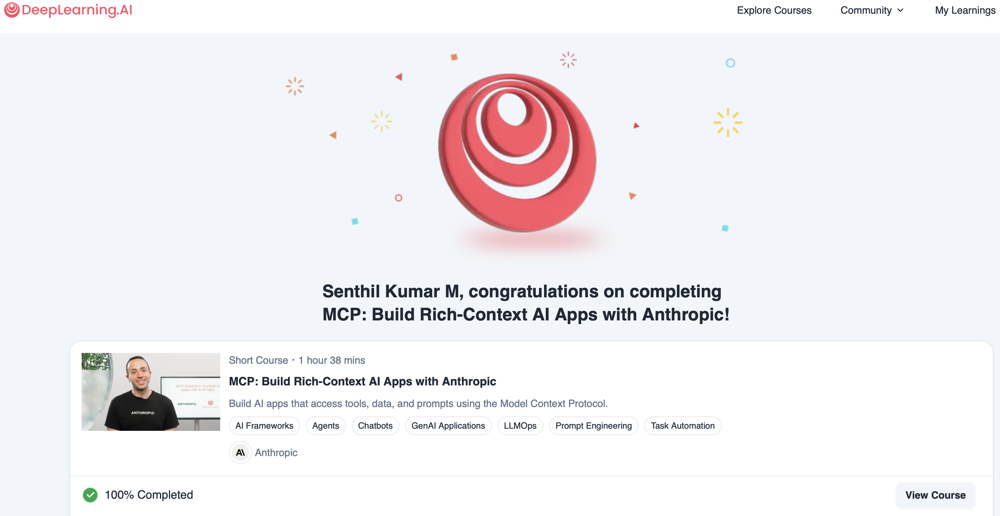

I got to learn quite a few things in that. I have collated below my notes from the course.


Source: Author's Personal Understanding

> **Plagiarism Disclosure**: <br>
> - The headings below match the video titles from the course. <br>
> - These are notes where many of the lines would have been directly taken from course material. <br>
> - Sources are attributed to all pics for clarity

---

> **📌 A note on freshness (added later):** These notes are based on the MCP spec as of **early-mid 2025** (course used ~`2025-03-26`). The protocol has since shipped **three** revisions — `2025-06-18`, `2025-11-25`, and the now-stable **`2026-07-28`**, which made the protocol **stateless** (no `initialize` handshake, no sessions). Where something has changed materially, I've added a **🔄 Update** callout inline. For anything authoritative, check the [latest spec](https://modelcontextprotocol.io/specification/2025-06-18).

---

# 1. Introduction: What MCP Actually Is

- [The Model Context Protocol (MCP), introduced by Anthropic](https://modelcontextprotocol.io/introduction) is a standardized **protocol** for supplying structured, real-time **context** (such as tools and data) to large language **models** (LLMs).

- MCP works on client-server architecture

```
Key Components:
Client:
- A piece of software or device that initiates requests to the server. 
- Examples include web browsers, email clients, CLI and mobile applications.

Server:
- A powerful computer or software that provides services to clients. 
- It handles requests, processes data, and delivers responses. 
Source: Google Search

How it works:
The client sends a request to the server.
The server processes the request and gathers the necessary information.
The server sends a response back to the client.
The client displays the response to the user. 
```

In **MCP specifically**, this Client - Server model undergoes a minor modification:

> - **Host** — the LLM application the user interacts with (Claude Desktop, an IDE, an agent).
> - **MCP Client** — a *connector inside the Host* that holds a **1:1 session with exactly one MCP Server**. It is **not** a browser or an app; a Host spins up one Client per Server it talks to.
> - **MCP Server** — a lightweight program exposing Tools / Resources / Prompts.
>
> So a Host with 3 servers runs 3 clients. This triad - Host, MCP Client and MCP Server - is the single most important concept in MCP


## Flow of the Course

**Steps of learning in this course**:

- Understand MCP's Client Server Architecture
- Make a Chatbot application MCP compatible
- Build and Test your MCP Server
- In the MCP Server, you could have
    - Tools
    - Prompt Templates
    - trusted 3rd party servers
    - any resource ...
- Connect the MCP-compatible Chatbot to the MCP Server

> MCP is **not just useful for AI developers** to help them connect their AI/LLM to many data and tools, it is helping **tool/API developers** make their tool available to multiple AI applications


---

# 2. Why MCP? From Custom Glue to a Standard

## **Without MCP**

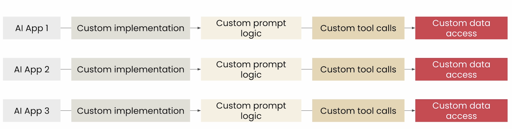

Source: DeepLearning.ai MCP Course

- MCP is *similar in spirit* to REST APIs — a standardized way for applications to talk to a backend. The popular one-liner is **"USB-C for AI"**.
- **But two differences matter:** 
    - (1) MCP uses [**JSON-RPC 2.0**, not REST](https://nordicapis.com/json-rpc-vs-rest-when-should-api-developers-use-each/); 
    - (2) MCP adds **capability discovery** and **server-initiated** interactions (e.g.: sampling - discussed in section 10.2 ) that REST does not have. 

```{mermaid}
flowchart LR
    subgraph REST["REST (one-way)"]
        C1[Client] -->|request| S1[Server]
        S1 -.->|response only| C1
    end
    subgraph MCP["MCP (bidirectional)"]
        C2[Client] -->|call tool| S2[Server]
        S2 -.->|response| C2
        S2 ==>|server-initiated:<br/>sampling / elicitation / roots| C2
    end
```

## **With MCP**

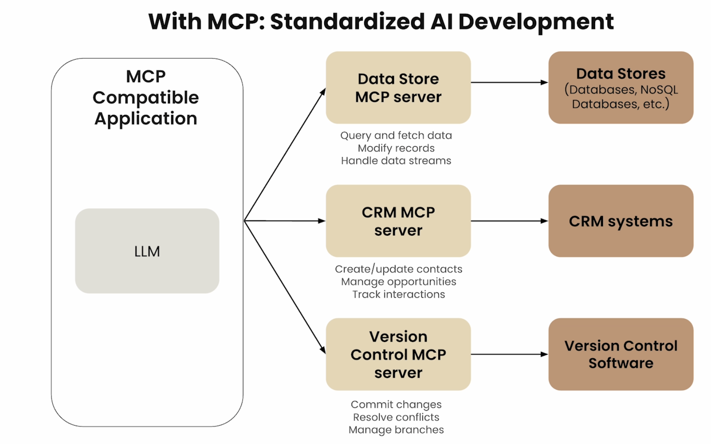
Source: DeepLearning.ai MCP Course

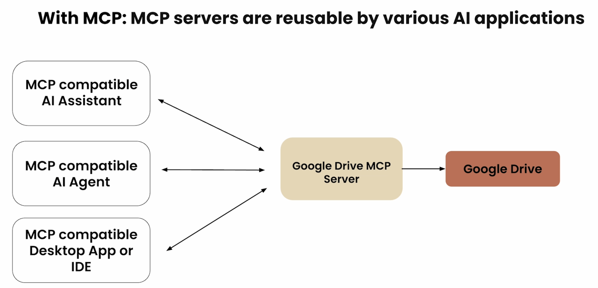
Source: DeepLearning.ai MCP Course

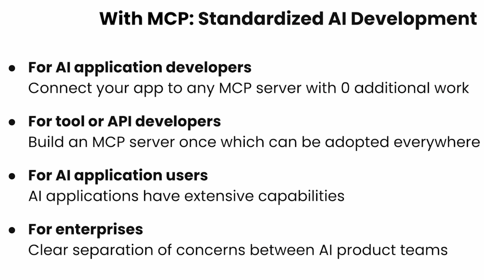
Source: DeepLearning.ai MCP Course

## **MCP Ecosystem** comprises:
- AI Applications utilizing MCP
- MCP Server Builders


## Other useful details
**Different types of MCP Applications**
- Web App, Desktop App and Agentic Products (including Mobile app)


**Who can write the MCP Servers**:
- Anyone in the OpenSource community can. 

**What is a MCP Server**

- A gateway or wrapper on top of API.
- If you do not want to call the API and instead want to use Natural Language and let the MCP server handle the right server for you. 

**3 components of an MCP-compatible Application**
- Host
- MCP Client
- MCP Server


---


# 3. MCP Client Server Architecture: The Core Triad - Host, Client, Server

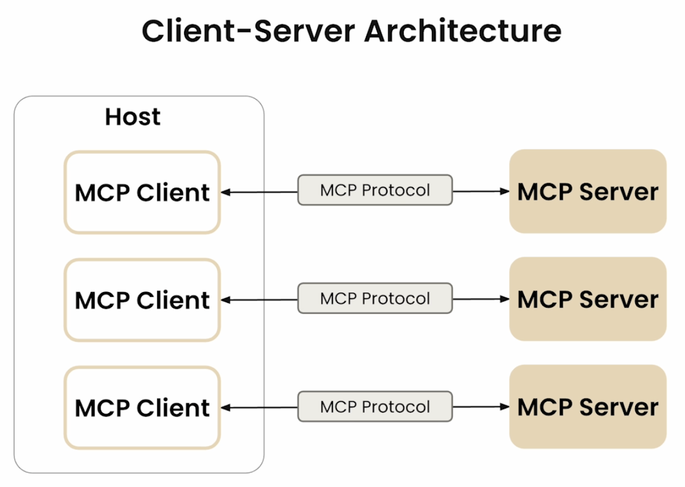
Source: DeepLearning.ai MCP Course

- **Host**: LLM Applications that access data and tools through MCP 
- **MCP Servers**: Lightweight programs that expose specific capabilities through MCP protocol
- **MCP Client**: Programs that maintain 1:1 connections with Servers inside the host application

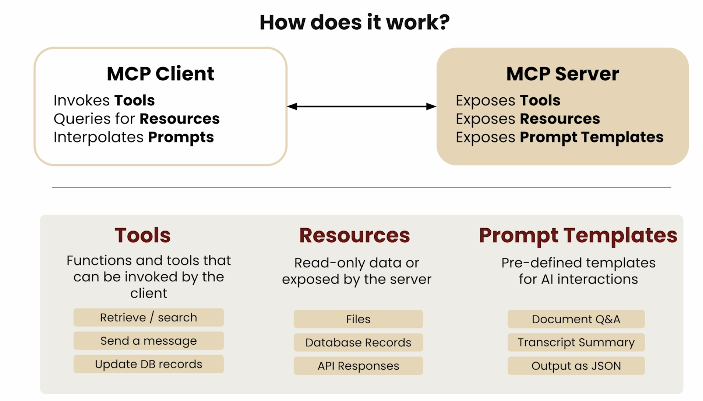


## Primitives of MCP: What a MCP Server Exposes - Tools, Resources and Prompts

Before we discuss the client-server architecture, let us discuss the **primitives** or **fundamental pieces** of the protocol

- Tools: Functions & Tools that can be invoked by the client (like "POST" request that does some kind of modification)
- Resources: Read-only Data or Context exposed by server (mostly read-only) (like "GET" request)
- Prompt Templates:  Pre-defined templates for AI interactions

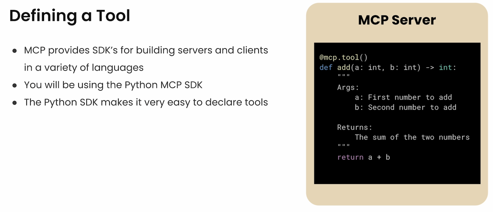
Source: DeepLearning.ai MCP Course

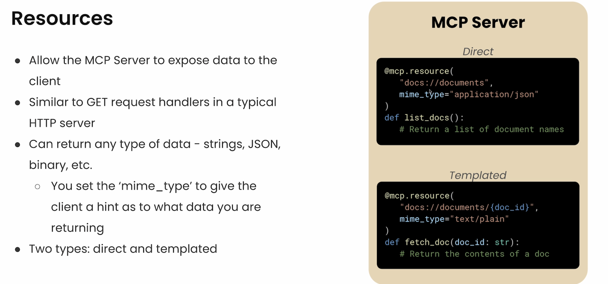
Source: DeepLearning.ai MCP Course

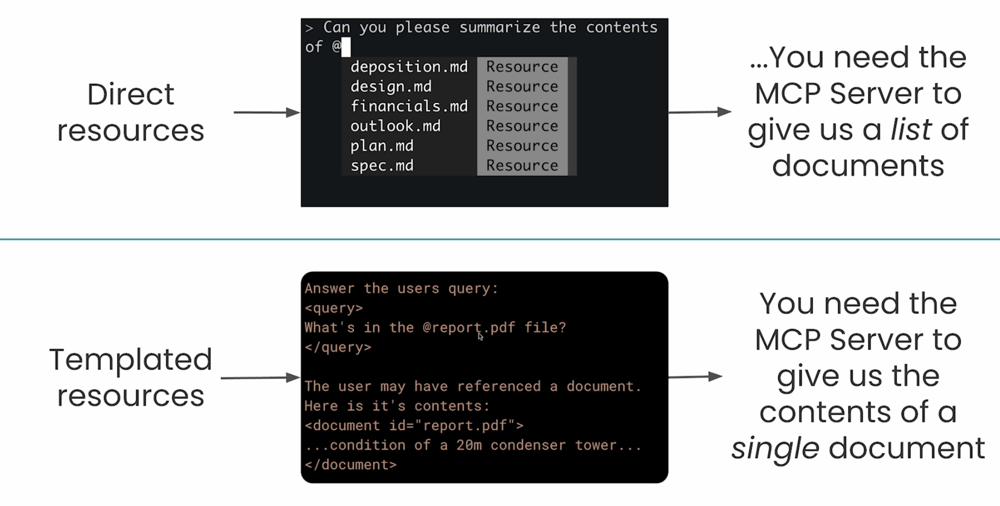
Source: DeepLearning.ai MCP Course

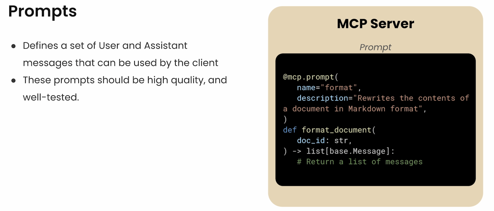
Source: DeepLearning.ai MCP Course

## MCP Communication Lifecycle

## 3.2 Communication Lifecycle: How Host ↔ Client ↔ Server ↔ Tool Talk

> **🔄 Fully updated for the `2026-07-28` spec.** The original course diagrams showed a **stateful** lifecycle (an `initialize` → `initialized` handshake, then message exchange, then termination). As of `2026-07-28`, MCP is **stateless**: there is **no handshake and no session**. I've redrawn everything below to match the current protocol; the old handshake is kept only as a "legacy" note.

The lifecycle has two layers worth separating:

- **The wire rule** — *how* a message is framed and sent (the **transport**: `stdio` or **Streamable HTTP**).
- **The conversation** — *what* client and server say (discover → call tools → server asks back if needed).

---

### 3.2.1 The conversation (transport-independent)

In the modern protocol there is **no setup phase**. Every request is **self-describing** — it carries its own protocol version and capabilities in `_meta` — so the server can accept or reject each request on its own.

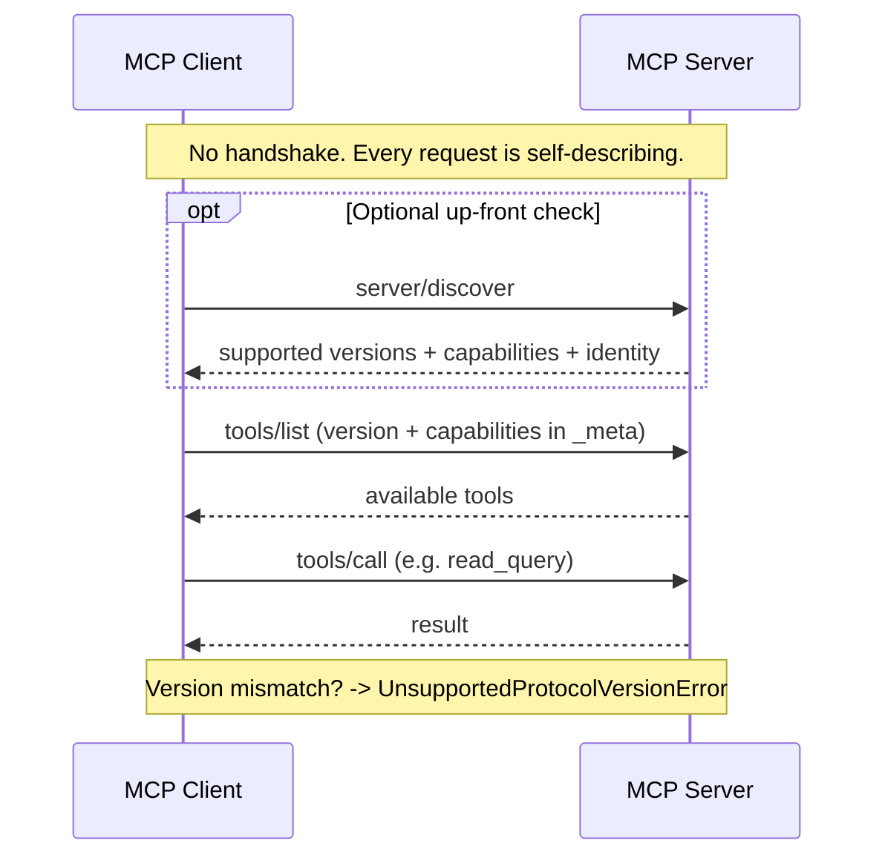
```mermaid
sequenceDiagram
    participant C as MCP Client
    participant S as MCP Server

    Note over C,S: No handshake. Every request is self-describing.

    opt Optional up-front check
        C->>S: server/discover
        S-->>C: supported versions + capabilities + identity
    end

    C->>S: tools/list  (version + capabilities in _meta)
    S-->>C: available tools

    C->>S: tools/call  (e.g. read_query)
    S-->>C: result

    Note over C,S: Version mismatch? -> UnsupportedProtocolVersionError
```

- **No `initialize` handshake.** Each request declares its version in `_meta` (and, on HTTP, the `MCP-Protocol-Version` header). The server replies with `UnsupportedProtocolVersionError` if it can't speak that version.
- **`server/discover` is optional.** Servers **MUST** implement it; a client **MAY** call it first to learn versions/capabilities up front, or just fire an RPC and handle the mismatch error.
- **Why this matters:** because no request depends on a prior "session", any request can land on **any server instance** behind a plain load balancer.

---

### 3.2.2 When the server needs something back (MRTR)

The one case that isn't plain request→response: the server needs the **client's LLM (sampling)**, the **user (elicitation)**, or **file scope (roots)**. Instead of holding a bidirectional stream open, the server returns an **`input_required`** result; the client supplies the input on a **retry**. This is **Multi Round-Trip Requests (MRTR)**.

```{mermaid}
sequenceDiagram
    participant C as MCP Client
    participant S as MCP Server

    C->>S: tools/call (summarize a huge doc)
    S-->>C: InputRequiredResult (needs an LLM completion)
    C->>C: run the LLM (sampling)
    C->>S: retry, now with the completion
    S-->>C: final result
```

- **The idea survives, the plumbing changed.** Sampling / elicitation / roots (§10.2) are now delivered as structured round-trips, not push-over-an-open-stream.
- **Net effect:** the server can still "call back", but nothing has to stay connected between calls.

---

### 3.2.3 Transports: how bytes actually move

A **transport** handles the underlying mechanics of sending/receiving messages. Two are defined:

| Transport | Use it for | Shape |
|---|---|---|
| **`stdio`** | Server running **locally** (most common for desktop) | Client launches server as a **subprocess**; JSON-RPC over stdin/stdout |
| **Streamable HTTP** | **Remote** servers | A single HTTP endpoint; each message is its own POST |

> **🔄 Update:** The old **HTTP+SSE** transport (2024-11-05) is **deprecated**. **Streamable HTTP** (introduced 2025-03-26) is the remote transport, and `2026-07-28` further simplified it — see below.

---

### 3.2.4 `stdio` — local servers

```{mermaid}
sequenceDiagram
    participant C as MCP Client
    participant S as MCP Server (subprocess)

    C->>S: launch as subprocess
    C->>S: write JSON-RPC to stdin (one msg per line)
    S-->>C: write JSON-RPC to stdout (one msg per line)
    S-->>C: stderr = logs only (not protocol)
    C->>S: close stdin -> server exits
```

- **One subprocess, two pipes.** Client writes requests to the server's **stdin**; server writes responses to **stdout**. Messages are **newline-delimited** JSON-RPC (no embedded newlines).
- **`stderr` is for logs**, not protocol. The client may capture or ignore it and **should not** treat output there as an error.
- **Shutdown is just closing stdin** and waiting for the process to exit (force-kill only if it hangs).
- **No header layer:** version, capabilities, and identity all ride **inline** in the message's `_meta`.

---

### 3.2.5 Streamable HTTP — remote servers

```{mermaid}
sequenceDiagram
    participant C as MCP Client
    participant S as MCP Server (remote)

    Note over C,S: One endpoint (e.g. POST /mcp). No sessions, no GET stream.

    C->>S: POST /mcp  (tools/list)
    S-->>C: application/json  (or SSE stream for this one request)

    C->>S: POST /mcp  (tools/call)
    S-->>C: SSE stream: progress... then final result
```

- **One endpoint, POST-only.** Every JSON-RPC message is its **own POST** to a single MCP endpoint (e.g. `/mcp`). The server answers each with either a plain JSON body **or** an SSE stream **scoped to that one request** (for progress + final result).
- **`2026-07-28` removed two things:** the separate **GET stream endpoint** and **protocol-level sessions** (`Mcp-Session-Id` is gone). That's what makes it **stateless** and horizontally scalable behind a round-robin load balancer.
- **Routing on headers:** the method and tool names travel in `Mcp-Method` / `Mcp-Name` headers, so gateways can route/authorize without parsing the body.
- **Server-to-client** work (sampling/elicitation/roots) uses **MRTR** (§3.2.2); long-lived change notifications use a `subscriptions/listen` request.
- **Security basics:** validate the `Origin` header (DNS-rebinding defense); bind local servers to `127.0.0.1`; require auth on remote endpoints.

---

> **Legacy note (for context):** If you learned MCP in 2025, you'll remember the three-step **Initialization → Message Exchange → Termination** lifecycle with an `initialize`/`initialized` handshake and a session ID. Servers can still support those **legacy clients** in a "dual-era" mode, but the **modern default is stateless** — no handshake, no session.


## Code Examples


**Tools**:

```python
@mcp.tool()
def add(a,b):
    return a + b
```

**Resources**

```python
@mcp.resources(
    "docs://documents",
    mime_type="application/json"
)
def list_docs()
    # return a list
```


# 4. Chatbot Example

- Highlighting in this section the important functions that were created to build the chatbot (without MCP)

**Create Functions/Tools**

- `search_papers()`
- `extract_info()`

**Tool_Schema**

- Create the tool schema in a json format
- Tool mapping and tool execution functions


**Chatbot CLI Client Functions** ()

The following functions make the chatbot client work:
- `process_query()`
- `chat_loop()`

[Source for GitHub Code Materials](https://github.com/dzlab/deeplearning.ai/blob/main/2025/05/MCPBuildRichContextAIAppswithAnthropic/L3/L3_Executed.ipynb)


# 5. MCP Server

In this section, we will wrap the tools of the chatbot of the previous lesson, to build an MCP server that exposes 2 tools. we will use here the `stdio` transport and run the server in the provided local environment.

- Two main requests that an MCP server needs to handle from MCP Client

- Server List Tools

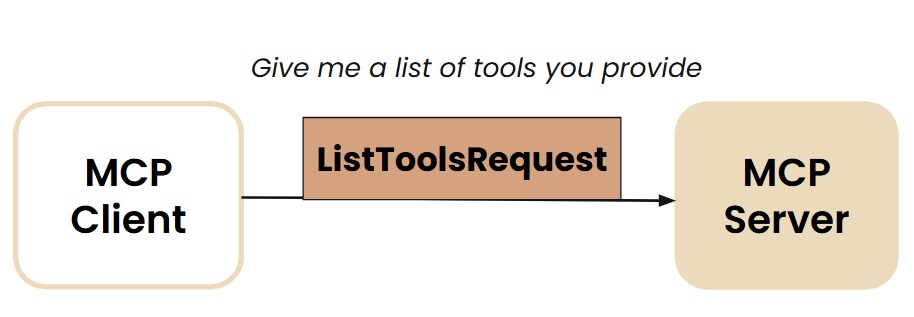
Source: DeepLearning.ai MCP Course

- Server Call Tools

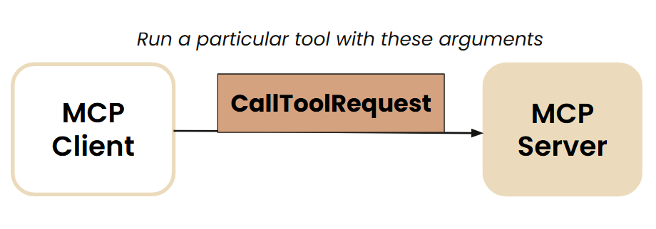
Source: DeepLearning.ai MCP Course

- The library FastMCP takes care of MCP Protocol details like server_call_tool and server_list_tool
- You will wrap the tools in @mcp.tool()

- There is an inspector window that can be used to test how the MCP tools are functioning

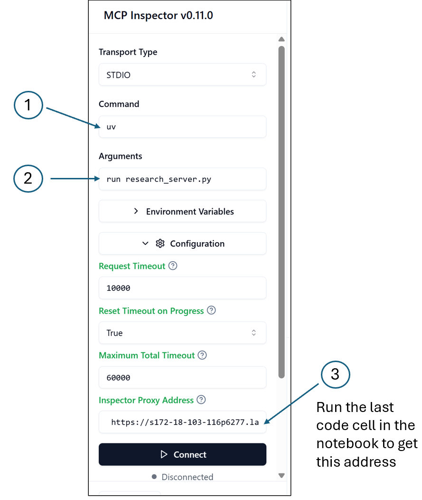
Source: DeepLearning.ai MCP Course

[Source for GitHub Code Materials](https://github.com/dzlab/deeplearning.ai/tree/main/2025/05/MCPBuildRichContextAIAppswithAnthropic/L4)

# 6. MCP Client

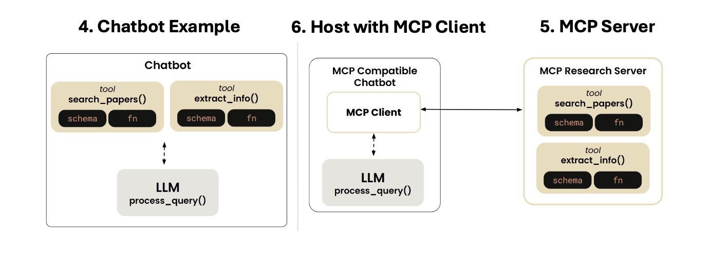
Source: DeepLearning.ai MCP Course

- In the previous section, we created an MCP research server that exposes 2 tools. 


How **Tools Discovery** happens: 


Source: DeepLearning.ai MCP Course

**Invoking a particular Tool**:

Source: DeepLearning.ai MCP Course

- In this section, we will make the chatbot communicate to the server through an MCP client.

- The functions `process_query()` and `chatbot_loop()` (that were created in Section #4) are now encapsulated inside `class MCP_Chatbot`

- The course materials used a package manager called uv (uv, built in Rust, is a Python Package Manager)

[Source for GitHub Code Materials](https://github.com/dzlab/deeplearning.ai/tree/main/2025/05/MCPBuildRichContextAIAppswithAnthropic/L5)

# 7. Connecting the MCP-compatible Chatbot to Reference MCP Servers 
> (not just local MCP servers built in section 5)

- In this section, we extend the MCP chatbot capabilities by making it connect to any (reference) MCP server

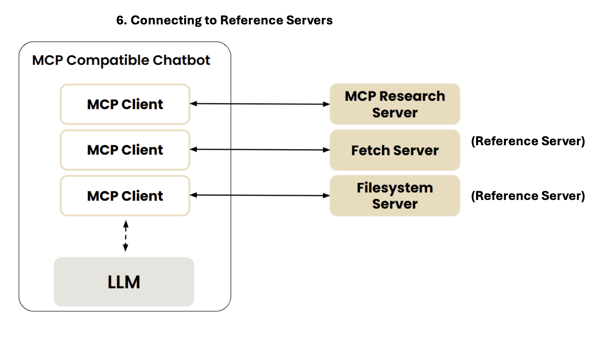
Source: DeepLearning.ai MCP Course

- Reference servers are implmented with `npx` and `uvx` commands
```json
{
    "mcpServers": {

        "filesystem": {
            "command": "npx",
            "args": [
                "-y",
                "@modelcontextprotocol/server-filesystem",
                "."
            ]
        },

        "research": {
            "command": "uv",
            "args": ["run", "research_server.py"]
        },

        "fetch": {
            "command": "uvx",
            "args": ["mcp-server-fetch"]
        }
    }
}
```

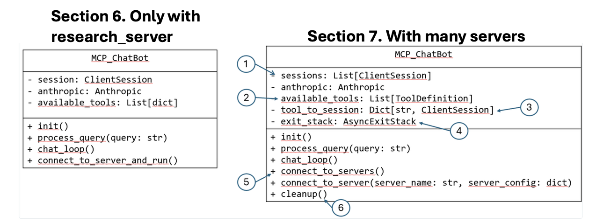
Source: DeepLearning.ai MCP Course

- One can run the below command in Terminal or Inspector

```
uv run mcp_chatbot.py
```

[Source for GitHub Code Materials](https://github.com/dzlab/deeplearning.ai/tree/main/2025/05/MCPBuildRichContextAIAppswithAnthropic/L6)


# 8. Prompt and Resource Features 
- In this section, the mcp compatible chatbot utilizing 2 tools is extended with "Prompt Template" and "Resources" (`folders` and `topic`)

```python

@mcp.resource("papers://{topic}")
def get_topic_papers(topic: str) -> str:
    ...

@mcp.resource("papers://folders")
def get_available_folders() -> str:
    ...

@mcp.prompt()
def generate_search_prompt(topic: str, num_papers: int = 5) -> str:
    ...

```

- How does Prompt Discovery and Invocation work

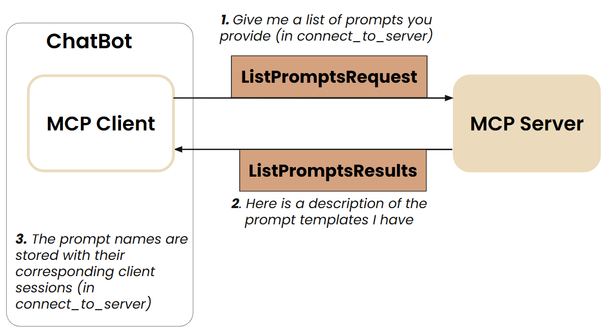
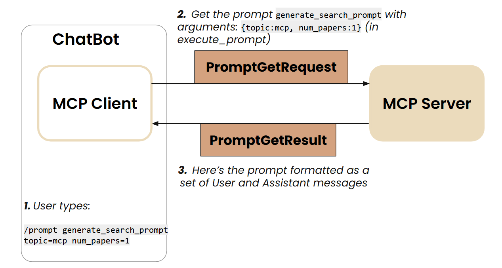
Source: DeepLearning.ai MCP Course

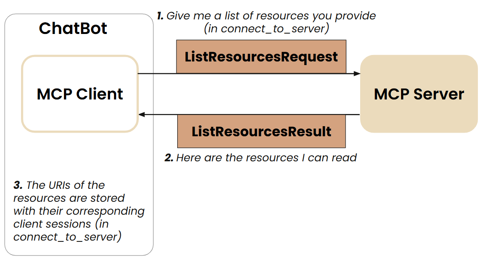
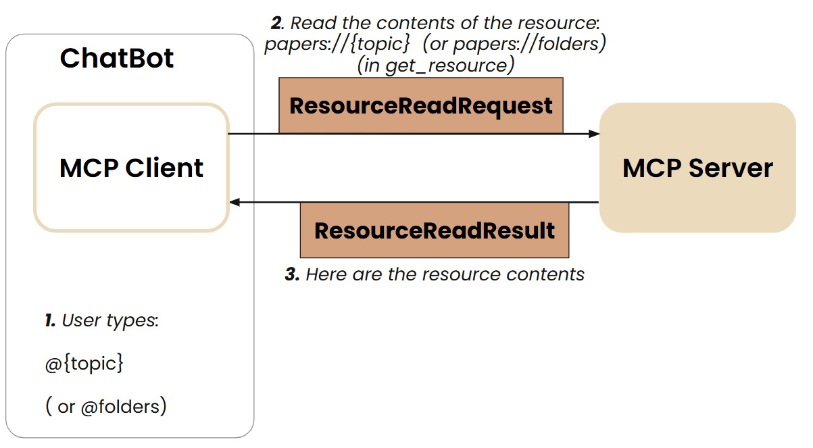
Source: DeepLearning.ai MCP Course

- How to use the Prompts and Resources

```
@folders
@ai_interpretability
/prompts
/prompt generate_search_prompt topic=history num_papers=2
```

# 9. Creating and Deploying Remote Servers

- In the previous sections, we worked with servers running locally using `stdio` transport. 
- In this section, we will learn how to create a remote server using `FastMCP`, test it using MCP inspector and then learn how to deploy it on `render.com` (a remote server could be in AWS, Azure, Heroku).

- The course focused on the `sse transport` (which is depcrecated in the upcoming MCP versions). 
- In actual implementaiton, we would use `streamable_http` protocol (provided by FastMCP)

# 10. Other Interesting Areas in MCP


## 10.1  OAuth Authentication in MCP
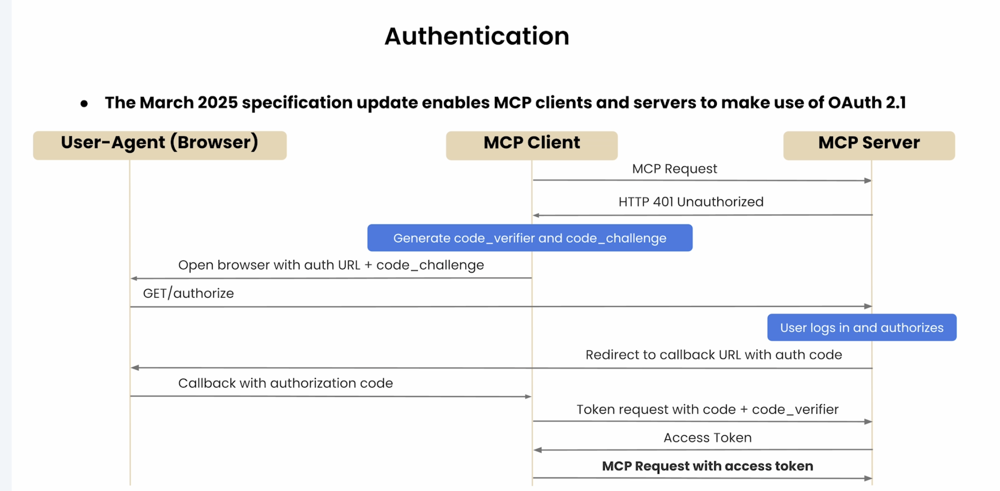
Source: DeepLearning.ai MCP Course

## 10.2 Primitives in Client had not been explored in the above sections
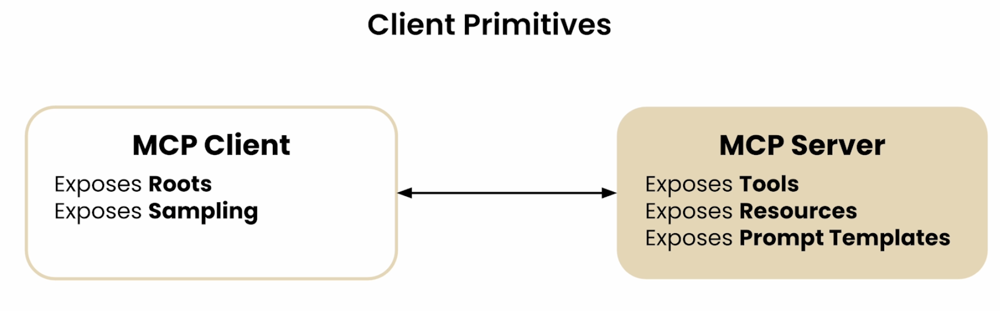
Source: DeepLearning.ai MCP Course

**Client Primitives**:
- Root
- Sampling

### 10.2.1. Root
> A Root is a Unique Resource Identifier
> Root primitive from the client dictates the server what resource to use/checkout 
> "Look only these places for answers"

- Root is primarily a filesystem path. But it could be any URI, for e.g. HTTP URL

### 10.2.2 Sampling
- Allows a server to request inference from the LLM
- Sampling helps in Servers to leverage LLM's intelligence as part of their processing pipeline
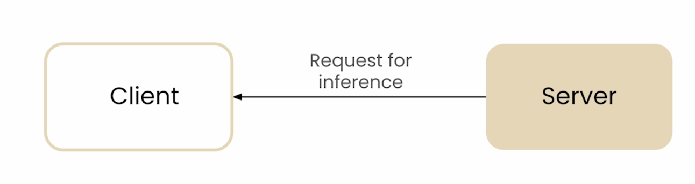

**Example Usecase**: Server is Down

- If a server is down, and based on metrics like compute used or usage, server identifies itself that it is slow
- Server could request the client to initiate a "Diagnosis of the Performance Issues"
- The LLM then analyzes server logs, error logs, performance metrics. 
- The LLM will dictate steps to make the Website less slow
- "Sampling Loops" could be very useful 

## 10.3 Composability: Client and Server are Interchangeable

- Clients and Server can play other's roles
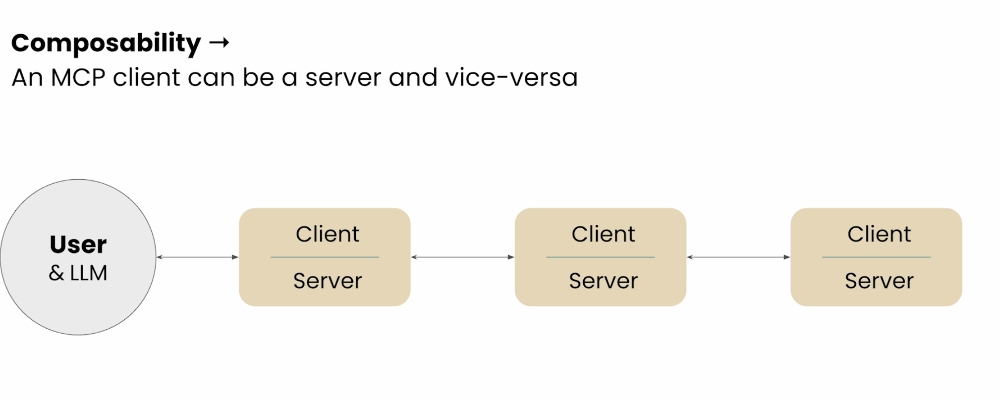
Source: DeepLearning.ai MCP Course

- Sampling + Composability could be used in Multi-agent Architecture
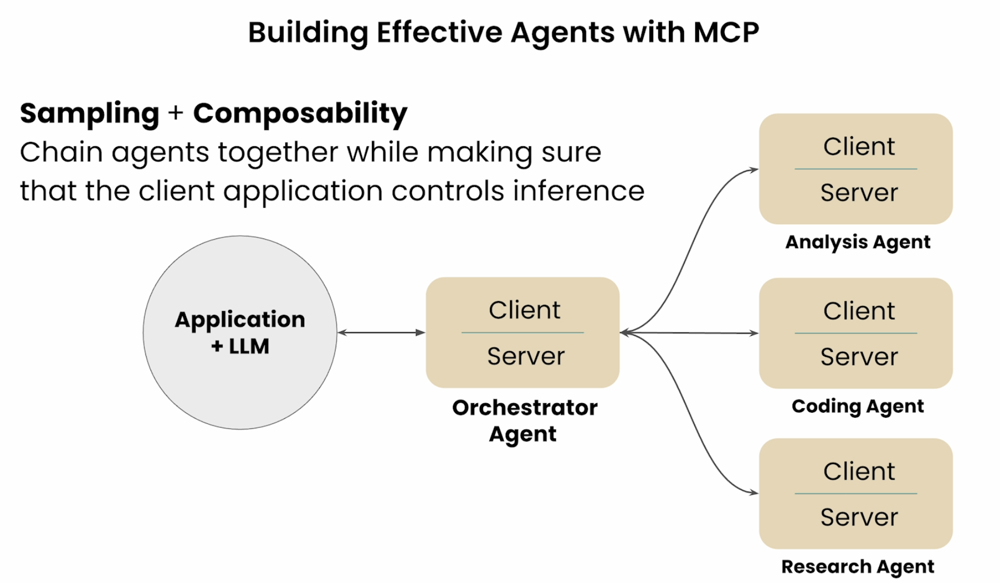
Source: DeepLearning.ai MCP Course

## 10.4 MCP Registry API

- Like a Docker Registry or package manager, MCP now has an **official Registry (since Sept 2025)**, backed by Anthropic, GitHub, Microsoft, and PulseMCP.
- Servers publish a **`server.json`** (name, where to run, args/env); namespaces are **DNS/GitHub-verified** (e.g. nobody but Microsoft can publish `io.github.microsoft/...`). It's a **catalog of metadata, not a host** — code still lives in npm/PyPI/containers.
- Downstream directories (PulseMCP, Glama, mcp.so) consume this API and add curation/ratings on top.


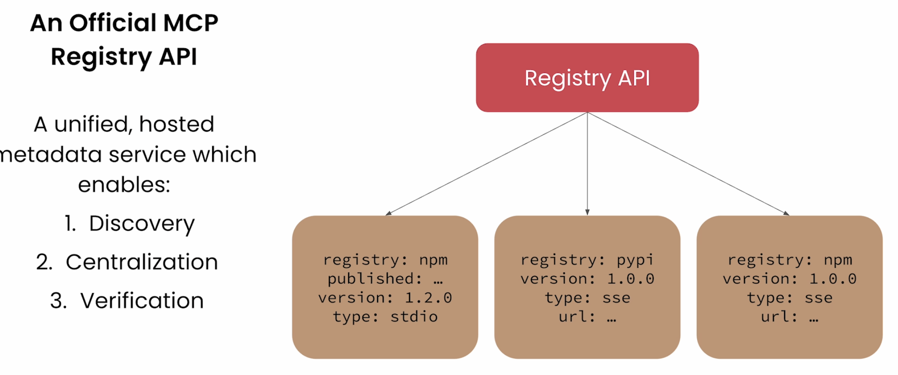
Source: DeepLearning.ai MCP Course

- In fact, we could have an MCP agent that auto-discovers relevant MCP Registry servers, implements and runs them

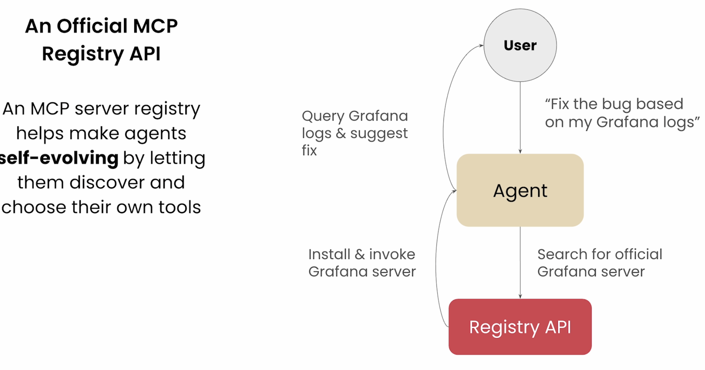
Source: DeepLearning.ai MCP Course

- An example showcasing this Self Discovery of right MCP Servers
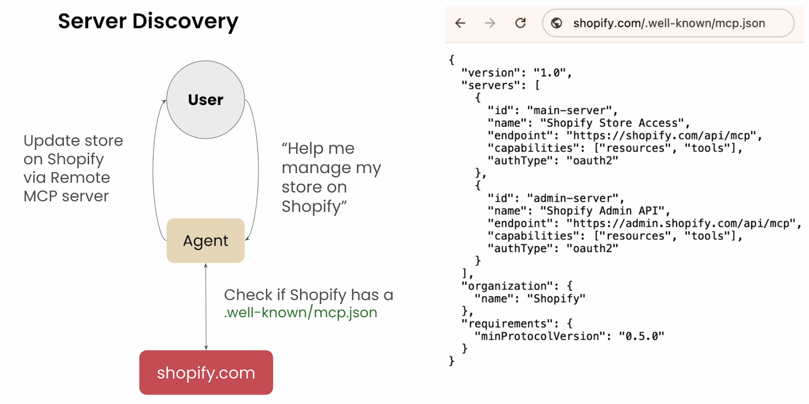
Source: DeepLearning.ai MCP Course


## 10.5 Other Evolving Topics
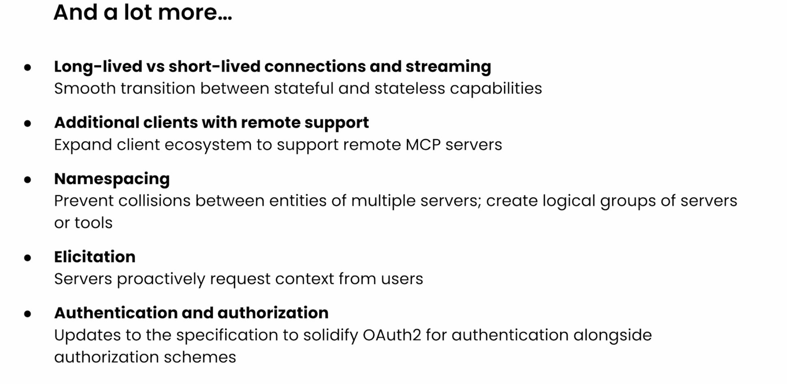
Source: DeepLearning.ai MCP Course

---

> *Updated in Aug'26: Newly updated sections are below*

# 11. Security & Trust

# 11. Security & Trust (the part the course under-covered)

MCP's power — letting an LLM discover and call arbitrary tools from arbitrary servers — is also its risk surface. 

Key Issues the MCP implementation could face: 

- **Tool poisoning / prompt injection via descriptions:** A server's tool *descriptions* are read by the model. A malicious or compromised server can smuggle instructions there. Treat server metadata as untrusted input.
- **Confused-deputy:** Your Host holds credentials; a rogue server can try to get the Host to act on its behalf. Scope tokens tightly.
- **Provenance > convenience:** Prefer servers from the **official Registry with verified namespaces** over pasting install commands from a forum post (see §10.4).
- **Least privilege:** Only expose the tools/resources a task needs; watch out for **tool-count bloat**, which both inflates context and widens attack surface.

> Rule of thumb: *"Would I run this server's code on my laptop with my API keys?"* If not, don't connect it.