I recently completed a short course from DeepLearning.ai on Model Context Protocol. [link to the course](https://www.deeplearning.ai/short-courses/mcp-build-rich-context-ai-apps-with-anthropic/)
I got to learn quite a few things in that. I have collated below my notes from the course.


Source: Author's Personal Understanding

> **Plagiarism Disclosure**: <br>
> - The headings below match the video titles from the course. <br>
> - These are notes where many of the lines would have been directly taken from course material. <br>
> - Sources are attributed to all pics for clarity

# 1. Introduction

- [The Model Context Protocol (MCP), introduced by Anthropic](https://modelcontextprotocol.io/introduction) is a standardized **protocol** for supplying structured, real-time **context** (such as tools and data) to large language **models** (LLMs).

- MCP works on client-server architecture

```
Key Components:
Client:
- A piece of software or device that initiates requests to the server. 
- Examples include web browsers, email clients, CLI and mobile applications.

Server:
- A powerful computer or software that provides services to clients. 
- It handles requests, processes data, and delivers responses. 
Source: Google Search

How it works:
The client sends a request to the server.
The server processes the request and gathers the necessary information.
The server sends a response back to the client.
The client displays the response to the user. 
```

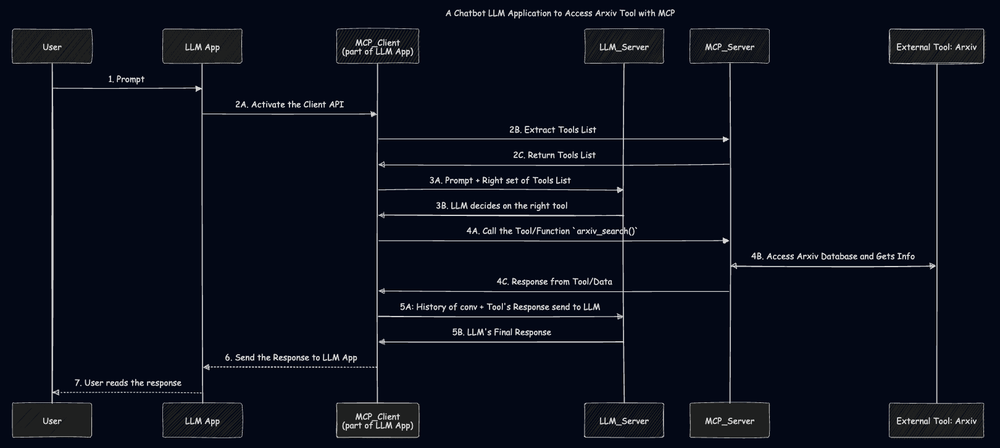
Source: Author
 
## Flow of the Course

**Steps of learning in this course**:

- Understand MCP's Client Server Architecture
- Make a Chatbot application MCP compatible
- Build and Test your MCP Server
- In the MCP Server, you could have
    - Tools
    - Prompt Templates
    - trusted 3rd party servers
    - any resource ...
- Connect the MCP-compatible Chatbot to the MCP Server

> MCP is **not just useful for AI developers** to help them connect their AI/LLM to many data and tools, it is helping **tool/API developers** make their tool available to multiple AI applications


---

# 2. Why MCP

## **Without MCP**


Source: DeepLearning.ai MCP Course

- MCP is similar to Rest APIs (that standardized way/protocol for Web Applications to interact with backend)


## **With MCP**


Source: DeepLearning.ai MCP Course

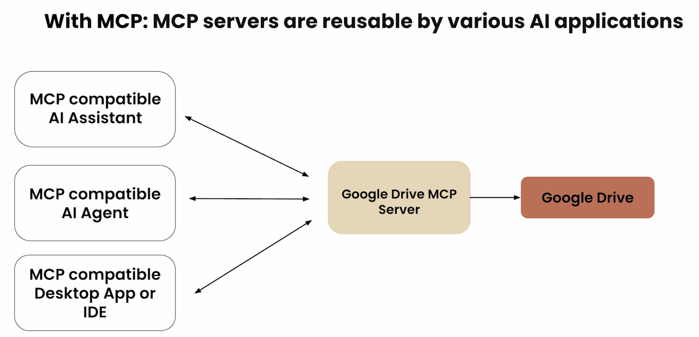
Source: DeepLearning.ai MCP Course

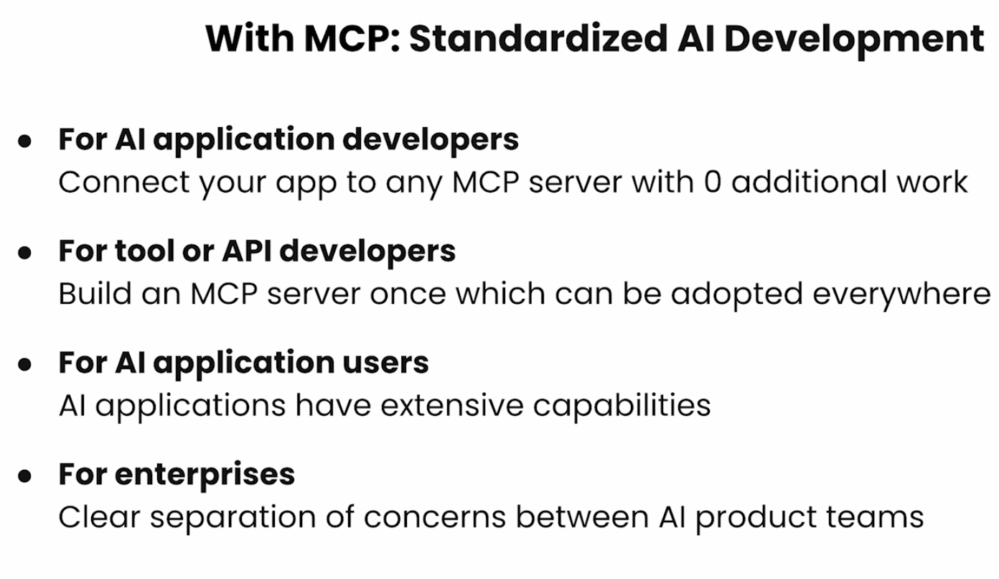
Source: DeepLearning.ai MCP Course

## **MCP Ecosystem** comprises:
- AI Applications utilizing MCP
- MCP Server Builders


## Other useful details
**Different types of MCP Applications**
- Web App, Desktop App and Agentic Products (including Mobile app)


**Who can write the MCP Servers**:
- Anyone in the OpenSource community can. 

**What is a MCP Server**

- A gateway or wrapper on top of API.
- If you do not want to call the API and instead want to use Natural Language and let the MCP server handle the right server for you. 

**3 components of an MCP-compatible Application**
- Host
- MCP Client
- MCP Server


---


# 3. MCP Client Server Architecture

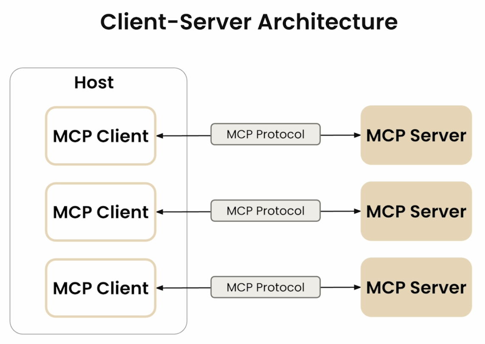
Source: DeepLearning.ai MCP Course

- **Host**: LLM Applications that access data and tools through MCP 
- **MCP Servers**: Lightweight programs that expose specific capabilities through MCP protocol
- **MCP Client**: Programs that maintain 1:1 connections with Servers inside the host application

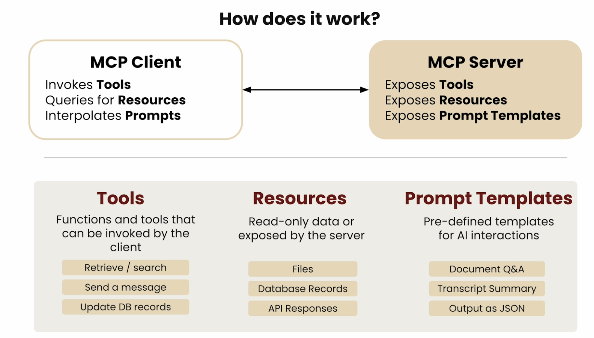


## Primitives of MCP

Before we discuss the client-server architecture, let us discuss the **primitives** or **fundamental pieces** of the protocol

- Tools: Functions & Tools that can be invoked by the client (like "POST" request that does some kind of modification)
- Resources: Read-only Data or Context exposed by server (mostly read-only) (like "GET" request)
- Prompt Templates:  Pre-defined templates for AI interactions


Source: DeepLearning.ai MCP Course


Source: DeepLearning.ai MCP Course

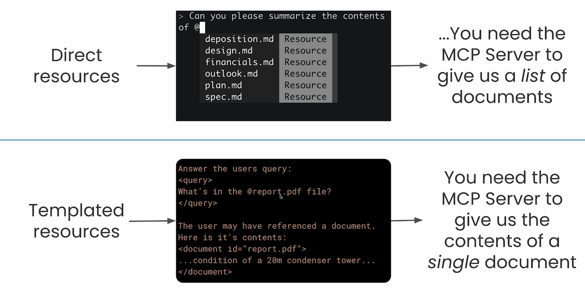
Source: DeepLearning.ai MCP Course

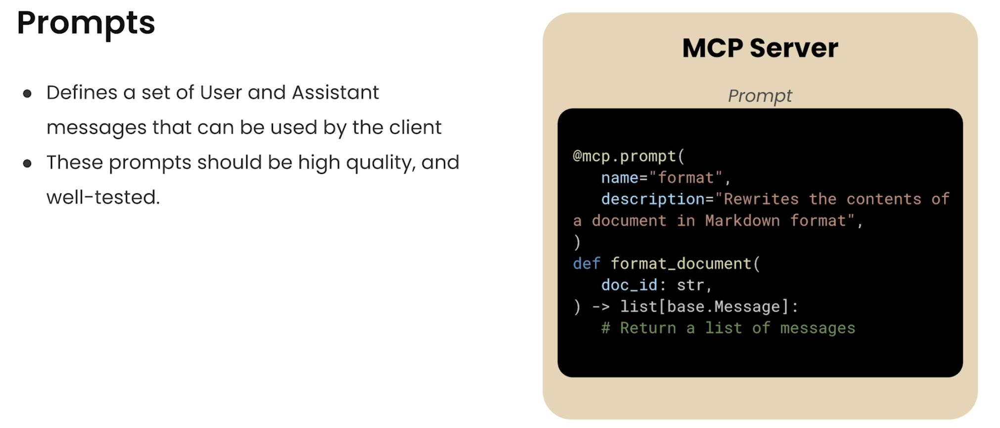
Source: DeepLearning.ai MCP Course

## MCP Communication Lifecycle


Source: DeepLearning.ai MCP Course

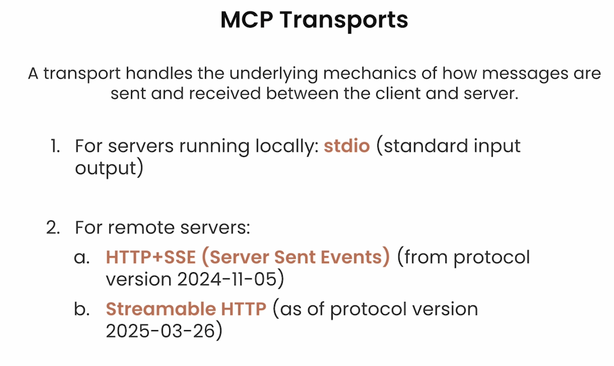
Source: DeepLearning.ai MCP Course

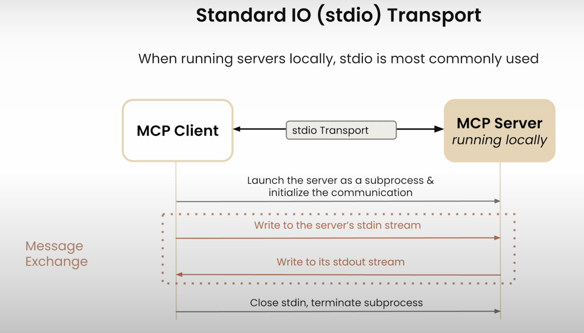
Source: DeepLearning.ai MCP Course


Source: DeepLearning.ai MCP Course


Source: DeepLearning.ai MCP Course

## A Brief Note about A Demo Video in the Course

> *In the course, I saw a wonderful demo of how MCP servers and tools were used in Claude Desktop*

- Before drafting the prompt in Claud Desktop (a tool similar to ChatGPT for the unfamiliar folks), the author shows how he has various mcp tools for SQL lite processing at his disposal. 
- The Claude desktop uses "an MCP tool" (under the mcp server) called `list_tables` and then also does a `read_query` mcp tool for the question `what tables do I have and how many records aren  there`
- There are several tool calls being made seamlessly one after the other
- He is then asking for "Generate a visualization based on data in the products table"
- The LLM responses in following steps:
    - At first, the llm lists the tools that are at its disposal
    - Then, runs `read_query` tool to fetch data of `products_table`
    - It then creats a "javascript" visualization via an another tool 


## Code Examples


**Tools**:

```python
@mcp.tool()
def add(a,b):
    return a + b
```

**Resources**

```python
@mcp.resources(
    "docs://documents",
    mime_type="application/json"
)
def list_docs()
    # return a list
```


# 4. Chatbot Example

- Highlighting in this section the important functions that were created to build the chatbot (without MCP)

**Create Functions/Tools**

- `search_papers()`
- `extract_info()`

**Tool_Schema**
- Create the tool schema in a json format
- Tool mapping and tool execution functions


**Chatbot CLI Client Functions** ()

The following functions make the chatbot client work:
- `process_query()`
- `chat_loop()`

[Source for GitHub Code Materials](https://github.com/dzlab/deeplearning.ai/blob/main/2025/05/MCPBuildRichContextAIAppswithAnthropic/L3/L3_Executed.ipynb)


# 5. MCP Server

In this section, we will wrap the tools of the chatbot of the previous lesson, to build an MCP server that exposes 2 tools. we will use here the `stdio` transport and run the server in the provided local environment.

- Two main requests that an MCP server needs to handle from MCP Client

- Server List Tools


Source: DeepLearning.ai MCP Course

- Server Call Tools


Source: DeepLearning.ai MCP Course

- The library FastMCP takes care of MCP Protocol details like server_call_tool and server_list_tool
- You will wrap the tools in @mcp.tool()

- There is an inspector window that can be used to test how the MCP tools are functioning


Source: DeepLearning.ai MCP Course

[Source for GitHub Code Materials](https://github.com/dzlab/deeplearning.ai/tree/main/2025/05/MCPBuildRichContextAIAppswithAnthropic/L4)

# 6. MCP Client


Source: DeepLearning.ai MCP Course

- In the previous section, we created an MCP research server that exposes 2 tools. 


How **Tools Discovery** happens: 


Source: DeepLearning.ai MCP Course

**Invoking a particular Tool**:
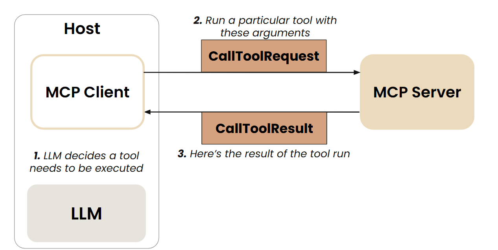
Source: DeepLearning.ai MCP Course

- In this section, we will make the chatbot communicate to the server through an MCP client.

- The functions `process_query()` and `chatbot_loop()` (that were created in Section #4) are now encapsulated inside `class MCP_Chatbot`

- The course materials used a package manager called uv (uv, built in Rust, is a Python Package Manager)

[Source for GitHub Code Materials](https://github.com/dzlab/deeplearning.ai/tree/main/2025/05/MCPBuildRichContextAIAppswithAnthropic/L5)

# 7. Connecting the MCP-compatible Chatbot to Reference MCP Servers 
> (not just local MCP servers built in section 5)

- In this section, we extend the MCP chatbot capabilities by making it connect to any (reference) MCP server

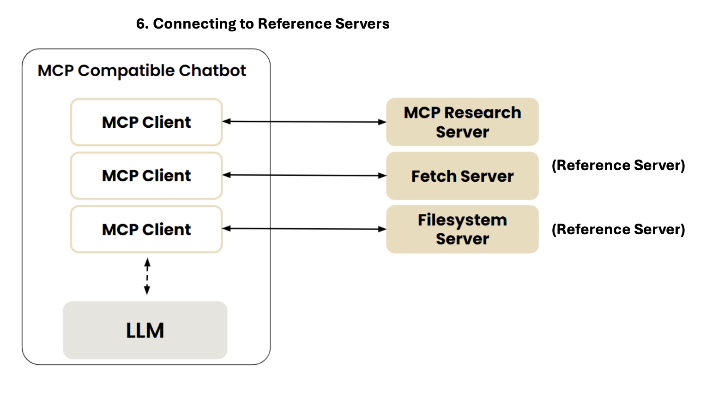
Source: DeepLearning.ai MCP Course

- Reference servers are implmented with `npx` and `uvx` commands
```json
{
    "mcpServers": {

        "filesystem": {
            "command": "npx",
            "args": [
                "-y",
                "@modelcontextprotocol/server-filesystem",
                "."
            ]
        },

        "research": {
            "command": "uv",
            "args": ["run", "research_server.py"]
        },

        "fetch": {
            "command": "uvx",
            "args": ["mcp-server-fetch"]
        }
    }
}
```


Source: DeepLearning.ai MCP Course

- One can run the below command in Terminal or Inspector

```
uv run mcp_chatbot.py
```

[Source for GitHub Code Materials](https://github.com/dzlab/deeplearning.ai/tree/main/2025/05/MCPBuildRichContextAIAppswithAnthropic/L6)


# 8. Prompt and Resource Features 
- In this section, the mcp compatible chatbot utilizing 2 tools is extended with "Prompt Template" and "Resources" (`folders` and `topic`)

```python

@mcp.resource("papers://{topic}")
def get_topic_papers(topic: str) -> str:
    ...

@mcp.resource("papers://folders")
def get_available_folders() -> str:
    ...

@mcp.prompt()
def generate_search_prompt(topic: str, num_papers: int = 5) -> str:
    ...

```

- How does Prompt Discovery and Invocation work


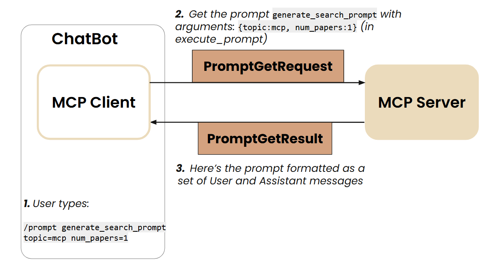
Source: DeepLearning.ai MCP Course


Source: DeepLearning.ai MCP Course

- How to use the Prompts and Resources

```
@folders
@ai_interpretability
/prompts
/prompt generate_search_prompt topic=history num_papers=2
```

# 9. Creating and Deploying Remote Servers

- In the previous sections, we worked with servers running locally using `stdio` transport. 
- In this section, we will learn how to create a remote server using `FastMCP`, test it using MCP inspector and then learn how to deploy it on `render.com` (a remote server could be in AWS, Azure, Heroku).

- The course focused on the `sse transport` (which is depcrecated in the upcoming MCP versions). 
- In actual implementaiton, we would use `streamable_http` protocol (provided by FastMCP)

# 10. Other Interesting Areas in MCP


## 10.1  OAuth Authentication in MCP
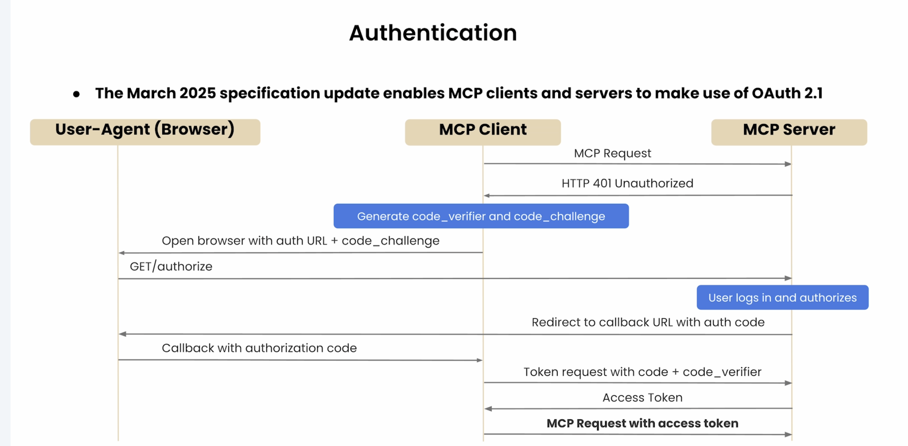
Source: DeepLearning.ai MCP Course

## 10.2 Primitives in Client had not been explored in the above sections

Source: DeepLearning.ai MCP Course

**Client Primitives**:
- Root
- Sampling

### 10.2.1. Root
> A Root is a Unique Resource Identifier
> Root primitive from the client dictates the server what resource to use/checkout 
> "Look only these places for answers"

- Root is primarily a filesystem path. But it could be any URI, for e.g. HTTP URL

### 10.2.2 Sampling
- Allows a server to request inference from the LLM
- Sampling helps in Servers to leverage LLM's intelligence as part of their processing pipeline
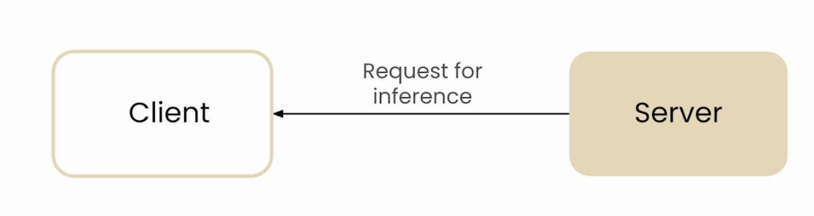

**Example Usecase**: Server is Down

- If a server is down, and based on metrics like compute used or usage, server identifies itself that it is slow
- Server could request the client to initiate a "Diagnosis of the Performance Issues"
- The LLM then analyzes server logs, error logs, performance metrics. 
- The LLM will dictate steps to make the Website less slow
- "Sampling Loops" could be very useful 

## 10.3 Composability: Client and Server are Interchangeable

- Clients and Server can play other's roles
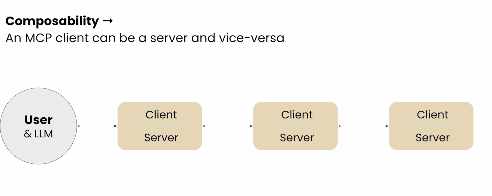
Source: DeepLearning.ai MCP Course

- Sampling + Composability could be used in Multi-agent Architecture
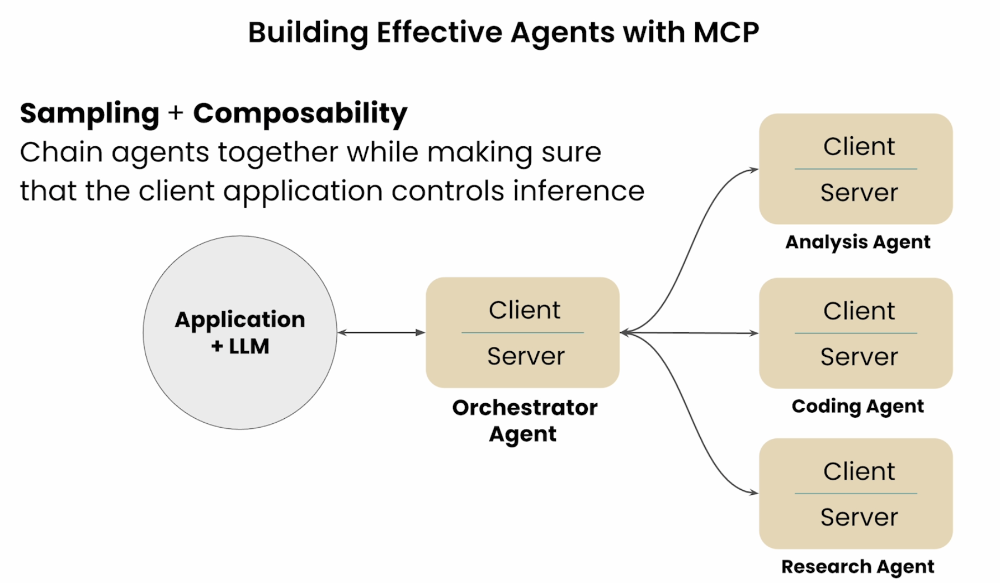
Source: DeepLearning.ai MCP Course

## 10.4 MCP Registry API

- Like a Docker Registry or Python Package Manager, MCP would also have an official list of Servers and Clients held in a registy. That is useful to keep in server_config.json. It allows versioning. 
- 


Source: DeepLearning.ai MCP Course

- In fact, we could have an MCP agent that auto-discovers relevant MCP Registry servers, implements and runs them


Source: DeepLearning.ai MCP Course

- An example showcasing this Self Discovery of right MCP Servers

Source: DeepLearning.ai MCP Course


## 10.5 Other Evolving Topics
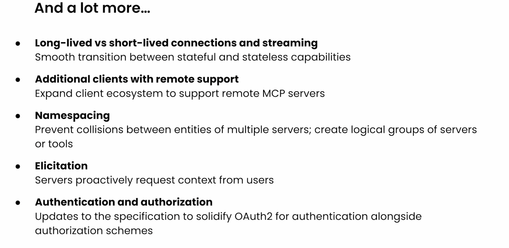
Source: DeepLearning.ai MCP Course