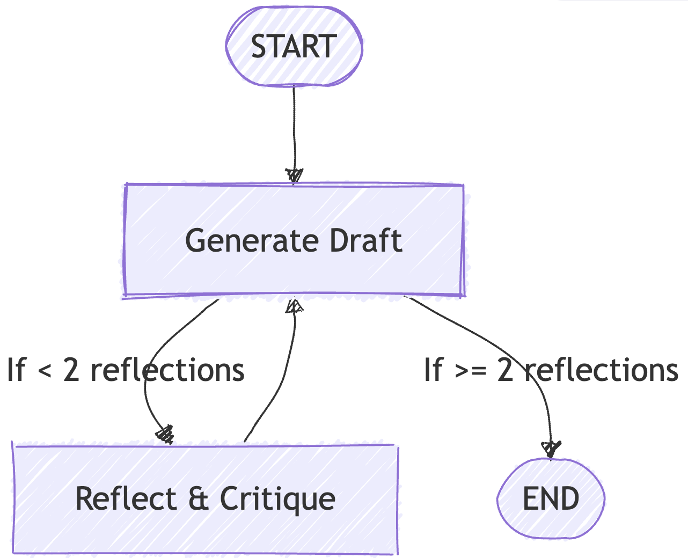

I recently completed a course in O'Reilly on "Modern Automated AI Agents: Building Agentic AI to Perform Complex Tasks" by Sinan Ozdemir ([O'reilly course link](https://learning.oreilly.com/course/modern-automated-ai/9780135414965/))


I learned quite a few things from that. I have compiled my notes from the course below. 


## 1. Introduction to AI Agents

### 1.1 Overview of AI Agents and Their Applications

**Definitions of AI Agents** <br>

- Business Definition: AI agents are systems that exhibit **autonomy**, **decision-making**, and **adaptation**. They can operate independently, learn from feedback, and improve over time.
- Technical Definition: Agents are LLMs + prompts under the hood. Agents are **prompts layered on top of LLMs**, combined with **tools** and **context** to achieve specific goals.

**Agents vs LLMs**<br>  

- **LLMs**: Generate human-like text
- **Agents**: Generate human-like text, perform tasks, and make their own decisions.  

**Core Components of an Agent**<br>  

1. **LLM**: The model(s) needed for generating text and making decisions
2. **Task/Goal**: Example – “Go to thiswebsite.com and summarize.”  
3. **Tools**: Example – A web scraper.  
4. **Context**: Example – “You are an AWS expert. Check the full website and scroll through all components.” 
5. **Prompt**: Combines task and context, while knowing what tools are available. 


**Example of an Agent**: ChatGPT is an agent because it has access to tools like:  <br>

- Web search  
- DALL·E for image generation  
- Python execution tool
- User profile context (memory about you)

**Single vs Multi-agent**<br>  

- ChatGPT = Single agent with sequential task flow.  
- OpenAI Swarm = Enables consistent agent handoffs.  
- AutoGen = Multi-agent system for asynchronous, distributed deployments.  

Other examples of agents: <br> 

- **Replit Agent**: Develops apps from scratch.  

---

### 1.2 Leading AI Agent Frameworks

Two major frameworks stand out: <br> 

- **LangChain & LangGraph**: Known for code standardization and stateful workflows.  (focused more in this blog)
- **CrewAI**: Focused on collaborative, role-based agents.  

**Why LangChain/LangGraph?**  

- Standardized workflows  
- Stateful multi-actor applications  
- Human-in-the-loop support  

Other notable frameworks:  

- **SmolAgents** (HuggingFace)  
- **StrandsAgents** (Amazon) 


---

> While I have ignored the CrewAI codes discussed in the course, you can find the `Hello World` of CrewAI [here](https://github.com/sinanuozdemir/oreilly-ai-agents/blob/main/notebooks/CrewAI_Hello_World.ipynb)

---

### 1.3 Designing Multi-step Workflows with LangGraph

Sinan (the author of the O'Reilly course) emphasizes **LangGraph** for its:  

- **StateGraph**  
- **Stateful execution**  
- **Traceability and reproducibility**  
  
**Approach differences**:  

- **CrewAI**: Assign tasks and tools, let it figure out execution.  
- **LangGraph**: Hardcode everything and dictate the flow.  

#### 📘 [LangGraph Hello World](https://github.com/sinanuozdemir/oreilly-ai-agents/blob/main/notebooks/LangGraph_Hello_World.ipynb) – Key Highlights of this Jupyter Notebook

##### 🧰 A. Libraries/Modules Used

| Category          | Library / Tool                                                    |
| ----------------- | ----------------------------------------------------------------- |
| Core LangGraph    | `langgraph`, `StateGraph`, `START`, `END`                        |
| LLM + Prompts     | `langchain_openai`, `ChatOpenAI`, `ChatPromptTemplate`           |
| Vector DB & Docs  | `langchain_community.document_loaders`, `Chroma`, `WebBaseLoader`|
| Parsing + Grading | `langchain_core.output_parsers`, `pydantic`, `StrOutputParser`   |
| Utility           | `RecursiveCharacterTextSplitter`, `typing`, `TypedDict`          |
##### 🎯 B. Agent Goals

This LangGraph pipeline simulates a **smart RAG loop with self-correction**.

**Goals:**

- Load documents from blog posts (e.g., Lilian Weng)
- Build a Vector DB for semantic retrieval
- Validate retrieved docs for relevance
- If irrelevant, **rewrite the question and retry (up to 3 times)**
- If relevant, **generate a final answer**

##### C. Flow of Steps with Code Snapshots


The above diagram is similar to the one the `StateGraph` will generate


**⚙️ (i). Setup – Vector DB + Docs**

```python
docs = [WebBaseLoader(url).load() for url in urls]
text_splitter = RecursiveCharacterTextSplitter(...)
doc_splits = text_splitter.split_documents(docs_list)
vectorstore = Chroma.from_documents(..., persist_directory='./db')
retriever = vectorstore.as_retriever()
```

**🧠 (ii). Retrieval Grader**

- Grades relevance of retrieved documents using GPT-4.1-mini:

```python
class GradeDocuments(BaseModel):
    binary_score: str = Field(...)

# LLM with structured output
llm = ChatOpenAI(model="gpt-4.1-mini", temperature=0)
structured_llm_grader = llm.with_structured_output(GradeDocuments)


# Prompt
system = """Give a binary score 'yes' or 'no' to indicate whether the document is relevant to the question."""
grade_prompt = ChatPromptTemplate.from_messages(
    [
        ("system", system),
        ("human", "Retrieved document: \n\n {document} \n\n User question: {question}"),
    ]
)

retrieval_grader = grade_prompt | structured_llm_grader
```

**✍️ (iii). RAG + Answer Generator**

```python
from langchain import hub
from langchain_core.output_parsers import StrOutputParser

prompt = hub.pull("rlm/rag-prompt")
rag_chain = prompt | llm | StrOutputParser()
```

**🔁 (iv). Question Rewriter**

- If docs are irrelevant, rewrite the query:

```python
# A different LLM, just to show we can use multiple LLMs in our calls
bigger_llm = ChatOpenAI(model="gpt-4.1", temperature=0.1)

question_rewriter = re_write_prompt | bigger_llm | StrOutputParser()
```

**🧩 (v). Graph Nodes (Functions)**


Each stage is a callable node:

```python
def retrieve(state): ...
def grade_documents(state): ...
def transform_query(state): ...
def generate(state): ...
```

**🔗 (vi). Conditional Edge Logic**


```python
def decide_to_generate(state):
    if web_search == "Yes" and state["times_transformed"] < 3:
        return "should_transform_query"
    return "should_generate"
```

**🛠️ (vii). Building the Graph**

```python
workflow = StateGraph(GraphState)
workflow.add_node("retrieve", retrieve)
workflow.add_node("grade_documents", grade_documents)
workflow.add_conditional_edges("grade_documents", decide_to_generate, {
    "should_transform_query": "transform_query",
    "should_generate": "generate"
})
```

🏁 (viii). Final Output

- **Relevant docs?** → Direct generation  
- **Irrelevant docs?** → Retry up to 3 rewrites  
- **Output:** Final LLM generation printed via:

```python
print(value["generation"])
```

Example inputs:

```python
inputs = {"question": "What on earth is few shot learning?"}
inputs = {"question": "How big is the moon?"}
```

**Key Takeaways from the Jupyter Notebook:**

- Uses LangGraph’s `StateGraph` for a **dynamic RAG pipeline**
- Incorporates **retrieval validation** and **query rewriting**
- Mimics **agent self-correction** via looped transitions
- Clear separation of state (`GraphState`) and function nodes

---


## 2. Under the Hood of AI Agents

- This section explains **why agents need auto-regressive LLMs**, **how they reason**, and **what makes frameworks like CrewAI useful**.

### 2.1 Evolution of Auto-regressive LLMs

**What is Language Modeling?**  
Language modeling is the process of generating a **probability distribution over sequences of words**. In simpler terms, it predicts the **next word in a sequence**.

**Evolution of NLP Models** *(Image Description)*:  

- **2001**: Neural Language Models  
- **2013**: Encoding Semantic Meaning with Word2Vec  
- **2014–2017**: Seq2Seq + Attention  
- **2017–Present**: Transformers and Large Language Models  

**Types of Language Models**

1. **Auto-encoding LMs – The Readers**  

- Learn the entire sequence by predicting tokens using **past and future context**.  
- Great at reading and understanding text, but **cannot generate text**.  
- Examples: **BERT, RoBERTa, XLNet, sBERT**  
- Best for: **Classification, Embedding, Retrieval tasks**  

2. **Auto-regressive LMs – The Generators**  

- Predict the **next token** using **past context only**.  
- Great at writing and generating text.  
- Examples: **GPT, Claude**  
- These are **Generative LLMs** capable of reasoning and conversation, but limited by **context window size**.  

**Why Auto-regressive LLMs Matter for Agents**  
Most AI agents rely on these models to:  

- Decide **which tool to use**  
- Determine **tool inputs and arguments**  
- Decide **when to return the final answer**  


---

### 2.2  Tools of AI Agents

**Direct Tool Calling vs Agentic Frameworks**  

- **Direct LLM Tool Calling**: Offers **maximum control and customization**.  
- **Agentic Frameworks (e.g., CrewAI)**: Ideal for **orchestrating multi-agent workflows**.  


> In the same [CrewAI Notebook](https://github.com/sinanuozdemir/oreilly-ai-agents/blob/main/notebooks/CrewAI_Hello_World.ipynb), Sinan shows how he has built a **Search + Email Agent** to send personalized cold emails. The workflow: **Search Task → Email Task**


---

### 2.3 Key Components of Agent Frameworks: **ReAct Reasoning**

Most frameworks use the **ReAct pattern**:  
**Thought → Action → Observation → Response**  

- **Thought**: Decide what to do next  
- **Action**: Execute a tool or step  
- **Observation**: Analyze the result  
- **Response**: Produce the final answer  

> LLM “thinks” about which tool to activate, performs the "action", "observes" the result, and loops back if needed or gives the "response"

> Agents often need **multiple tools**. After each observation, the agent may return to **Thought** and select another tool. This iterative reasoning is what makes agents powerful for complex tasks.

---

### 2.4 Another Definition of Agents - `Workflows with Discrete Checkpoints`

Agents operate as **workflows with discrete checkpoints**:  

1. Did the AI pick the right tool?  
2. Did it use the tool correctly?  
3. Did the tool succeed?  
4. Was the returned information correct?  
5. Did the AI use the info properly?  
6. Did it pick the next tool correctly?  

This loop continues until the final response is ready.

---

## 3. Building Your Own AI Agentic Framework

> One can ignore this section if they have chosen an Agentic Framework. This section is important for learning purposes

### 3.1 How does the `ReAct Agent Class with Tool Invocation` look?

> Code to Explore: [Google Colab](https://colab.research.google.com/drive/14jAlW2E7ya_aS1M6eUsuHciC1WvLfIif?usp=sharing) - by Sinan


**Goals**: 

- Build an agent using a minimal framework from scratch.
- Use a strict prompt schema to drive ReAct-style loops.
- Enforce a stop pattern to avoid uncontrolled generations.


```python
FINAL_ANSWER_TOKEN = "Assistant Response:"
OBSERVATION_TOKEN = "Observation:"
THOUGHT_TOKEN = "Thought:"
PROMPT_TEMPLATE = """Today is {today} and you can use tools to get new information. Respond to the user's input as best as you can using the following tools:

{tool_description}

You must follow the following format for every single turn of the conversation:

User Input: the input question you must answer
Thought: comment on what you want to do next.
Action: the action to take, exactly one element of [{tool_names}]
Action Input: the input to the action
Observation: the result of the action
Thought: Now comment on what you want to do next.
Action: the next action to take, exactly one element of [{tool_names}]
Action Input: the input to the next action
Observation: the result of the next action
Thought: Now comment on what you want to do next.
... (this Thought/Action/Action Input/Observation repeats until you are sure of the answer)
Assistant Thought: I have enough information to respond to the user's input.
Assistant Response: your final answer to the original input question
User Input: the input question you must answer
Thought: comment on what you want to do next.
Action: the next action to take, exactly one element of [{tool_names}]
Action Input: the input to the next action
Observation: the result of the next action
... (this Thought/Action/Action Input/Observation repeats until you are sure of the answer)
Assistant Thought: I have enough information to respond to the user's input.
Assistant Response: your final answer to the original input question

You must end every round with "Assistant Thought:" and "Assistant Response:"

Begin:

{previous_responses}
"""

class Agent(BaseModel):
    llm: ChatLLM
    tools: List
    prompt_template: str = PROMPT_TEMPLATE
    max_loops: int = 5
    # The stop pattern is used, so the LLM does not hallucinate until the end
    stop_pattern: List[str] = [f'\n{OBSERVATION_TOKEN}', f'\n\t{OBSERVATION_TOKEN}']
    human_responses: List[str] = []
    ai_responses: List[str] = []
    pretty_responses: List[str] = []
    verbose: bool = False

    @property
    def tool_description(self) -> str:
        return "\n".join([f"{tool.name}: {tool.description}" for tool in self.tools])

    @property
    def tool_names(self) -> str:
        return ", ".join([tool.name for tool in self.tools])

    @property
    def tool_by_names(self) -> Dict[str, ToolInterface]:
        return {tool.name: tool for tool in self.tools}

    def run(self, question: str):
        self.ai_responses.append(f'User Input: {question}')
        self.human_responses.append(question)
        previous_responses = copy(self.ai_responses)
        num_loops = 0
        prompt = self.prompt_template.format(
                today = datetime.date.today(),
                tool_description=self.tool_description,
                tool_names=self.tool_names,
                question=question,
                previous_responses='{previous_responses}'
        )
        if self.verbose:
            print('------')
            print(prompt.format(previous_responses=''))
            print('------')
        while num_loops < self.max_loops:
            num_loops += 1
            curr_prompt = prompt.format(previous_responses='\n'.join(previous_responses))
            generated, tool, tool_input = self.decide_next_action(curr_prompt)
            if self.verbose:
                print('------')
                print('CURR PROMPT')
                print('------')
                print(curr_prompt)
                print('------')
                print('------')
                print('RAW GENERATED')
                print('------')
                print(generated)
                print('------')
            if tool == 'Assistant Response':
                if self.verbose:
                    print('------')
                    print('FINAL PROMPT')
                    print('------')
                    print(curr_prompt)
                    print('------')
                self.ai_responses.append(f'Assistant Response: {tool_input}')
                return tool_input
            if tool not in self.tool_by_names:
                raise ValueError(f"Unknown tool: {tool}")
            if self.verbose:
                print('tool_input', tool_input)
            tool_result = self.tool_by_names[tool].use(tool_input)
            if type(tool_result) == PIL.Image.Image:
                plt.imshow(tool_result)
                plt.show()
            generated += f"\n{OBSERVATION_TOKEN} {tool_result}\n"
            self.ai_responses.append(generated.strip())
            if self.verbose:
                print('------')
                print('PARSED GENERATED')
                print('------')
                print(generated)
                print('------')
            previous_responses.append(generated)

    def decide_next_action(self, prompt: str) -> str:
        generated = self.llm.generate(prompt, stop=self.stop_pattern)
        tool, tool_input = self._parse(generated)
        return generated, tool, tool_input

    def _parse(self, generated: str) -> Tuple[str, str]:
        if FINAL_ANSWER_TOKEN in generated:
            if self.verbose:
                print('------')
                print('FINAL ANSWER')
                print('------')
                print(generated)
                print('------')
            final_answer = generated.split(FINAL_ANSWER_TOKEN)[-1].strip()
            self.pretty_responses.append(final_answer)
            return "Assistant Response", final_answer
        regex = r"Action: [\[]?(.*?)[\]]?[\n]*Action Input:[\s]*(.*)"
        match = re.search(regex, generated, re.DOTALL)
        if not match:
            raise ValueError(f"Output of LLM is not parsable for next tool use: `{generated}`")
        tool = match.group(1).strip()
        tool_input = match.group(2)
        return tool, tool_input.strip(" ").strip('"')
```


### 3.2 Building a Custom Tool

- Create a `ToolInterface` and implement a Python REPL tool.
- Accept raw Python. Return printed output or error text.

```python
class ToolInterface(BaseModel):
    name: str
    description: str

    def use(self, input_text: str) -> str:
        raise NotImplementedError("use() method not implemented")  # Must implement in subclass

class PythonREPLTool(ToolInterface):
    """A tool for running python code in a REPL."""

    globals: Optional[Dict] = Field(default_factory=dict, alias="_globals")
    locals: Optional[Dict] = Field(default_factory=dict, alias="_locals")

    name: str = "Python REPL"
    description: str = (
        "A Python shell. Use this to execute python commands. "
        "Input should be a valid python command. "
        "If you want to see the output of a value, you should print it out "
        "with `print(...)`. Include examples of using the code and print "
        "the output."
    )

    def _run(self, command: str) -> str:
        """Run command with own globals/locals and returns anything printed."""
        old_stdout = sys.stdout
        sys.stdout = mystdout = StringIO()
        try:
            exec(command, self.globals, self.locals)
            sys.stdout = old_stdout
            output = mystdout.getvalue()
        except Exception as e:
            sys.stdout = old_stdout
            output = str(e)
        return output.strip()

    def use(self, input_text: str) -> str:
        input_text = input_text.strip().replace("```python" , "")
        input_text = input_text.strip().strip("```")
        return self._run(input_text)


repl_tool = PythonREPLTool()
result = repl_tool.use('print(1+2)')
print(result)
assert result == "3"
```


### 3.3 Building an Agent Prompt

- LLMs act as reasoning machines.
- Prefer few-shot learning for better accuracy.
- *Language Models are Few-Shot Learners* (GPT‑3).
- Use Chain-of-Thought prompting to elicit reasoning first, then the answer.
- Provide a strict, repetitive format to guide tool use and observations.

```python
FINAL_ANSWER_TOKEN = "Assistant Response:"
OBSERVATION_TOKEN = "Observation:"
THOUGHT_TOKEN = "Thought:"
PROMPT_TEMPLATE = """Today is {today} and you can use tools to get new information. Respond to the user's input as best as you can using the following tools:

{tool_description}

You must follow the following format for every single turn of the conversation:

User Input: the input question you must answer
Thought: comment on what you want to do next.
Action: the action to take, exactly one element of [{tool_names}]
Action Input: the input to the action
Observation: the result of the action
Thought: Now comment on what you want to do next.
Action: the next action to take, exactly one element of [{tool_names}]
Action Input: the input to the next action
Observation: the result of the next action
Thought: Now comment on what you want to do next.
... (this Thought/Action/Action Input/Observation repeats until you are sure of the answer)
Assistant Thought: I have enough information to respond to the user's input.
Assistant Response: your final answer to the original input question
User Input: the input question you must answer
Thought: comment on what you want to do next.
Action: the next action to take, exactly one element of [{tool_names}]
Action Input: the input to the next action
Observation: the result of the next action
... (this Thought/Action/Action Input/Observation repeats until you are sure of the answer)
Assistant Thought: I have enough information to respond to the user's input.
Assistant Response: your final answer to the original input question

You must end every round with "Assistant Thought:" and "Assistant Response:"

Begin:

{previous_responses}
"""

prompt = self.prompt_template.format(
        today = datetime.date.today(),
        tool_description=self.tool_description,
        tool_names=self.tool_names,
        question=question,
        previous_responses='{previous_responses}'
)
```


---

### 3.4 Sinan's Own Agentic AI Framework - Squad Goals

> He is building his own Agent Framework: [Simam Ozmedr's Squad Goals Agentic Framework](https://github.com/sinanuozdemir/squad-goals)

- Explore the framework to see how the agent loop, tools, and prompt schema come together.
- Review how state, parsing, and stop patterns control execution.

---

## 4. Testing and Evaluating AI Agents

  

> Evaluating AI agents is as critical as building them. Poor evaluation can lead to unreliable systems, biased decisions, and poor user experience. 


### 4.1 Core Evaluation Metrics

1. **Response Time**  
   - A quick gut check on performance.  
   - Example: ChatGPT is fast because it uses a small set of tools (web, DALL·E, Python, bio), reducing complexity.

2. **Accuracy**  
   - Measures correctness of decisions and outputs.

3. **Task Completion Rate**  
   - How often agents successfully complete assigned tasks.

4. **Bias in Decision-making**  
   - Biases in LLMs propagate to agents. Requires continuous monitoring and retraining.

5. **Explainability**  
   - Can you trace the agent’s reasoning?  
   - More explainability often means less flexibility.

> **Key Insight:** Evaluating agents is similar to evaluating LLMs.

---

### 4.2 Evaluating LLM Behavior Inside Agents

- What to measure in **Generative Tasks**: How "good" are the Free-text responses, Accuracy when Multiple Choices are presented.  
- What to measure **Understanding Tasks**: How good is the semantic meaning in Embeddings, How accurate is the classification.  
- E.g.: Tool selection is like a **multiple-choice problem**, while generating inputs that need to be fed into a tool is a **free-text problem**.

---

### 4.3 Evaluating Tool Selection and Use

Tool selection is critical for agent reliability. Use **classification metrics**:

- **Accuracy**: Overall correctness.  
- **Precision**:  
  \# times tool was correct / \# times tool was selected.  
  Useful when false positives are costly.  
- **Recall**:  
  \# times tool was selected / \# times tool should have been selected.  
  Useful when missing a tool is costly.

**Example:**  
Low recall → Agent often misses the right tool.  
Low precision → Agent confuses tools.

**Positional Bias Problem:**  


```
Following are the tools at an LLM's disposal 

Tool 1
Tool 2
Tool 3
Tool 4
Tool 5

etc
```

- Positional bias (present even in Transformer architectures) in prompts affects tool selection. Tools listed first are often over-selected.  
- The starting tool may be over-prioritized. Tools 4 and 5 could be ignored (low recall). Even OpenAI and Google models show this bias.

**Personal Experience Anecdote from Sinan**: <br>
> - Type of LLM chosen affects quality of responses and also tool selection
> - From experience, an AI practitioner realized it was NOT "crewAI" that sucked, but it was a small quantized model that sucked at selecting the right tool. Once changed to bigger LLMs, the same crewAI tool worked well. 

---

### 4.4 Assessing Response Quality

Two approaches:

- **Traditional**: Compare generated text with ground truth using embeddings and cosine similarity.  
- **Modern**: Use **rubrics** (like a teacher's grading methodology) and LLM-based grading.  

**Rubric Criteria Examples:**  
- How well does the answer match reference answers?  
- Is it natural, safe, and helpful?  

**LLM Grading Example:**  
Use GPT-4o to score answers on a scale (e.g., 1–10) for each criterion.

---

### 4.5 Human vs LLM Evaluation

- **Human Evaluation**  
  - High quality but expensive (e.g., Mechanical Turk).  
  - Consensus among judges is hard.  

- **LLM Evaluation**  
  - Cheap and scalable.  
  - Risk of bias (e.g., positional bias).  
  - Mitigation: Use **Chain-of-Thought (CoT)** reasoning in grading prompts.

**Example Prompt for Pairwise Comparison:**  

```
### User Question
{question}

### Assistant 1 Answer
{answer_1}

### Assistant 2 Answer
{answer_2}

### Rating Task
Rate which answer is better on a scale of 1–8.
Output JSON: {"reason": "...", "score": integer}
```

> Adding CoT improves fairness but does not fully eliminate bias.


### 4.6 **Key Takeaways for Agent Evaluation**

- Evaluate **tool selection**, **response quality**, and **bias** systematically.  
- Use **classification metrics** for tool use and **rubrics** for response quality.  
- Combine **human evaluation** (for quality) with **LLM evaluation** (for scale).  
- Watch out for **positional bias** in both tool selection and grading.

---

## 5. Expanding on ReAct with Planning and Reflection

### 5.1 Why Agents Fail?

Agents often fail due to:

- **Wrong tool selection** (even if previously correct)
- **Tool failure** (e.g., invalid parameters, scraping errors)
- **Infinite loops** (exceeding time or step limits)

**Debugging Agents**

- Test different LLMs for better tool alignment.
- Handle tool errors gracefully and allow retries.
- Add loop limits in prompts to prevent runaway reasoning.


**Understanding ReAct Pattern**
```
User Query → Thought → Action → Observation → Thought → Action → ... → Final Answer
```

Example:

- Query: “Who is Sinan Ozdemir?”
- Thought: “Look him up”
- Action: Search
- Observation: “AI expert, author...”
- Thought: “Check his site”
- Action: Visit site
- Observation: “Consults for companies”
- Final Thought: “I have enough info to respond”


**Plan Ahead**

- Instead of step-by-step reasoning, **plan the entire workflow first** for efficiency.

**Feedback Loops**

- Add real-time or batch feedback to improve future decisions.


---

### 5.2 Plan & Execute Agents

#### 5.2.1 Optimizing Agents with Plan & Execute

Replace a single LLM doing everything with:

- **Planner**: Large LLM creates a multi-step plan.
- **Executors**: Smaller, faster LLMs execute steps.
- Benefits: Faster execution, better scalability.

*(Planner delegates tasks like “Lookup” and “Summarize” to smaller agents.)*

---

#### 5.2.2 How to code `Plan & Execute` in LangGraph | [refer the notebook](https://github.com/sinanuozdemir/oreilly-ai-agents/blob/main/notebooks/LangGraph_Plan_Execute.ipynb)


**A. Concept and Inspiration**

- **Plan & Execute** has two parts:
  1. **Planner**. An LLM creates a multi‑step plan for a large task.
  2. **Executor**. An agent executes each step with tools.
- Inspiration: https://blog.langchain.dev/planning-agents/


**B. Executor: A Basic ReAct Agent**

- Tool: `DuckDuckGoSearchRun`
- Prompt: `ih/ih-react-agent-executor` from LangChain Hub
- LLM: `gpt-4o-mini`
- Builder: `create_react_agent(llm, tools, state_modifier=prompt)`
- Behavior: Answers user queries by thinking, acting with a tool, and observing the result.
- Example query: “Who won the most recent Ravens game?”  
  - The agent searched and returned a game summary (correct as of 11/19/24).


**C. Planner: Structured Step Generation**

- Schema:

  ```python
  class Plan(BaseModel):
      steps: List[str]
  ```

**Prompt goals**:

- Produce a **simple, step‑by‑step plan**.
- Include only **necessary steps**.
- Ensure **each step has required info**.

- LLM: `gpt-4o-mini` with **structured output** to `Plan`.
**Example plan (condensed)**:
1. Identify the most recent Ravens game.
2. Determine if they won.
3. If they won, find the starting QB.
4. Find the QB’s hometown.


**D. Replanner: Update Plan or Respond**

- Models:

  ```python
  class Response(BaseModel):
      response: str

  class Act(BaseModel):
      action: Union[Response, Plan]
  ```

- Prompt inputs:
  - **Objective**
  - **Original plan**
  - **Past steps completed**
- Behavior:
  - If enough info is available, **return a final response**.
  - Else, **return only remaining steps**.
- LLM: `gpt-4o` with structured output to `Act`.
- Example:
  - Past step done: “Identify the most recent game”  
  - New plan excludes completed steps and keeps the rest.


**E. Graph Assembly in LangGraph**

- **State**:

  ```python
  class PlanExecute(TypedDict):
      input: str
      plan: List[str]
      past_steps: Annotated[List[Tuple], operator.add]
      response: str
  ```
- **Nodes**:
  - `planner`: Creates the plan from the user input.
  - `executor`: Formats and executes **step 1** with the ReAct agent.
  - `replan`: Decides to **respond** or **refine the plan**.
- **Routing**:
  - `START → planner → executor → replan`
  - Conditional edge from `replan`:
    - If a final **response** exists → `END`
    - Else → `executor` (loop)


**F. Running the Plan & Execute Agent**

- Input example:

  ```python
  inputs = {"input": "what is the hometown of the QB of the winner of the Ravens game on 11/17/2024"}
  for event in app.stream(inputs):
      for node_name, output in event.items():
          print(f'Node: {node_name}. Output: {output}')
  ```


**Key Takeaways From this Jupyter Notebook**

- Plan & Execute **separates planning and action**. This improves clarity.
- The **ReAct** executor handles web lookups and tool calls well.
- The **replanner** removes completed steps. This keeps the loop focused.
- LangGraph makes the loop **traceable** and **composable** with explicit nodes and edges.


---

### 5.3 Reflection Agents 

**Optimizing Agents with Reflection**

- Instead of returning the first answer, **reflect and revise** before finalizing.
- Reflection adds a critique loop for quality improvement.

#### 5.3.1. Reflection Agents with LangGraph | [refer notebook](https://github.com/sinanuozdemir/oreilly-ai-agents/blob/main/notebooks/LangGraph_Reflect.ipynb)



(i) **Concept and Inspiration**

**Reflection Agents** introduce a feedback loop:

1. **Generator**: Produces an initial response (with or without tools).
2. **Reflector**: Critiques the response and provides actionable feedback for improvement.

- Inspiration: [LangChain Blog on Reflection Agents](https://blog.langchain.com/reflection-agents/)

**(ii) Building the Generator**

- **Task**: Write engaging LinkedIn posts.
- **Prompt**:  
  ```python
  prompt = ChatPromptTemplate.from_messages([
      ("system", "You write engaging Linkedin Posts."),
      MessagesPlaceholder(variable_name="messages"),
  ])
  ```
- **LLM**: `ChatOpenAI(model="gpt-4o-mini")`
- **Pipeline**: `generate = prompt | llm`
- **Example**:  
  ```python
  request = "Write one about me completing day one of filming my AI agent course"
  first_draft_response = generate.invoke({"messages": [("user", request)]})
  print(first_draft_response.content)
  ```


**(iii) Adding Reflection**

- **Reflection Prompt**:  
  ```python
  reflection_prompt = ChatPromptTemplate.from_messages([
      ("system", "You are a marketing strategist... Provide detailed recommendations on length, style, etc."),
      MessagesPlaceholder(variable_name="messages"),
  ])
  reflect = reflection_prompt | llm
  ```
- **Behavior**: Takes the original request and the first draft, then returns critique and suggestions.

**(iv) Turning Reflection into a Loop with LangGraph**

- **State**:  
  ```python
  class State(TypedDict):
      messages: Annotated[list, add_messages]
  ```
- **Nodes**:
  - `generation_node`: Calls `generate` and appends the draft.
  - `reflection_node`:  
    - Keeps the original user request.
    - Adds the latest draft as input for critique.
    - Returns feedback as a `HumanMessage` for the generator.
- **Graph Flow**:
  - `START → generate → reflect → generate → ...`
- **Stopping Condition**:
  - After 2 reflections (`len(messages) >= 6`), end the loop.

**(v) Key Takeaways from this Jupyter Notebook**

- Reflection Agents **improve quality iteratively** by combining generation and critique.
- LangGraph makes this loop **explicit and traceable** with nodes and conditions.
- Useful for tasks like **content creation**, **code review**, or **answer refinement**.

---

## 6. Advanced Applications and Future Directions

### 6.1 Integrating Real-Time Data into AI Agents

- **Why it matters**: Real-time data reduces hallucinations and keeps agents grounded in the current context.
- **How to integrate**:
    - Connect to APIs (e.g., weather, finance).
    - Ensure low-latency processing (edge or distributed systems).
    - Preprocess streams to maintain data quality.

---

### 6.2 Best Practices

- **Modular Testing**: Break workflows into smaller units for easier debugging.
- **Feedback Loops**: Use telemetry or human feedback for continuous improvement.
- **Compliance & Ethics**:
    - Secure sensitive data.
    - Mitigate bias and ensure explainability.
    - Follow regulations (e.g., GDPR) and audit regularly.

---

### 6.3 Future Trends

- **AI + IoT**: Smarter homes, industrial automation, healthcare monitoring.
- **Collaborative Multi-Agent Systems**:
    - Split tasks across agents to reduce context overload.
    - Assign specialized roles (e.g., “Agent for Spotify”).
- **Real-Time Agent Collaboration**: Frameworks like AutoGen and Swarm enable dynamic teamwork.
- **Simpler UIs**: Low-code/no-code agent builders for non-technical users.
- **Auto-Generation**:
    - **Tasks**: From high-level goals.
    - **Tools**: From API docs.
    - **Agents**: With dynamic rules and permissions.

---

### 6.4 A Visual Summary 


Want to edit this chart? Refer to [this github gist](https://gist.github.com/senthilkumarm1901/e9407775b0993bd246ae9c8f343e0880)


---

## 7.**Conclusion: Key Takeaways from the Six Sections**

**Introduction to AI Agents**
- Agents combine **LLMs, tools, and context** to perform tasks autonomously.
- Frameworks like **CrewAI** and **LangGraph** enable structured, multi-agent workflows.

**Under the Hood of AI Agents**
- Most agents rely on **auto-regressive LLMs** for reasoning and decision-making.
- The **ReAct pattern** (Thought → Action → Observation → Response) underpins agent logic.

**Building an AI Agent**
- Agents can be built from scratch using **custom prompts, tool interfaces, and reasoning loops**.
- Few-shot prompting and structured formats improve reliability.

**Testing and Evaluating Agents**
- Evaluate on **response time, accuracy, tool selection, and bias**.
- Use **classification metrics** for tool use and **rubrics or LLM-based grading** for response quality.

**Expanding with Planning and Reflection**
- **Plan & Execute**: Large LLM plans, smaller LLMs execute steps for efficiency.
- **Reflection Agents**: Add critique loops for iterative improvement.

**Advanced Applications and Future Directions**
- **Real-time data integration**, **modular testing**, and **ethical compliance** are critical.
- Future trends: **AI + IoT**, **collaborative multi-agent systems**, **auto-generation of tasks/tools/agents**, and **simpler UIs** for non-technical users.

---

> **Plagiarism Disclosure**: <br>
> - The headings below match the video titles from the course. 
> - These are notes where many of the lines would have been directly taken from the course material. 
> - Sources are attributed to all pics for clarity
> - I used ample help from ChatGPT to produce these learning notes from the course material. 