* I attended a 2-day workshop conducted by my company Toyota Connected India and TinyMagiq CoFounder [Anandan Kumaran](https://www.linkedin.com/in/akumaran/) in Feb'26.

* These are my learning notes to my future self and for all my readers.

* I have updated the notes with my own research and experiences as well

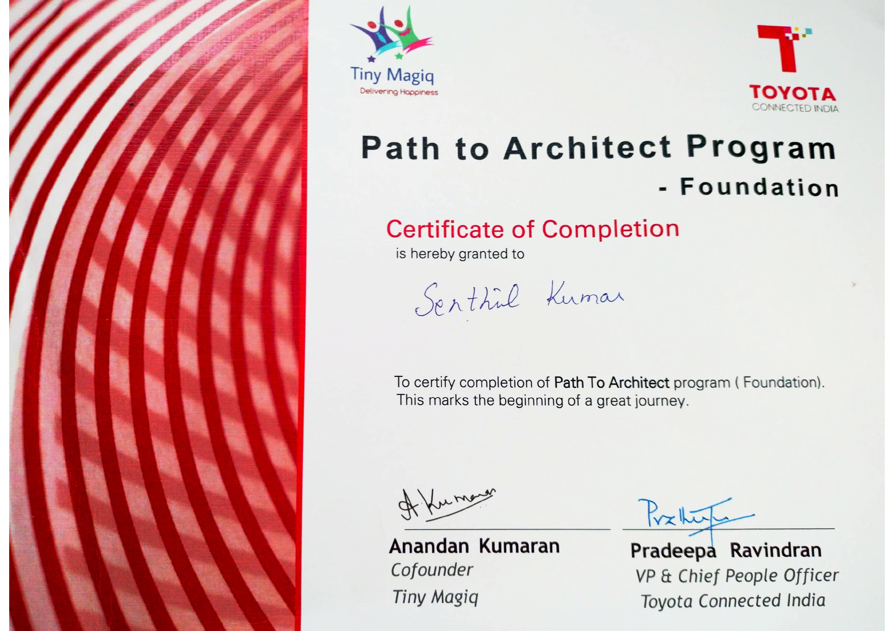{width=100%}


<br>

###### **Author:** Senthil Kumar

---

## Agenda

* First Things First - Understanding Requirements: The "Problem Framing" Frontend
* What is Software Architecture - A Set of Hedging Techniques
* The Five-Pillar Lens of Architecture Decisions
* Where do you stand as an Architect? - The Leadership matrix, Explorer Reset, and the HIPPO effect
* Translating technical bets into business language
* A Few More Frameworks to fine-tune Architecture Thinking
* Closing thoughts

---

## 0. Understanding Requirements: The "Problem Framing" Frontend to Architecture Decisions

This section - Business Requirements Understanding - sits before architecture decisions. 

Understanding requirements is a pre-requisite before

* Part 1 - Sizing a bet (MVE-will be discussed later) or 
* Part 2 - Hedge the bet taken (architecture) 


```{mermaid}
flowchart LR
    A["Part 0: Frame the problem<br/>Requirements + Constraints"] --> B["Part 1: Is it worth building?<br/>MVE / Spike"]
    B --> C["Part 2: Survive being wrong<br/>Architecture Hedging"]
    C --> D["Engineering builds the bet"]
```

### From Business Requirements to Architecture decisions

```{mermaid}
flowchart TD
    BR["Business Requirements<br/><br/><i>Why — goals, outcomes, ROI</i>"] --> SR["Stakeholder Requirements<br/><br/><i>Who needs what</i>"]
    SR --> FR["Functional Requirements<br/><br/><i>What the system does</i>"]
    SR --> NFR["Non-Functional Requirements<br/><br/><i>How well it must do it</i>"]
    CON["Constraints<br/><br/><i>Budget, regulatory, tech, time</i>"] --> ASR
    ASM["Assumptions<br/><br/><i>What we bet is true</i>"] --> ASR
    FR --> ASR["Architecturally<br/><br/>Significant Requirements"]
    NFR --> ASR
    ASR --> DEC["Architecture Decisions"]
```

Before asking "is it worth building," an architect asks "do I understand what is being asked?" Requirements are not flat. They form a hierarchy:

* Business Requirements — the why. The outcome the business is funding.
* Functional Requirements — the what. The behavior the system must exhibit.
* Non-Functional Requirements (Quality Attributes) — the how well. Latency, availability, security, scalability. Architecture is driven far more by NFRs than by features.
* Constraints — the non-negotiables. Budget, compliance, existing stack, deadline.
* Assumptions — the unstated bets. Documented, because every one of them can be wrong.

> * The trap: treating every requirement as equally important. 
> * The skill is isolating the Architecturally Significant Requirements — the small subset that, if wrong, is expensive to reverse. Those, and only those, drive the hedging in Part 2.


---

## I. The First Princples Thinking: What is Software Architecture?

* The answer lies in the answer to two further drill down questions:
    * Is the idea worth building?
    * If built, how do we survive wrong decisions? 

> * v1: *Architecture is the set of design decisions that must be made early in a project*
> * v2: *Architecture is the way the highest level of components of a system are wired together.* 
> * v3: *Architecture thinking helps in recognizing the most important elements that are likely to result in serious problems, should they not be controlled
> * Sources: [Martin Fowler's Architecture Blog](https://martinfowler.com/architecture/) and [Martin Fowler - What is Architecture](https://martinfowler.com/ieeeSoftware/whoNeedsArchitect.pdf)


* **My personal Definition**: 
* *Architecture is a set of "Hedging techniques/strategies" when building a software*

### Architectural Thinking = Hedging Strategies

> A good quote from the Workshop by [Anandan Kumaran](https://www.linkedin.com/in/akumaran/):
> * Engineering places the bet. Architecture hedges the bet.
> * Engineering commits to a solution. Architecture assumes uncertainty and creates fallback paths.

####  Part 1 of Architecture Decisioning: Is the idea worth building?

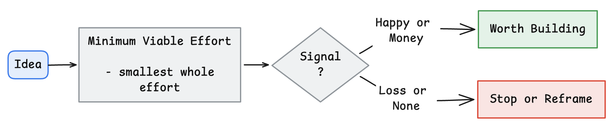

- A Minimum Viable Effort (MVE - a word play on MVP; MVE could be considered a subset of MVP) sits upstream of architecture. It reduces the size of the bet.
- MVE could be defined as: the absolute smallest action/step that can give a signal. 
- In Agile Project Management world, it could be similar to [**a spike story**](https://www.wrike.com/agile-guide/faq/what-is-a-spike-story-in-agile/)

#### Part 2 of Architecture Decisioning: If we build it, how do we survive being wrong?

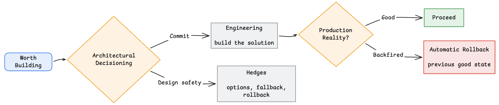

- Architecture then reduces the blast radius of the bet. 
- Engineering executes the bet once it is worth taking. 


#### Surviving Wrong Decision: (1) Blue-Green Deployment

Blue-green deployment is architectural hedging in its most practical form. [Martin Fowler’s original writeup](https://martinfowler.com/bliki/BlueGreenDeployment.html) remains the cleanest explanation.

* You deploy a new green version.
* You keep the old blue version alive.
* If reality disagrees with your assumptions, you switch traffic rather than rebuilding under pressure.

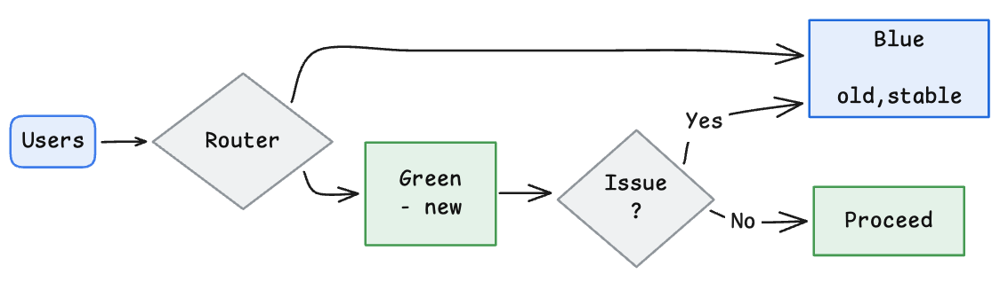

#### Surviving Wrong Decision: (2) Canary Releases & (3) Feature Flags

* *Not All Risk is the Same Risk*


- Matching the hedging strategy to the risk: Replicas Handle Failure, Blue-Green Handles Regret

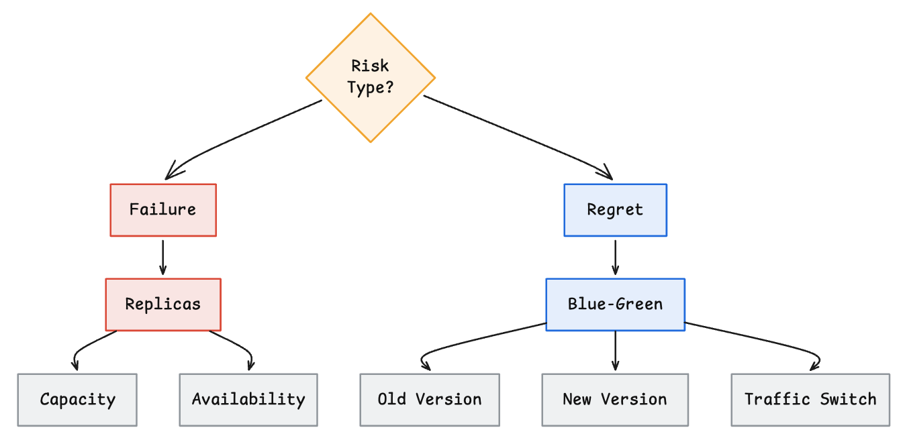


- Blue-green is a coarse hedge. We flip all traffic from one full environment to another. 
- Sometimes we want a smaller, more controlled bet. That is where **canary releases** and **feature flags** come in.

- In Feature Flags, for certain users, some features are turned ON for testing
- In Canary Release, only a certain small section of users are tested first before going fully into new version


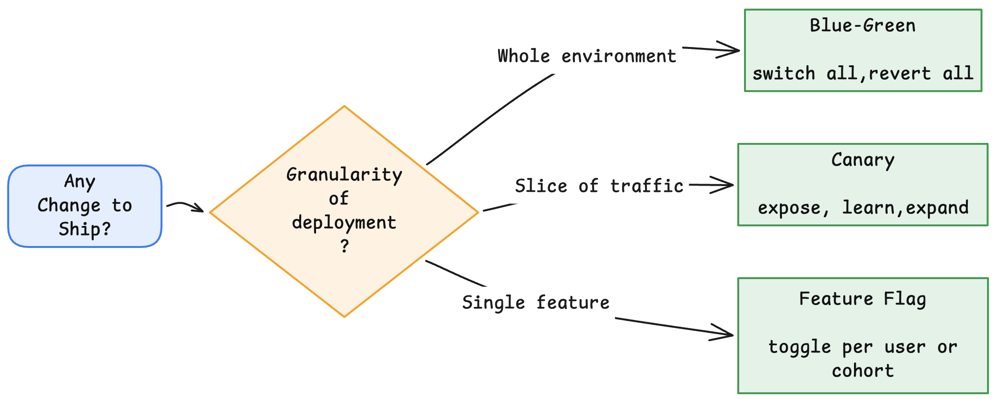

**Sources**:
- [FeatureFlag](https://martinfowler.com/bliki/FeatureFlag.html)
- [CanaryRelease](https://martinfowler.com/bliki/CanaryRelease.html)


---

## II. The Five-Pillar Lens of Product / Architecture Decisions

Architecture decisions should be evaluated through five lenses:

- Quality
- Design
- Business
- Engineering
- Human Dynamics


A highly opinionated view (in a way this prioritizes the pillars)

* Business Strategy = Entry Fee before building a product
* Design + Engineering = The compulsory hardwork while building the product
* Human Dynamics = The differentiator


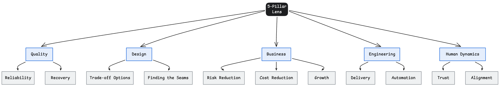

As Architects, we must think negative:  
* No pillar is allowed to "win" silently. Trade-offs across all five must be explicit.
* Optimizing one pillar in isolation creates silent debt in another

### What Each Pillar Is and Isn't

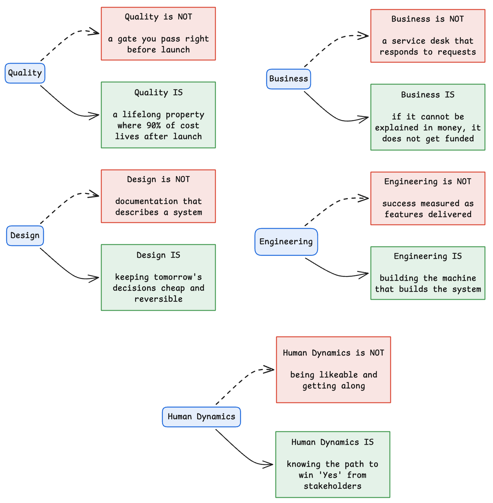

### The Quality Pillar is where NFRs live — and get *measured*

A pillar you cannot measure is a slogan. Quality is not a launch gate. It is the home of NFRs (reliability, recovery, latency, security) that must be verified continuously, not declared once.

* "99.9% uptime" is a wish. A **fitness function** (an automated check on an architectural characteristic) makes it a property.
* NFRs are **leading indicators**. The outcomes they protect (churn, revenue, trust) are **lagging**. Fix the leading ones first.
* Every NFR needs an owner, a number, and a test. Without them, it becomes silent debt elsewhere.

### Constraints & Assumptions as First-Class Citizens

Trade-offs happen inside a box. Constraints are the walls. Assumptions hold them up. Write both down before building, not mid-build.

* **Constraints** are non-negotiables: budget, compliance, existing stack, deadline, team topology. You cannot "choose" what a constraint already decided.
* **Assumptions** are unstated bets: expected load, data volumes, third-party SLAs, "the team knows Kubernetes." Each can be wrong. Each is a hedging candidate for Part 2.
* Make them explicit. An unwritten constraint becomes a production incident. An unwritten assumption becomes a post-mortem line item.

---

## III. Leadership Matrix and the HIPPO Effect

The workshop describes growth across two dimensions.

- Impact (Self, Team, Org, Industry)
- Archetype (Explorer, Alchemist, Maverick, Oracle)

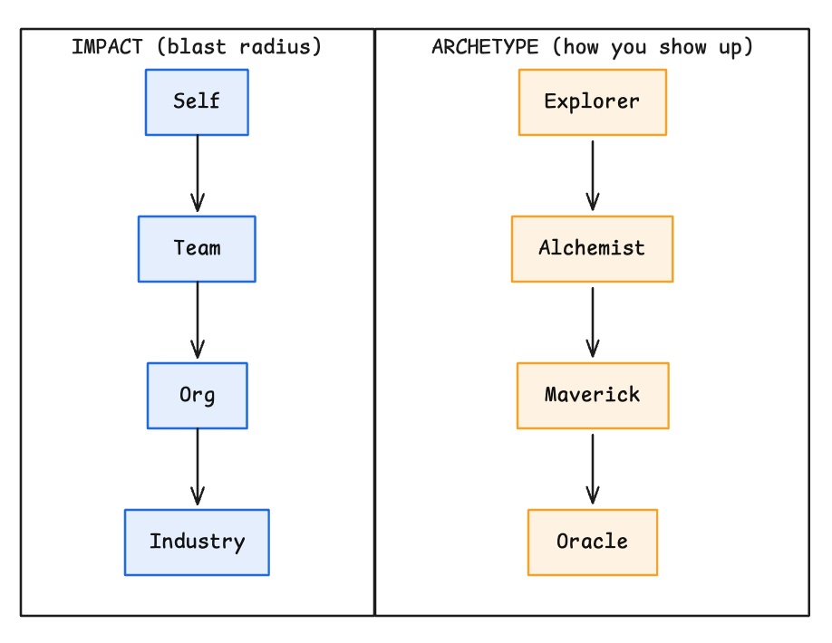

The most useful insight is the growth model.

Every time impact expands beyond a threshold, an Orcale resets to an Explorer.

```{mermaid}
stateDiagram-v2
    [*] --> Explorer
    Explorer --> Alchemist
    Alchemist --> Maverick
    Maverick --> Oracle
    Oracle --> Explorer: Next Level
```

Growth is not becoming a bigger expert. Growth is becoming a beginner in a larger arena.

### A note on informal power: the HIPPO effect

The workshop makes a strong distinction between formal power and informal power. Formal power comes from a title. Informal power comes from trust, tenure, and perceived seniority.

**What formal title offers**:
The [HIPPO effect](https://t2informatik.de/en/smartpedia/hippo-effect/) (Highest Paid Person’s Opinion) is a well-known name for what happens when power overrides evidence.


### Conway's Law: the org chart becomes the architecture

The HIPPO effect shows how *people in the room* shape a single decision. Conway's Law
shows how the *shape of the organization* shapes the entire system — whether you intend
it or not.

> Any organization that designs a system will produce a design whose structure is a copy
> of the organization's communication structure. — Melvin Conway

Why architects should care:

- Data does not automatically win. Room dynamics do.
- A quiet, tenured engineer can veto a decision without saying no.
- A senior leader unfamiliar with the domain can steer a design purely by leaning in.

Architects who track only formal decision-makers miss the actual decision surface. Related reading: [Bernard Marr on the HIPPO effect and data-driven decisions](https://www.forbes.com/sites/bernardmarr/2017/10/26/data-driven-decision-making-beware-of-the-hippo-effect/).

* Note: 
* Personally, I have gained respect and received brickbats countering the HIPPO effect - either by consciously or unintentionally voicing the cons of decisions by people in power
* It is important to read the room before deciding to counter the HIPPO.  

---


## IV. Translating Technical Bets into Business Language

_How do I connect code to the boardroom?_

* Don't pitch "Kubernetes"; pitch "20% cost reduction."
* Same work, different frame — audience determines vocabulary.

Architects frequently lose stakeholder support because they stop at technical reasoning. The workshop repeatedly emphasizes business translation.

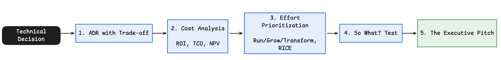

A few of the tools that help in converting a decision to a durable outcome: 


### 1. ADRs (Architecture Decision Records) with Trade-Offs Documented

> _How do I prevent "Why did we do this" debates?_

- 20‑minute investment capturing: what we decided, why, and what we traded away.
- "The palest ink beats the best memory."

### 2. Cost Analysis


**The Holy Trinity (Risk, Cost, Growth)** — _What do executives actually fund?_

- If your pitch doesn't hit Risk reduction, Cost optimization, or Growth in 30 seconds, you've lost.
- Never pitch technology; pitch the solution to a painful business problem.

#### ROI (Return on Investment)

- Simple ratio of gain to cost.
- Formula: (Gain minus Cost) divided by Cost.
- Best for comparing options over a short horizon.
- Weakness: it hides timing. A slow 40 percent return can be worse than a fast 20 percent one. That is where [XIRR](https://support.zerodha.com/category/console/portfolio/console-holdings/articles/xirr-and-cagr-for-equity) is used
- [Reference](https://www.investopedia.com/terms/r/returnoninvestment.asp)

#### TCO (Total Cost of Ownership)

- Sum of all direct and indirect costs over the life of a system.
- Includes licensing, infrastructure, operations, support, migration, retirement.
- Best for choosing between systems that look cheap upfront but expensive later, and vice versa.


#### NPV (Net Present Value)

- Value of a future cash flow expressed in today’s money.
- It respects time. A dollar earned in three years is worth less than a dollar earned today.
- Best for long-lived investments where cash flows arrive over years.
- [Reference](https://www.investopedia.com/terms/n/npv.asp)

### 3. Effort Prioritization 

#### Run / Grow / Transform 

> _How should budget be distributed?_

- 60% Run (things that keep the "lights on"), 20% Grow (new features), 20% Transform  (thought-provoking or trend-breaking innovation).
- Don't let "Run" eat the entire budget silently.

#### RICE (Reach, Impact, Confidence, Effort)

- A prioritization framework from [Intercom’s product team](https://www.intercom.com/blog/rice-simple-prioritization-for-product-managers/).

```
(Reach x Impact x Confidence)
-----------------------------
           Effort
```

- Reach: how many people are affected in a defined period.
- Impact: how much it affects each person.
- Confidence: how sure the team is about the estimates.
- Effort: person-months of work required.
- Best for comparing initiatives with different sizes and audiences.
- Weakness: it works best for incremental improvements, less well for novel bets where reach is unknowable.


### 4. The "So What?" Test

> _How do I know if my argument has landed?_

- Ask "So what?" repeatedly until you hit a dollar sign or a human consequence.
- If you can't reach one, the proposal isn't ready.


### 5. 5-Stage Executive Pitch

- Burning Problem → Why Now (current state) → Proposed Solution → Trade‑off Map → The Ask 
  - The Ask e.g.: what should the leadership do/ why should they take in this decision.
- Skipping stages diminishes persuasive effect proportionally.

---


## V. A Few More Frameworks to fine-tune Architecture Thinking


### How to Prioritize the Right Tasks

**MuSCoW Prioritization** — _How do I scope with clarity?_

- Must / Should / Could / Won't.
- Explicit "Won't" items are as valuable as "Must‑haves" for alignment.

**Trade‑Off Matrix** — _Can I have everything?_

- No. Performance, security, modifiability compete — you must choose.
- Make the trade‑off explicit on paper before the deadline makes it for you.

**Leading vs Lagging Indicators** — _How do tech metrics connect to business outcomes?_

- Tech metrics (uptime, velocity) are leading; business metrics (churn, revenue) are lagging.
- Knowing the leading and lagging indicators help in deciding when to look for return for an effort

**Non‑Functional Requirements (The Hidden 90%)** — _What actually pays the bills?_

- Features get glory; NFRs (uptime, security, compliance, performance) determine survival.
- If you don't define them, production incidents will.

### The "People" Quotient in Architects 

**Crisis as Leadership Moment** — _What separates senior response from junior response?_

- Technical fix is table stakes; leadership response defines reputation.
- Blame processes, not people. Own the narrative.

**Principled Negotiation** — _How do I resolve conflict without politics?_

- Separate people from problem; focus on interests, not positions.
- Invent options for mutual gain; insist on objective criteria.

**Stakeholder Typology** — _Who am I dealing with?_

- Champion (highly interested in your view), 
- Gatekeeper (guarded interest in your view), 
- Skeptic (does not believe in your view), 
- Bystander (neither believes or nor disagrees - on the fence).

**The 50-30-20 split**:

* Ensure you give 50% of your attention to stakeholders highly interested in your work
* 30% of your attention on skeptics
* The last 20% of your attention spend on Gatekeepers and bystanders are most likely to be automatically won over if the majority agrees with you.

**Formal vs Informal Power** — _Who really decides?_

- Formal = title and org chart; Informal = trust, expertise, track record.
- Treating formal authority as the primary variable is one of the costliest errors.


### Some more Thoughts on "Communication"

**U‑PSA Storytelling Framework** — _How do I make a story stick?_

- U (Unusual) → Problem → Solution → Achievement.
- Without U, PSA is intellectually correct but emotionally inert; U is the ignition.

**Cumulative Unusual** — _How do I create an Aha moment from ordinary facts?_

- 50 pushups/day is boring; 200,000 pushups in 10 years is unforgettable.
- Temporal or scale compression transforms the ordinary into the unusual.

**Clarity more important than being Complete** — _What kills my message?_

- Completeness over clarity is a mistake: Clarity is a gift to the receiver; completeness is comfort for the sender.

**Ethos / Logos / Pathos** — _What makes a pitch persuasive?_

- Ethos (credibility), Logos (logic), Pathos (emotional stakes).
- All three must work together; logic alone doesn't move decisions.

**TED Talk Formula** — _What ratio drives persuasion?_

- Facts/Data: 25%, Credibility: 10%, Emotion: 65%.
- Most technical communicators over‑index on facts and under‑index on emotion.

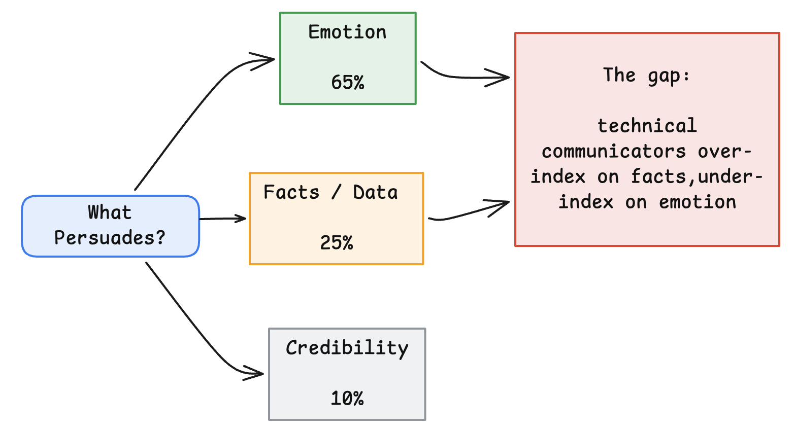

**Power of Metaphors** — _How do I make technical concepts land?_

- How much longer iPad lasts? - "10 hours of video watching" >> "4200 mAh battery."
- Metaphors translate abstractions into the brain's native format — lived experience.


## VI. Closing Thoughts

The journey from engineer to architect is not about drawing larger diagrams.

It is about becoming better at managing uncertainty.

The workshop material repeatedly returns to the same idea:

- Test the idea before committing.
- Make trade-offs explicit.
- Preserve options.
- Design for survivable failure.
- Translate decisions into outcomes.

**A final takeaway**:

> *Engineering makes progress possible. Architecture makes progress survivable.*