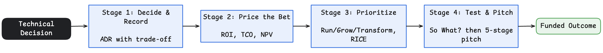
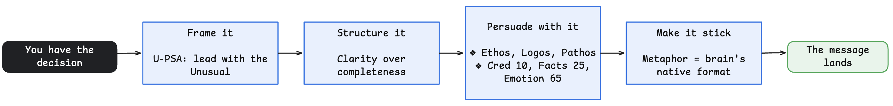

* I attended a 2-day workshop conducted by my company Toyota Connected India and TinyMagiq CoFounder [Anandan Kumaran](https://www.linkedin.com/in/akumaran/) in Feb'26.

* These are my learning notes to my future self and for all my readers.

* I have updated the notes with my own research and experiences as well

{width=100%}


<br>

###### **Author:** Senthil Kumar

---

## Agenda

A walk through of the flow of this blog:

* **Frame the problem first.** - before designing or "architecting" anything.
* **Ask if the bet is even worth placing** - "Is this even worth building?"
* **Survive being wrong** - hedging with blue-green, canary, and feature flags.
* **Balance five pillars** without letting one win silently.
* **Know where you stand as an architect.** - Impact × Archetype matrix, Political Capital & HIPPO Effect
* **Translate the technical bet into business language**
* **Win the last mile** — communicate effectively so the decision lands.
* **Closing thoughts.**

---

## 0. Frame the Problem First

_The "Problem Framing" Frontend to Architecture_

This section - Business Requirements Understanding - sits before architecture decisions. 

Understanding requirements is a pre-requisite before

* Part 1 - Sizing a bet ("Minimum Valuable Effort" - will be discussed later) or 
* Part 2 - Hedge the bet taken 


```{mermaid}
flowchart LR
    A["Part 0: Frame the problem<br/>Requirements + Constraints"] --> B["Part 1: Is it worth building?<br/>MVE / Spike"]
    B --> C["Part 2: Survive being wrong<br/>Architecture Hedging"]
    C --> D["Engineering builds the bet"]
```

### From Business Requirements to Architecture decisions

```{mermaid}
flowchart TD
    BR["Business Requirements<br/><br/><i>Why — goals, outcomes, ROI</i>"] --> SR["Stakeholder Requirements<br/><br/><i>Who needs what</i>"]
    SR --> FR["Functional Requirements<br/><br/><i>What the system does</i>"]
    SR --> NFR["Non-Functional Requirements<br/><br/><i>How well it must do it</i>"]
    CON["Constraints<br/><br/><i>Budget, regulatory, tech, time</i>"] --> ASR
    ASM["Assumptions<br/><br/><i>What we bet is true</i>"] --> ASR
    FR --> ASR["Architecturally<br/><br/>Significant Requirements"]
    NFR --> ASR
    ASR --> DEC["Architecture Decisions"]
```

Before asking "is it worth building," an architect asks "do I understand what is being asked?".
<br>
Requirements are not flat. They form a hierarchy:

* Business Requirements — the why. The outcome the business is funding.
* Functional Requirements — the what. The behavior the system must exhibit.
* Non-Functional Requirements (Quality Attributes) — the how well. Latency, availability, security, scalability. Architecture is driven far more by NFRs than by features.
* Constraints — the non-negotiables. Budget, compliance, existing stack, deadline.
* Assumptions — the unstated bets. Documented, because every one of them can be wrong.

> * The trap: treating every requirement as equally important. 
> * The skill is isolating the Architecturally Significant Requirements — the small subset that, if wrong, is expensive to reverse. Those, and only those, drive the hedging in Part 2.

### Extracting Requirements: The `Phantom Sketch Artist` Technique

* Gregor Hohpe suggests ***sketching**** the requirements works better than ***asking*** for it. 
* It makes people say "Oh, that's wrong" - which is a good thing as a wrong sketch brings out the real requiremnts out of people faster 
* [refer this Hohpe podcast in YouTube](https://www.youtube.com/watch?v=F8X9_Dp3ZUk&list=PLCD51wKPfmAU&index=4)

---

## I. What is Software Architecture? A Set of Hedging Strategies

* The answer lies in the answer to two further drill down questions:
    * Is the idea worth building?
    * If built, how do we survive wrong decisions? 

> * v1: *Architecture is the set of design decisions that must be made early in a project*
> * v2: *Architecture is the way the highest level of components of a system are wired together.* 
> * v3: *Architecture thinking helps in recognizing the most important elements that are likely to result in serious problems, should they not be controlled
> * Sources: [Martin Fowler's Architecture Blog](https://martinfowler.com/architecture/) and [Martin Fowler - What is Architecture](https://martinfowler.com/ieeeSoftware/whoNeedsArchitect.pdf)

> * v4: *Architects are risk managers in disguise* - [Gregor Hohpe's blog](https://architectelevator.com/)

* **My personal Definition**: 
* *Architecture is a set of "Hedging techniques/strategies" when building a software*

### Architectural Thinking = Hedging Strategies

> A good quote from the Workshop by [Anandan Kumaran](https://www.linkedin.com/in/akumaran/):
> * Engineering places the bet. Architecture hedges the bet.
> * Engineering commits to a solution. Architecture assumes uncertainty and creates fallback paths.

####  Part 1 of Architecture Decisioning: Is the idea worth building?


- A Minimum Viable Effort (MVE - a word play on MVP; MVE could be considered a subset of MVP) sits upstream of architecture. It reduces the size of the bet.
- MVE could be defined as: the absolute smallest action/step that can give a signal. 
- In Agile Project Management world, it could be similar to [**a spike story**](https://www.wrike.com/agile-guide/faq/what-is-a-spike-story-in-agile/)

#### Part 2 of Architecture Decisioning: If we build it, how do we survive being wrong?


- Architecture then reduces the blast radius of the bet. 
- Engineering executes the bet once it is worth taking. 


##### Surviving Wrong Decision: (1) Blue-Green Deployment

Blue-green deployment is architectural hedging in its most practical form. [Martin Fowler’s original writeup](https://martinfowler.com/bliki/BlueGreenDeployment.html) remains the cleanest explanation.

* You deploy a new green version.
* You keep the old blue version alive.
* If reality disagrees with your assumptions, you switch traffic rather than rebuilding under pressure.


##### Surviving Wrong Decision: (2) Canary Releases & (3) Feature Flags

* *Not All Risk is the Same Risk*


- Matching the hedging strategy to the risk: Replicas Handle Failure, Blue-Green Handles Regret


- Blue-green is a coarse hedge. We flip all traffic from one full environment to another. 
- Sometimes we want a smaller, more controlled bet. That is where **canary releases** and **feature flags** come in.

- In Feature Flags, for certain users, some features are turned ON for testing
- In Canary Release, only a certain small section of users are tested first before going fully into new version


**Sources**:
- [FeatureFlag](https://martinfowler.com/bliki/FeatureFlag.html)
- [CanaryRelease](https://martinfowler.com/bliki/CanaryRelease.html)


---

## II. The Five-Pillar Lens of Product / Architecture Decisions

Architecture decisions should be evaluated through five lenses:

- Quality
- Design
- Business
- Engineering
- Human Dynamics


A highly opinionated view (in a way this prioritizes the pillars)

* Business Strategy = Entry Fee before building a product
* Design + Engineering = The compulsory hardwork while building the product
* Human Dynamics = The differentiator


As Architects, we must think negative:  
* No pillar is allowed to "win" silently. Trade-offs across all five must be explicit.
* Optimizing one pillar in isolation creates silent debt in another

### What Each Pillar Is and Isn't


### The Quality Pillar is where NFRs live and get *measured*

A pillar you cannot measure is a slogan. Quality is not a launch gate. It is the home of NFRs (reliability, recovery, latency, security) that must be verified continuously, not declared once.

* "99.9% uptime" is a wish. A **fitness function** (an automated check on an architectural characteristic) makes it a property.
* NFRs are **leading indicators**. The outcomes they protect (churn, revenue, trust) are **lagging**. Fix the leading ones first.
* Every NFR needs an owner, a number, and a test. Without them, it becomes silent debt elsewhere.

### Constraints & Assumptions as First-Class Citizens

Trade-offs happen inside a box. Constraints are the walls. Assumptions hold them up. Write both down before building, not mid-build.

* **Constraints** are non-negotiables: budget, compliance, existing stack, deadline, team topology. You cannot "choose" what a constraint already decided.
* **Assumptions** are unstated bets: expected load, data volumes, third-party SLAs, "the team knows Kubernetes." Each can be wrong. Each is a hedging candidate for Part 2.
* Make them explicit. An unwritten constraint becomes a production incident. An unwritten assumption becomes a post-mortem line item.

---

## III. Where Do You Stand as an Architect?

The workshop describes growth across two dimensions.

- Impact (Self, Team, Org, Industry)
- Archetype (Explorer, Alchemist, Maverick, Oracle)

**Leadership Matrix**:


The most useful insight is the growth model.

Every time impact expands beyond a threshold, an Orcale resets to an Explorer.

```{mermaid}
stateDiagram-v2
    [*] --> Explorer
    Explorer --> Alchemist
    Alchemist --> Maverick
    Maverick --> Oracle
    Oracle --> Explorer: Next Level
```

Growth is not becoming a bigger expert. Growth is becoming a beginner in a larger arena.

### Informal Power: `Political Capital` and the `HIPPO` effect

* The workshop makes a strong distinction between formal power and informal power. 
* Formal power comes from a title. Informal power comes from trust, tenure, and perceived seniority.

**What formal title offers**:
The [HIPPO effect](https://t2informatik.de/en/smartpedia/hippo-effect/) (Highest Paid Person’s Opinion) is a well-known name for what happens when power overrides evidence.


Why architects should care:

- Data does not automatically win. Room dynamics do.
- A quiet, tenured engineer ("informal power") can veto a decision without saying no.
- A senior leader unfamiliar with the domain can steer a design purely by leaning in.

Architects who track only formal decision-makers miss the actual decision surface. Related reading: [Bernard Marr on the HIPPO effect and data-driven decisions](https://www.forbes.com/sites/bernardmarr/2017/10/26/data-driven-decision-making-beware-of-the-hippo-effect/).

* Note: 
* Personally, I have gained respect and received brickbats countering the HIPPO effect - either by consciously or unintentionally voicing the cons of decisions by people in power
* It is important to read the room before deciding to counter the HIPPO. This is mentioned as "leveraging the political capital" in [Hohpe podcast in YouTube](https://www.youtube.com/watch?v=F8X9_Dp3ZUk&list=PLCD51wKPfmAU&index=4). 
    * A quip from the video: "Save capital for the decisions that actually move the needle" 

---


## IV. Translating Technical Bets into Business Language

_How do I connect code to the boardroom?_

* Don't pitch "Kubernetes"; pitch "20% cost reduction."
* Same work, different framing — audience determines vocabulary.

> * If a pitch doesn't hit one or more the holy trinity: **Risk reduction, Cost optimization, or Growth** in 30 seconds, it loses the audience

Architects frequently lose stakeholder support because they stop at technical reasoning. The workshop repeatedly emphasizes translating technical decisions to business funded outcomes.



A few of the tools that help in converting a decision to a durable outcome: 

Four stages turn a technical decision into a funded outcome.

### Stage 1 — Decide and Record (ADRs)

_How do I prevent "why did we do this" debates?_

- A 20-minute record capturing what we decided, why, and what we traded away.
- "The palest ink beats the best memory."

### Stage 2 — Price the Bet (ROI, TCO, NPV)

_What is this decision worth in money?_

**ROI (Return on Investment)** — gain over cost, best for short horizons.
- Formula: (Gain − Cost) / Cost.
- Weakness: it hides timing. A slow 40% can lose to a fast 20%. [XIRR](https://support.zerodha.com/categorye/portfolio/console-holdings/articles/xirr-and-cagr-for-equity fixes the timing blindspot.

**TCO (Total Cost of Ownership)** — the full lifetime cost.
- Licensing, infra, ops, support, migration, retirement.
- Best when something looks cheap upfront but expensive later.

**NPV (Net Present Value)** — future cash flow in today's money.
- Respects time: a dollar in three years is worth less than a dollar today.
- Best for long-lived investments.

### Stage 3 — Prioritize the Bets (Run/Grow/Transform, RICE)

_Given limited budget, which bets win?_

**Run / Grow / Transform** — the portfolio split.
- Roughly 60% Run (lights on), 20% Grow (features), 20% Transform (trend-breaking bets).
- Don't let "Run" eat the whole budget silently.

**RICE** — scores competing initiatives.

```
(Reach x Impact x Confidence)  
  ------------------------- 
           Effort
```
- Best for comparing initiatives of different sizes and audiences.
- Weakness: strong for incremental work, weak for novel bets where reach is unknowable.

### Stage 4 — Pressure-Test, then Pitch

_Is the argument ready, and how do I deliver it?_

**The "So What?" test** — ask "so what?" until you hit a dollar sign or a human consequence. If you can't reach one, the proposal isn't ready.

**The 5-stage executive pitch** — once the passes `So What` test is passed:
Burning Problem → Why Now → Proposed Solution → Trade-off Map → The Ask.
- The Ask = the specific decision you want leadership to make.
- Skipping stages weakens the pitch proportionally.

---


## V. The Architect's Last Mile: Communicating the Decision

_Once you have the right decision, how do you make it land?_



**U‑PSA Storytelling Framework** — _How do I make a story stick?_

- U (Unusual) → Problem → Solution → Achievement.
- Without U, PSA is intellectually correct but emotionally inert; U is the ignition.

**Cumulative Unusual** — _How do I create an Aha moment from ordinary facts?_

- 50 pushups/day is boring; 200,000 pushups in 10 years is unforgettable.
- Temporal or scale compression transforms the ordinary into the unusual.

**Clarity more important than being Complete** — _What kills my message?_

- Completeness over clarity is a mistake: Clarity is a gift to the receiver; completeness is comfort for the sender.

**Ethos / Logos / Pathos** — _What makes a pitch persuasive?_

- Ethos (credibility), Logos (logic), Pathos (emotional stakes).
- All three must work together; logic alone doesn't move decisions.

**TED Talk Formula** — _What ratio drives persuasion?_

- Facts/Data: 25%, Credibility: 10%, Emotion: 65%.
- Most technical communicators over‑index on facts and under‑index on emotion.


**Power of Metaphors** — _How do I make technical concepts land?_

- How much longer iPad lasts? - "10 hours of video watching" >> "4200 mAh battery."
- Metaphors translate abstractions into the brain's native format — lived experience.


## VI. Closing Thoughts

The journey from engineer to architect is not about drawing larger diagrams.
It is about becoming better at managing uncertainty/risk 

> * Gregor Hohpe's quote: "Architects are just risk managers in disguise".

The workshop material repeatedly returns to the same idea:

- Test the idea before committing.
- Make trade-offs explicit.
- Preserve options.
- Design for survivable failure.
- Translate decisions into outcomes.

Most often we toggle between code-level ("Engineering" mindset) and strategy-level ("Architect" mindset). 
How effectively we do this switch in thinking determines how successful we can become. 

**A final takeaway**:

> *Engineering makes progress possible. Architecture makes progress survivable.*


## VII. Amazing Sources

* Martin Fowler's Blog: [martinfowler.com](https://martinfowler.com/)
* Gregor Hohpe's Blog: [architectelevator.com](https://architectelevator.com/)
* TinyMagiq CoFounder [Anandan Kumaran](https://www.linkedin.com/in/akumaran/)'s teachings