> Note: The below notes contain my own writing combined with copy-paste notes from Coursera (Not to be misjudged for plagiarism)
> Most pics are from Coursera course. If a pic is taken from outside, source is cited below it
> The below notes are purely to refresh my memory when I take up any AWS exam in future. Unlike other article, the below notes are not meant to be `original`


---

# Architectue that was used in the Course

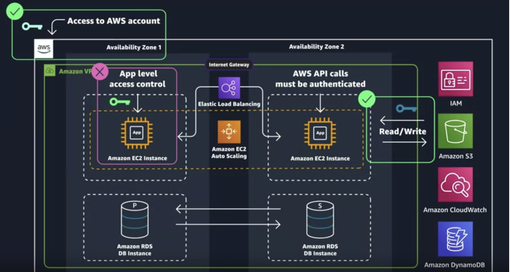

# Course Roadmap

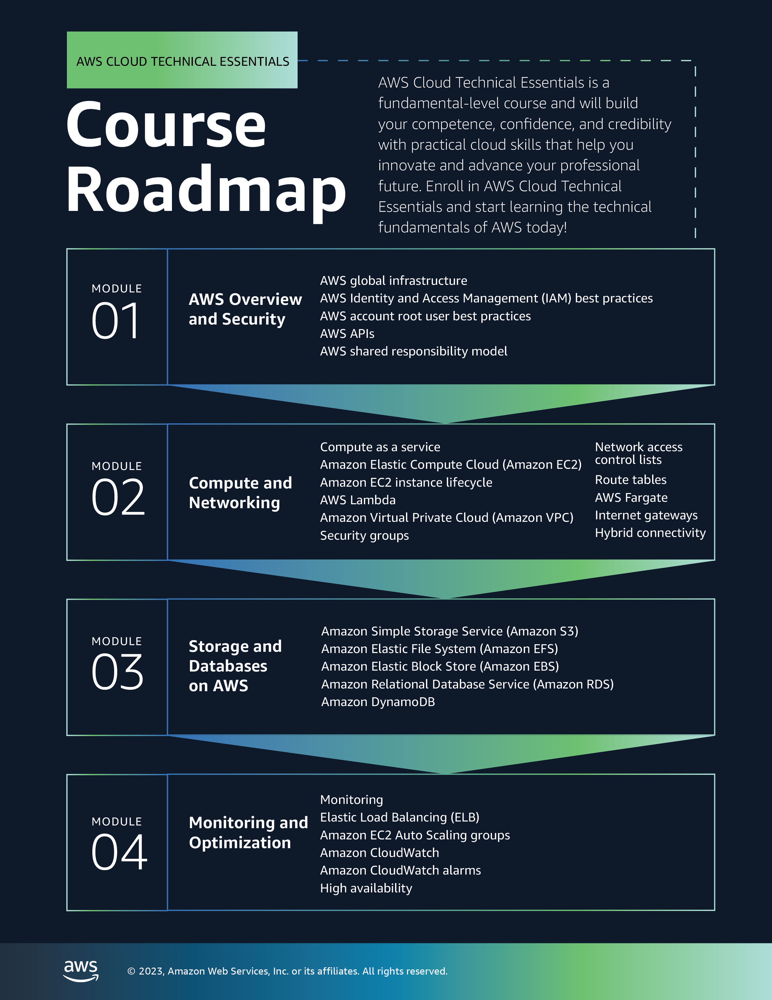

---

# What is AWS?
## What is the Cloud? 
In the past, companies and organizations hosted and maintained hardware such as compute, storage, and networking equipment in their own data centers. They needed to allocate entire infrastructure departments to take care of them, resulting in a costly operation that made some workloads and experimentation impossible.

As internet usage became more widespread, the demand for compute, storage, and networking equipment increased. For some companies and organizations, the cost of maintaining a large physical presence was unsustainable. To solve this problem, cloud computing was created.

Cloud computing is the on-demand delivery of IT resources over the internet with pay-as-you-go pricing. You no longer have to manage and maintain your own hardware in your own data centers. Companies like AWS own and maintain these data centers and provide virtualized data center technologies and services to users over the internet.

To help differentiate between running workloads on-premises versus in the cloud, consider the scenario where your developers need to deploy a new feature on your application. Before they deploy, the team wants to test the feature in a separate quality assurance (QA) environment that has the exact same configurations as production.

If you run your application on-premises, creating this additional environment requires you to buy and install hardware, connect the necessary cabling, provision power, install operating systems, and more. All of these tasks can be time-consuming and take days to perform. Meanwhile, the new product feature’s time-to-market is increasing and your developers are waiting for this environment. 

If you ran your application in the cloud, you can replicate the entire environment as often as needed in a matter of minutes or even seconds. Instead of physically installing hardware and connecting cabling, you can logically manage your physical infrastructure over the internet. 

Using cloud computing not only saves you time from the set-up perspective, but it also removes the undifferentiated heavy lifting. If you look at any application, you’ll see that some of the aspects of it are very important to your business, like the code. However, there are other aspects that are no different than any other application you might make: for instance the compute the code runs on. By removing repetitive common tasks that don’t differentiate your business, like installing virtual machines, or storing backups, you can focus on what is strategically unique to your business and let AWS handle the tasks that are time consuming and don’t separate you from your competitors. 

So where does AWS fit into all of this? Well AWS simply just provides cloud computing services. Those IT resources mentioned in the cloud computing definition are AWS services in this case. We’ll need to use these AWS services to architect a scalable, highly available, and cost effective infrastructure to host our corporate directory application. This way we can get our corporate directory app out into the world quickly, without having to manage any heavy-duty physical hardware. There are the six main advantages to running your workloads on AWS.

**The Six Benefits of Cloud Computing**: 

- Pay as you go. Instead of investing in data centers and hardware before you know how you are going to use them, you pay only when you use computing resources, and pay only for how much you use.

- Benefit from massive economies of scale. By using cloud computing, you can achieve a lower cost than you can get on your own. Because usage from hundreds of thousands of customers is aggregated in the cloud, AWS can achieve higher economies of scale, which translates into lower pay as-you-go prices.

- Stop guessing capacity. Eliminate guessing on your infrastructure capacity needs. When you make a capacity decision prior to deploying an application, you often end up either sitting on expensive idle resources or dealing with limited capacity. With cloud computing, these problems go away. You can access as much or as little capacity as you need, and scale up and down as required with only a few minutes notice.

- Increase speed and agility. IT resources are only a click away, which means that you reduce the time to make those resources available to your developers from weeks to just minutes. This results in a dramatic increase in agility for the organization since the cost and time it takes to experiment and develop is significantly lower.

- Stop spending money running and maintaining data centers. Focus on projects that differentiate your business, not the infrastructure. Cloud computing lets you focus on your customers, rather than on the heavy lifting of racking, stacking, and powering physical infrastructure. This is often referred to as undifferentiated heavy lifting.

- Go global in minutes. Easily deploy your application in multiple Regions around the world with just a few clicks. This means you can provide lower latency and a better experience for your customers at a minimal cost.

---

# AWS Global Infrastructure

Infrastructure, like data centers and networking connectivity, still exists as the foundation of every cloud application. In AWS, this physical infrastructure makes up the AWS Global Infrastructure, in the form of Availability Zones and Regions.

Here are a few examples of Region codes:

us-east-1: This is the first Region created in the east of the US. The geographical name for this Region is N. Virginia.

ap-northeast-1: The first Region created in the northeast of Asia Pacific. The geographical name for this Region is Tokyo.

AWS Regions are independent from one another. This means that your data is not replicated from one Region to another, without your explicit consent and authorization.

## CHOOSE THE RIGHT AWS REGION
Consider four main aspects when deciding which AWS Region to host your applications and workloads: latency, price, service availability, and compliance.

- **Latency**. If your application is sensitive to latency, choose a Region that is close to your user base. This helps prevent long wait times for your customers. Synchronous applications such as gaming, telephony, WebSockets, and IoT are significantly affected by higher latency, but even asynchronous workloads, such as ecommerce applications, can suffer from an impact on user connectivity.
- **Price**. Due to the local economy and the physical nature of operating data centers, prices may vary from one Region to another. The pricing in a Region can be impacted by internet connectivity, prices of imported pieces of equipment, customs, real estate, and more. Instead of charging a flat rate worldwide, AWS charges based on the financial factors specific to the location.
- **Service availability**. Some services may not be available in some Regions. The AWS documentation provides a table containing the Regions and the available services within each one.
- **Data compliance**. Enterprise companies often need to comply with regulations that require customer data to be stored in a specific geographic territory. If applicable, you should choose a Region that meets your compliance requirements.

## AVAILABILITY ZONES

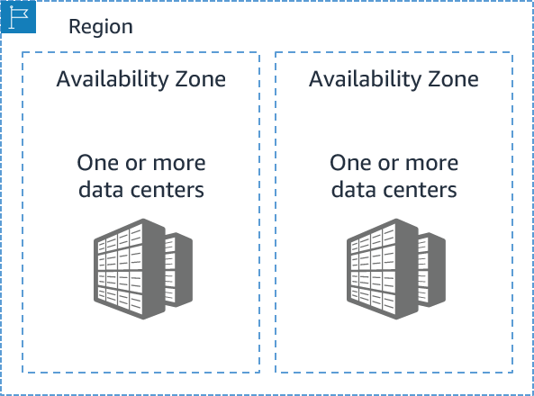

Inside every Region is a cluster of Availability Zones (AZ). An AZ consists of one or more data centers with redundant power, networking, and connectivity. These data centers operate in discrete facilities with undisclosed locations. They are connected using redundant high-speed and low-latency links.AZs also have a code name. Since they’re located inside Regions, they can be addressed by appending a letter to the end of the Region code name. For example:

us-east-1a: an AZ in us-east-1 (Northern Virginia Region)

sa-east-1b: an AZ in sa-east-1 (São Paulo Region in South America)

If you see that a resource exists in us-east-1c, you know this resource is located in AZ c of the us-east-1 Region.

## SCOPE AWS SERVICES

Depending on the AWS Service you use, your resources are either deployed at the AZ, Region, or Global level. Each service is different, so you need to understand how the scope of a service may affect your application architecture.When you operate a Region-scoped service, you only need to select the Region you want to use. If you are not asked to specify an individual AZ to deploy the service in, this is an indicator that the service operates on a Region-scope level. For region-scoped services, AWS automatically performs actions to increase data durability and availability.On the other hand, some services ask you to specify an AZ. With these services, you are often responsible for increasing the data durability and high availability of these resources.


## MAINTAIN RESILIENCY

To keep your application available, you need to maintain high availability and resiliency. A well-known best practice for cloud architecture is to use Region-scoped, managed services. These services come with availability and resiliency built in.When that is not possible, make sure the workload is replicated across multiple AZs. At a minimum, you should use two AZs. If one entire AZ fails, your application will have infrastructure up and running in at least a second AZ to take over the traffic.

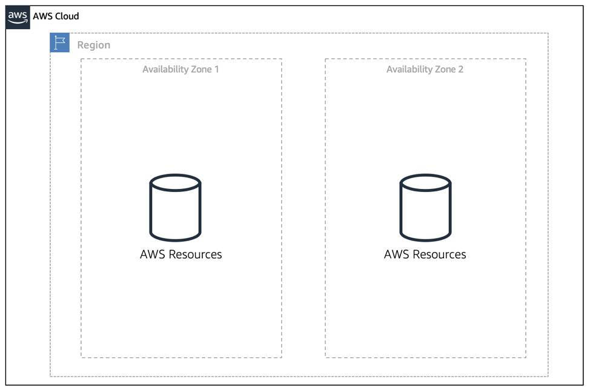

---


# Security and the AWS Shared Responsibility Model

When you begin working with the AWS Cloud, managing security and compliance is a shared responsibility between AWS and you. To depict this shared responsibility, AWS created the shared responsibility model. This distinction of responsibility is commonly referred to as security of the cloud, versus security in the cloud.

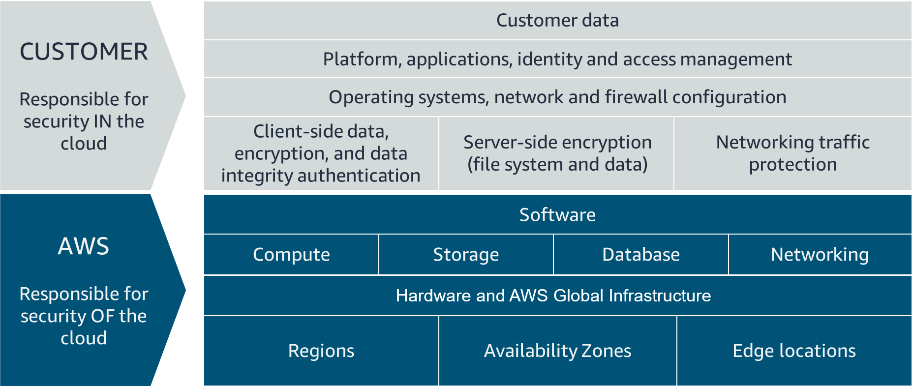

## WHAT IS AWS RESPONSIBLE FOR?
AWS is responsible for security of the cloud. This means AWS is required to protect and secure the infrastructure that runs all the services offered in the AWS Cloud. AWS is responsible for:

Protecting and securing AWS Regions, Availability Zones, and data centers, down to the physical security of the buildings

Managing the hardware, software, and networking components that run AWS services, such as the physical server, host operating systems, virtualization layers, and AWS networking components

The level of responsibility AWS has depends on the service. AWS classifies services into three different categories. The following table provides information about each, as well as the AWS responsibility.


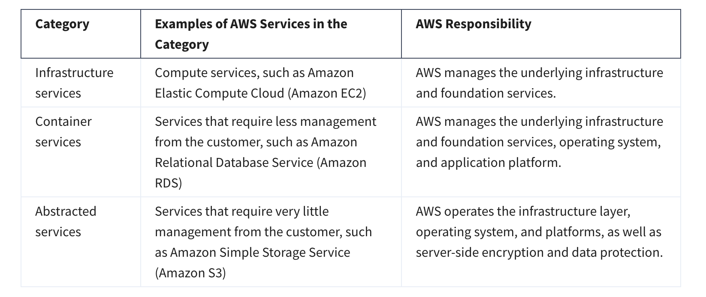

Note: 
- Container services refer to AWS abstracting application containers behind the scenes, not Docker container services. This enables AWS to move the responsibility of managing that platform away from customers.


## WHAT IS THE CUSTOMER RESPONSIBLE FOR?


You’re responsible for security in the cloud. When using any AWS service, you’re responsible for properly configuring the service and your applications, as well as ensuring your data is secure.The level of responsibility you have depends on the AWS service. Some services require you to perform all the necessary security configuration and management tasks, while other more abstracted services require you to only manage the data and control access to your resources. Using the three categories of AWS services, you can determine your level of responsibility for each AWS service you use.

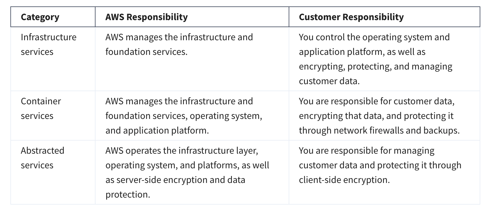


Due to the varying level of effort, it’s important to consider which AWS service you use and review the level of responsibility required to secure the service. It’s also important to review how the shared security model aligns with the security standards in your IT environment, as well as any applicable laws and regulations.It’s important to note that you maintain complete control of your data and are responsible for managing the security related to your content. Here are some examples of your responsibilities in context.

- Choosing a Region for AWS resources in accordance with data sovereignty regulations
- Implementing data protection mechanisms, such as encryption and managing backups
- Using access control to limit who has access to your data and AWS resources

---

# Protect the AWS Root User

## What’s the Big Deal About Auth?
When you’re configuring access to any account, two terms come up frequently: authentication and authorization. Though these terms may seem basic, you need to understand them to properly configure access management on AWS. It’s important to keep this mind as you progress in this course. Let’s define both terms.

## Understand Authentication
When you create your AWS account, you use a combination of an email address and a password to verify your identity. If the user types in the correct email and password, the system assumes the user is allowed to enter and grants them access. This is the process of authentication.Authentication ensures that the user is who they say they are. Usernames and passwords are the most common types of authentication, but you may also work with other forms, such as token-based authentication or biometric data like a fingerprint. Authentication simply answers the question, **“Are you who you say you are?”**

## Understand Authorization
Once you’re inside your AWS account, you might be curious about what actions you can take. This is where authorization comes in. Authorization is the process of giving users permission to access AWS resources and services. Authorization determines whether the user can perform an action—whether it be to read, edit, delete, or create resources. Authorization answers the question, **“What actions can you perform?”**

## What Is the AWS Root User?
When you first create an AWS account, you begin with a single sign-in identity that has complete access to all AWS services and resources in the account. This identity is called the AWS root user and is accessed by signing in with the email address and password that you used to create the account.

## Understand the AWS Root User Credentials
The AWS root user has two sets of credentials associated with it. One set of credentials is the email address and password used to create the account. This allows you to access the AWS Management Console. The second set of credentials is called access keys, which allow you to make programmatic requests from the 
AWS Command Line Interface (AWS CLI) or AWS API
.  Access keys consist of two parts:

1. An access key ID, for example, A2lAl5EXAMPLE
2. A secret access key, for example, wJalrFE/KbEKxE

Similar to a username and password combination, you need both the access key ID and secret access key to authenticate your requests via the AWS CLI or AWS API. Access keys should be managed with the same security as an email address and password.

## Follow Best Practices When Working with the AWS Root User
Keep in mind that the root user has complete access to all AWS services and resources in your account, as well as your billing and personal information. Due to this, securely lock away the credentials associated with the root user and do not use the root user for everyday tasks.  To ensure the safety of the root user:

- Choose a strong password for the root user.
- Never share your root user password or access keys with anyone.
- Disable or delete the access keys associated with the root user.
- Do not use the root user for administrative tasks or everyday tasks.

**When is it OK to use the AWS root user?**
There are some tasks where it makes sense to use the AWS root user. Check out the links at the end of this section to read about them.
Link: [aws_tasks-that-require-root](https://docs.aws.amazon.com/IAM/latest/UserGuide/id_root-user.html#root-user-tasks)

## Delete Your Keys to Stay Safe
If you don't already have an access key for your AWS account root user, don't create one unless you absolutely need to. If you do have an access key for your AWS account root user and want to delete the keys:

Go to the 
 My Security Credentials page
 in the AWS Management Console and sign in with the root user’s email address and password.

Open the Access keys section.

Under Actions, click Delete.

Click Yes.

## The Case for Multi-Factor Authentication
When you create an AWS account and first log in to that account, you use single-factor authentication. Single-factor authentication is the simplest and most common form of authentication. It only requires one authentication method. In this case, you use a username and password to authenticate as the AWS root user. Other forms of single-factor authentication include a security pin or a security token.However, sometimes a user’s password is easy to guess. 

For example, your coworker Bob’s password, IloveCats222, might be easy for someone who knows Bob personally to guess, because it’s a combination of information that is easy to remember and describes certain things about Bob (1. Bob loves cats, and 2. Bob’s birthday is February 22).

If a bad actor guessed or cracked Bob’s password through social engineering, bots, or scripts, Bob might lose control of his account. Unfortunately, this is a common scenario that users of any website often face.

This is why using MFA has become so important in preventing unwanted account access. MFA requires two or more authentication methods to verify an identity, pulling from three different categories of information.

Something you know, such as a username and password, or pin number

Something you have, such as a one-time passcode from a hardware device or mobile app

Something you are, such as fingerprint or face scanning technology

Using a combination of this information enables systems to provide a layered approach to account access. Even though the first method of authentication, Bob’s password, was cracked by a malicious user, it’s very unlikely that a second method of authentication, such as a fingerprint, would also be cracked. This extra layer of security is needed when protecting your most sacred accounts, which is why it’s important to enable MFA on your AWS root user.

## Use MFA on AWS
If you enable MFA on your root user, you are required to present a piece of identifying information from both the something you know category and the something you have category. The first piece of identifying information the user enters is an email and password combination. The second piece of information is a temporary numeric code provided by an MFA device.Enabling MFA adds an additional layer of security because it requires users to use a supported MFA mechanism in addition to their regular sign-in credentials. It’s best practice to enable MFA on the root user.

## Review Supported MFA Devices
AWS supports a variety of MFA mechanisms, such as virtual MFA devices, hardware devices, and Universal 2nd Factor (U2F) security keys. For instructions on how to set up each method, check out the Resources section.

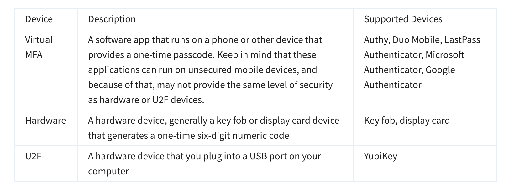

---

# Introduction to AWS Identity and Access Management

## WHAT IS IAM?
IAM is a web service that enables you to manage access to your AWS account and resources. It also provides a centralized view of who and what are allowed inside your AWS account (authentication), and who and what have permissions to use and work with your AWS resources (authorization).With IAM, you can share access to an AWS account and resources without having to share your set of access keys or password. You can also provide granular access to those working in your account, so that people and services only have permissions to the resources they need. For example, to provide a user of your AWS account with read-only access to a particular AWS service, you can granularly select which actions and which resources in that service they can access.


## GET TO KNOW THE IAM FEATURES

To help control access and manage identities within your AWS account, IAM offers many features to ensure security.

- IAM is global and not specific to any one Region. This means you can see and use your IAM configurations from any Region in the AWS Management Console.

- IAM is integrated with many AWS services 
by default


- You can establish password policies in IAM to specify complexity requirements and mandatory rotation periods for users.

- IAM supports MFA.

- IAM supports identity federation, which allows users who already have passwords elsewhere—for example, in your corporate network or with an internet identity provider—to get temporary access to your AWS account.

- Any AWS customer can use IAM; the service is offered at no additional charge.

## WHAT IS AN IAM USER?

An IAM user represents a person or service that interacts with AWS. You define the user within your AWS account. And any activity done by that user is billed to your account. Once you create a user, that user can sign in to gain access to the AWS resources inside your account.You can also add more users to your account as needed. For example, for your cat photo application, you could create individual users in your AWS account that correspond to the people who are working on your application. Each person should have their own login credentials. Providing users with their own login credentials prevents sharing of credentials.

## IAM USER CREDENTIALS

An IAM user consists of a name and a set of credentials. When creating a user, you can choose to provide the user:

- Access to the AWS Management Console
- Programmatic access to the AWS Command Line Interface (AWS CLI) and AWS Application Programming Interface (AWS API)

To access the AWS Management Console, provide the users with a user name and password. For programmatic access, AWS generates a set of access keys that can be used with the AWS CLI and AWS API. IAM user credentials are considered permanent, in that they stay with the user until there’s a forced rotation by admins.When you create an IAM user, you have the option to grant permissions directly at the user level.This can seem like a good idea if you have only one or a few users. However, as the number of users helping you build your solutions on AWS increases, it becomes more complicated to keep up with permissions. For example, if you have 3,000 users in your AWS account, administering access becomes challenging, and it’s impossible to get a top-level view of who can perform what actions on which resources.If only there were a way to group IAM users and attach permissions at the group level instead. Guess what: There is!

## WHAT IS AN IAM GROUP?

An IAM group is a collection of users. All users in the group inherit the permissions assigned to the group. This makes it easy to give permissions to multiple users at once. It’s a more convenient and scalable way of managing permissions for users in your AWS account. This is why using IAM groups is a best practice.If you have a an application that you’re trying to build and have multiple users in one account working on the application, you might decide to organize these users by job function. You might want IAM groups organized by developers, security, and admins. You would then place all of your IAM users in the respective group for their job function.This provides a better view to see who has what permissions within your organization and an easier way to scale as new people join, leave, and change roles in your organization.Consider the following examples.

- A new developer joins your AWS account to help with your application. You simply create a new user and add them to the developer group, without having to think about which permissions they need.

- A developer changes jobs and becomes a security engineer. Instead of editing the user’s permissions directly, you can instead remove them from the old group and add them to the new group that already has the correct level of access.

Keep in mind the following features of groups.

- Groups can have many users.
- Users can belong to many groups.
- Groups cannot belong to groups.


The root user can perform all actions on all resources inside an AWS account by default. This is in contrast to creating new IAM users, new groups, or new roles. New IAM identities can perform no actions inside your AWS account by default until you explicitly grant them permission.The way you grant permissions in IAM is by using IAM policies.

## WHAT IS AN IAM POLICY?

To manage access and provide permissions to AWS services and resources, you create IAM policies and attach them to IAM users, groups, and roles. Whenever a user or role makes a request, AWS evaluates the policies associated with them. For example, if you have a developer inside the developers group who makes a request to an AWS service, AWS evaluates any policies attached to the developers group and any policies attached to the developer user to determine if the request should be allowed or denied.

## IAM POLICY EXAMPLES

Most policies are stored in AWS as JSON documents with several policy elements. Take a look at the following example of what providing admin access through an IAM identity-based policy looks like.

```json
{

"Version": "2012-10-17",    
     "Statement": [{        
          "Effect": "Allow",        
          "Action": "*",        
          "Resource": "*"     
     }]
}
```

In this policy, there are four major JSON elements: Version, Effect, Action, and Resource.

- The Version element defines the version of the policy language. It specifies the language syntax rules that are needed by AWS to process a policy. To use all the available policy features, include "Version": "2012-10-17" before the "Statement" element in all your policies.

- The Effect element specifies whether the statement will allow or deny access. In this policy, the Effect is "Allow", which means you’re providing access to a particular resource.

- The Action element describes the type of action that should be allowed or denied. In the above policy, the action is "*". This is called a wildcard, and it is used to symbolize every action inside your AWS account.

- The Resource element specifies the object or objects that the policy statement covers. In the policy example above, the resource is also the wildcard "*". This represents all resources inside your AWS console.

Putting all this information together, you have a policy that allows you to perform all actions on all resources inside your AWS account. This is what we refer to as an administrator policy.

Let’s look at another example of a more granular IAM policy.


```json
{"Version": "2012-10-17",    
     "Statement": [{        
          "Effect": "Allow",        
          "Action": [            
               "iam: ChangePassword",            
               "iam: GetUser"            
               ],        
          "Resource": "arn:aws:iam::123456789012:user/${aws:username}"    
     }]
}
```

After looking at the JSON, you can see that this policy allows the IAM user to change their own IAM password (iam:ChangePassword) and get information about their own user (iam:GetUser). It only permits them to access their own credentials because the resource restricts access with the variable substitution ${aws:username}.

## UNDERSTAND POLICY STRUCTURE

When creating a policy, it is required to have each of the following elements inside a policy statement.

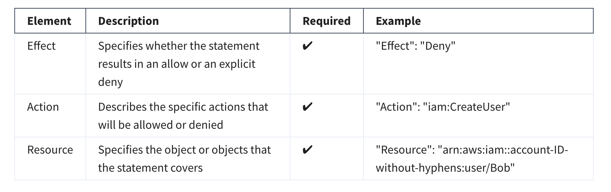


---

# Role Based Access in AWS

Throughout these last few lessons, there have been sprinklings of IAM best practices. It’s helpful to have a brief summary of some of the most important IAM best practices you need to be familiar with before building out solutions on AWS.

## LOCK DOWN THE AWS ROOT USER

The root user is an all-powerful and all-knowing identity within your AWS account. If a malicious user were to gain control of root-user credentials, they would be able to access every resource within your account, including personal and billing information. To lock down the root user:

Don’t share the credentials associated with the root user.

Consider deleting the root user access keys.

Enable MFA on the root account.

## FOLLOW THE PRINCIPLE OF LEAST PRIVILEGE

Least privilege is a standard security principle that advises you to grant only the necessary permissions to do a particular job and nothing more. To implement least privilege for access control, start with the minimum set of permissions in an IAM policy and then grant additional permissions as necessary for a user, group, or role.

## USE IAM APPROPRIATELY

IAM is used to secure access to your AWS account and resources. It simply provides a way to create and manage users, groups, and roles to access resources within a single AWS account. IAM is not used for website authentication and authorization, such as providing users of a website with sign-in and sign-up functionality. IAM also does not support security controls for protecting operating systems and networks.

## USE IAM ROLES WHEN POSSIBLE

Maintaining roles is easier than maintaining users. When you assume a role, IAM dynamically provides temporary credentials that expire after a defined period of time, between 15 minutes and 36 hours. Users, on the other hand, have long-term credentials in the form of user name and password combinations or a set of access keys.User access keys only expire when you or the admin of your account rotates these keys. User login credentials expire if you have applied a password policy to your account that forces users to rotate their passwords.

## CONSIDER USING AN IDENTITY PROVIDER

If you decide to make your cat photo application into a business and begin to have more than a handful of people working on it, consider managing employee identity information through an identity provider (IdP). Using an IdP, whether it be an AWS service such as AWS IAM Identity Center (Successor to AWS Single Sign-On) or a third-party identity provider, provides you a single source of truth for all identities in your organization.You no longer have to create separate IAM users in AWS. You can instead use IAM roles to provide permissions to identities that are federated from your IdP.For example, you have an employee, Martha, that has access to multiple AWS accounts. Instead of creating and managing multiple IAM users named Martha in each of those AWS accounts, you can manage Martha in your company’s IdP. If Martha moves within the company or leaves the company, Martha can be updated in the IdP, rather than in every AWS account you have.

## CONSIDER AWS IAM IDENTITY CENTER

If you have an organization that spans many employees and multiple AWS accounts, you may want your employees to sign in with a single credential.AWS IAM Identity Center is an IdP that lets your users sign in to a user portal with a single set of credentials. It then provides them access to all their assigned accounts and applications in one central location.AWS IAM Identity Center is similar to IAM, in that it offers a directory where you can create users, organize them in groups, and set permissions across those groups, and grant access to AWS resources. However, AWS IAM Identity Center has some advantages over IAM. For example, if you’re using a third-party IdP, you can sync your users and groups to AWS IAM Identity Center.This removes the burden of having to re-create users that already exist elsewhere, and it enables you to manage those users from your IdP. More importantly, AWS IAM Identity Center separates the duties between your IdP and AWS, ensuring that your cloud access management is not inside or dependent on your IdP.

---

### Summary:

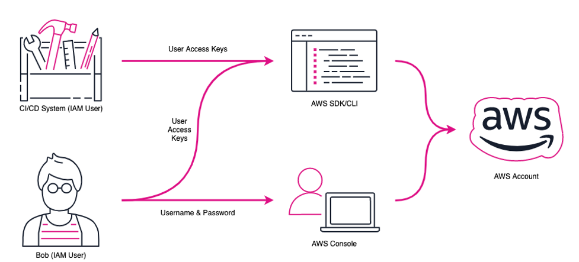
Source: AWS Blg

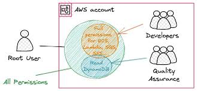
---

# Week 1's Quiz: 

[A GitHub Source for Week 1 Quiz](https://github.com/salimt/Courses-/blob/master/AWS%20Cloud%20Solutions%20Architect%20Professional/c01-%20AWS%20Cloud%20Technical%20Essentials/w1-%20Amazon%20Web%20Services%20(AWS)/Week%201%20Quiz%20_%20Coursera.pdf)

---

# Default Amazon Machine Image (AMI) for Amazon EC2

When using the user data scripts, remember to replace the <INSERT REGION HERE> with whatever AWS region you are operating in, and ensure you remove both brackets as well.

## Amazon Linux 2023 user data script: 

```bash
          #!/bin/bash -ex
          wget 
https://aws-tc-largeobjects.s3-us-west-2.amazonaws.com/DEV-AWS-MO-GCNv2/FlaskApp.zip
          unzip FlaskApp.zip
          cd FlaskApp/
          yum -y install python3-pip
          pip install -r requirements.txt
          yum -y install stress
          export PHOTOS_BUCKET=${SUB_PHOTOS_BUCKET}
          export AWS_DEFAULT_REGION=<INSERT REGION HERE>
          export DYNAMO_MODE=on
          FLASK_APP=application.py /usr/local/bin/flask run --host=0.0.0.0 --port=80 
```

---

## 2.1 Compute as a Service on AWS

## Understanding Servers
The first building block you need to host an application is a server. Servers often times can handle Hypertext Transfer Protocol (HTTP) requests and send responses to clients following the client-server model, though any API based communication also falls under this model. A client being a person or computer that sends a request, and a server handling the requests is a computer, or collection of computers, connected to the internet serving websites to internet users. These servers power your application by providing CPU, memory, and networking capacity to process users’ requests and transform them into responses. For context, common HTTP servers include:

Windows options, such as Internet Information Services (IIS).

Linux options, such as Apache HTTP Web Server, Nginx, and Apache Tomcat.

To run an HTTP server on AWS, you need to find a service that provides compute power in the AWS Management Console. You can log into the console and view the complete list of AWS compute services.


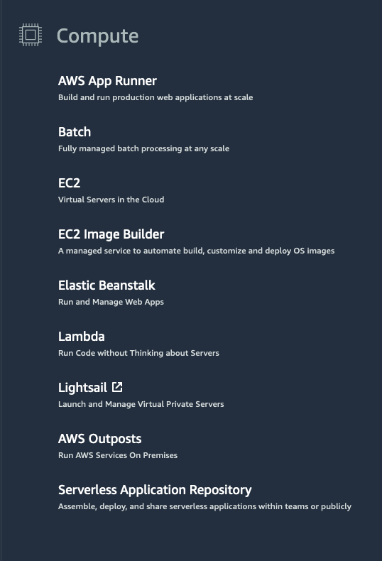

## Choose the Right Compute Option
If you’re responsible for setting up servers on AWS to run your infrastructure, you have many compute options. You need to know which service to use for which use case. 

At a fundamental level, there are three types of compute options: 
- virtual machines
- container services, and 
- serverless. 


If you’re coming to AWS with prior infrastructure knowledge, a virtual machine can often be the easiest compute option in AWS to understand. This is because a virtual machine emulates a physical server and allows you to install an HTTP server to run your applications. To run these virtual machines, you install a hypervisor on a host machine. This hypervisor provisions the resources to create and run your virtual machines.

In AWS, these virtual machines are called Amazon Elastic Compute Cloud or Amazon EC2. Behind the scenes, AWS operates and manages the host machines and the hypervisor layer. AWS also installs the virtual machine operating system, called the guest operating system.Some AWS compute services use Amazon EC2 or use virtualization concepts under the hood, therefore it is best to understand this service first before moving on to container services and serverless compute. 

A **hypervisor** is software or firmware that creates and manages virtual machines (VMs) by separating a computer's physical hardware from its operating system and applications. It allows multiple OS environments to run on a single physical machine, each with its own resources like CPU, memory, and storage. Hypervisors are fundamental to virtualization, enabling efficient use of hardware and providing flexibility, scalability, and isolation.

> Behind the scenes, AWS operates and manages the host machines and the hypervisor layer. AWS also installs the virtual machine operating system, called the guest operating system.

Some AWS compute services use Amazon EC2 or use virtualization concepts under the hood, therefore it is best to understand this service first before moving on to container services and serverless compute. 

---

## 2.2 Introduction to Amazon Elastic Compute Cloud (AWS EC2)


 Amazon EC2 is a web service that provides secure, resizable compute capacity in the cloud. It allows you to provision virtual servers called EC2 instances. Although AWS uses the phrase “web service” to describe it, it doesn’t mean that you are limited to running just web servers on your EC2 instances. You can create and manage these instances through the AWS Management Console, the AWS Command Line Interface (CLI), AWS Software Development Kits (SDKs), or through automation tools and infrastructure orchestration services.In order to create an EC2 instance, you need to define:

- **Hardware** specifications, like CPU, memory, network, and storage.
- **Logical** configurations, like networking location, firewall rules, authentication, and the operating system of your choice.

When launching an EC2 instance, the first setting you configure is which operating system you want by selecting an Amazon Machine Image (AMI).

### What Is an AMI?

In the traditional infrastructure world, the process of spinning up a server consists of installing an operating system from installation disks, installation drives, or installation wizards over the network. In the AWS Cloud, this operating system installation is no longer your responsibility, and is instead built into the AMI that you choose.Not only does an AMI let you configure which operating system you want, you can also select storage mappings, the architecture type (such as 32-bit, 64-bit, or 64-bit ARM), and additional software installed.

### What Is the Relationship Between AMIs and EC2 Instances?

> A cake is an instantiation of the cake recipe
> An EC2 instance is an instantiation of the AMI image

EC2 instances are live instantiations of what is defined in an AMI, much like a cake is a live instantiation of a cake recipe. If you are familiar with software development, you can also see this kind of relationship between a Class and an Object.

A Class is something you model and define, while an object is something you interact with. In this case, the AMI is how you model and define your instance, while the EC2 instance is the entity you interact with, where you can install your web server, and serve your content to users.When you launch a new instance, AWS allocates a virtual machine that runs on a hypervisor. Then the AMI you selected is copied to the root device volume, which contains the image used to boot the volume. In the end, you get a server you can connect to and install packages and any additional software. In this case, you install a web server along with the properly configured source code of your employee directory app. 


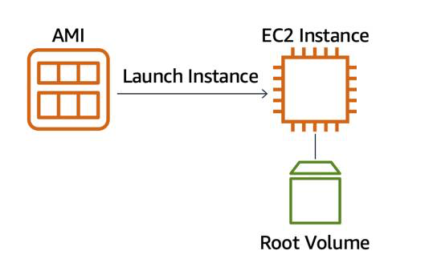

One advantage of using AMIs is that they are reusable. 

You might choose a Linux-based AMI and configure the HTTP server, application packages, and any additional software you may need to run your application. 

If you wanted to create a second EC2 instance with the same configurations, how can you easily do that? One option is to go through the entire instance creation and configuration process and try to match your settings to the first instance. However, this is time consuming and leaves room for human error. 

The second, better option, is to create an AMI from your running instance and use this AMI to start a new instance. This way, your new instance will have all the same configurations as your current instance, because the configurations set in the AMIs are the same.

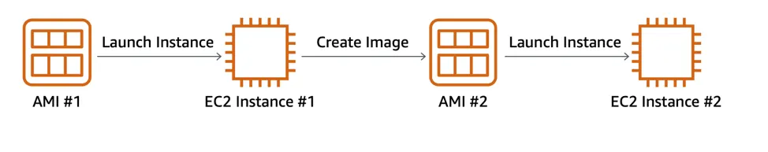

### Where Can You Find AMIs?
You can select an AMI from the following categories.

- Quick Start AMIs that are premade by AWS and allow you to get started quickly.
- AWS Marketplace AMIs that provide popular open source and commercial software from third-party vendors.
- My AMIs that are created from your EC2 instances.
- Community AMIs that are provided by the AWS user community.
- Build your own custom image with EC2 Image Builder.

### Types of EC2 Instances

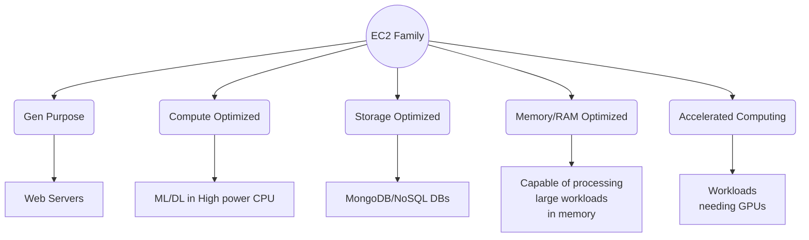
```mermaid
flowchart TD
  EC2((EC2 Family)) 
  E1(Gen Purpose)
  E2(Compute Optimized)
  E3(Storage Optimized)
  E4(Memory/RAM Optimized)
  E5(Accelerated Computing)

  U1[Web Servers]   
  U2[ML/DL in High power CPU]   
  U3[MongoDB/NoSQL DBs]
  U4[Capable of processing<br>large workloads<br>in memory]
  U5[Workloads<br>needing GPUs]

  EC2 --> E1
  EC2 --> E2
  EC2 --> E3
  EC2 --> E4
  EC2 --> E5

  E1 --> U1
  E2 --> U2
  E3 --> U3
  E4 --> U4
  E5 --> U5
```


---

## 2.3: Container Services on AWS

AWS offers a broad spectrum of compute offerings that give you the flexibility to choose the right tool for the right job. The three main categories of compute are virtual machines, containers, and serverless. There is no one-size-fits-all service because it depends on your needs.The key is to understand what each option has to offer in order to build a more appropriate cloud architecture for your use case. In this unit, you learn about containers and how to run them on AWS.Containers can host a variety of different workloads, including web applications, lift and shift migrations, distributed applications, and streamlining of development, test, and production environments.

### WHAT IS A CONTAINER?

While containers are often referred to as a new technology, the idea started in the 1970s with certain Linux kernels having the ability to separate their processes through isolation. At the time, this was configured manually, making operations complex.With the evolution of the open source software community, containers evolved. Today, containers are used as a solution to problems of traditional compute, including the issue of getting software to run reliably when it moves from one compute environment to another.


A container is a standardized unit that packages up your code and all of its dependencies. This package is designed to run reliably on any platform, because the container creates its own independent environment. This makes it easy to carry workloads from one place to another, such as from development to production or from on-premises to the cloud.

### WHAT IS DOCKER?

When you hear the word container, you may associate it with Docker. **Docker is a popular container runtime** that simplifies the management of the entire operating system stack needed for container isolation, including networking and storage. Docker makes it easy to create, package, deploy, and run containers.

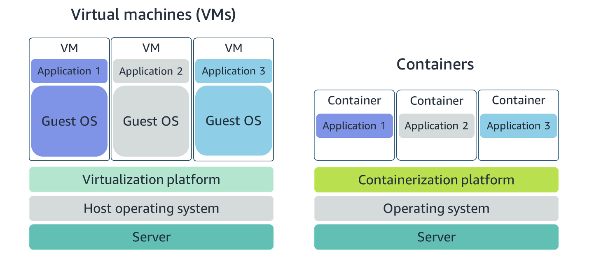


Containers share the same operating system and kernel as the host they exist on, whereas virtual machines contain their operating system. Since each virtual machine has to maintain a copy of an operating system, there’s a degree of wasted space.A container is more lightweight. They spin up quicker, almost instantly. This difference in startup time becomes instrumental when designing applications that need to scale quickly during input/output (I/O) bursts.While containers can provide speed, virtual machines offer you the full strength of an operating system and offer more resources, like package installation, a dedicated kernel, and more.

### ORCHESTRATE CONTAINERS

In AWS, containers run on EC2 instances. For example, you may have a large instance and run a few containers on that instance.While running one instance is easy to manage, it lacks high availability and scalability. Most companies and organizations run many containers on many EC2 instances across several Availability Zones.If you’re trying to manage your compute at a large scale, you need to know:

- How to place your containers on your instances.
- What happens if your container fails.
- What happens if your instance fails.
- How to monitor deployments of your containers.


This coordination is handled by a container orchestration service. AWS offers two container orchestration services: Amazon Elastic Container Service (ECS) and Amazon Elastic Kubernetes Service (EKS).

### MANAGE CONTAINERS WITH AMAZON ELASTIC CONTAINER SERVICE (AMAZON ECS)

Amazon ECS is an end-to-end container orchestration service that allows you to quickly spin up new containers and manage them across a cluster of EC2 instances.

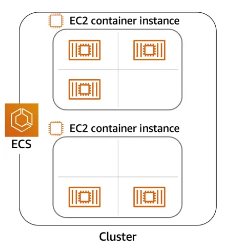


To run and manage your containers, you need to install the Amazon ECS Container Agent on your EC2 instances. This agent is open source and responsible for communicating back to the Amazon ECS service about cluster management details. You can run this agent on both Linux and Windows AMIs. An instance with the container agent installed is often called a container instance.

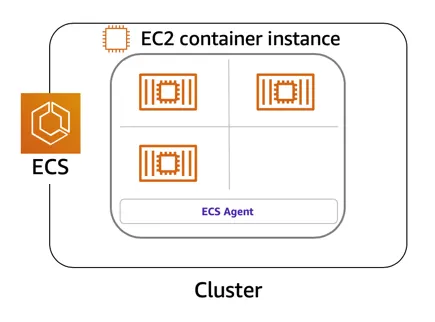


Once the Amazon ECS container instances are up and running, you can perform actions that include, but are not limited to, launching and stopping containers, getting cluster state, scaling in and out, scheduling the placement of containers across your cluster, assigning permissions, and meeting availability requirements.

To prepare your application to run on Amazon ECS, you create a task definition. The task definition is a text file, in JSON format, that describes one or more containers. A task definition is similar to a blueprint that describes the resources you need to run that container, such as CPU, memory, ports, images, storage, and networking information.

Here is a simple task definition that you can use for your corporate director application. In this example, the runs on the Nginx web server.


### Task definition
```json
{    

     "family": "webserver",    

     "containerDefinitions": [ {        

          "name": "web",        

          "image": "nginx",        

          "memory": "100",        

          "cpu": "99"    

     } ],    

     "requiresCompatibilities": [ "FARGATE" ],    

     "networkMode": "awsvpc",    

     "memory": "512",    

     "cpu": "256"

}
```

```
## Amazon ECS (Elastic Container Service):
- What it is: A fully managed container orchestration service provided by AWS.
- Technology: ECS is an AWS-native service and does not use Kubernetes. Instead, it uses its own orchestration technology.
- Docker integration: ECS works directly with Docker containers, so if you're familiar with Docker, it's relatively straightforward to use ECS. AWS handles a lot of the complex setup, such as networking and container placement, for you.

## How ECS Works:
- Container Instances (EC2 instances): In ECS, when you launch a cluster of EC2 instances, each instance runs the ECS agent. This agent is responsible for running and managing the containers on that instance. These EC2 instances are called container instances.
- Tasks: A task is an instantiation of a container or group of containers. It’s how ECS defines a running containerized application. For example, if you launch an application with multiple containers, ECS defines it as a task.
- Fargate: ECS can also use Fargate, which is a serverless compute engine. With Fargate, you don't even need to manage EC2 instances; AWS runs the containers for you in a completely managed environment.

## Key Points:
- Native to AWS: ECS is built directly on AWS, and AWS takes care of much of the complexity (like networking, scaling, and load balancing) for you.
- No Kubernetes: ECS uses AWS-native orchestration, not Kubernetes.
- Terminology: Containers running on ECS are called tasks.
```

```
## Amazon EKS (Elastic Kubernetes Service):
- What it is: A fully managed service that runs Kubernetes clusters on AWS.
- Technology: EKS uses Kubernetes, an open-source container orchestration tool originally developed by Google. While ECS is AWS-native, EKS leverages Kubernetes' widespread adoption and flexibility.
- Docker integration: EKS runs Docker containers, but it uses Kubernetes to manage and orchestrate them, instead of AWS-native orchestration technology.

## How EKS Works:
- Worker Nodes (EC2 instances): In EKS, the EC2 instances are called worker nodes, and they run your containers. These worker nodes are part of a Kubernetes cluster.
- Pods: In Kubernetes (and therefore in EKS), a pod is the smallest deployable unit. A pod can contain one or more containers that are tightly coupled. Think of a pod as the Kubernetes equivalent of a task in ECS.
- Control Plane: EKS manages the Kubernetes control plane for you. The control plane is responsible for making scheduling decisions, scaling, and managing the state of the Kubernetes cluster (worker nodes, pods, etc.).

## Key Points:
- Kubernetes-based: EKS runs on Kubernetes, which means you get access to the full set of Kubernetes features, such as advanced scheduling, load balancing, service discovery, and much more.
- More Complex but Flexible: Since Kubernetes is a flexible and powerful orchestration tool, you get more control over how your containers run, but it also comes with more complexity compared to ECS.
- Terminology: Containers running in EKS are part of a pod, not a task.
```


### USE KUBERNETES WITH AMAZON ELASTIC KUBERNETES SERVICE (AMAZON EKS)

Kubernetes is a portable, extensible, open source platform for managing containerized workloads and services. By bringing software development and operations together by design, Kubernetes created a rapidly growing ecosystem that is very popular and well established in the market.If you already use Kubernetes, you can use Amazon EKS to orchestrate these workloads in the AWS Cloud.Amazon EKS is conceptually similar to Amazon ECS, but there are some differences.

An EC2 instance with the ECS Agent installed and configured is called a container instance. In Amazon EKS, it is called a worker node.

An ECS Container is called a task. In the Amazon EKS ecosystem, it is called a pod.

While Amazon ECS runs on AWS native technology, Amazon EKS runs on top of Kubernetes.

If you have containers running on Kubernetes and want an advanced orchestration solution that can provide simplicity, high availability, and fine-grained control over your infrastructure, Amazon EKS is the tool for you.


### Terminology Comparison

| ECS | EKS |
|---|---|
| EC2 Instances where containers are run `EC2 Container Instances` | EC2 Instances where containers run `Worker Nodes` |
| A `task` refers to a set of one or more containers that are scheduled together | A `pod` - the smallest deployable unit and equivalent of `task` in ECS - consists of one or more containers that share resources |
| Summary: In ECS, the EC2 instances where containers run are called container instances because they have the ECS agent installed to manage `tasks` | Summary: In EKS (Kubernetes), the EC2 instances are called worker nodes, and they are part of the broader Kubernetes cluster. Kubernetes distributes containers (in the form of pods) to these nodes. |

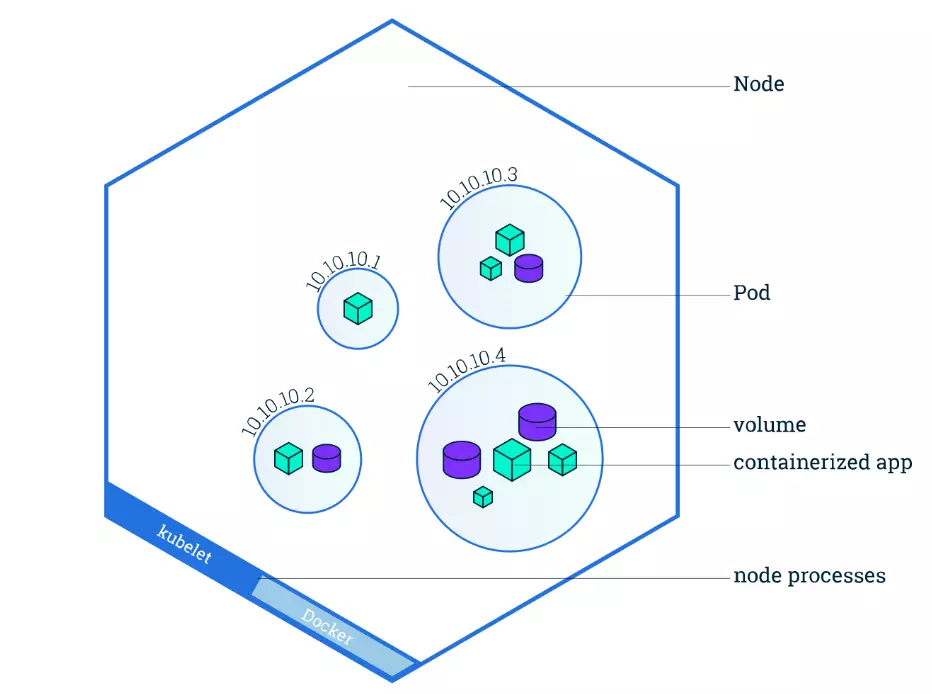

---

## 2.4 Serverless and AWS Lambda

### REMOVE THE UNDIFFERENTIATED HEAVY LIFTING

If you run your code on Amazon EC2, AWS is responsible for the physical hardware and you are responsible for the logical controls, such as guest operating system, security and patching, networking, security, and scaling.

If you run your code in containers on Amazon ECS and Amazon EKS, AWS is responsible for more of the container management, such as deploying containers across EC2 instances and managing the container cluster. 

However, when running ECS and EKS on EC2, you are still responsible for maintaining the underlying EC2 instances.

If you want to deploy your workloads and applications without having to manage any EC2 instances, you can do that on AWS with serverless compute.


### GO SERVERLESS

Every definition of serverless mentions four aspects.

- No servers to provision or manage.
- Scales with usage.
- You never pay for idle resources.
- Availability and fault tolerance are built-in.

With serverless, spend time on the things that differentiate your application, rather than spending time on ensuring availability, scaling, and managing servers.AWS has several serverless compute options, including AWS Fargate and AWS Lambda.

### EXPLORE SERVERLESS CONTAINERS WITH AWS FARGATE

Amazon ECS and Amazon EKS enable you to run your containers in two modes.

- Amazon EC2 mode
- AWS Fargate mode


AWS Fargate is a purpose-built serverless compute engine for containers. Fargate scales and manages the infrastructure, allowing developers to work on what they do best: application development.It achieves this by allocating the right amount of compute, eliminating the need to choose and handle EC2 Instances and cluster capacity and scaling. Fargate supports both Amazon ECS and Amazon EKS architecture and provides workload isolation and improved security by design.

AWS Fargate abstracts the EC2 instance so you’re not required to manage it. However, with AWS Fargate, you can use all the same ECS primitives, APIs, and AWS integrations. It natively integrates with AWS Identity and Access Management (IAM) and Amazon Virtual Private Cloud (VPC). Having native integration with Amazon VPC allows you to launch Fargate containers inside your network and control connectivity to your applications.

### RUN YOUR CODE ON AWS LAMBDA

If you want to deploy your workloads and applications without having to manage any EC2 instances or containers, you can use AWS Lambda.AWS Lambda lets you run code without provisioning or managing servers or containers. You can run code for virtually any type of application or backend service, including data processing, real-time stream processing, machine learning, WebSockets, IoT backends, mobile backends, and web apps, like your corporate directory app!

AWS Lambda requires zero administration from the user. You upload your source code and Lambda takes care of everything required to run and scale your code with high availability. There are no servers to manage, bringing you continuous scaling with subsecond metering and consistent performance.

### HOW LAMBDA WORKS

There are three primary components of a Lambda function: the trigger, code, and configuration.The code is source code, that describes what the Lambda function should run. This code can be authored in three ways.

You create the code from scratch.

You use a blueprint that AWS provides.

You use same code from the AWS Serverless Application Repository, a resource that contains sample applications, such as “hello world” code, Amazon Alexa Skill sample code, image resizing code, video encoding, and more.

When you create your Lambda function, you specify the runtime you want your code to run in. There are built-in runtimes such as Python, Node.js, Ruby, Go, Java, .NET Core, or you can implement your Lambda functions to run on a custom runtime.The configuration of a Lambda function consists of information that describes how the function should run. In the configuration, you specify network placement, environment variables, memory, invocation type, permission sets, and other configurations. To dive deeper into these configurations, check out the resources section of this unit.Triggers describe when the Lambda function should run. 

A trigger integrates your Lambda function with other AWS services, enabling you to run your Lambda function in response to certain API calls that occur in your AWS account. This makes you quicker to respond to events in your console without having to perform manual actions.All you need is the what, how, and when of a Lambda function to have functional compute capacity that runs only when you need it to.Amazon’s CTO, Werner Vogels, says, “No server is easier to manage than no server.” This quote summarizes the convenience you can have when running serverless solutions, like AWS Fargate and AWS Lambda. 

In the next unit, you apply all the information you’ve learned about Amazon EC2, Amazon ECS and Amazon EKS, and AWS Fargate and learn the use cases for each service.

AWS Lambda function handler

The AWS Lambda function handler is the method in your function code that processes events. When your function is invoked, Lambda runs the handler method. When the handler exits or returns a response, it becomes available to handle another event.You can use the following general syntax when creating a function handler in Python:

def handler_name(event, context):  ... return some_value

NAMING

The Lambda function handler name specified at the time you create a Lambda function is derived from the following:the name of the file in which the Lambda handler function is locatedthe name of the Python handler functionA function handler can be any name; however, the default on the Lambda console is lambda_function.lambda_handler. This name reflects the function name as lambda_handler, and the file where the handler code is stored in lambda_function.py.If you choose a different name for your function handler on the Lambda console, you must update the name on the Runtime settings pane.

BILLING GRANULARITY

AWS Lambda lets you run code without provisioning or managing servers, and you pay only for what you use. You are charged for the number of times your code is triggered (requests) and for the time your code executes, rounded up to the nearest 1ms (duration). AWS rounds up duration to the nearest millisecond with no minimum execution time. With this pricing, it can be very cost effective to run functions whose execution time is very low, such as functions with durations under 100ms or low latency APIs. For more information, see 
AWS News Blog
. 

SOURCE CODE

This video used a small amount of sample code illustrating a pattern for lazily generating assets using AWS Lambda and Amazon S3. If you’re looking to deploy a service to resize images to production, consider using the new release  
 Serverless Image Handler 
which is a robust solution to handle image manipulation and can be deployed via an AWS CloudFormation template.

You can find a tutorial on creating the AWS Lambda function as well as the code used in the AWS Lambda demo here: see 

---

## 2.5 Networking on AWS

### WHAT IS NETWORKING?

Networking is how you connect computers around the world and allow them to communicate with one another. In this trail, you’ve already seen a few examples of networking. One is the AWS global infrastructure. AWS has created a network of resources using data centers, Availability Zones, and Regions.

### KNOW THE NETWORKING BASICS


Think about sending a letter. When sending a letter, there are three pieces of information you need.
- Sender
- Receiver
- Payload content

Let’s go further. Each address must contain information such as:

- Name of sender and recipient
- Street
- City
- State or province
- Zip, area, or postal code
- Country


You need all parts of an address to ensure that your letter gets to its destination. Without the correct address, postal workers are not able to properly deliver the message. In the digital world, computers handle the delivery of messages in a similar way. This is called **routing**.

### WHAT ARE IP ADDRESSES?

In order to properly route your messages to a location, you need an address. Just like each home has a mail address, each computer has an IP address. However, instead of using the combination of street, city, state, zip code, and country, the IP address uses a combination of bits, 0s and 1s. 

 It’s called 32-bit because you have 32 digits of 0s and 1s. 

### WHAT IS IPV4 NOTATION?

Typically, you don’t see an IP address in this binary format. Instead, it’s converted into decimal format and noted as an Ipv4 address. 

In the diagram below, the 32 bits are grouped into groups of 8 bits, also called octets. Each of these groups is converted into decimal format separated by a period. 

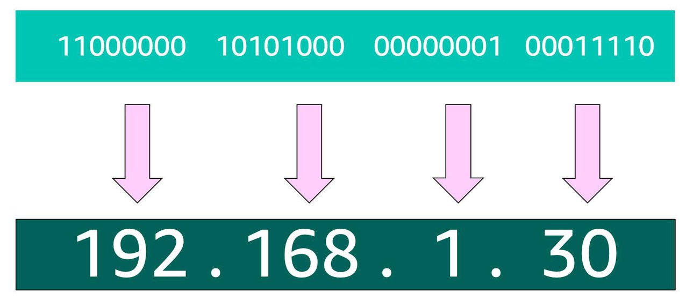

In the end, this is what is called an Ipv4 address. This is important to know when trying to communicate to a single computer. But remember, you’re working with a network. This is where CIDR Notation comes in.


### USE CIDR NOTATION

192.168.1.30 is a single IP address. If you wanted to express IP addresses between the range of 192.168.1.0 and 192.168.1.255, how can you do that? 

One way is by using Classless Inter-Domain Routing (CIDR) notation. CIDR notation is a compressed way of specifying a range of IP addresses. Specifying a range determines how many IP addresses are available to you. 

CIDR notation looks like this: 

```
192.168.1.0/24
```

It begins with a starting IP address and is separated by a forward slash (the “/” character) followed by a number. The number at the end specifies how many of the bits of the IP address are fixed. In this example, the first 24 bits of the IP address are fixed. The rest are flexible. 


```
# first 24 of the 32 bits are fixed 
192.168.1.0/24

# 192 - Fixed 
# 168 - Fixed
# 1 - Fixed
# last 8 bits - Flexible 

# each of the last 8 bits can take 0 or 1 - so two choices. 
# hence 2^8 = 256 IP addresses possible
```

When working with networks in the AWS Cloud, you choose your network size by using CIDR notation. In AWS, the smallest IP range you can have is `/28`, which provides you `16 IP addresses`. The largest IP range you can have is a `/16`, which provides you with `65,536` IP addresses.


---


```

# Q) What should be the right CIDR range to choose for my VPC? What factors dictate that? 
When should I choose a CIDR /24 or CIDR/28 and CIDR/16 range of ip addresses?

Ans: 
Factors that decide the range of the IP addresses: 
1. Size of the Network
2. Subnets
3. Growth and Scalability
4. Private vs Public Subnets
5. Peering and Inter-VPC Connectivity
6. Service Endpoints & NAT Gateways

Summary: 
/16: Best for large networks with many subnets, services, or where future scaling is critical.
/24: Suitable for mid-sized networks with a moderate number of subnets.
/28: Best for small networks, testing environments, or scenarios with very few resources.

Note: On `Subnets`

AWS reserves 5 IP addresses in every subnet, so in smaller CIDR blocks like /28 (where 16 IP addresses are available), you only have 11 usable IPs. Remaining 5 get used for subnets

```

---

## 2.6. Introduction to VPC


3 Requirements to set up a VPC: 
1. The name of your VPC.
2. A Region for your VPC to live in. Each VPC spans multiple Availability Zones within the Region you choose.
3. A IP range for your VPC in CIDR notation. This determines the size of your network. Each VPC can have up to four /16 IP ranges.

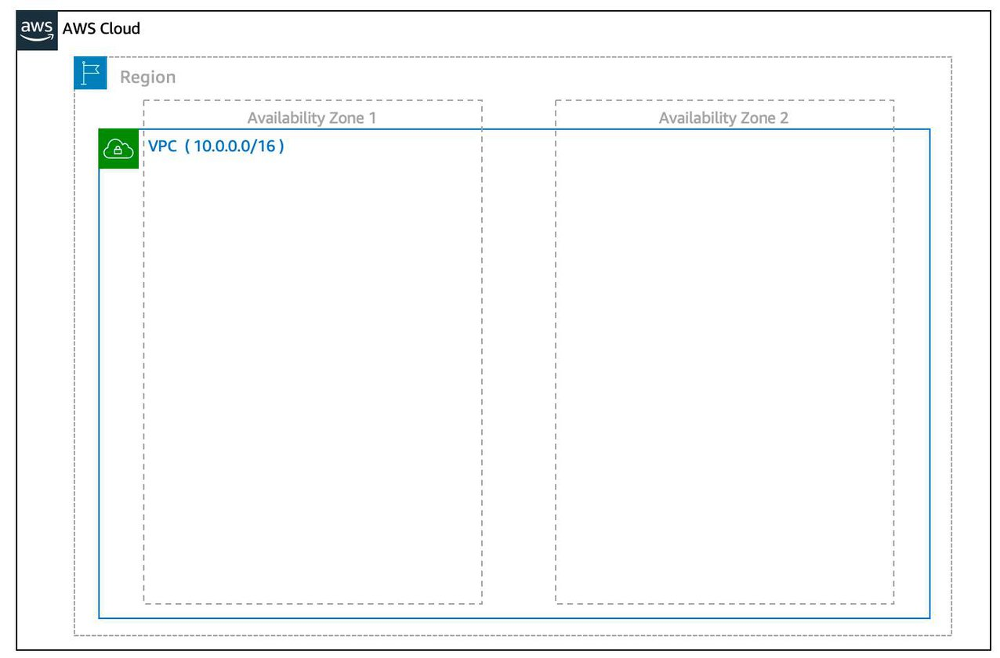

### Create a Subnet: 

After you create your VPC, you need to create subnets inside of this network. Think of subnets as smaller networks inside your base network—or virtual area networks (VLANs) in a traditional, on-premises network. In an on-premises network, the typical use case for subnets is to isolate or optimize network traffic. In AWS, subnets are used for high availability and providing different connectivity options for your resources. 

> Subnet is a subset of VPC. The size of Both Subnets and VPCs are indicated with CIDR notation.
> A VPC CIDR range is always bigger than its subnet CIDR range. 

When you create a subnet, you need to choose three settings.
1. The VPC you want your subnet to live in, in this case VPC (`10.0.0.0/16`).
2. The Availability Zone you want your subnet to live in, in this case AZ1.
3. A CIDR block for your subnet, which must be a subset of the VPC CIDR block, in this case 10.0.0.0/24.

 When you launch an EC2 instance, you launch it inside a subnet, which will be located inside the Availability Zone you choose.  

Below is an image of an EC2 instance residing inside a public subnet   

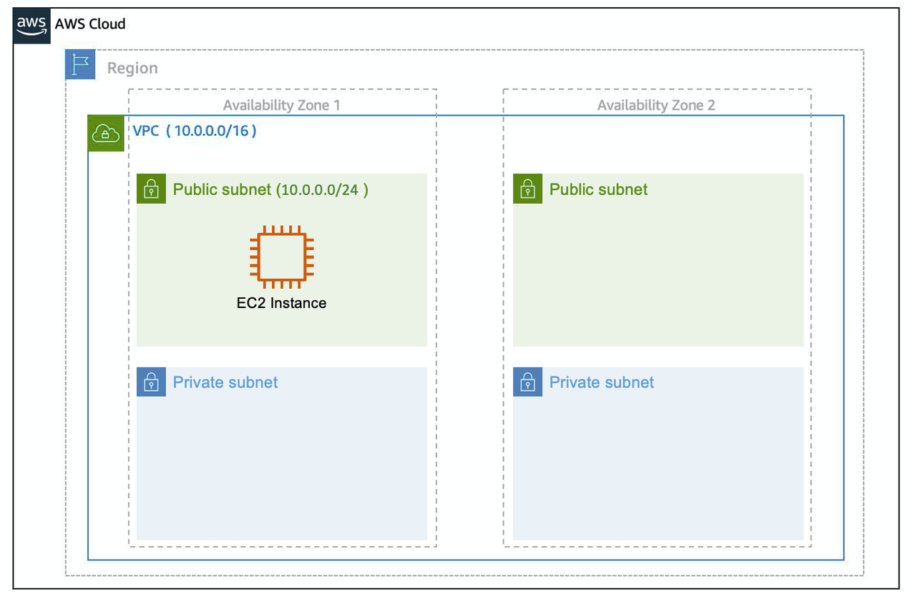

How to maintain high availability with a VPC?

- When you create your subnets, keep high availability in mind. In order to maintain redundancy and fault tolerance, create at least two subnets configured in two different Availability Zones.   

**Reserved IPs** For AWS to configure your VPC appropriately, AWS reserves five IP addresses in each subnet. These IP addresses are used for routing, Domain Name System (DNS), and network management.  

What are those 5 Reserved IPs at every Subnet? 

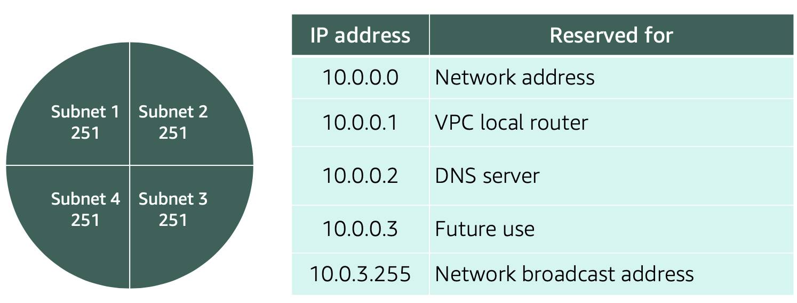

> For example, consider a VPC with the IP range 10.0.0.0/22. The VPC includes `1,024 total IP addresses`. This is divided into four equal-sized subnets, each with a `/24` IP range with `256 IP addresses`. Out of each of those IP ranges, there are only 251 IP addresses that can be used because AWS reserves five.  

Since AWS reserves these five IP addresses, it can impact how you design your network. A common starting place for those who are new to the cloud is to create a VPC with a IP range of /16 and create subnets with a IP range of /24. This provides a large amount of IP addresses to work with at both the VPC and subnet level. 

---

### Gateways

#### Internet Gateway 

- To enable internet connectivity for your VPC, you need to create an internet gateway. 

> Think of this gateway as similar to a modem. Just as a modem connects your computer to the internet, the internet gateway connects your VPC to the internet. Unlike your modem at home, which sometimes goes down or offline, an internet gateway is highly available and scalable. 

- After you create an internet gateway, you then need to attach it to your VPC.  

#### Virtual Private Gateway  


A virtual private gateway allows you to connect your AWS VPC to another private network. Once you create and attach a VGW to a VPC, the gateway acts as anchor on the AWS side of the connection. On the other side of the connection, you’ll need to connect a customer gateway to the other private network. A customer gateway device is a physical device or software application on your side of the connection. 

> Once you have both gateways, you can then **establish an encrypted VPN connection between the two sides**. 


#### NAT Gateway

NAT Gateway stands for Network Address Translation Gateway. The name "NAT" is derived from the process of Network Address Translation, which allows a device (like an EC2 instance) with a private IP address to communicate with external systems (like the internet) by **translating its private IP into a public IP** for **outbound traffic**.


**Why is it called "NAT Gateway"?**
Network Address Translation (NAT): This is the key process behind the name. NAT allows instances in a private subnet (with only private IP addresses) to send traffic to the internet by translating their private IP addresses to a public IP address as they pass through the NAT Gateway.
Gateway: It acts as a "gateway" or bridge between instances in a private subnet and external destinations, like the internet.

**Primary Function: Outbound Internet Traffic**
A NAT Gateway is primarily designed to allow outbound internet access from instances in a private subnet, while preventing inbound traffic from the internet.
When an instance in a private subnet needs to download updates or communicate with a service on the internet, it sends the request to the NAT Gateway. The NAT Gateway then makes the request on behalf of the instance using its own public IP and routes the response back to the instance.


**Important Characteristics**:
- Outbound-only:
     - NAT Gateway is designed for outbound traffic only from private subnets to the internet. It does not allow incoming traffic initiated from the internet to reach instances in private subnets.

- Security:
     - Since instances behind a NAT Gateway do not have public IP addresses, they are not directly reachable from the internet, enhancing security.


**Summary**:
NAT Gateway enables instances in private subnets to connect to the internet (e.g., to download updates or communicate with external APIs), but does not allow inbound internet traffic. It serves as a way to hide the private IP addresses of those instances from external systems while enabling them to make outgoing connections.

---

**Outbound vs. Inbound Traffic Breakdown**
Outbound Traffic refers to traffic initiated by an instance (in your private subnet) that goes out to the internet. When you send a request to download an update or access an external API, this is outbound traffic because the instance is initiating the connection.

Inbound Traffic refers to traffic initiated from the internet towards your instance. For example, a web server accepting a request from an external user would be receiving inbound traffic.

**Key Concept: Stateful Connections and Outbound Session**
NAT Gateways maintain **stateful connections**. When your instance starts a connection to the internet, the NAT Gateway tracks that connection. Any return traffic (like the update file) is automatically allowed because it is part of an ongoing session initiated by your instance.
NAT Gateway does not allow new incoming connections initiated by the external source. It only forwards responses to requests that were initiated by the private instance (which keeps the session active).


## What is built in `Public` and `Private` Subnets

```
Example Architecture Setup for Amazon.com or Facebook.com:


**Public-facing Load Balancer (ALB or NLB) in a public subnet**:

- The Load Balancer receives all incoming traffic (e.g., user requests to Amazon.com).
It distributes the traffic to a pool of web servers based on load and availability.

**Web Servers**:
- The web servers can be in either a public or private subnet. If they are in a public subnet, they have a public IP address but only accept traffic from the Load Balancer.
If they are in a private subnet, they do not have a public IP and can only receive traffic forwarded by the Load Balancer.


**Backend Components (databases, APIs, etc.) in private subnets**:
- These are isolated and only accessible from the web servers or other internal systems.
- They cannot be accessed directly from the internet, ensuring sensitive data and services are protected.

**NAT Gateway (optional for backend services)**:
- Any backend instances in the private subnet that need to initiate outbound traffic (e.g., for updates, API calls) do so through a NAT Gateway.

Summary:
- Web Servers (like Amazon.com and Facebook.com) do need to allow inbound traffic for users to access their websites. However, this traffic is typically handled in a controlled and secure manner, often through Load Balancers and strict security group rules.
- Backend systems, on the other hand, are usually hosted in private subnets and do not allow any unsolicited inbound traffic from the internet. They may make outbound requests through NAT Gateways or other secure channels.


The **key security principle** here is that inbound traffic is tightly controlled and usually mediated by a public-facing Load Balancer, while private subnets and backend systems remain isolated and protected from direct exposure to the internet.
```

---

## 2.7: Amazon VPC Routing and Security

### The Main Route Table

When you create a VPC, AWS creates a route table called the main route table. A route table contains a set of rules, called routes, that are used to determine where network traffic is directed. AWS assumes that when you create a new VPC with subnets, you want traffic to flow between them. Therefore, the default configuration of the main route table is to allow traffic between all subnets in the local network.

.png)


There are two main parts to this route table.

- The **destination**, which is a range of IP addresses where you want your traffic to go. In the example of sending a letter, you need a destination to route the letter to the appropriate place. The same is true for routing traffic. In this case, the destination is the IP range of our VPC network.

- The **target**, which is the connection through which to send the traffic. In this case, the traffic is routed through the local VPC network.

### Custom Route Tables

- Custom Route Tables are Route Tables for specific subnets 
     - granular way to route your traffic for specific subnets.  

> If you associate a custom route table with a subnet, the subnet will use it instead of the main route table. By default, each custom route table you create will have the `local` route already inside it, allowing communication to flow between all resources and subnets inside the VPC. 


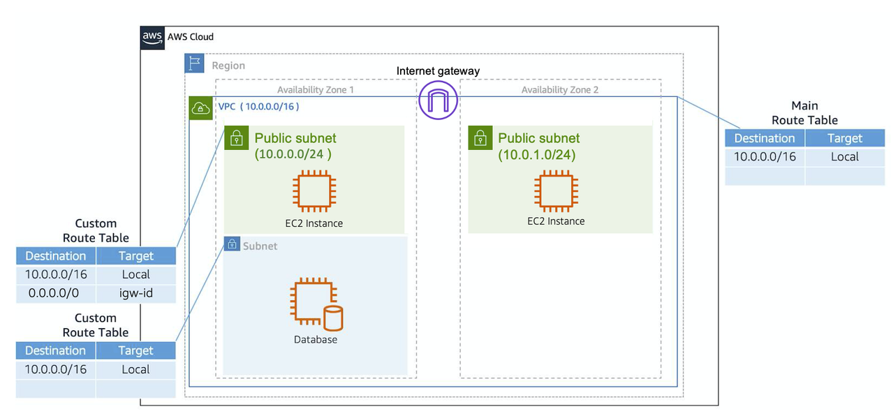


### Secure Your Subnets with Network ACLs


A NACL (Network Access Control List) is *a stateless firewall* at the subnet level in AWS that controls inbound and outbound traffic to and from subnets. 

> Network ACL’s are considered stateless, so you need to include both the inbound and outbound ports used for the protocol. If you don’t include the outbound range, your server would respond but the traffic would never leave the subnet.   

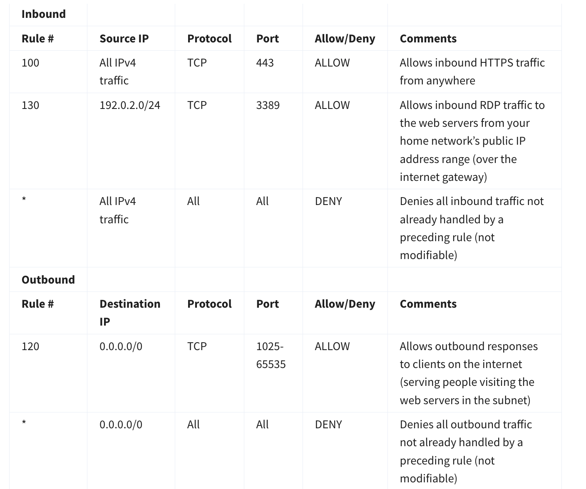

> Note the `non modifiable` rules in both `inbound` and `outbound`

### Secure Your EC2 Instances with Security Groups

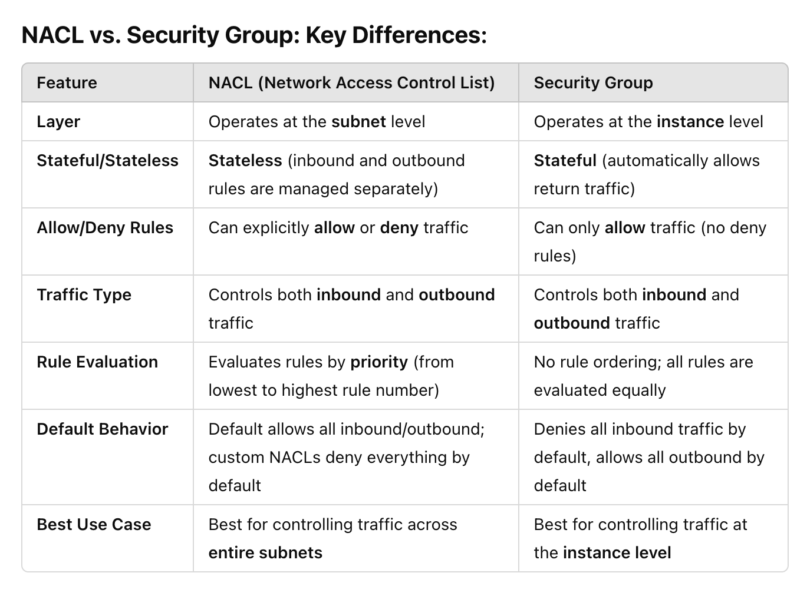

> Default Security Group Behaviour: Denies all inbound traffic by default, allows all outbound by default

If you have a web server, you may need to accept HTTP and HTTPS requests to allow that type of traffic in through your security group. You can create an inbound rule that will allow port 80 (HTTP) and port 443 (HTTPS) as shown below. 

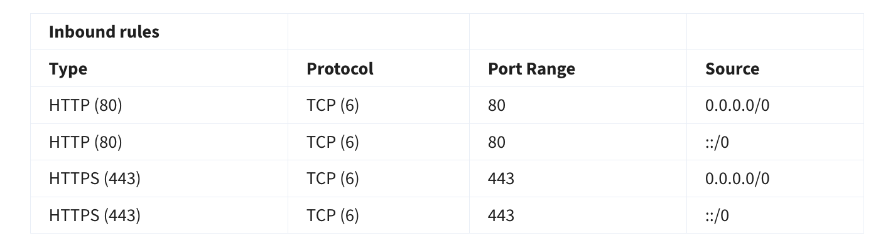

#### Port 80 vs Port 443: 

```
Q) 1. What does port 80 and port 443 signify? 
2. What does HTTP request and HTTPS request ? How are these 2 requests different

> Port 80 (HTTP): When your browser makes an HTTP request over port 80, the communication is unencrypted. 
- Anyone intercepting the data between the browser and server can read the content in plaintext.
- HTTP requests are typically used on websites where security is not a concern (e.g., static informational sites).

E.g.: `http://` websites

> Port 443 (HTTPS): When your browser makes an HTTPS request over port 443, the communication is encrypted using SSL/TLS. This means:
- The data is securely encrypted and can only be decrypted by the server and client.
- HTTPS requests are used on websites where security is important (e.g., banking, e-commerce, login forms).

E.g.: `https://` websites
```

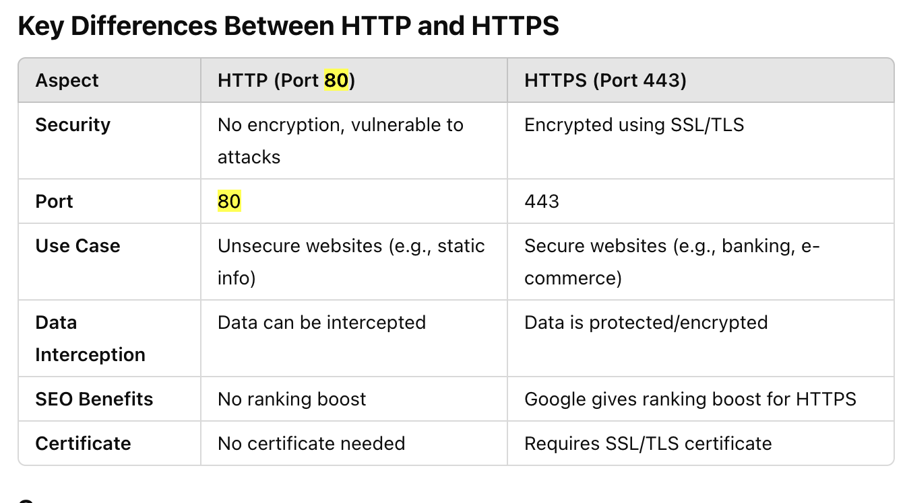


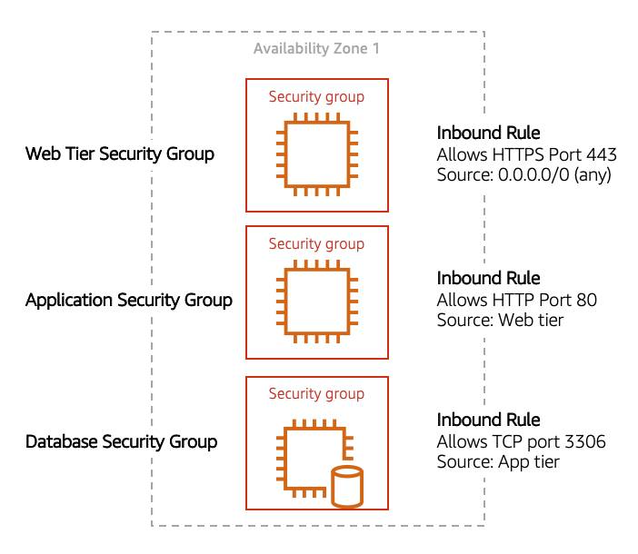


> This example allows you to define three tiers and isolate each tier with the security group rules you define. In this case, you only allow internet traffic to the web tier over HTTPS, Web Tier to Application Tier over HTTP, and Application tier to Database tier over MySQL. This is different from traditional on-premises environments, in which you isolate groups of resources via VLAN configuration. In AWS, security groups allow you to achieve the same isolation without tying it to your network. 

---

## How an EC2 Instance in a Private Subnet reaches the Internet

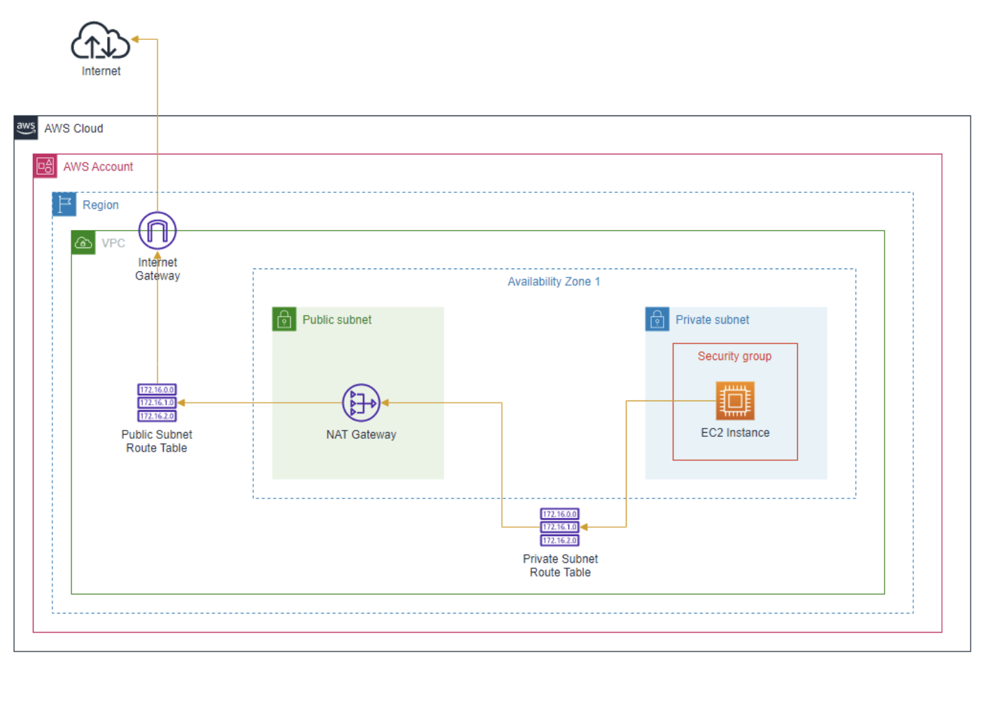

---

## 10 Common network troubleshooting steps for Amazon VPC

Below is a list of configurations you should check if you ever have `a public EC2 instance with a web application` that is not loading as expected.

1. Internet gateway
> Is IGW attached to VPC?
> Without the internet gateway, no traffic will be allowed in or out of the VPC.

2. Route tables

> Does the route table of the subnet that has the EC2 application have destination as `0.0.0.0/0` and target as `igw` ? This route allows outbound traffic to the internet and makes the subnet a `public` subnet


3. Security groups

> By default all inbound traffic is blocked. 
> Make sure there are inbound rules allowing HTTP (port 80) and/or HTTPS (port 443) traffic from the internet (0.0.0.0/0). Also, verify that outbound rules allow traffic to leave the instance.

4. Network Access Control Lists

> Check the NACLs associated with the subnet that has the EC2 instance
> NACLs are stateless, so you must explicitly allow both inbound and outbound rules that allow the http and https rules to subnet

5. Public IP address (Most important one :))

> Ensure you have `auto-assign IP address` when launching EC2 instance

6. HTTP vs HTTPS

> Confirm that your application is accessible via the correct protocol. If your application is configured for HTTPS, ensure SSL/TLS certificates are correctly installed and configured. Also, check if the web browser is trying to connect via the wrong protocol (HTTP instead of HTTPS or vice versa). For this course, the application is operating via HTTP, double check that your browser is not trying to connect via HTTPS. You can do this by selecting the address bar in the browser and making sure the address starts with http and not https.

7. User data script

> If your instance uses a user data script to configure the application on launch, verify that the script has run successfully. 

> Check the instance logs (`/var/log/cloud-init.log` or `/var/log/cloud-init-output.log`) for any errors that may have occurred during the execution of the user data script.


8. Permissions (another important one)

> Verify the permissions and roles attached to your EC2 instance. Ensure the instance has the necessary IAM roles and policies to access any required AWS services, such as S3, DynamoDB, or RDS.


9. Personal network permissions

> Ensure that your personal or corporate network does not have restrictions blocking access to the public IP address of your EC2 instance. 

> Some networks might have firewalls or proxy settings that could block outbound traffic to certain IP ranges or ports.

10. Application Code Logs

> Ensure that your application code is correctly deployed and running. Check the application's logs to diagnose any runtime errors. Also, make sure the web server (e.g., Apache, Nginx) is installed and running.

---

[A Github Source for Week 2 Quiz](https://github.com/salimt/Courses-/blob/master/AWS%20Cloud%20Solutions%20Architect%20Professional/c01-%20AWS%20Cloud%20Technical%20Essentials/w2-%20AWS%20Compute%20and%20Networking/Week%202%20Quiz%20_%20Coursera.pdf)

---

## 3.1 Storage Types on AWS

3 Different AWS Storage Types:
- block storage
- file storage
- object storage

### File Storage

- Structure: Data is stored as files in a tree-like hierarchical directory structure (like a traditional file system).

> Each file has metadata such as file name, file size, and the date the file was created. The file also has a path, for example, computer/Application_files/Cat_photos/cats-03.png. When you need to retrieve a file, your system can use the path to find it in the file hierarchy.

> Every additional folder adds latency to the structure

Usecases:
- Large content repositories
- Development environments
- User home directories

### Block Storage

- While file storage treats files as a singular unit, block storage splits files into fixed-size chunks of data called blocks that have their own addresses. Since each block is addressable, blocks can be retrieved efficiently.

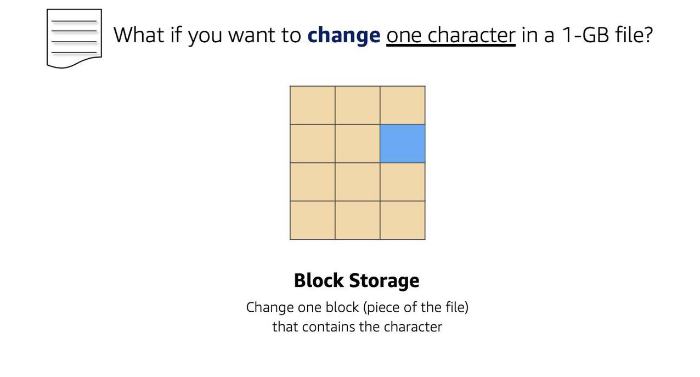

### Object Storage

- Very similar to File Storage but no `hierarchical` storage
- Flat structure
- Each object is a file with a unique identifier. This identifier, along with any additional metadata, is bundled with the data and stored.


| File Storage | Object Storge |
|---|---|
|Hierarchy - YES; Folder or tree-like structure | Flat Structure. No hierarchy |
|Good for low-latency read-write | Good for high throughput |
|Edit a portion, you overwrite the whole file | Edit a portion, you overwrite the whole object|
|Amazon EFS | Amazon S3 |


---

## 3.2: Amazon EC2 Instance Storage and Amazon Elastic Block Store

### The two types of EC2 Instance Storage Options
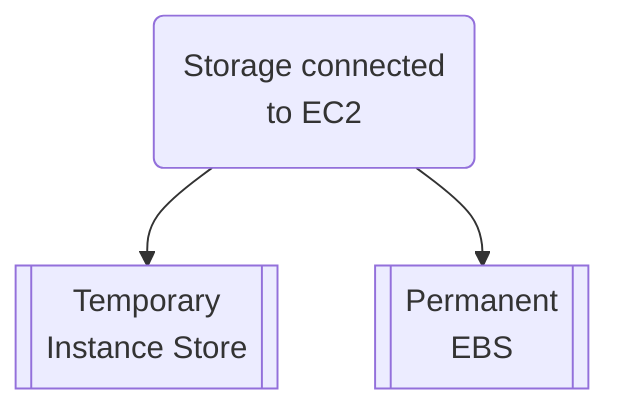
```mermaid
flowchart TD
  A[[Temporary<br>Instance Store]]
  B[[Permanent<br>EBS]]
  C(Storage connected<br>to EC2)
  C --> A
  C --> B  
```

### How many EBS to every EC2 Instance

**1 EC2 to Many EBS Volumes**:
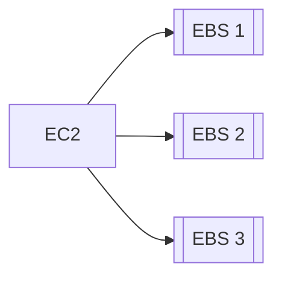
```mermaid
flowchart LR
  EC[EC2]
  EB1[[EBS 1]]
  EB2[[EBS 2]]
  EB3[[EBS 3]]
  EC --> EB1
  EC --> EB2
  EC --> EB3
```

> `In the same AZ`, an EBS can be detached from 1 EC2 and connected to a new EC2 instance

**1 EBS to 1 EC2** (typically):

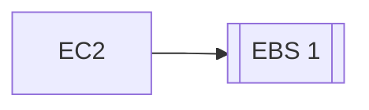
```mermaid
flowchart LR
  EC[EC2] --> EB1[[EBS 1]]
```

**1 EBS volume to Many EC2 Instances** (recently supported for some instances):

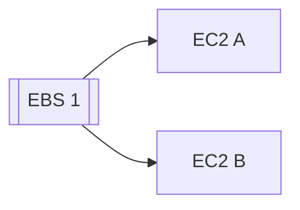
```mermaid
flowchart LR
  EB1[[EBS 1]]
  ECA[EC2 A]
  ECB[EC2 B]

  EB1 --> ECA
  EB1 --> ECB
```

Additional Points: 

> The external drive is separate from the computer. That means, if an accident happens and the computer goes down, you still have your data on your external drive. The same is true for EBS volumes.

> You’re limited to the size of the external drive, since it has a fixed limit to how scalable it can be. For example, you may have a 2 TB external drive and that means you can only have 2 TB of content on there. This relates to EBS as well, since volumes also have a max limitation of how much content you can store on the volume.

### Scale Amazon EBS Volumes

1. Increase the volume size, as long as it doesn’t increase above the maximum size limit. For EBS volumes, the maximum amount of storage you can have is 16 TB. That means if you provision a 5 TB EBS volume, you can choose to increase the size of your volume until you get to 16 TB.

2. Attach multiple volumes to a single Amazon EC2 instance. EC2 has a one-to-many relationship with EBS volumes. You can add these additional volumes during or after EC2 instance creation to provide more storage capacity for your hosts.


### Two types of AMIs for EC2 Instances 

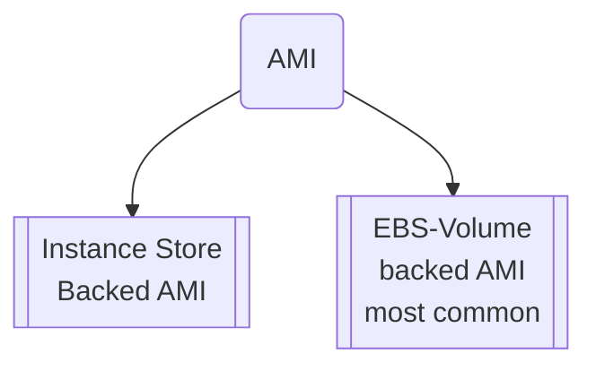
```mermaid
flowchart TD
  AMI(AMI)
  AMI1[[Instance Store<br>Backed AMI]]
  AMI2[[EBS-Volume<br>backed AMI<br>most common]]
  AMI --> AMI1
  AMI --> AMI2   
```

**Key Points**: 
- When EC2 running on instance-store backed AMI is stopped, data is lost. 
- Instance-store backed AMIs are useful for stateless applications
- It can be rebooted without losing data


**Latency vs Throughput discussion**

Latency:
- Amount of time it takes for ONE data packet to reach its destination
- For databases and Web <-> Server Interactions

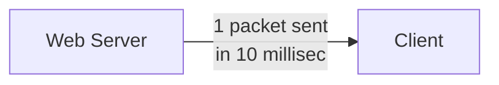
```mermaid
flowchart LR
  W[Web Server] -- 1 packet sent<br> in 10 millisec --> C[Client]
```

Throughput:
- Number of packets that can reach a destination within 1 sec
- Needed in Big Data Analytics

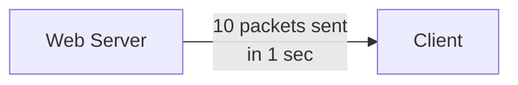
```mermaid
flowchart LR
  W[Web Server] -- 10 packets sent<br> in 1 sec --> C[Client]
```

### Types of EBS Volumes

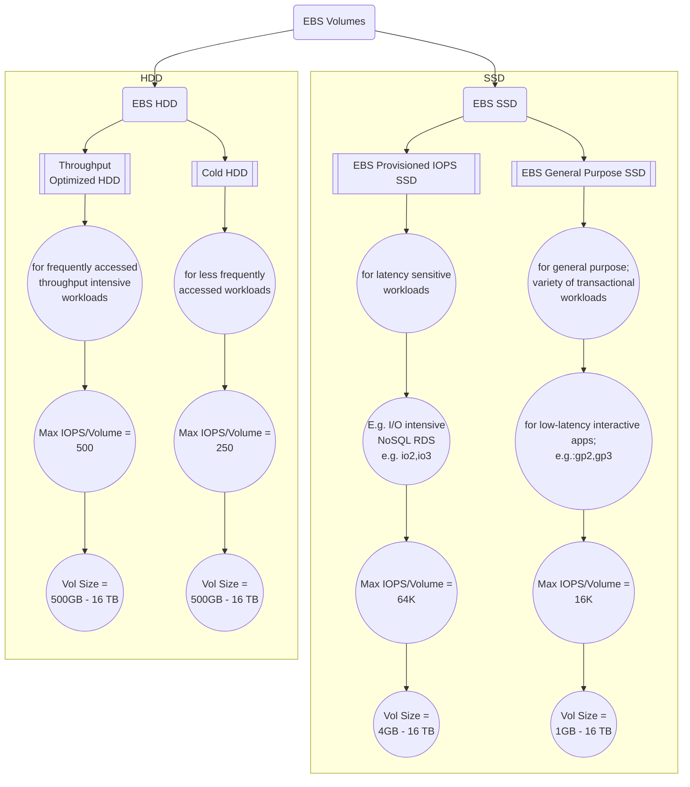
```mermaid
flowchart TD
  EBS(EBS Volumes)
  subgraph SSD
    EBS_SSD(EBS SSD)
    SSD1[[EBS Provisioned IOPS SSD]]
    SSD2[[EBS General Purpose SSD]]
    EBS_SSD --> SSD1
    EBS_SSD --> SSD2
    SSD1 --> app1((for latency sensitive<br>workloads))
    app1 --> ex1((E.g. I/O intensive<br> NoSQL RDS<br>e.g. io2,io3))
    SSD2 --> app2((for general purpose;<br>variety of transactional<br>workloads))
    app2 --> ex2((for low-latency interactive apps;<br>e.g.:gp2,gp3)) 
    max1((Max IOPS/Volume =<br> 64K))
    vol_size1((Vol Size =<br> 4GB - 16 TB))
    max2((Max IOPS/Volume =<br> 16K))
    vol_size2((Vol Size =<br> 1GB - 16 TB))
    ex1 --> max1
    ex2 --> max2 
    max1 --> vol_size1
    max2 --> vol_size2
  end
  subgraph HDD
    EBS_HDD(EBS HDD)
    HDD1[[Throughput<br>Optimized HDD]]
    HDD2[[Cold HDD]]
    apphd1((for frequently accessed<br>throughput intensive<br>workloads))
    apphd2((for less frequently<br>accessed workloads))
    maxhd1((Max IOPS/Volume =<br> 500))
    vol_sizehd1((Vol Size =<br> 500GB - 16 TB))
    maxhd2((Max IOPS/Volume =<br> 250))
    vol_sizehd2((Vol Size =<br> 500GB - 16 TB))
    EBS_HDD --> HDD1
    EBS_HDD --> HDD2
    HDD1 --> apphd1 --> maxhd1 --> vol_sizehd1
    HDD2 --> apphd2 --> maxhd2 --> vol_sizehd2
  end      
  EBS --> EBS_SSD
  EBS --> EBS_HDD

```

Key Point: 
- solid-state drives (SSDs) are faster and expensive than hard-disk drives (HDDs)


|Need on Latency/Throughput | Applications | Most suited type of EBS |
|---|---|--|
| Very low latency | Databases, payment systems | Provisioned IOPS SSD |
| low latency |  Web Server | General Purpose SSD |
| Very high throughput | Big Data | Throughput optimized HDD |
| can tolerate high latency but still might need good throughput because of data transer | Infrequently accessed data | Cold HDD |

### EBS Snapshots:

- Concept: Incremental backups
     - First time: Stores the entire data
     - Second Snapshot: Store only data on what has changed

---

## 3.3: Object Storage with Amazon S3

### WHAT IS AMAZON S3?

- Amazon S3 is an object storage service.
- Object storage stores data in a flat structure, using unique identifiers to look up objects when requested. An object is simply a file combined with metadata and that you can store as many of these objects as you’d like. 
- All of these characteristics of object storage are also characteristics of Amazon S3. 

### UNDERSTAND AMAZON S3 CONCEPTS

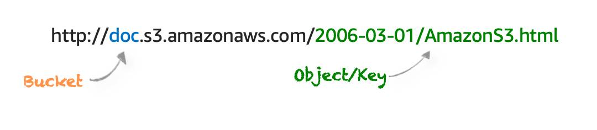

### Security for S3 Objects

- Everything is private by default

> If you decide that you want everyone on the internet to see your photos, you can choose to make your buckets, folders, and objects public. Keep in mind that a public resource means that everyone on the internet can see it. Most of the time, you don’t want your permissions to be all or nothing. Typically, you want to be more granular about the way you provide access to your resources. 

Amazon S3 provides two main access management features: `IAM policies` and `S3 bucket policies`.

### When should one use S3 bucket policies:
- When you need a simple way to do cross-account access to S3, without using IAM roles.
- Your IAM policies bump up against the defined size limit. S3 bucket policies have a larger size limit.

> S3 Bucket policies can only be placed on buckets, and cannot be used for folders or objects. 

### ENCRYPT S3

Amazon **S3 reinforces encryption in transit** (as it travels to and from Amazon S3) and **at rest**. To protect data at rest, you can use:

**Server-side encryption**: This allows Amazon S3 to encrypt your object before saving it on disks in its data centers and then decrypt it when you download the objects.

**Client-side encryption**: Encrypt your data client-side and upload the encrypted data to Amazon S3. In this case, you manage the encryption process, the encryption keys, and all related tools.

### USE VERSIONING TO PRESERVE OBJECTS

Versioning-enabled buckets let you recover objects from accidental deletion or overwrite.

> Deleting an object does not remove the object permanently. Instead, Amazon S3 puts a marker on the object that shows you tried to delete it. If you want to restore the object, you can remove this marker and it reinstates the object.

> If you overwrite an object, it results in a new object version in the bucket. You still have access to previous versions of the object.

Buckets can be in one of three states.

- Unversioned (the default): No new or existing objects in the bucket have a version.
- Versioning-enabled: This enables versioning for all objects in the bucket.
- Versioning-suspended: This suspends versioning for new objects. All new objects in the bucket will not have a version. However, all existing objects keep their object versions.

### AMAZON S3 STORAGE CLASSES

Here are the main types of Amazon S3 storage options:

1. **S3 Standard**
Use Case: Frequently accessed data.
Availability: 99.99%.
Durability: 99.999999999% (11 nines).
Performance: Low latency, high throughput.
Cost: Higher cost compared to other classes.
Typical Uses: Websites, content distribution, data analytics, and mobile applications.

2. **S3 Intelligent-Tiering**
Use Case: Data with unpredictable access patterns.
Availability: 99.9%.
Durability: 99.999999999% (11 nines).
Performance: Automatically moves data between two access tiers (frequent and infrequent) to optimize cost.
Cost: Slightly higher than Standard but saves on infrequently accessed data by automatically moving data to lower-cost storage tiers.

3. **S3 Standard-Infrequent Access (S3 Standard-IA)**
Use Case: Data that is infrequently accessed but requires rapid access when needed.
Availability: 99.9%.
Durability: 99.999999999% (11 nines).
Cost: Lower storage cost, higher retrieval cost compared to S3 Standard.
Typical Uses: Backups, disaster recovery, long-term storage.

4. **S3 One Zone-Infrequent Access (S3 One Zone-IA)**
Use Case: Infrequently accessed data that doesn't require multi-zone redundancy.
Availability: 99.5%.
Durability: 99.999999999% (11 nines) within a single Availability Zone.
Cost: Lower cost than S3 Standard-IA.
Typical Uses: Data that can be recreated easily, backups, or secondary copies.


5. **S3 Glacier**

Use Case: Long-term archive storage where retrieval time can range from minutes to hours.
Availability: 99.99%.
Durability: 99.999999999% (11 nines).
Cost: Very low storage cost, retrieval incurs additional cost and delay.
Typical Uses: Archival data, regulatory compliance, and historical records.


6. **S3 Glacier Deep Archive**
Use Case: Long-term archive for data that is rarely accessed and has retrieval times of up to 12 hours.
Availability: 99.99%.
Durability: 99.999999999% (11 nines).
Cost: Lowest-cost storage option in S3, with higher retrieval times.
Typical Uses: Long-term data retention for compliance or legal purposes.


7. **S3 Outposts**
Use Case: Storing data on-premises for applications that need local data residency.
Durability: Same as S3 (99.999999999%).
Typical Uses: Local workloads that need low latency or local data processing, and when compliance requires data to stay on-premises.

### AUTOMATE TIER TRANSITIONS WITH OBJECT LIFECYCLE MANAGEMENT

When you define a lifecycle policy configuration for an object or group of objects, you can choose to automate two actions: transition and expiration actions.

- Transition actions are used to define when you should transition your objects to another storage class.
- Expiration actions define when objects expire and should be permanently deleted.

The following use cases are good candidates for lifecycle management.

- Periodic logs: If you upload periodic logs to a bucket, your application might need them for a week or a month. After that, you might want to delete them.

- Data that changes in access frequency: Some documents are frequently accessed for a limited period of time. After that, they are infrequently accessed. At some point, you might not need real-time access to them, but your organization or regulations might require you to archive them for a specific period. After that, you can delete them.

---

### AWS Storage Services Recap

#### Amazon EC2 Instance Store

- Instance store is ephemeral block storage
- For stateless applications

> EC2 Instance Store is not meant for data that is persistent or long-lasting. If you need persistent long-term block storage that can be detached from Amazon EC2 and provide you more management flexibility, such as increasing volume size or creating snapshots, then you should use Amazon EBS. 

#### Amazon EBS

Amazon EBS is meant for data that changes frequently and needs to persist through instance stops, terminations, or hardware failures. Amazon EBS has two different types of volumes

- SSD - For I/O-sensitive workloads
- HDD - For Throughput-intensive workloads


#### Amazon S3

- It is object storage.
- You pay for what you use (you don’t have to provision storage in advance).
- Amazon S3 replicates your objects across multiple Availability Zones in a Region.
- Amazon S3 is not storage attached to compute.

#### Amazon Elastic File System (Amazon EFS) and Amazon FSx

- Also Serverless
- No need to provision in advance
- Pay for what you use

---

## 3.5 Explore Databases on AWS

### Q) What is the difference between database, data warehouse and data lake. Explain with examples from AWS. 


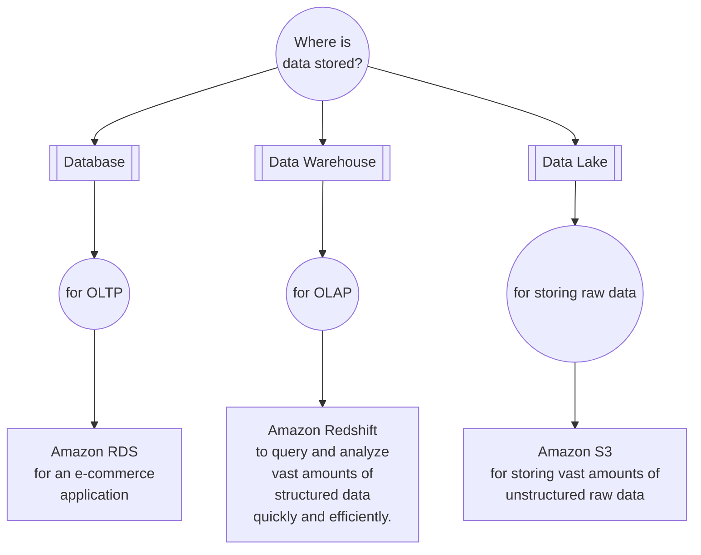
```mermaid
flowchart TD
  Q((Where is<br>data stored?))
  A1[[Database]]
  A2[[Data Warehouse]]
  A3[[Data Lake]]

  P1((for OLTP))
  P2((for OLAP))
  P3((for storing raw data))

  E1[Amazon RDS<br>for an e-commerce<br>application]
  E2[Amazon Redshift<br>to query and analyze <br>vast amounts of <br>structured data<br>quickly and efficiently.]
  E3[Amazon S3<br>for storing vast amounts of<br>unstructured raw data]

  Q --> A1 
  Q --> A2
  Q --> A3

  A1 --> P1 --> E1
  A2 --> P2 --> E2
  A3 --> P3 --> E3   
```

The terms **database**, **data warehouse**, and **data lake** all refer to systems for managing and storing data, but they serve different purposes and are optimized for different types of data and use cases. Here’s a breakdown, along with AWS examples:

#### 1. **Database**  
- **Purpose:** A **database** is designed to store structured data that can be easily queried and updated. It's typically used for transactional processing (OLTP: Online Transaction Processing) where you need to manage day-to-day operations like inserts, updates, and deletes efficiently.
  
- **Data Type:** Structured data (e.g., relational data with tables, rows, and columns).
  
- **Use Cases:** Applications like inventory management, customer management, e-commerce websites, or any app that involves a lot of concurrent, real-time transactions.

- **AWS Example:** 
  - **Amazon RDS (Relational Database Service):** Supports databases like MySQL, PostgreSQL, SQL Server, and Oracle. It's managed, which means AWS takes care of backups, patching, and scaling.
  - **Amazon DynamoDB:** A NoSQL database for high-speed, low-latency performance, often used for large-scale applications that require flexible data models.

**Example Use Case:** An e-commerce website storing customer orders and product information in **Amazon RDS** for efficient querying and real-time updates.

---

#### 2. **Data Warehouse**  
- **Purpose:** A **data warehouse** is optimized for **analytical processing** (OLAP: Online Analytical Processing) where large volumes of structured data are aggregated and analyzed. It is ideal for complex queries, reporting, and business intelligence (BI) tasks.

- **Data Type:** Primarily structured data, although it may support semi-structured data (e.g., JSON or Parquet formats). Data is typically cleaned and organized before loading into a data warehouse.

- **Use Cases:** Business analytics, trend analysis, data mining, generating reports or dashboards across large data sets (e.g., sales trends across regions or customer segments).

- **AWS Example:** 
  - **Amazon Redshift:** A fully managed, petabyte-scale data warehouse designed for fast query execution across large datasets. Redshift is built for complex queries and analytics, and it integrates well with BI tools like Amazon QuickSight.

**Example Use Case:** A retail company uses **Amazon Redshift** to analyze sales data across regions to understand seasonal buying trends and forecast future demand.

---

#### 3. **Data Lake**  
- **Purpose:** A **data lake** is a centralized repository that allows you to store **structured, semi-structured, and unstructured** data at any scale. It’s highly flexible and is often used to store raw data until it’s needed for analysis. It supports various formats (e.g., JSON, CSV, images, video, text logs) and allows for big data analytics and machine learning.

- **Data Type:** Structured, semi-structured, and unstructured data (e.g., documents, audio, videos, logs, sensor data).

- **Use Cases:** Data exploration, machine learning, big data analytics, and situations where you want to store a vast array of data types before deciding what analysis or processing you need.

- **AWS Example:**
  - **Amazon S3 (Simple Storage Service):** Typically used to build a data lake in AWS. You can store any type of data in its native format and then later analyze it using other AWS services like AWS Glue (for data transformation), Amazon Athena (for querying), or Amazon EMR (for big data processing).

**Example Use Case:** A healthcare company uses **Amazon S3** to store vast amounts of raw patient data, including medical images, doctor notes, and sensor data from wearables. They later process this data for machine learning models and analytics.

---

#### Key Differences:
| Feature         | Database (RDS/DynamoDB)         | Data Warehouse (Redshift)         | Data Lake (S3)                |
|-----------------|---------------------------------|-----------------------------------|-------------------------------|
| **Primary Use**  | Transactional (OLTP)            | Analytical (OLAP)                 | Store raw data, Big Data       |
| **Data Type**    | Structured                      | Structured, Semi-structured       | Structured, Semi-structured, Unstructured |
| **Processing**   | Real-time transactions          | Aggregated, Complex queries       | Data exploration, batch processing |
| **AWS Service**  | Amazon RDS, DynamoDB            | Amazon Redshift                   | Amazon S3                      |
| **Example**      | E-commerce apps, customer orders| Business analytics, dashboards    | Raw data for analytics, ML     |

#### Summary of AWS Services:
- **Database** → **Amazon RDS** for relational databases or **DynamoDB** for NoSQL databases.
- **Data Warehouse** → **Amazon Redshift** for OLAP and analytical workloads.
- **Data Lake** → **Amazon S3** to store large datasets in various formats for big data analytics.

---


### Q) Are all AWS Databases in EC2 instances? Are they named as db.xxx ?


No, **not all AWS databases run on EC2 instances**, and they are **not named as `db.xxx` by default**. While some database services in AWS may use EC2 instances under the hood, many of them are fully managed services, meaning you don't need to worry about the underlying EC2 infrastructure. Let me explain further:

#### 1. **Managed Databases** (Not necessarily tied to EC2 instances)
AWS provides **fully managed databases**, which abstract away the underlying infrastructure, including EC2 instances, networking, and scaling. With these services, AWS handles most operational tasks like backups, patching, scaling, and failover.

Here are some examples of **fully managed AWS database services**:
- **Amazon RDS (Relational Database Service):** A managed service for relational databases like MySQL, PostgreSQL, Oracle, SQL Server, and MariaDB. It is designed to handle the operational management of these databases, though the actual database may run on EC2 instances in the background. As a user, you don’t have direct access to the underlying EC2 instances.
  
- **Amazon Aurora:** A high-performance, MySQL- and PostgreSQL-compatible relational database built for the cloud. Like RDS, Aurora abstracts away the EC2 instances, providing a managed environment.

- **Amazon DynamoDB:** A fully managed NoSQL database that scales horizontally. It doesn’t require EC2 instances, and you don’t need to manage the underlying servers or instances.

- **Amazon Redshift:** A managed data warehouse that allows you to run analytics on structured data. While Redshift clusters are backed by EC2 instances, you manage them at a higher level through the Redshift interface.

- **Amazon DocumentDB:** A fully managed MongoDB-compatible database that abstracts away the underlying EC2 instances.

In these fully managed services, the database instances are **not explicitly named as `db.xxx`**; instead, you interact with these services through their respective APIs or consoles without seeing the underlying infrastructure. However, you may define instance identifiers or cluster names like "db1" when provisioning databases, but this is customizable.

#### 2. **Self-Managed Databases on EC2** (Named as `db.t3.medium`, etc.)
If you **self-manage** a database on an EC2 instance, then you directly control the EC2 infrastructure. In this case, you would need to handle database installation, patching, backups, scaling, and networking yourself. You could launch a database server (e.g., MySQL, PostgreSQL) on an EC2 instance, and here you would see the EC2 instance types named in the `t3`, `m5`, `db.m6g`, or similar families.

Some instance types in RDS do use naming patterns like `db.m6g.large`, but this is specific to Amazon RDS and Aurora, which provide a **managed environment on top of EC2**. For example:
- `db.t3.medium` (RDS instance) → This is an instance class used for databases in Amazon RDS, where `t3.medium` is an EC2 instance type optimized for general-purpose workloads, but **the naming convention** here indicates that it's used for a database (`db.` prefix).

### **Summary**:
- **Not all AWS databases** run on EC2 instances. Services like DynamoDB and Aurora abstract the infrastructure so you don't manage EC2s directly.
- In **Amazon RDS**, the underlying instances may be named as `db.xxx` (e.g., `db.t3.medium`), but this is specific to the RDS service.
- If you're running a database **directly on EC2**, you choose standard EC2 instance types like `t3.medium`, and you’re responsible for managing the database yourself.

---

### Q) So a PostgreSQL DB can be either Self-Managed Databases on EC2 or AWS Managed ?

Yes, in AWS, a PostgreSQL database can be deployed in two primary ways:

1. **Self-Managed on EC2**:
   - **Description**: You launch a PostgreSQL database on an EC2 instance, essentially creating a self-managed environment where you control the entire database stack.
   - **Responsibilities**: You handle **installation, configuration, patching, backup, scaling,** and **security management**.
   - **Flexibility**: Full control over the PostgreSQL settings, customizations, and extensions.
   - **Use Case**: Ideal if you need custom configurations or PostgreSQL plugins that aren’t supported in managed services, or if you want to control the environment entirely.

2. **AWS Managed PostgreSQL (Amazon RDS or Amazon Aurora)**:
   - **Description**: Amazon RDS for PostgreSQL and Amazon Aurora (PostgreSQL-compatible) are fully managed database services that AWS operates.
   - **Responsibilities**: AWS handles **provisioning, patching, backup, scaling,** and **automatic failover**. You only need to manage data, schema, and performance tuning.
   - **Flexibility**: Limited to configurations and extensions that AWS supports.
   - **Use Case**: Best for users who prefer a managed, highly available, and scalable PostgreSQL solution without the administrative overhead.

So, **self-managed on EC2** gives you complete control and flexibility, whereas **AWS-managed services** offer ease of use and reduced operational burden at the cost of some customization flexibility.

---

### Managed Databases in Amazon

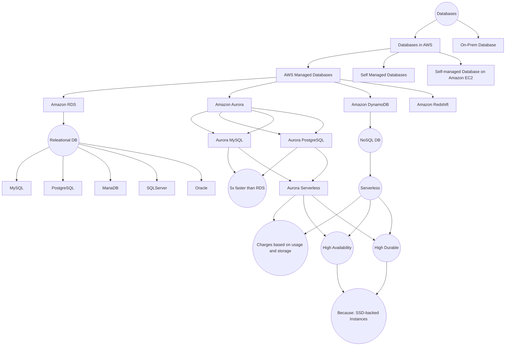
```mermaid

flowchart TD
  DB((Databases))
  ADB[Databases in AWS]   
  M[AWS Managed Databases]
  UM[Self Managed Databases]
  OP[On-Prem Database]
  SM[Self-managed Database on Amazon EC2]

  M1[Amazon RDS]
  M2[Amazon Aurora]
  M3[Amazon DynamoDB]
  M4[Amazon Redshift]

  REL((Releational DB))   
  MEX1[MySQL]
  MEX2[PostgreSQL]
  MEX3[MariaDB]
  MEX4[SQLServer]
  MEX5[Oracle]

  MAA1[Aurora MySQL]
  MAA2[Aurora PostgreSQL]

  MAAP1((5x faster than RDS))
  MAAP2[Aurora Serverless]

  NOREL((NoSQL DB))   
  
  DDB1((Serverless))
  BOTH1((Charges based on usage and storage))
  BOTH2((High Availability))
  BOTH3((High Durable))
  BOTH4((Because: SSD-backed Instances))

  DB --> ADB
  DB --> OP

  ADB --> M
  ADB --> UM
  ADB --> SM
  M --> M1
  M --> M2
  M --> M3
  M --> M4
  
  M1 --> REL --> MEX1
  REL --> MEX2
  REL --> MEX3
  REL --> MEX4
  REL --> MEX5

  M2 --> MAA1 --> MAAP1 
  M2 --> MAA2 --> MAAP1
  M2 --> MAA1 --> MAAP2
  M2 --> MAA2 --> MAAP2   
  MAAP2 --> BOTH1
  BOTH2 --> BOTH4
  BOTH3 --> BOTH4

  M3 --> NOREL --> DDB1 --> BOTH1 
  DDB1 --> BOTH2 
  DDB1 --> BOTH3
  MAAP2 --> BOTH2 
  MAAP2 --> BOTH3
```

## Elements to decide for a DB Selection

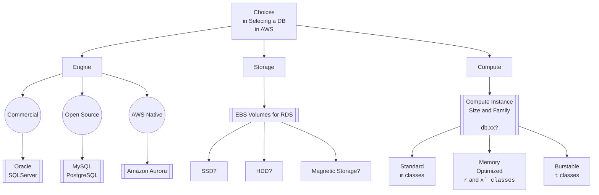
```mermaid
flowchart TB
  DB[Choices<br>in Selecing a DB<br>in AWS]
  ENG[Engine]
  STORAGE[Storage]
  COMPUTE[Compute]  

  ENG1((Commercial))
  ENG2((Open Source))
  ENG3((AWS Native))

  ENG1A[[Oracle<br>SQLServer]]
  ENG2A[[MySQL<br>PostgreSQL]]
  ENG3A[[Amazon Aurora]]

  
  STORAGE1[[EBS Volumes for RDS]]
  COMPUTE1[[Compute Instance <br>Size and Family <br><br>db.xx?]]   

  TYPE1[Standard<br> <code>m</code> classes]
  TYPE2[Memory<br>Optimized<br><code>r</code> and <code>x` classes]
  TYPE3[Burstable<br><code>t</code> classes]

  S1[SSD?]
  S2[HDD?]
  S3[Magnetic Storage?] 

  DB --> ENG --> ENG1
  ENG --> ENG2
  ENG --> ENG3

  ENG1 --> ENG1A
  ENG2 --> ENG2A
  ENG3 --> ENG3A

  DB --> STORAGE --> STORAGE1
  DB --> COMPUTE --> COMPUTE1

  STORAGE1 --> S1
  STORAGE1 --> S2
  STORAGE1 --> S3   

  COMPUTE1 --> TYPE1
  COMPUTE1 --> TYPE2
  COMPUTE1 --> TYPE3
```

## Where are Database Instances placed?

### RDS lies inside VPC Private Subnet
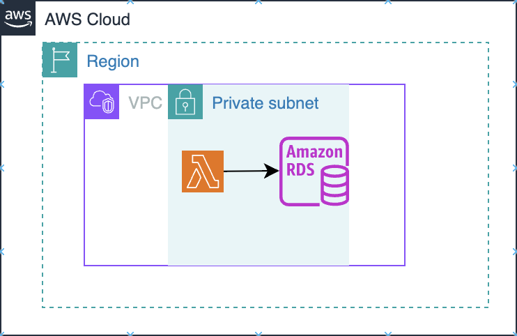


### Dynamo DB lies outside VPC

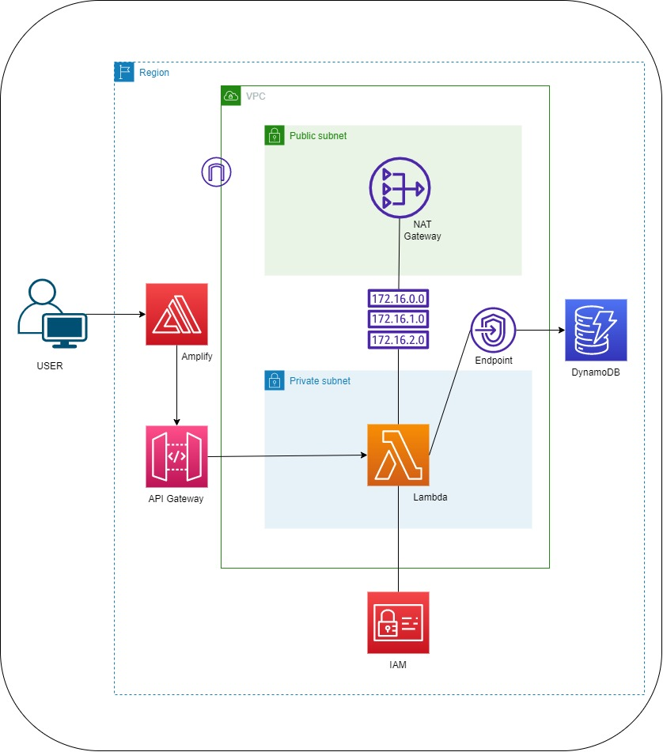


Source: [AWS rePost](https://repost.aws/questions/QUsOBNlERPQZejZsyo3rtxGg/lambda-in-private-subnet-cannot-reach-dynamodb)

### Backups in RDS

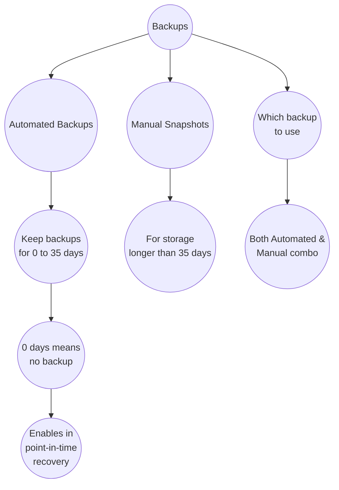
```mermaid
flowchart TD
  B((Backups))
  A((Automated Backups))
  M((Manual Snapshots))

  K((Keep backups<br>for 0 to 35 days))
  ZERO((0 days means<br>no backup))   
  E((Enables in<br>point-in-time<br>recovery))

  P((For storage<br>longer than 35 days))

  Q((Which backup<br>to use))
  ANS((Both Automated &<br>Manual combo))   

  B --> A
  B --> M

  A --> K --> ZERO --> E

  M --> P

  B --> Q --> ANS
```

### Redundancy in RDS via Multiple Avalaibility Zones

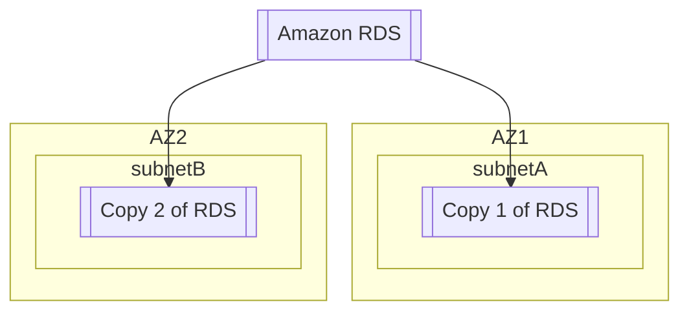
```mermaid
flowchart TD
  RDS[[Amazon RDS]]
  subgraph AZ1
     subgraph subnetA
       C1[[Copy 1 of RDS]]
     end
  end

  subgraph AZ2
    subgraph subnetB
      C2[[Copy 2 of RDS]]
    end
  end
  RDS --> C1
  RDS --> C2
```

- Multi AZ deployment ensure `High Availability` and `High Durability`

---

## Encryption of EBS Volumes


> Consider this scenario: You are a cloud engineer who works at a company that uses Amazon Elastic Compute Cloud (Amazon EC2) instances and Amazon Elastic Block Store (Amazon EBS) volumes. The company is currently using unencrypted EBS volumes. You are tasked with migrating the data on these unencrypted EBS volumes to encrypted EBS volumes. What steps can you take to migrate the data to encrypted EBS volumes? 

```
To migrate data from unencrypted to encrypted Amazon EBS volumes, follow these steps:

Create a snapshot of the unencrypted EBS volume.

Copy the snapshot, and during the copy process, select the option to encrypt the snapshot.

Once the encrypted snapshot is created, create a new EBS volume from the encrypted snapshot.

Detach the unencrypted volume from the EC2 instance.

Attach the new encrypted volume to the EC2 instance in place of the original.

This ensures seamless migration of data from unencrypted to encrypted EBS volumes without downtime.
```
---

## DynamoDB

- Amazon DynamoDB is a fully managed NoSQL database service
- With DynamoDB, you can create database tables that can store and retrieve any amount of data and serve any level of request traffic.
- Data in DynamoDB stored in Key-Value pair format


| RDS | NoSQL DB |
|---|---|
| Table | Table |
| Row/Record | Item |
| Column| Attribute|

Like a `primary column` in RDS, a `primary attribute` is needed in Dynamo DB. An item could have any number of attributes


---
## 4.1 Monitoring on AWS

**Why?**
- Ensuring reliable performance
- Are we using resources in a cost-effective way?
- Preventive Healthcheck: Prevent outage by scaling infra or fixing issues automated
- For security

**Services in CloudWatch**:
- Metrics
- Alarms (when a metric goes above a threshold)
- Logs

### Types of Cloudwatch Metrics

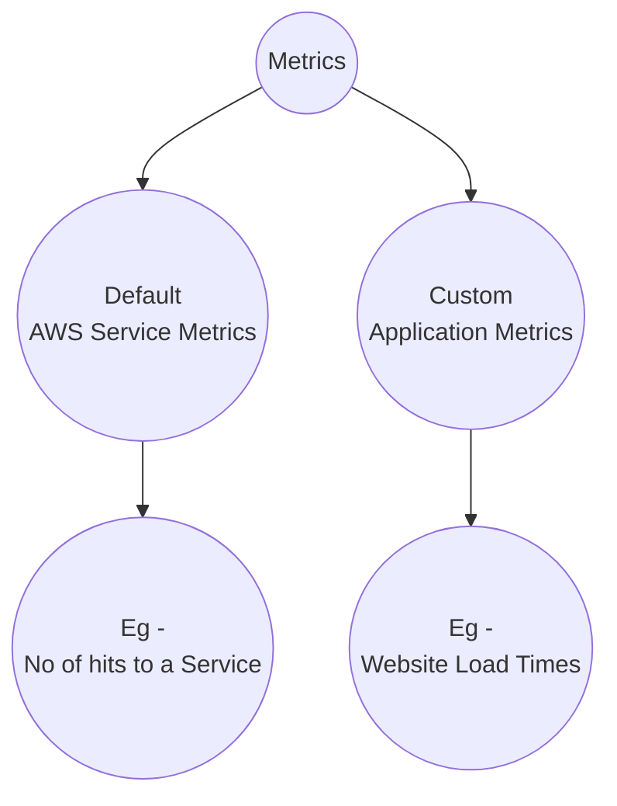
```mermaid
flowchart TD
  M((Metrics))
  M1((Default <br>AWS Service Metrics))
  M2((Custom<br>Application Metrics))

  EX1((Eg -<br>No of hits to a Service))
  EX2((Eg -<br>Website Load Times))

  M --> M1
  M --> M2

  M1 --> EX1
  M2 --> EX2
```

### Types of Monitoring

- By default, with the AWS account, a `basic monitoring` is enabled (where every 5 minutes some metrics reach the CloudWatch dashboard)
- A `detailed monitoring` at additional cost can be setup if say, metrics need to be logged every 1 minute instead of 5 minutes


### How to filter/categorize Metrics


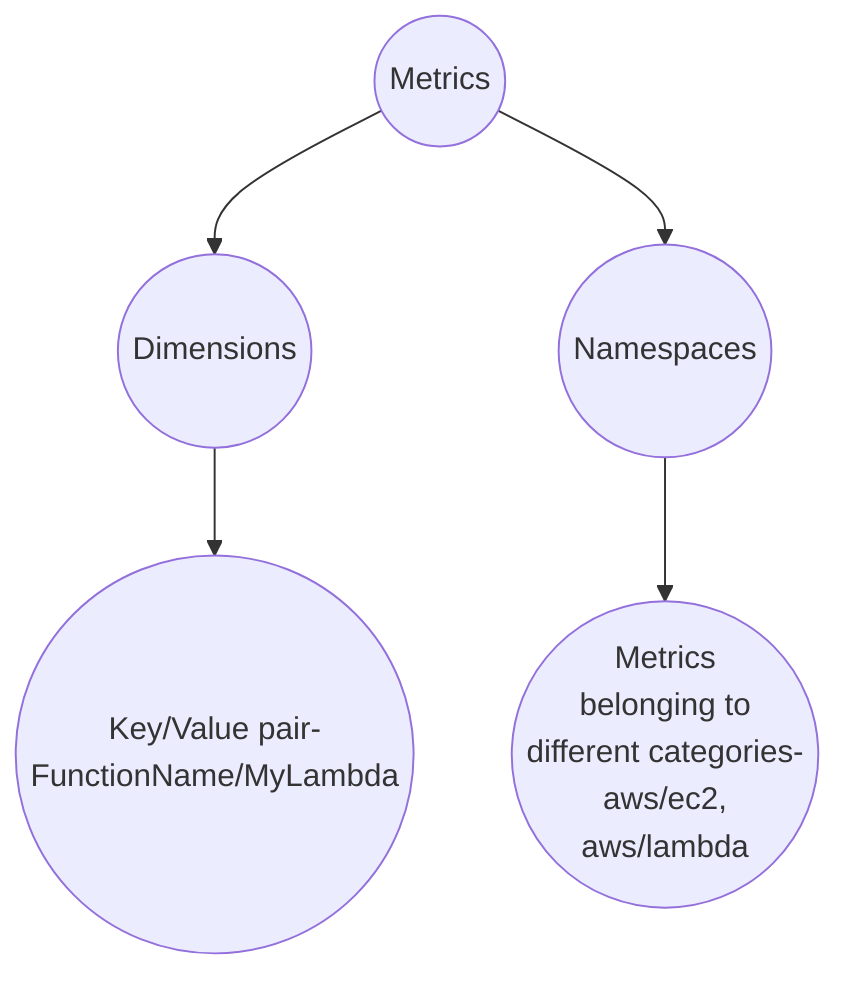
```mermaid
flowchart TD
  M((Metrics))

  M1((Dimensions))
  M2((Namespaces))

  EX1((Key/Value pair-<br>FunctionName/MyLambda))   
  EX2((Metrics <br>belonging to<br>different categories-<br>aws/ec2,<br>aws/lambda))

  M --> M1 --> EX1
  M --> M2 --> EX2
```

- A `Dimension` can be used to filter the metrics
- A `Namespace` gives a logical grouping of the logs into different categories

### Custom Metrics

Using `boto3` sdk, you can ensure `custom metrics` like the following that reflect the health of your application can be sent to CloudWatch logs

- Web page Load Time
- Amount of tasks handled 


### Understand the CloudWatch Dashboards

- For viewing aggregated statistics of CloudWatch metrics

### CloudWatch Logs

- For lambda, easy to setup: Enable in IAM policy
- For EC2, enable CW logs agent


### CloudWatch Alarms 

- When a metric goes above a threshold

### EventBridge

- For a Rule-triggered workflow 
- Allows you to define rules that filter events based on specific patterns and forward those events to one or more targets.

---

## 4.3 Optimization in AWS

### Notation in Nines:

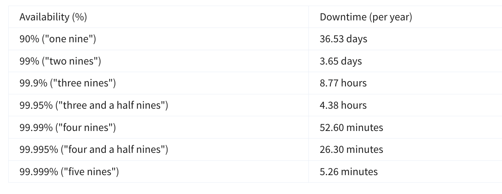

### Automatically use a Second Server in a different availability zone

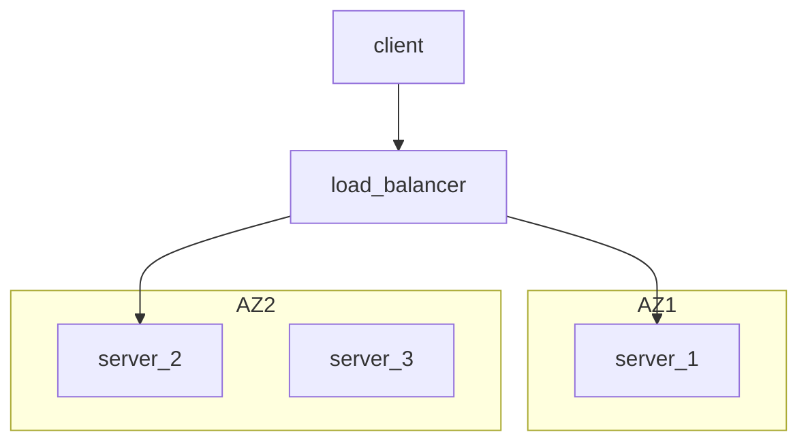
```mermaid
flowchart TD
  client
  load_balancer
  subgraph AZ1
    server_1
  end
  subgraph AZ2
    server_2
    server_3
  end 

  client --> load_balancer
  load_balancer --> server_1
  load_balancer --> server_2
```

### Types of High Availability Architecture

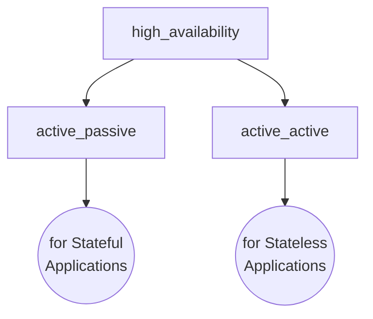
```mermaid
flowchart TD
  HA[high_availability]
  AP[active_passive]
  AA[active_active]

  P1((for Stateful<br>Applications))
  P2((for Stateless<br>Applications))

  HA --> AP
  HA --> AA  

  AP --> P1
  AA --> P2 
```
---

## 4.4 Route Traffic with Amazon Elastic Load Balancing

### What is a Load Balancer:

- Purpose is to distribute the requests across all the servers hosting the application using a load balancer

Load balancing refers to the process of distributing tasks across a set of resources. In the case of the corporate directory application, the resources are EC2 instances that host the application, and the tasks are the different requests being sent. It’s time to distribute the requests across all the servers hosting the application using a load balancer.

To do this, you first need to enable the load balancer to take all of the traffic and redirect it to the backend servers based on an algorithm. The most popular algorithm is round-robin, which sends the traffic to each server one after the other.

A typical request for the application would start from the browser of the client. It’s sent to a load balancer. Then, it’s sent to one of the EC2 instances that hosts the application. The return traffic would go back through the load balancer and back to the client browser. Thus, the load balancer is directly in the path of the traffic.

Although it is possible to install your own software load balancing solution on EC2 instances, AWS provides a service for that called Elastic Load Balancing (ELB).


### FEATURES OF ELB

The ELB service provides a major advantage over using your own solution to do load balancing, in that you don’t need to manage or operate it. It can distribute incoming application traffic across EC2 instances as well as containers, IP addresses, and AWS Lambda functions.

- The fact that ELB can load balance to IP addresses means that it can work in a hybrid mode as well, where it also load balances to on-premises servers.

- ELB is highly available. The only option you have to ensure is that the load balancer is deployed across multiple Availability Zones.

- In terms of scalability, ELB automatically scales to meet the demand of the incoming traffic. It handles the incoming traffic and sends it to your backend application.

### HEALTH CHECKS

Taking the time to define an appropriate health check is critical. Only verifying that the port of an application is open doesn’t mean that the application is working. It also doesn’t mean that simply making a call to the home page of an application is the right way either.

For example, the employee directory application depends on a database, and S3. The health check should validate all of those elements. One way to do that would be to create a monitoring webpage like “/monitor” that will make a call to the database to ensure it can connect and get data, and make a call to S3. Then, you point the health check on the load balancer to the “/monitor” page.

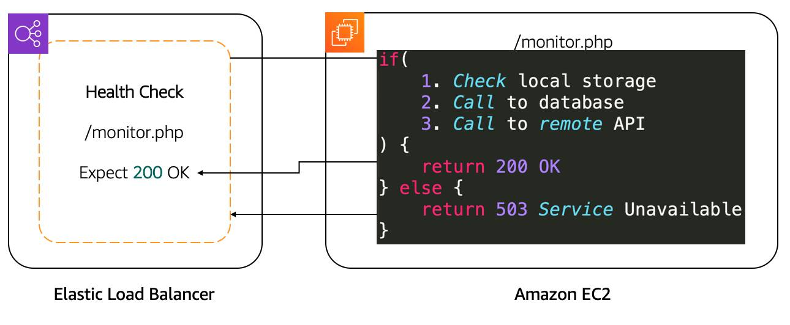

 After determining the availability of a new EC2 instance, the load balancer starts sending traffic to it. If ELB determines that an EC2 instance is no longer working, it stops sending traffic to it and lets EC2 Auto Scaling know. EC2 Auto Scaling’s responsibility is to remove it from the group and replace it with a new EC2 instance. Traffic only sends to the new instance if it passes the health check.

In the case of a scale down action that EC2 Auto Scaling needs to take due to a scaling policy, it lets ELB know that EC2 instances will be terminated. ELB can prevent EC2 Auto Scaling from terminating the EC2 instance until all connections to that instance end, while preventing any new connections. That feature is called **connection draining**.

### ELB COMPONENTS


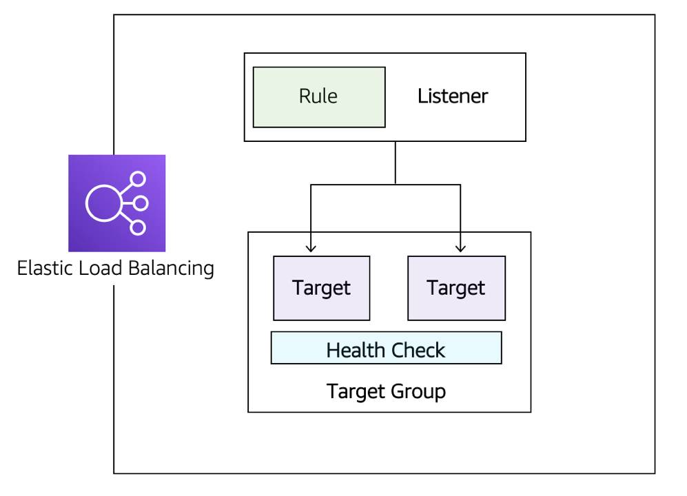

- Listeners: The client connects to the listener. This is often referred to as client-side. To define a listener, a port must be provided as well as the protocol, depending on the load balancer type. There can be many listeners for a single load balancer.

- Target groups: The backend servers, or server-side, is defined in one or more target groups. This is where you define the type of backend you want to direct traffic to, such as EC2 Instances, AWS Lambda functions, or IP addresses. Also, a health check needs to be defined for each target group.

- Rules: To associate a target group to a listener, a rule must be used. Rules are made up of a condition that can be the source IP address of the client and a condition to decide which target group to send the traffic to.

### APPLICATION LOAD BALANCER

Here are some primary features of Application Load Balancer (ALB).

ALB routes traffic based on request data. It makes routing decisions based on the HTTP protocol like the URL path (/upload) and host, HTTP headers and method, as well as the source IP address of the client. This enables granular routing to the target groups.

Send responses directly to the client. ALB has the ability to reply directly to the client with a fixed response like a custom HTML page. It also has the ability to send a redirect to the client which is useful when you need to redirect to a specific website or to redirect the request from HTTP to HTTPS, removing that work from your backend servers.

ALB supports TLS offloading. Speaking of HTTPS and saving work from backend servers, ALB understands HTTPS traffic. To be able to pass HTTPS traffic through ALB, an SSL certificate is provided by either importing a certificate via Identity and Access Management (IAM) or AWS Certificate Manager (ACM) services, or by creating one for free using ACM. This ensures the traffic between the client and ALB is encrypted.

Authenticate users. On the topic of security, ALB has the ability to authenticate the users before they are allowed to pass through the load balancer. ALB uses the OpenID Connect protocol and integrates with other AWS services to support more protocols like SAML, LDAP, Microsoft AD, and more.

Secure traffic. To prevent traffic from reaching the load balancer, you configure a security group to specify the supported IP address ranges.

ALB uses the round-robin routing algorithm. ALB ensures each server receives the same number of requests in general. This type of routing works for most applications.

ALB uses the least outstanding request routing algorithm. If the requests to the backend vary in complexity where one request may need a lot more CPU time than another, then the least outstanding request algorithm is more appropriate. It’s also the right routing algorithm to use if the targets vary in processing capabilities. An outstanding request is when a request is sent to the backend server and a response hasn’t been received yet.

For example, if the EC2 instances in a target group aren’t the same size, one server’s CPU utilization will be higher than the other if the same number of requests are sent to each server using the round-robin routing algorithm. That same server will have more outstanding requests as well. Using the least outstanding request routing algorithm would ensure an equal usage across targets.

ALB has sticky sessions. In the case where requests need to be sent to the same backend server because the application is stateful, then use the sticky session feature. This feature uses an HTTP cookie to remember across connections which server to send the traffic to.Finally, ALB is specifically for HTTP and HTTPS traffic. If your application uses a different protocol, then consider the Network Load Balancer (NLB).

### NLB

Here are some primary features of Network Load Balancer (NLB).Network Load Balancer supports TCP, UDP, and TLS protocols. HTTPS uses TCP and TLS as protocol. However, NLB operates at the connection layer, so it doesn’t understand what a HTTPS request is. That means all features discussed above that are required to understand the HTTP and HTTPS protocol, like routing rules based on that protocol, authentication, and least outstanding request routing algorithm, are not available with NLB.

NLB uses a flow hash routing algorithm. The algorithm is based on:

The protocol

The source IP address and source port

The destination IP address and destination port

The TCP sequence number

If all of these parameters are the same, then the packets are sent to the exact same target. If any of them are different in the next packets, then the request may be sent to a different target.

**NLB has sticky sessions**. Different from ALB, these sessions are based on the source IP address of the client instead of a cookie.

**NLB supports TLS offloading**. NLB understands the TLS protocol. It can also offload TLS from the backend servers similar to how ALB works.

**NLB handles millions of requests per second**. While ALB can also support this number of requests, it needs to scale to reach that number. This takes time. NLB can instantly handle this amount of requests.

**NLB supports static and elastic IP addresses**. There are some situations where the application client needs to send requests directly to the load balancer IP address instead of using DNS. For example, this is useful if your application can’t use DNS or if the connecting clients require firewall rules based on IP addresses. In this case, NLB is the right type of load balancer to use.

**NLP preserves source IP address**. NLB preserves the source IP address of the client when sending the traffic to the backend. With ALB, if you look at the source IP address of the requests, you will find the IP address of the load balancer. While with NLB, you would see the real IP address of the client, which is required by the backend application in some cases.

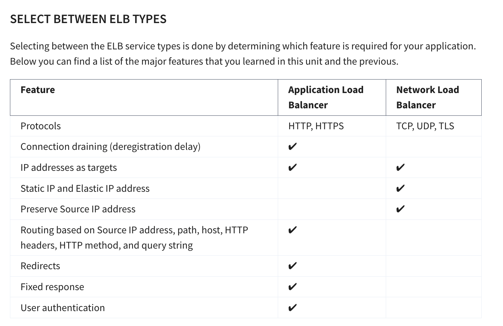

---

## 4.5: Amazon EC2 Auto Scaling

Availability and reachability is improved by adding one more server. However, the entire system can again become unavailable if there is a capacity issue. Let’s look at that load issue with both types of systems we discussed, active-passive and active-active.

**Vertical Scaling**
If there are too many requests sent to a single active-passive system, the active server will become unavailable and hopefully failover to the passive server. But this doesn’t solve anything. With active-passive, you need vertical scaling. This means increasing the size of the server. With EC2 instances, you select either a larger type or a different instance type. This can only be done while the instance is in a stopped state. In this scenario, the following steps occur: 

1. Stop the passive instance. This doesn’t impact the application since it’s not taking any traffic.
2. Change the instance size or type, then start the instance again.
3. Shift the traffic to the passive instance, turning it active.
4. The last step is to stop, change the size, and start the previous active instance as both instances should match.

When the amount of requests reduces, the same operation needs to be done. Even though there aren’t that many steps involved, it’s actually a lot of manual work to do. Another disadvantage is that a server can only scale vertically up to a certain limit.

Once that limit is reached, the only option is to create another active-passive system and split the requests and functionalities across them. This could require massive application rewriting.This is where the active-active system can help. When there are too many requests, this system can be scaled horizontally by adding more servers.

**Horizontal Scaling**
As mentioned above, for the application to work in an active-active system, it’s already created as stateless, not storing any client session on the server. This means that having two servers or having four wouldn’t require any application changes. It would only be a matter of creating more instances when required and shutting them down when the traffic decreases.

The Amazon EC2 Auto Scaling service can take care of that task by automatically creating and removing EC2 instances based on metrics from Amazon CloudWatch. 

You can see that there are many more advantages to using an active-active system in comparison with an active-passive. Modifying your application to become stateless enables scalability.

**Integrate ELB with EC2 Auto Scaling**
The ELB service integrates seamlessly with EC2 Auto Scaling. As soon as a new EC2 instance is added to or removed from the EC2 Auto Scaling group, ELB is notified. However, before it can send traffic to a new EC2 instance, it needs to validate that the application running on that EC2 instance is available.

This validation is done via the health checks feature of ELB. Monitoring is an important part of load balancers, as it should route traffic to only healthy EC2 instances. That’s why ELB supports two types of health checks. 

Establishing a connection to a backend EC2 instance using TCP, and marking the instance as available if that connection is successful.

Making an HTTP or HTTPS request to a webpage that you specify, and validating that an HTTP response code is returned.

Differentiate Between Traditional Scaling and Auto Scaling
With a traditional approach to scaling, you buy and provision enough servers to handle traffic at its peak. However, this means that at night time, there is more capacity than traffic. This also means you’re wasting money. Turning off those servers at night or at times where the traffic is lower only saves on electricity. 

The cloud works differently, with a pay-as-you-go model. It’s important to turn off the unused services, especially EC2 instances that you pay for On-Demand. One could manually add and remove servers at a predicted time. But with unusual spikes in traffic, this solution leads to a waste of resources with over-provisioning or with a loss of customers due to under-provisioning.

The need here is for a tool that automatically adds and removes EC2 instances according to conditions you define—that’s exactly what the EC2 Auto Scaling service does.

**Use Amazon EC2 Auto Scaling**
The EC2 Auto Scaling service works to add or remove capacity to keep a steady and predictable performance at the lowest possible cost. By adjusting the capacity to exactly what your application uses, you only pay for what your application needs. And even with applications that have steady usage, EC2 Auto Scaling can help with fleet management. If there is an issue with an EC2 instance, EC2 Auto Scaling can automatically replace that instance. This means that EC2 Auto Scaling helps both to scale your infrastructure and ensure high availability. 

**Configure EC2 Auto Scaling Components**
There are three main components to EC2 Auto Scaling.

> 1. Launch template or configuration: What resource should be automatically scaled?
> 2. EC2 Auto Scaling Group: Where should the resources be deployed?
> 3. Scaling policies: When should the resources be added or removed?

**Learn About Launch Templates**

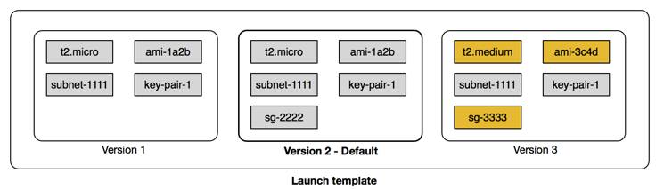

There are multiple parameters required to create EC2 instances: Amazon Machine Image (AMI) ID, instance type, security group, additional Amazon Elastic Block Store (EBS) volumes, and more. All this information is also required by EC2 Auto Scaling to create the EC2 instance on your behalf when there is a need to scale. This information is stored in a launch template.

You can use a launch template to manually launch an EC2 instance. You can also use it with EC2 Auto Scaling. It also supports versioning, which allows for quickly rolling back if there was an issue or to specify a default version of your launch template. This way, while iterating on a new version, other users can continue launching EC2 instances using the default version until you make the necessary changes. 


You can create a launch template one of three ways. 

- The fastest way to create a template is to use an existing EC2 instance. All the settings are already defined.
- Another option is to create one from an already existing template or a previous version of a launch template.
- The last option is to create a template from scratch. The following options will need to be defined: AMI ID, instance type, key pair, security group, storage, and resource tags.

Note: Another way to define what Amazon EC2 Auto Scaling needs to scale is by using **a launch configuration**. It’s similar to the launch template, but it doesn’t allow for versioning using a previously created launch configuration as a template. Nor does it allow for creating one from an already existing EC2 instance. For these reasons and to ensure that you’re getting the latest features from Amazon EC2, use a launch template instead of launch configuration.

Get to Know EC2 Auto Scaling Groups
The next component that EC2 Auto Scaling needs is an EC2 Auto Scaling Group (ASG). An ASG enables you to define where EC2 Auto Scaling deploys your resources. This is where you specify the Amazon Virtual Private Cloud (VPC) and subnets the EC2 instance should be launched in. 

EC2 Auto Scaling takes care of creating the EC2 instances across the subnets, so it’s important to select at least two subnets that are across different Availability Zones.

ASGs also allow you to specify the type of purchase for the EC2 instances. You can use On-Demand only, Spot only, or a combination of the two, which allows you to take advantage of Spot instances with minimal administrative overhead.To specify how many instances EC2 Auto Scaling should launch, there are three capacity settings to configure for the group size. 

**Minimum**: The minimum number of instances running in your ASG even if the threshold for lowering the amount of instances is reached.

**Maximum**: The maximum number of instances running in your ASG even if the threshold for adding new instances is reached.

**Desired capacity**: The amount of instances that should be in your ASG. This number can only be within or equal to the minimum or maximum. EC2 Auto Scaling automatically adds or removes instances to match the desired capacity number. 

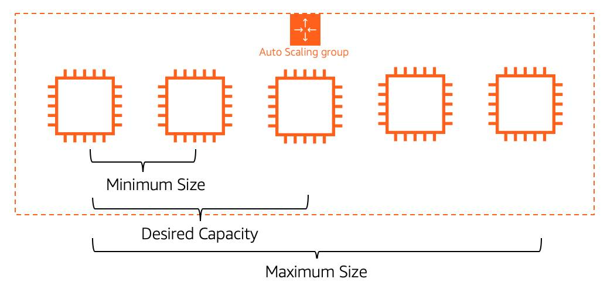

When EC2 Auto Scaling removes EC2 instances because the traffic is minimal, it keeps removing EC2 instances until it reaches a minimum capacity. Depending on your application, using a minimum of two is a good idea to ensure high availability, but you know how many EC2 instances at a bare minimum your application requires at all times. When reaching that limit, even if EC2 Auto Scaling is instructed to remove an instance, it does not, to ensure the minimum is kept.

On the other hand, when the traffic keeps growing, EC2 Auto Scaling keeps adding EC2 instances. This means the cost for your application will also keep growing. That’s why it’s important to set a maximum amount to make sure it doesn’t go above your budget.

The desired capacity is the amount of EC2 instances that EC2 Auto Scaling creates at the time the group is created. If that number decreases, then EC2 Auto Scaling removes the oldest instance by default. If that number increases, then EC2 Auto Scaling creates new instances using the launch template.

Ensure Availability with EC2 Auto Scaling

Using different numbers for minimum, maximum, and desired capacity is used for dynamically adjusting the capacity. However, if you prefer to use EC2 Auto Scaling for fleet management, you can configure the three settings to the same number, for example four. EC2 Auto Scaling will ensure that if an EC2 instance becomes unhealthy, it replaces it to always ensure that four EC2 instances are available. This ensures high availability for your applications.

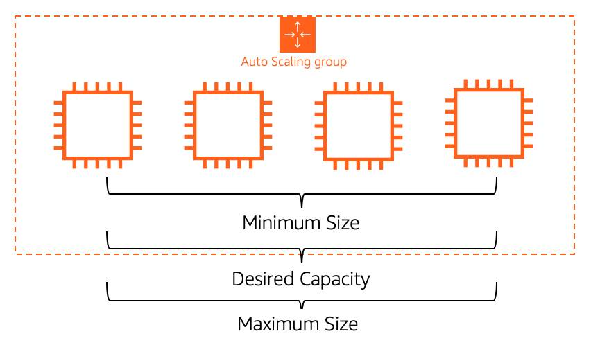

**Enable Automation with Scaling Policies**
By default, an ASG will be kept to its initial desired capacity. Although it’s possible to manually change the desired capacity, you can also use scaling policies.

In the AWS Monitoring module, you learned about Amazon CloudWatch metrics and alarms. You use metrics to keep information about different attributes of your EC2 instance like the CPU percentage. You use alarms to specify an action when a threshold is reached. Metrics and alarms are what scaling policies use to know when to act. For example, you set up an alarm that says when the CPU utilization is above 70% across the entire fleet of EC2 instances, trigger a scaling policy to add an EC2 instance.

There are three types of scaling policies: simple, step, and target tracking scaling.

**Simple Scaling Policy**
A simple scaling policy allows you to do exactly what’s described above. You use a CloudWatch alarm and specify what to do when it is triggered. This can be a number of EC2 instances to add or remove, or a specific number to set the desired capacity to. You can specify a percentage of the group instead of using an amount of EC2 instances, which makes the group grow or shrink more quickly. 

Once this scaling policy is triggered, it waits a cooldown period before taking any other action. This is important as it takes time for the EC2 instances to start and the CloudWatch alarm may still be triggered while the EC2 instance is booting. For example, you could decide to add an EC2 instance if the CPU utilization across all instances is above 65%. You don’t want to add more instances until that new EC2 instance is accepting traffic. 

However, what if the CPU utilization was now above 85% across the ASG? Only adding one instance may not be the right move here. Instead, you may want to add another step in your scaling policy. Unfortunately, a simple scaling policy can’t help with that.

**Step Scaling Policy**
This is where a step scaling policy helps. Step scaling policies respond to additional alarms even while a scaling activity or health check replacement is in progress. Similar to the example above, you decide to add two more instances in case the CPU utilization is at 85%, and four more instances when it’s at 95%.

Deciding when to add and remove instances based on CloudWatch alarms may seem like a difficult task. This is why the third type of scaling policy exists: target tracking.

**Target Tracking Scaling Policy**
If your application scales based on average CPU utilization, average network utilization (in or out), or based on request count, then this scaling policy type is the one to use. All you need to provide is the target value to track and it automatically creates the required CloudWatch alarms.


---


# Additional References:

> Disclaimer: Beware: Not all information provided by ChatGPT is accurate. They get wrong quite a lot in nuanced sub-topics. 

- [My ChatGPT Interactions on Networking in AWS](https://chatgpt.com/share/67077451-51e0-800f-ad65-98c6b109e330)
- [My ChatGPT Interactions on Computing in AWS](https://chatgpt.com/share/6703b5e9-1154-800f-8c1d-03f16c3ae6e0)
- [My ChatGPT Interactions on Storage Services in AWS](https://chatgpt.com/share/6728503c-722c-800f-a6fc-f16d4e1888f3)
- [My ChatGPT Interactions on Database Services in AWS](https://chatgpt.com/share/67285596-cb00-800f-b999-f317d4ae56c4)